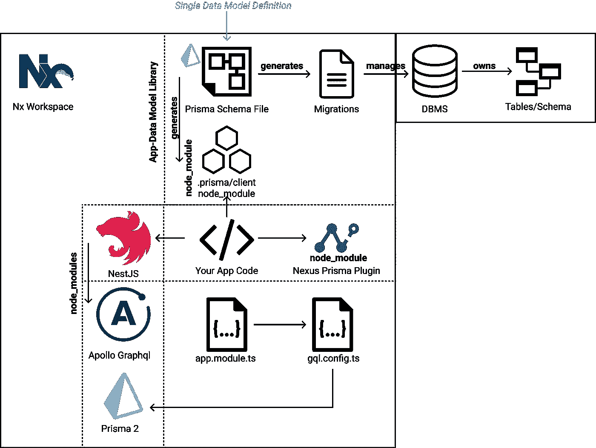
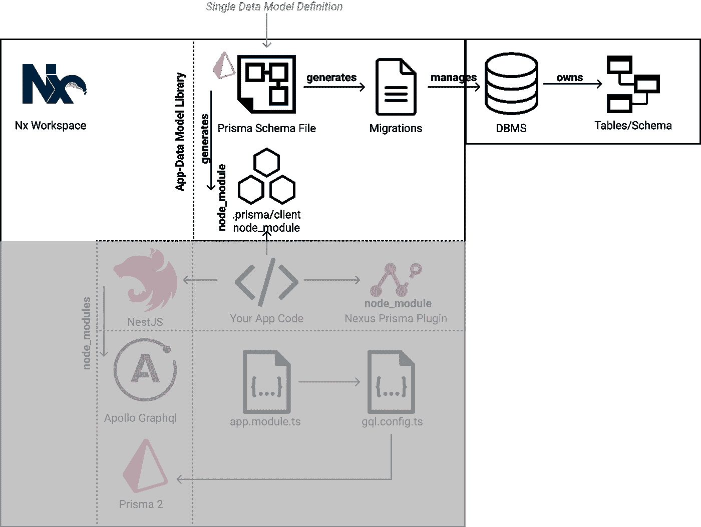
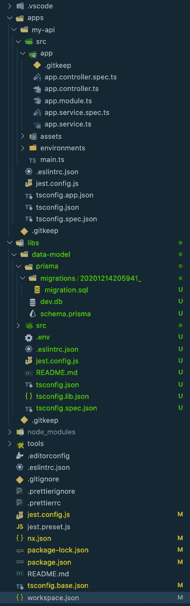
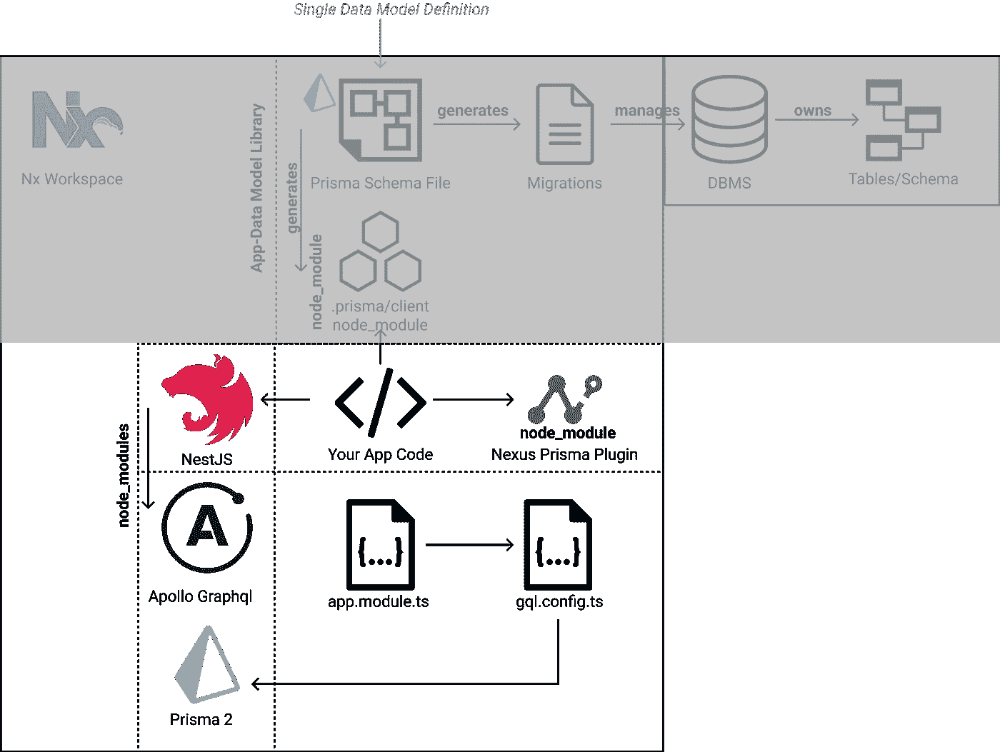
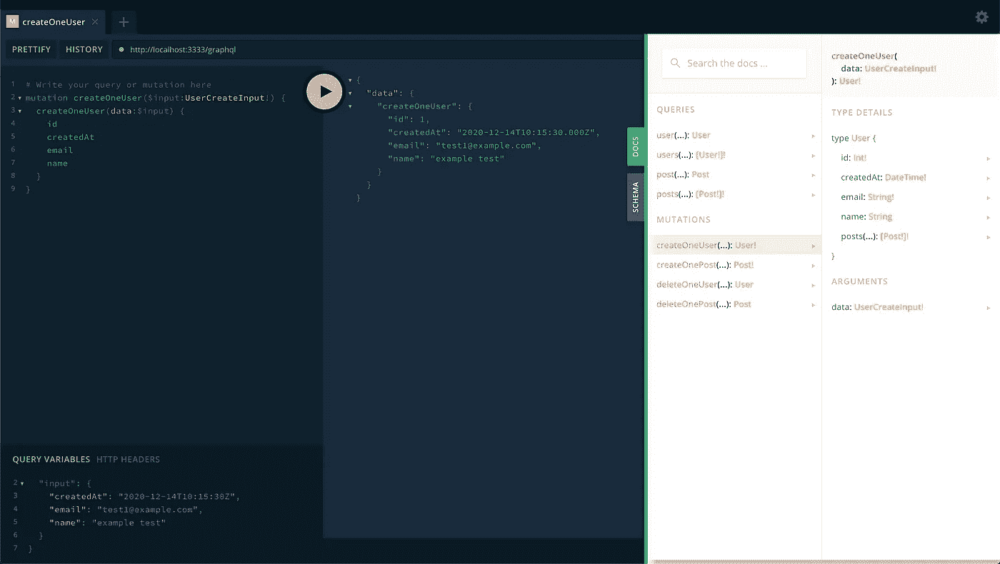
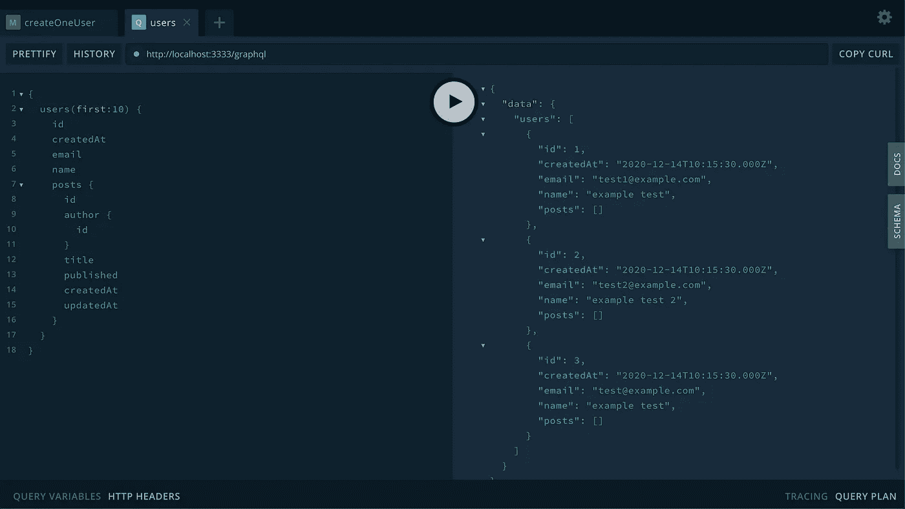

# 让我们创建一个 Nest，Nx，GraphQL，Prisma 单数据模型定义

> 原文：<https://javascript.plainenglish.io/nx-nest-prisma-graphql-single-data-model-definition-e601eaa372c6?source=collection_archive---------3----------------------->

每个框架和库似乎都有自己的数据模型 SDL 格式。这在最好的情况下会导致模型定义的重复，在最坏的情况下会导致完全的混乱。

本文详细介绍了一种方法，当您的库和应用程序都需要跨业务领域共享数据模型时，这种方法非常简单和有用。

所选的 DMF(数据模型格式)是 Prisma 的模式，我将从该模式向您展示它如何管理您的 SQL DB 模型、API 服务器和 React 客户端数据模型，以及如何将模型绑定到生成的 GraphQL 服务，并对暴露的模型属性进行应用程序级控制。听起来比实际更复杂。

陈述完毕，让我们开始吧！

## 第一部分。我们在做什么



为了再次说明我们的目标，我们要做的是设置我们的项目工作区，这样我们就有了一个保存数据模型的单个节点库，任何导入该数据模型库的应用程序都可以快速、轻松地设置和公开 GraphQL api 端点以及它选择管理的模型部分。人们希望对数据模型有一个单一的定义，并让所有的“实现系统”都使用这个单一的模型定义。这将允许我们避免数据模型定义重复，并简化我们数据管理的某些方面。

为了使这成为一个完整的例子，我将详细介绍一些 Nx 工作空间的基本设置(不全面)。[在这里阅读 Nx](https://nx.dev/)。对于这个示例设置，我们将使用一个 [sqlite3 数据库](https://www.npmjs.com/package/sqlite)，但是在生产中，您可能想要使用 postgres 或类似的数据库。此外，请注意，我们将在本例中使用的数据模型是一个从 [Prisma 示例模式](https://www.prisma.io/docs/concepts/components/prisma-schema#example)中借用的最小模型，稍加修改即可在 Sqlite 上运行(删除了 Role 的 enum)。

## **第二部分。设置工作空间**

第一步是设置我们的目录，创建工作空间，生成框架应用程序和库，然后安装所需的 npm 模块。

至此，我们已经有了一个工作区设置的框架。我们需要向我们的工作区添加一些任务，以简化我们的数据模型迁移步骤。现在让我们开始吧——在项目目录中打开名为 workspace.json 的文件

看看上面的第 85-125 行。我添加了这些任务来完成 Prisma 迁移。这是一个预览功能(之前——就像上周写这篇文章时——它还处于试验阶段，所以很可能在不久的将来它会成为一个完整的功能)。

现在，正如我提到的，对于这个示例项目，我们将使用 sqlite —您应该打开文件*<project-root>/libs/data-model/prisma/schema . prisma*

下面是我的文件的样子:

有了这个文件和对我们的 workspace.json 所做的修改，现在你需要做的就是修改 <project-root>/libs/data-mode/。env 文件具有以下内容，这将告诉我们的 Prisma 模式它所使用的环境变量的值应该是什么:</project-root>

```
DATABASE_URL="file:./dev.db"
```

现在，从项目根目录运行以下命令:

```
nx run data-model:migrate-up
```

当您执行此任务时，您应该会看到如下内容:

```
> nx run data-model:migrate-up 
Environment variables loaded from .env
Prisma schema loaded from prisma/schema.prisma
Datasource "db": SQLite database "dev.db" at "file:./dev.db"SQLite database dev.db created at file:./dev.dbThe following migration(s) have been created and applied from new schema changes:migrations/
  └─ 20201214205941_/
    └─ migration.sql✔ Generated Prisma Client (2.13.0) to ./../../node_modules/@prisma/client in 97ms
```

您可以通过运行以下命令来检查其状态:

```
> nx run data-model:migrate-status 
Environment variables loaded from .env
Prisma schema loaded from prisma/schema.prisma
Datasource "db": SQLite database "dev.db" at "file:./dev.db"Status
1 migration found in prisma/migrationsDatabase schema is up to date!
```

此时，您可能倾向于编写一个小脚本来播种您的数据库，这样做是正确的，但是在我们的示例中，我们将跳过这一步，设置一个 GraphQL 变体，这样我们就可以使用 api 插入和读取数据。这是我们到目前为止已经设置好的部分:



What we have setup so far in our example workspace

这是我的工作空间在目录和文件方面的样子:



**第三部分。连接我们的 Prisma 模式并公开一个 GraphQL API**

现在是我们例子的核心部分——设置从 Prisma 模式和客户机自动生成丰富的 GraphQL api。对于这个例子，我使用的是 NestJS(尽管您可以使用另一个框架或者简单地使用您自己的方法——milage 可能会有所不同)。还记得我们第一次设置项目工作环境时创建的应用程序吗？对，那个叫“我的 api”的应用。

在开始编写代码之前，我们应该安装一些额外的库:

```
npm i @nestjs/graphql @nexus/schema@0.19.2 graphql-scalars apollo-server-express --save
```

快速补充说明—如果您在任何时候看到一个关于类型不匹配的错误，如下所示:

```
The types of 'config.fieldDefTypes' are incompatible between these types.
```

这意味着你可能有一个不兼容的(或损坏的)版本的 nexus 插件 prisma node nodule。在这个例子中，我使用了:

```
"nexus-plugin-prisma": "^0.26.0"and"@nexus/schema": "^0.19.2"
```

原来 0.27.0 此刻坏了。你要知道。

好了，现在让我们来做有趣的部分，写一些实际的代码。打开 *<项目根目录> /apps/my-api/src/app* 目录下的 *app.module.ts* 文件。更改文件，使其看起来像:

app 模块从 nestjs 导入 GraphQL 库，并定义 graphql api 的配置(模式、类型和解析器)来自 GraphqlConfigService 类。这个服务类是我们接下来要创建的。

在同一个目录中创建一个名为 gql.config.ts 的新文件，神奇的事情就发生在这个文件中。下面是您应该在源文件中放置的内容:

现在这里发生了很多事情。TL；DR；总结一下，这个类基于生成的 prisma 客户机中的可用内容为 GraphQL api 定义了一个可注入的配置，prisma 客户机是在我们从模式中“构建”数据模型时创建的。

首先要注意的是，我们使用 nexus/schema 模块根据我们提供的 config 对象创建一个模式。配置对象包括插件 nexus-plugin-prisma(见第 32 行)。我们将一个配置传递给插件，告诉它生成 crud 操作——这些操作来自基于 schema.prisma 的生成的 Prisma 客户机代码，我们在前面的库中设置了这些代码。

第二件值得注意的事情是，我们定义了应用程序将使用的类型(第 36–78 行),以及我们希望应用程序公开的一组查询和变化。这是分离关注点的一个很好的方法，虽然数据模型模式中有轻微的重复，但这是可以原谅的，因为它能够选择性地选择 graphql api 将从模型定义中公开什么。



This is the section we just completed

我们现在准备使用刚刚设置的 GraphQL API 插入数据。让我们启动服务器并插入我们的第一个用户。

```
nx serve my-api
```

您应该会在控制台中看到一些输出，告诉您服务器正在监听 h[TTP://localhost:3333/API](http://localhost:3333/api)—打开浏览器并转到 [http://localhost/graphql](http://localhost/graphql) ，您将看到 graphql playground。让我们创建一个新用户:



现在我们已经创建了一些用户，我们也可以查询他们



您可以将 db 换成 postgres 或 MySQL db(可能使用 docker 容器或其他服务提供商)。您只受到 Prisma 所支持的内容的限制，即使这样，也没有什么可以阻止您为当前不支持的数据库创建适配器(也许是大查询？还是弹性的？)

你可以在这方面做很多事情——虽然我想在这里更深入，但这篇文章已经很长了。我必须停止写更多，并相信我们所涵盖的内容是有意义的(为它鼓掌，或者留下评论，如果这对你有用的话)。

那么，你将何去何从？尝试这些资源:

*   【https://www.prisma.io/ 
*   [https://docs.nestjs.com/](https://docs.nestjs.com/)
*   [https://github.com/graphql-nexus/nexus-plugin-prisma](https://github.com/graphql-nexus/nexus-plugin-prisma)
*   [https://github.com/graphql-nexus/nexus](https://github.com/graphql-nexus/nexus)
*   [https://nx.dev/](https://nx.dev/)
*   [https://rollout.io/blog/database-migration/](https://rollout.io/blog/database-migration/)
*   [https://medium . com/dooboolab/why-our-team-choose-prisma 2-nexus-schema-for-graph QL-Apollo-server-40 ed 42 a 26 c 37](https://medium.com/dooboolab/why-our-team-chose-prisma2-nexus-schema-for-graphql-apollo-server-40ed42a26c37)
*   NestJS Discord:[https://Discord . com/channels/520622812742811698/527853342152458287](https://discord.com/channels/520622812742811698/527853342152458287)