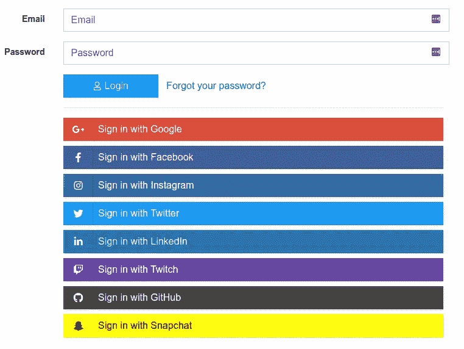
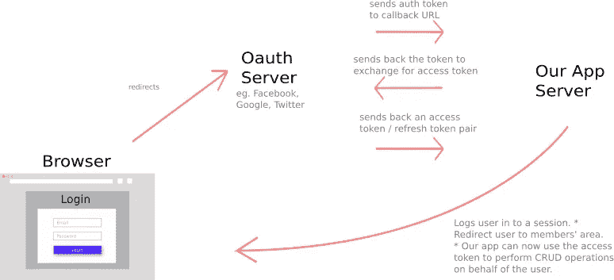
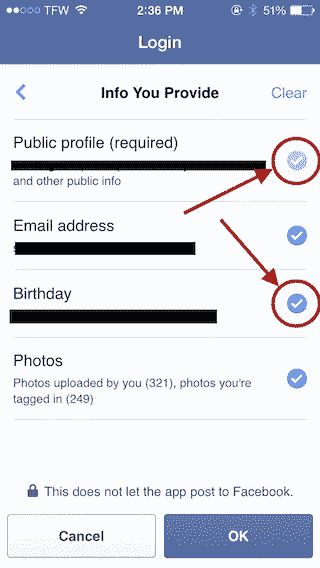

# Oauth 是什么？为什么呢？用简单的英语解释

> 原文：<https://javascript.plainenglish.io/oauth-explained-in-simple-terms-aebec8fcf66d?source=collection_archive---------11----------------------->

点击“使用谷歌登录”按钮可以在幕后做很多事情。这是一个复杂的话题，但我会为你简化它。😎

Choosing a sign-in option can be colourful :)

# 那么 Oauth 是什么？

简而言之，Oauth 是一种通过第三方服务登录应用的方式。看到那些花里胡哨的`sign in with Google` `sign in with Facebook`按钮了吗？点击这些按钮将允许您通过 Oauth 登录网站！

Oauth 允许我们做的不仅仅是认证。我们可以代表用户执行操作。还记得那些可以代表你张贴在你的脸书墙上的应用吗？或者在您的 Google 日历上添加一个新事件？Oauth 使这些集成成为可能。

# 为什么是 Oauth？传统的登录系统有什么问题？

传统上，我们通过在登录表单上输入凭据来登录网站，并将其提交给网站的服务器。该网站将我们的凭据存储在本地数据库中。事情是这样的:我们基本上相信网站会为我们安全地存储凭证。

如果这个网站碰巧使用了过时的安全标准或者有漏洞，那么你的证书很有可能会被泄露([网络漏洞比你想象的还要普遍](https://www.cybintsolutions.com/cyber-security-facts-stats/))。

因此，通过使用 Oauth，我们实际上是将这些安全问题委托给脸书或谷歌等科技巨头，以确保我们的凭证安全。作为网站所有者，让我们的用户通过 Oauth 登录是一个好主意，因为我们希望最大限度地降低泄露用户数据的风险。

另一方面，这可能意味着我们正在将客户的数据交给这些巨头。根据我们开发应用的方式，会有一些隐私方面的影响，例如，针对客户的更有针对性或“个性化”的广告。为了使用这些“免费”服务，网站所有者必须付出代价。

Oauth 有几个变体。我将以脸书为例。请注意，我在这里描述的 Oauth 流仅仅是概念的演示。它可能与脸书使用的实际 Oauth 流程不同。有关实现，请参考脸书开发人员文档。

# 那么 Oauth 是如何在幕后工作的呢？

我们的旅程从浏览器开始。有关 Oauth 术语的列表，请参考下面的关键术语部分。

Image by Author

1.  你访问一个网站。你点击了`Login with Facebook`按钮。

这是应用程序试图从脸书请求一个`authorisation token`的地方。只有当用户在步骤#2 中点击`ok`后，脸书才会发出`authorisation token`。`Authorisation Token`将在以后消耗以换取`access token`。

2.该按钮会将您重定向到脸书的登录页面。重定向有效载荷通常包含其他元数据，例如`app_id`、`app_key`，供脸书识别应用或重定向源。登录页面应该类似于下图。它应该告诉你所有的信息，该应用程序打算从你的脸书帐户检索。

Permission (Scope) that the site requested

3.当你点击`ok`时，脸书会向`callback_url`发送一个包含`authorisation token`的 HTTP 请求。`callback_url`是位于应用服务器中的 API 端点。这个端点应该使用它从脸书收到的`auth_token`，并将其发送回脸书的服务器，以交换一个`access_token`和`refresh_token`对。

4.该应用程序现在可以使用`access_token`来访问您的脸书个人资料信息(受步骤#2 中定义的范围限制)。通常情况下，该应用程序会在本地数据库中存储登录会话、您的脸书个人资料 ID、访问令牌和刷新令牌。

5.如果`access_token`到期，应用程序将使用`refresh_token`来刷新`access_token`。这允许应用程序保持你登录到该网站。授权服务器通常有一个 API 端点，允许我们刷新`access token`。

6.就是这样！Oauth 消除了在本地存储用户详细信息的需要，因此为我们解除了许多安全隐患。

# 关键术语

**令牌**

Token 只是超长字符串的另一种说法。它们用于身份验证，代替密码。

**资源所有者密码凭证(ROPC)**

这通常是一个替代实际帐户持有人密码的令牌。资源所有者=拥有数据的人，例如客户。

**资源服务器**

保存用户数据的服务器。脸书存储用户信息的服务器。

**回拨网址**

这是 Oauth 服务器将发送授权令牌的地方。这通常是应用程序的一个 API 端点，它接受`auth token`并交换一个`access token`和`refresh token`。

**访问令牌**

这个令牌允许应用程序代表用户在资源服务器上执行 CRUD 操作。每次应用程序想要检索用户的数据时，请求中都必须包含一个`access token`。`Access token`有时被称为 API 键。

`access token`有到期时间。一旦该时间到期，`access token`就不能再使用了。

**刷新令牌**

这个令牌用于刷新`access token`，所以我们不需要再次遍历整个 Oauth 流。刷新时我们会得到一双新的`access token`和`refresh token`。刷新令牌也有到期时间。

**授权令牌**

这个令牌用于交换一个`access token` / `access token`对。

**授权服务器**

发送授权码(也称为授权令牌)的服务器。

**重定向网址**

用户通过身份验证后，Oauth 服务器将在这里重定向用户。这通常是应用程序的会员区。

**范围**

这些是应用程序正常运行所需的权限。一旦用户授予了权限，应用程序就可以在作用域中定义的范围内代表用户进行操作。

**公钥/私钥对**

公钥是 Oauth 服务器用来识别网站所有者的应用程序的令牌。每个公钥只有一个私钥。当应用程序想要用`auth token`交换一个`access token`时，它通常会随请求一起发送公钥/私钥。有时这些被称为`app_id`和`app_key`。

希望这篇文章能帮助您更好地理解 Oauth！同样，这是一个简化的概述，还有更多关于 Oauth 的实现。

*更多内容请看*[***plain English . io***](http://plainenglish.io/)