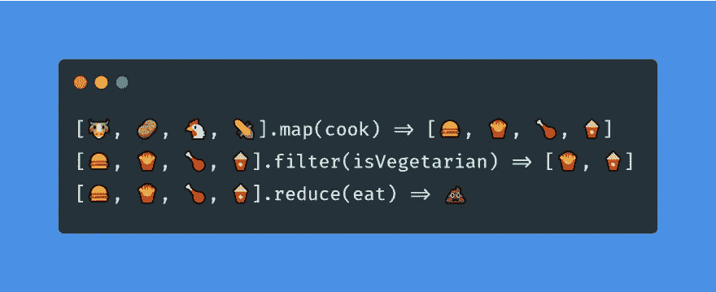
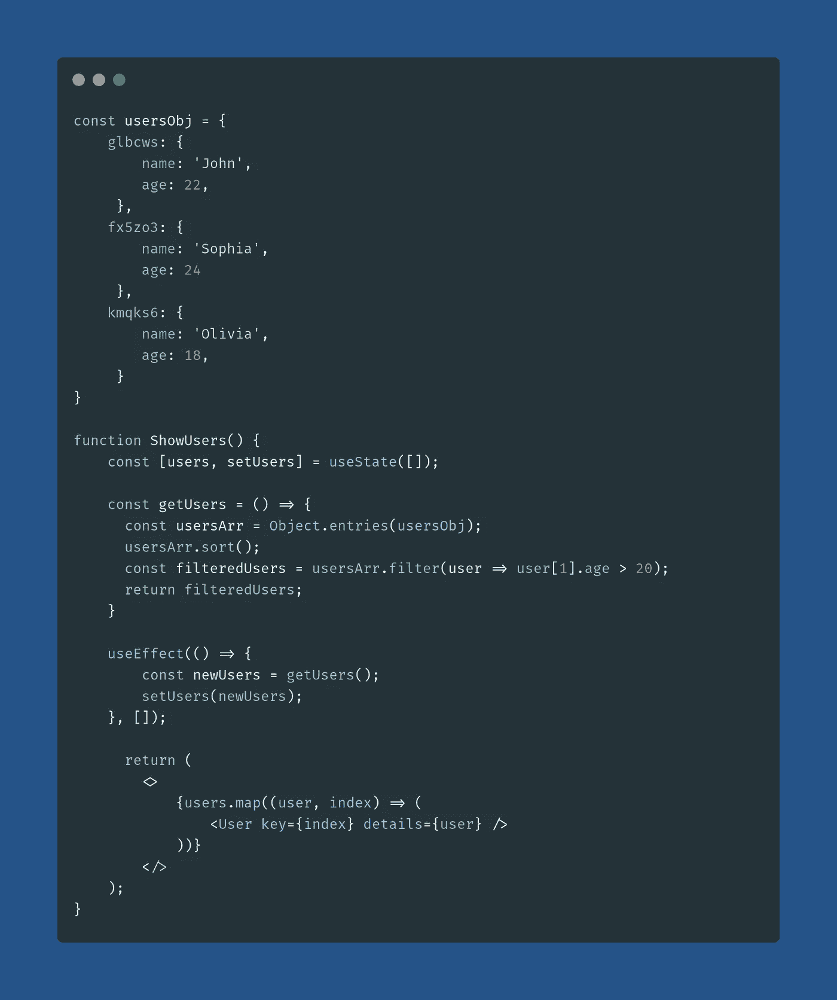

# 对象和数组方法，然后再学习 JavaScript 框架

> 原文：<https://javascript.plainenglish.io/object-and-array-methods-to-learn-before-javascript-frameworks-59728dcea306?source=collection_archive---------2----------------------->


Source: [https://miro.medium.com/max/4096/1*JinuD4VWgK0Iw0hXcALATA.jpeg](https://miro.medium.com/max/4096/1*JinuD4VWgK0Iw0hXcALATA.jpeg)

在本系列中，我们将涵盖以下主题:

1.  [ES6 的重要特性](https://medium.com/javascript-in-plain-english/things-to-learn-before-learning-a-javascript-framework-b7baec310247)
2.  对象和数组方法(本文)
3.  [异步 JavaScript 和获取 API](https://medium.com/javascript-in-plain-english/asynchronous-javascript-to-learn-before-javascript-frameworks-9b63972290c2)
4.  [JavaScript 中的 NPM 和导入/导出模块](https://medium.com/javascript-in-plain-english/how-to-use-npm-and-import-export-modules-in-javascript-31a7f66a2064)

在本系列的最后一篇文章**“学习 JavaScript 框架之前要学的东西”**、**、**中，我们了解了在任何 JavaScript 框架中经常使用的**重要的 ES6 特性**。现在，在本文中，我们将介绍该系列的第二部分，即**对象和数组方法**。

这里，我们将讨论 JavaScript 中可以应用于对象和数组的不同类型的方法。

先说对象和对象方法:

# 目标

一个`Object`可以被定义为以**“key:value”**对的形式存储的数据的无序集合。我们可以通过以下方式访问`Object`的属性和方法:

# 对象方法

`Object Methods`是可以在 JavaScript 对象上执行的操作。我们可以使用下面的语法访问一个`Object's`静态方法:

```
Object.methodName(someObject);
```

JavaScript 中有许多不同类型的对象方法，在这篇文章中，我们将讨论一些最有用的对象方法，它们在语言中可以使我们的生活变得轻松。

先说`Object.assign()`:

## 对象.分配()

此方法可用于将一个对象复制到另一个对象。

它还可以用来合并多个对象，形成一个新的`object`。

在上一篇文章中，我们讨论了也可以用来合并对象的`spread operator`。让我们看看这是如何实现的:

因为我们使用这两种方法得到了相同的结果，所以我们可以使用任何一种方法来合并对象。但是由于`Object.assign()`方法会改变第一个`object`方法，因此，我更喜欢使用第二种方法，因为它不会改变任何传递的对象。

## Object.create()

`Object.create()`方法创建一个新对象，使用一个现有对象作为新创建对象的原型。

让我们考虑一下`person`对象来理解这一点:

因此，对象`newPerson`只有一个属性，即`firstName`，但是因为它是使用`Object.create()`方法声明的，所以它可以通过原型访问所有其他属性和方法。

## Object.entries()、Object.keys()和 Object.values()

这三种方法彼此非常相似，所以让我们一起讨论它们。

`Object.entries()`方法创建一个传递给这个方法的`Object`的键/值对的数组。

`Object.keys()`方法用于创建一个`Object`的所有**键**的数组，而`Object.values()`方法创建一个对象的所有**值**的数组。

让我们看看他们对`person`对象的处理:

**注:**

1.  "这些方法返回对象实例的所有属性，而不是可以从其原型继承的任何属性."让我们理解，通过在`newPerson`对象上应用这个方法:

因此，我们看到它只打印对象实例的属性，而不打印从原型继承的其他属性。

2.这些方法也可以用来迭代对象的键和值。

到目前为止，我们讨论的所有方法都是静态的方法。还有另一种类型的`Object`方法，称为`Object's` *实例*方法。让我们也讨论一下这种类型的一种方法:

## hasOwnProperty()

该方法返回一个`boolean`，指示`object`是否具有指定的属性。

让我们考虑`person`对象来理解这一点:

**注意:**该方法只能用于检查`Object`拥有的属性，而不是它继承的属性。

# 排列

一个`Array`用于在单个`variable`中存储元素列表。让我们讨论一下 JavaScript 中可以应用于数组的基本操作:

# 数组方法

`Array Methods`是可以应用于数组的动作。JavaScript 为我们提供了很多方法，让我们在处理数组时更加轻松。在这里，我们将尝试把重点放在一些最有用的数组方法上。

让我们从`isArray`方法开始:

## Array.isArray()

这个方法是一个`static`数组方法。它用于确定传递的值是否是一个`Array`。让我们看几个例子来理解这一点:

## 地图()

此方法通过对数组的每个元素执行提供的函数来返回一个新数组。让我们先来看看这个方法的语法:

因此，我们注意到我们必须向这个方法传递一个函数，这个函数包含为数组的每个元素执行的代码。这里，我们将使用上一篇文章中提到的`arrow functions`。

现在，让我们来理解这种方法是如何工作的:

因此，我们观察到`numbers`数组的每个元素的值都增加了`1`，结果存储在新的数组`incNumbers`中。

## 过滤器()

此方法返回一个新数组，该数组只包含那些通过函数中指定条件的元素。这个方法的语法类似于`map`方法。

假设我们必须过滤大于 3 的数字:

因此，我们看到名为 **filtered** 的数组包含所有大于 3 的**数字**的元素。

## 减少()

顾名思义，`reduce`方法用于将数组缩减为单个值。它为数组的每个元素执行一个函数，并将返回值存储在`accumulator`中。
该函数有两个参数，第一个称为`reducer`函数，第二个是`accumulator`的`initialValue`。

让我们通过一个简单的例子来理解这一点:

在上面的例子中，**当** **我们向** `**reduce**` **方法传递一个参数时，它将** `**array**` **的第一个元素作为** `**initialValue**` **并从第二个元素开始循环，但是当我们传递** `**initialValue**` **时，循环从第一个元素开始。**

现在，让我们来看一个在学习 **React 和 Redux** 时经常遇到的`reduce`方法的更现实的例子:

**注意:**`reduce()`方法可以用来实现`map()`和`filter()`方法。

## 包括()

该方法用于确定`array`是否包含指定的元素。它根据结果返回一个`boolean`。

让我们看看这在`numbers`阵列上是如何工作的:

**注意:**`includes()`方法是**区分大小写**。

## 加入()

`join()`方法通过连接数组的所有元素返回一个新的`string`。`string`中的数组元素由逗号或指定的分隔符字符串分隔。

让我们理解这意味着什么:

## 排序()

顾名思义，`sort`方法用于对数组的元素进行排序。它通过将元素转换成字符串，然后比较它们的值来对元素进行排序。默认排序顺序为`ascending`。

因此，我们注意到数组值是通过转换成**字符串**来进行比较的。另外需要注意的是，原来的数组都是 ***变异了*** (变了)。

我们也可以通过一个 ***比较函数*** 来排序方法:

让我们看一个非常简单的例子来理解这些方法:



Credits: [Robert Vidal](https://medium.com/@bobbyvidal)

这就把我们带到了本文的结尾，在这里我们学习了不同的对象和数组方法。如果你想了解更多关于 JavaScript 对象的知识，你可以阅读 JavaScript**中的**[**了解对象，如果你想熟悉数组方法，你可以看看 JavaScript 的**](https://www.digitalocean.com/community/tutorials/how-to-use-object-methods-in-javascript)****[**数组迭代器 Cheatsheet。**](https://levelup.gitconnected.com/the-array-iterators-cheatsheet-javascript-9d0cfa03f4)********

****我们将在接下来的文章中讨论其余的主题。最后，我将留给你们一个使用这些方法的简单的`React Component`:****

********

****此外，请查看该系列的其他部分(如果您还没有查看):****

****[](https://medium.com/javascript-in-plain-english/things-to-learn-before-learning-a-javascript-framework-b7baec310247) [## 学习 JavaScript 框架之前需要了解的事情(第 1 部分)

### 因此，在这一系列的文章中，我将尝试解释一些我认为真正…

medium.com](https://medium.com/javascript-in-plain-english/things-to-learn-before-learning-a-javascript-framework-b7baec310247) [](https://medium.com/javascript-in-plain-english/asynchronous-javascript-to-learn-before-javascript-frameworks-9b63972290c2) [## 在 JavaScript 框架之前学习异步 JavaScript(第 3 部分)

### 对异步 javascript 的理解

medium.com](https://medium.com/javascript-in-plain-english/asynchronous-javascript-to-learn-before-javascript-frameworks-9b63972290c2) [](https://medium.com/javascript-in-plain-english/how-to-use-npm-and-import-export-modules-in-javascript-31a7f66a2064) [## 如何在 JavaScript 中使用 NPM(和导入/导出模块)(第 4 部分)

### 学习 JavaScript 框架之前要学习的 NPM 命令和导入/导出模块

medium.com](https://medium.com/javascript-in-plain-english/how-to-use-npm-and-import-export-modules-in-javascript-31a7f66a2064) 

如果你想和我联系，请点击下面的链接:

[LinkedIn](https://www.linkedin.com/in/rajat-verma-39458317b/)|[GitHub](https://github.com/rajat2502)|[Twitter](https://twitter.com/rajatverma2502)****