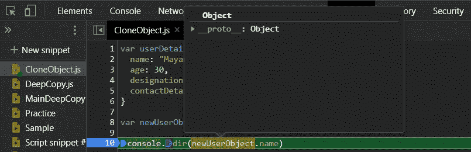
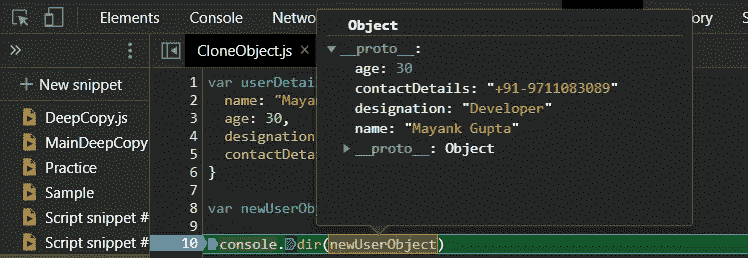
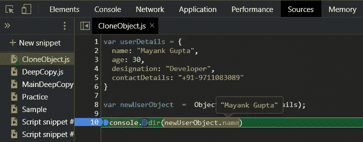
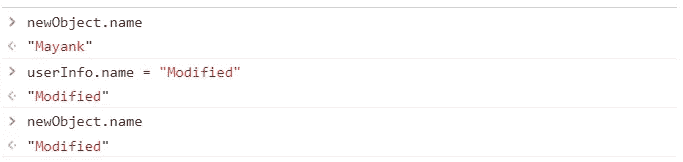

# 使用 Object.create 克隆 JavaScript 对象

> 原文：<https://javascript.plainenglish.io/object-create-to-object-cloning-deep-and-shallow-copy-javascript-d2da2289a312?source=collection_archive---------1----------------------->

## JavaScript 中 Object.create 的优点和缺点

Cloning Object in JavaScript

[TechnoFunnel](https://www.youtube.com/channel/UCo-h1M-5M6Y5D4Lgut8ge4w) 展示另一篇文章，着重于理解使用 **Object.create 创建对象的概念。**这篇文章将讨论使用“Object.create”进行对象克隆的优点和缺点。让我们来看看这个功能的细节。

# 什么是 Object.create？

**Object.create** 可用于从现有对象创建一个新对象。当我们用 Object.create 创建对象时，会创建一个空对象，并将 **__proto__** 对象映射到复制的对象。当 __proto__ 属性映射到要克隆的对象时，它会创建一个链式结构，使旧对象的属性和功能可用于创建的新对象。下面我们借助一个例子来看看。

[https://gist.github.com/Mayankgupta688/95abec93e2262b1828786dc903374400](https://gist.github.com/Mayankgupta688/95abec93e2262b1828786dc903374400)

在上面的例子中，我们可以看到我们正在尝试使用 Object.create 创建一个新的对象。让我们寻找调试器来寻找在这个执行中创建的新对象的对象结构。

在上面的执行中，我们可以看到“newUserObject”指向一个包含内部“__proto__”属性的空对象，该属性映射到作为参数传递给“Object.create”的“userDetails”对象。

让我们尝试使用这个函数创建的新对象来访问 userDetails 对象的属性。

创建的新对象没有属性，但是包含原始对象引用的 __proto__ 通过原型链接的概念为我们提供了对这些属性的访问。

# 使用 Object.create 的优势

*   用 Object.create 创建对象不为复制的对象分配任何新的内存位置。它只是将对象添加到对象的原型链中，为我们提供数据和方法的可重用性。

# Object.create 的缺点

1.  新创建的对象不会创建单独的属性。修改源对象的属性也会修改新对象可用的数据。

# 关闭:

克隆对象有多种方法，我们试图在我们的系列文章中详细记录每种方法:

使用 JSON.stringify 进行对象克隆。

 [## 用 JSON.stringify 克隆 JavaScript 对象

### 用 JSON.stringify 克隆对象的优缺点

medium.com](https://medium.com/technofunnel/clone-javascript-object-with-json-stringify-deep-shallow-copy-2919c5b3f970) 

关注我们获取更多此类文章:

 [## 技术漏斗

### 我们专注于学习不同的技术，如 React、Angular、机器学习、Python、Golang 和 AWS…

medium.com](https://medium.com/technofunnel)