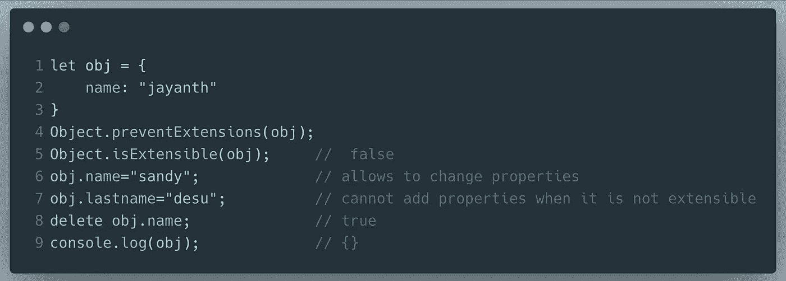

# object . freeze()vs object . seal()vs object . prevent extensions()

> 原文：<https://javascript.plainenglish.io/object-freeze-vs-object-seal-vs-object-preventextensions-e78ef3a24201?source=collection_archive---------4----------------------->

Photo by [Will Porada](https://unsplash.com/@will0629?utm_source=medium&utm_medium=referral) on [Unsplash](https://unsplash.com?utm_source=medium&utm_medium=referral)

ECMAScript 5 为 JavaScript 引入了新的`Object`方法。其中`seal`、`freeze,`、`preventExtensions`可以用来使任何对象不可变。

让我们看看这些方法到底能做什么，它们之间有什么区别。

## Object.freeze()

`**Object.freeze()**`方法**冻结**一个对象。这实际上是使对象不可变的最严格的方法。它执行以下操作:

1.  防止添加新属性
2.  不允许删除现有属性
3.  不允许改变`object`的即时属性
4.  可以修改子对象的属性

Freezing Objects in JavaScript

调用`Object.freeze(object)`的结果仅适用于`object`本身的立即属性，并且将仅阻止`object`上的未来属性添加、移除或值重新分配操作*。*

甚至我们可以通过使用`Object.freeze()`来冻结 JavaScript 中的数组。

Freezing arrays in JavaScript

## Object.seal()

对于密封，情况有点不同，`**Object.seal()**`方法密封一个对象，防止新的属性被添加到对象中。它执行以下操作:

1.  允许更改对象的现有属性
2.  防止添加新属性
3.  不允许删除现有属性

Object.seal() in JavaScript

由该方法调用的对象不能添加任何新属性或删除当前属性。

## Object.preventExtensions()

`**Object.preventExtensions()**`方法防止新的属性被添加到一个对象中(即防止将来对该对象的扩展)。它执行以下操作:

1.  允许更改对象的现有属性
2.  防止添加新属性

Object.`preventExtensions`() in JavaScript

`Object.preventExtensions()`将一个对象标记为不再可扩展，这样，除了它被标记为不可扩展时的属性之外，它将不再具有其他属性。

codepro

这三种方法都处理对象的不变性，这限制了向其添加新属性。

感谢您阅读这篇文章。如果你有任何问题，请在评论中告诉我。

## 简单英语的 JavaScript

你知道我们有四份出版物和一个 YouTube 频道吗？在 [**plainenglish.io**](https://plainenglish.io/) 和 [**找到他们订阅解码，我们的 YouTube 频道**](https://www.youtube.com/channel/UCtipWUghju290NWcn8jhyAw) **！**