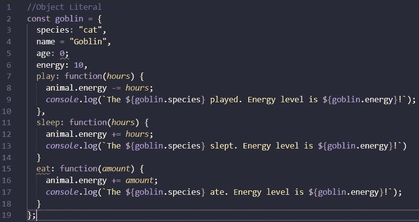
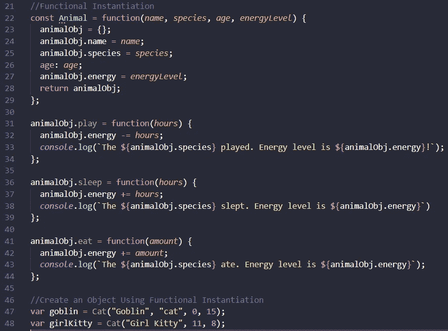
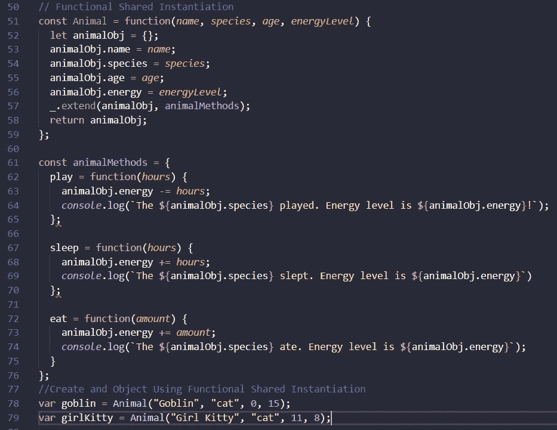
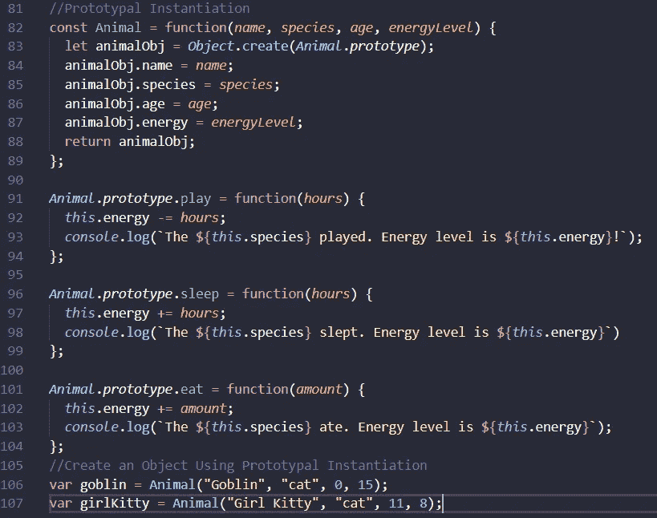
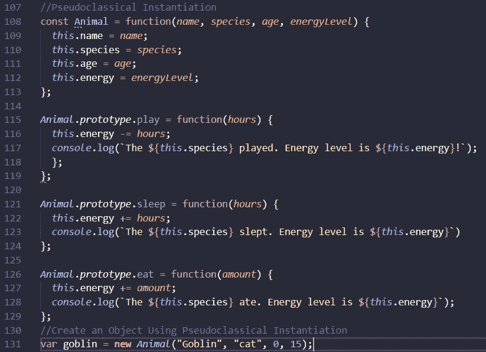

# JavaScript 中的对象实例化模式

> 原文：<https://javascript.plainenglish.io/object-instantiation-patterns-in-javascript-37b4bd97b884?source=collection_archive---------7----------------------->

对象是 JavaScript 中的一种复杂数据类型。就语法而言，对象被封装在花括号中，并被设置为等于变量。在花括号中，有一个无序的属性列表，每个属性都由逗号分隔的键值对组成。虽然键总是字符串，但相应的值可以是任何数据类型。

要创建一个对象(或创建一个对象的实例)，我们将从最简单的对象创建方法开始:对象文字的硬编码。从这里开始，我们将讨论更复杂的实例化类型(即函数实例化、函数共享实例化、原型实例化和伪经典实例化)。每个实例化模式都有自己的优缺点，这将在每个实例化类型的描述和代码示例中讨论。最后，我们将以伪经典实例化中 ES6 的实现来结束讨论。

# 对象文字的创建

创建对象最直接的方法是硬编码，创建一个对象文字。下面是一个对象文字的例子，遵循 JavaScript 中对象的标准语法。

Object Literal Creation

## 对象字面意义的利弊

创建一个对象文字是一个非常直接的实现，因为如果你只是在程序中创建一个特定对象的实例，它是清晰易读的。但是，在程序需要对象的多个实例的情况下，创建一个对象文本并不理想，因为如果您要创建一个不同的动物，就必须完整地编写整个对象。这是非常低效的。

# 功能实例化模式

创建对象的函数实例化模式正如其标题所暗示的那样:它通过使用函数来创建对象的实例。命名约定要求在函数名的开头使用大写字母，因此对于这个实例化模式，我们的函数将被称为 Animal。该函数包含某种存储对象，以包含对象的属性(以及本质上是具有函数值的键的方法)。在下面的例子中，第 47 行创建了与上面的对象文字(goblin)相同的对象文字。每次调用 Animal 函数时都会创建一个新对象。

Functional Instantiation Pattern

## 功能实例化的利弊

使用函数实例化模式来创建对象的一个好处是，它非常易读和易于理解，这意味着即使是对对象和函数没有太多了解的人也能够理解在创建和调用函数时正在做什么。此外，函数实例化使您可以轻松地创建同一对象的多个实例，甚至使用新的参数。这提高了创建 object literal 的效率，因为要为一个新的动物创建一个 animal 对象，您只需再次调用 animal 函数，如上面第 48 行所示，而不必为 girlKitty 完全重写 object literal。

尽管使用函数实例化模式比创建对象文字更有效，但代码是不可共享的，这意味着方法在每次实例化时都被复制到新对象中。

# 功能共享实例化模式

功能共享实例化模式与功能实例化模式的相似之处在于，它也创建一个对象实例作为运行功能的结果。然而，在函数共享模式中，方法存储在一个独立的容器中，该容器存在于函数之外。

Functional Shared Instantiation Pattern

## 功能共享实例化的利弊

由于在上面的 animalMethods 示例(第 60–75 行)中，方法存储在函数之外，因此与函数实例化相比，效率得到了提高，因为方法是在一个独立的、可重用的对象中，而不是与对象的新实例一起创建的。然而，如果方法在任何时候被修改，这可能导致这种实例化方法容易出错。

# 原型实例化模式

对象创建的原型实例化模式使用 Object.create()创建一个新对象，允许它访问原型链，从而允许对象的新实例在每次调用函数时访问对象的方法。在方法创建期间(第 91–104 行)，使用了 animal 的原型属性。此外，可以在用于创建方法的函数中使用关键字 this 代替 animalObj，而不必从对象调用 animalObj。这种实例化模式是我们已经讨论过的对象创建模式中最有效和最不容易出错的。

Prototypal Instantiation Pattern

# 伪经典实例化模式

用于对象创建的伪经典实例化模式是比原型模式更有效的对象实例化模式，因为代码行更少。在 Animal 函数中，我们不再需要包含 Object.create()或 return 语句的行；这些语句隐含在伪经典模式中，这是由于在 Animal 函数时在第 131 行实现了关键字 new。因为 animalObj 不在 Animal 函数中，所以我们依赖关键字 this 来创建每个对象属性和方法。

Pseudoclassical Instantiation Pattern

# 将 ES6 用于伪经典实例化模式

当实现 ES6 语法时，伪经典的实例化模式有一些变化。首先，第 138 行使用了关键字 class。此外，第 139 行使用了 constructor 关键字来创建构造函数。在方法的实现中，不再需要使用 prototype 属性，因为我们现在是在类范围内工作。注意，第 162 行仍然使用了 new 关键字。

ES6 Pseudoclassical Instantiation Pattern

# 结论

上面我们已经讨论了 JavaScript 中现存的所有对象实例化模式。虽然后一种方法对于新手来说在实现和语法上可能看起来更加晦涩，但是它们允许您提高效率，减少程序的冗长和冗余。