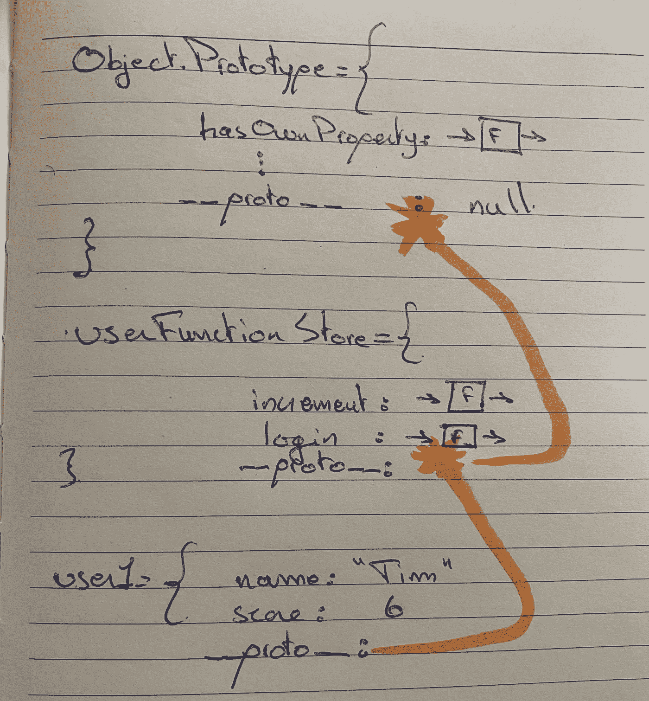

# JavaScript 中的面向对象编程和原型链

> 原文：<https://javascript.plainenglish.io/object-oriented-programming-and-the-prototype-chain-in-javascript-d71032a30324?source=collection_archive---------14----------------------->


在本文中，我们将介绍 JavaScript 如何允许开发人员以面向对象的方式组织他们的代码，以及它如何使用“原型继承”或“原型链”功能来实现这一点。

面向对象编程最早是由艾伦·凯(Alan Kay)在 60 年代创造出来的，从那时起，它就是最流行的代码组织结构之一。

在本系列的三个部分中，我们将了解 JavaScript 如何模拟面向对象的代码组织，了解 __ **proto__** 和 **prototype** 之间的区别，这将导致对`**new**`和`**class**`关键词的解释，这是工程师最常见的面试问题之一，抽象出“幕后”正在发生的事情，给开发人员一个愉快的编码体验。我们还将覆盖箭头功能的力量以及`**this**`关键词如何工作。

让我们从程序的核心基础开始:保存数据，并在其上运行代码。在一个问答游戏示例中，这将存储一个用户的分数，并在他得到正确答案时增加该用户的分数。

放松。

那么，有什么问题呢？好吧，假设我们有 1000 个用户，每个用户都有许多不同的属性，比如年龄、名字、分数、电子邮件地址、头像等等。每个用户都有处理这些数据的功能，增加分数，减少分数，改变用户名，电子邮件地址等...在智力竞赛游戏中，我们也有计分板、智力竞赛问题、智力竞赛结果，您可以随意命名。智力竞赛游戏的所有这些特征都有关于它们的信息以及使用这些数据并与之交互的功能；显示它，渲染它，改变它，删除它等等…

在一个 100，000 行代码的应用程序中，我们可以看到为什么这会变得很麻烦，当我需要它的时候，它的功能在哪里？我如何在用户身上应用这个功能，而不是在记分板上应用**而不是**？

我们希望我们的代码易于推理，即易于理解，我们也希望我们的代码易于允许添加新的特性，同时保持其高效性和性能，这就是 OOP 的目标。

让我们用一个简化的例子来说明。

我们有两个用户。

我们希望有能力提高他们的分数。

我们希望能够存储我们用户的信息，并在那里为我们的用户提供一些功能，来处理这些数据。

> 关键是在相关数据上实现运行功能。

那么，我们如何用 JavaScript 将数据结构、数据和功能组织在一起呢？

将其存储在对象中。

```
const user1 = {
    name: "Tim",
    score: 3,
    increment: function(){ user1.score ++ }
};
​
user1.increment();
//user1.score -> 4
```

完成了。

现在让我们创建我们的`user2`,并使用`.`操作符向它添加属性。

```
const user2 = {}
user2.name = "Tim";
user2.score = 6;
user2.increment = function() {
    user2.score++;
}
user1.increment();
//user1.score -> 7
```

现在让我们使用另一种方法创建`user3`，用 JavaScript 创建对象，`Object.create()`返回一个空对象，并再次使用`.`操作符向其添加属性。

```
const user3 = Object.create();
user3.name = "Laura";
user3.score = 7;
user3.increment = function() {
    user3.increment++;
}
user1.increment();
//user1.score -> 8
```

嘣，搞定！数据和功能封装在一个数据结构中。

**这太可怕了**有两个原因，我们已经重复同样的代码三次了，如果我们有 100，000 个用户，我们会怎么做？我们需要开发人员在每次用户注册或做一些事情时手动输入数据。你做梦去吧。

那么，当我们一次又一次地执行代码行时，我们该怎么办呢？

我们把它包装在一个函数里。保存一次，运行一次又一次，你想改变的位，作为输入传入。

# 解决方案 1

```
function userCreator(name, score){
    const newUser = {};
    newUser.name = name;
    newUser.score = score;
    newUser.incrementScore = function(){
        newUser.score++
    }
    return newUser;
}
​
const user1 = userCreator("Tim", 6);
const user2 = userCreator("Eva", 5);
​
user1.incrementScore();
```

对于所有意图和目的来说，这个解决方案是可行的，但是它与保持我们的代码高效和高性能背道而驰。为什么？通过这种方法，每个用户都在其中存储了负责增加分数的代码。两个用户和一个`incrementScore`函数没问题，但是当我们有 10，000 个用户，每个用户有 100 个函数，每个函数大约 10 行代码时会发生什么？很明显，这将导致我们的应用程序的内存管理效率非常低，使用起来也很慢。此外，如果我们想要添加一个特性，我们必须手动将其添加到每个用户。

肯定有更好的方法。

# 解决方案 2

我们可以有一个“函数库”来保存一个用户的所有**共享**函数，而不是每个对象上的每个函数的副本，每次我们想访问/使用这些函数中的一个时，每个用户都可以从中访问，当 JavaScript 在我们调用它的对象上找不到函数时，**不会惊慌失措**并去别的地方寻找那个函数，我们的“函数库”。

所以不要

```
user1 = {
    name: "Tim",
    score: 6,
    incrementScore: function() { increment user score }
}
​
user2 = {
    name: "Eva",
    score: 5,
    incrementScore: function() { increment user score }
}
```

我们会有的

```
sharedFunctionStore = {
    incrementScore: function() { increment user score }
}
​
user1 = {
    name: "Tim",
    score: 6,
}
​
user2 = {
    name: "Eva",
    score: 5,
}
```

当我们调用`user1.incrementScore()`时，JavaScript 不会惊慌，并在我们的`sharedFunctionStore`中寻找我们的`incrementScore()`函数。

我们需要**在我们的用户和我们的“共享功能商店”之间创建链接**。我们创建链接的方式是使用`Object.create()`技术。

将我们以前的解决方案重构为正确的方法将产生以下代码:

```
var userFunctionStore = {
    incrementScore: function(){ this.score++ },
    login: function(){ console.log("User logged in!")}
}function userCreator(name, score){
    const newUser = Object.create(userFunctionStore);
    newUser.name = name;
    newUser.score = score;
    return newUser
}
​
const user1 = userCreator("Tim", 5)
user1.incrementScore()
// -> 6
```

我们在这里看到一个**新关键字**，`**this**`。

我们还必须解释当我们使用`Object.create()`时会发生什么，以及它如何在我们的用户和我们的`userFunctionStore`之间创建一个**链接**。

那么我们的代码中发生了什么呢？

让我们问问自己，当我们呼叫`user1.incrementScore()`时会发生什么？

JavaScript 将在我们的`user1`对象上寻找`incrementScore`属性，它会找到吗？**否**。

接下来会发生什么？它在我们的`userFunctionStore`对象中寻找它，它找到了吗？**是**。

它执行`incrementScore()`。我们的用户分数也会增加。

但是你可能想知道，这个**神奇的链接**是怎么创建的？JavaScript 是怎么知道`userFunctionStore`的？为了解释这一点，我们必须解释当我们使用`Object.create()`时发生了什么。

当我们使用`Object.create(userFunctionStore)`时，JavaScript 在我们的`newUser`对象上创建一个名为`__proto__`的隐藏属性，它有一个链接，或者对`userFunctionStore`的引用。这个`__proto__`属性被称为“dunderscore proto”或“双下划线 proto ”,这意味着我们创建的用户对象实际上看起来像这样:

```
user1 = {
    name: "Tim",
    score: 6,
    __proto__: { link to userFunctionStore } <- Hidden property
}
​
user2 = {
    name: "Tim",
    score: 5,
    __proto__: { link to userFunctionStore } <- Hidden property
}
```

而这就是所谓的 JavaScript 的"**原型特征**，即:当 JavaScript 在对象上**而不是**或**找到**一个属性、函数或数据，我们试图访问时， ***它不会死机！！！*** ，它直接进入`**__proto__**`属性，并通过其原型引用链接向上查看`userFunctionStore`，找到我们正在寻找的属性，获取它，如果该属性是一个函数，则为其代码创建一个全新的**执行上下文**并运行它。

现在让我们看看运行`function incrementScore(){ this.score++ }`时会发生什么

`**this**`作为一个**隐式参数**传入，它计算什么？正在其上运行方法的对象。因此，在我们的示例中，当我们运行`user1.incrementScore()`时，`this`的计算结果为`user1`。

# 原型链

让我们看看 JavaScript 的`hasOwnProperty()`方法，通过下面的例子来解释和追溯原型链是如何工作的。

```
function userCreator(name, score){
    const newUser = Object.create(userFunctionStore);
    newUser.name = name;
    newUser.score = score
    return newUser
}
​
userFunctionStore = {
    incrementScore: function(){ this.score++ },
    login: function(){ console.log("User logged in!")}
}
​
const user1 = userCreator("Tim", 5)
user1.hasOwnProperty('score')
```

当我们运行`user1.hasOwnProperty('score')`时会发生什么？JavaScript 试图在`user1`上找到`hasOwnProperty`方法，但找不到。会不会恐慌或者崩溃？**否**。

它会查找原型链到`userFunctionStore`，它会找到吗？**否**。会不会恐慌或者崩溃？**否**。

那么这个`hasOwnProperty()`方法是从哪里来的呢？

原来有一个 headline `Object.prototype`对象，它有一堆有用的函数，所有其他对象都可以使用这些函数。嗯怎么样？因为 JavaScript 中的所有**`Objects`都有一个默认链接到这个`Object.prototype`对象的`__proto__`属性，当我们使用`Object.create()`时，我们本质上所做的是修改从`Object.Prototype`对象到我们传递给`Object.create()`的对象的默认链接。**

****

**同样，当我们调用`user1.hasOwnProperty('score')` JavaScript 检查`user1`对象上的`hasOwnProperty`时，**没有找到它**，查找`userFunctionStore`对象的链，**没有找到它**，检查`Object.Prototype`对象，**找到它并执行**。**

## **太棒了。**

**现在让我们研究一下`**this**`关键字，并了解当我们调用函数中定义的函数时，它的计算结果是什么。**

**让我们以下面的例子来说明我们的观点:**

```
function userCreator(name, score){
    const newUser = Object.create(userFunctionStore);
    newUser.name = name;
    newUser.score = score
    return newUser;
}
​
const userFunctionStore = {
    increment: function() {
        function add1(){ this.score++ }
        add1()
    }
}
​
const user1 = userCreator("Tim", 3);
​
user1.increment();
```

**当我们运行`user1.increment()`时会发生什么？它返回`undefined`。我们来看看为什么。**

**当`user1.increment()`运行时；**

*   **它创建了一个**新的执行上下文****
*   **我们的**隐式参数** `**this**`被传入，其计算结果为`user1`。**
*   **然后我们声明我们的函数`add1`**
*   **我们跑`add1()`**
*   **`add1()`将创建**它自己的新执行上下文**。**

**现在问题来了，在`add1`的**本地内存**中`this`的值是多少？想必是`user1`...**

**但它不是，可能在其他语言中，而不是在 JavaScript 中。**

**在 JavaScript 中，`this`默认为全局的`window`对象，所以我们最终在`window`上定义了一个`score`属性，这个属性应该是`undefined`，并且我们试图递增它。哈哈，谁需要那个？这很可能被认为是 JavaScript 中的一个错误，但是因为我们知道它的行为方式，我们总是可以避免它。**

**在过去，工程师们常常采用一种时髦的变通方法，使用`that=this`“黑客”。**

```
const userFunctionStore = {
    increment: function() {
        const that = this
        function add1(){ that.score++ }
        add1()
    }
}
```

**但是那太可怕了，让我的学长朋友想吐。**

**还有另一种手动运行`add`函数的方式，即**允许我们控制** `**this**` **赋值在**中的内容。这是通过使用`call`或`apply`方法实现的。**

```
const userFunctionStore = {
    increment: function() {
        function add1(){ this.score++ }
        add1.call(this)
    }
}
```

**现在越来越多的标准方法是使用**箭头函数** **，也就是说** `**this**` **赋值是在词汇范围内**。**

**这意味着，我们保存函数的位置决定了`this`的值。因此，当我们保存我们的**箭头函数**时，无论`this`的值是多少，当我们运行它时，都将是`this`的值。**

**把我们的代码变成这样:**

```
const userFunctionStore = {
    increment: function(){
        const add1 = () => { this.score++ }
        add1()
    }
}
```

**这里需要注意一点:**

**如果我们将存储在`increment`键中的函数声明为一个箭头函数，`this`将评估到它被定义的位置，在我们的例子中，是**全局内存**，并因此将`this`的值从`user1`覆盖到`window`。那会导致我们整个事情分崩离析。**

**因此，一个很好的规则是，当存储为属性时，以传统方式声明函数，并使用箭头函数声明其中的迷你函数。**

# **`new`和`class`**

**我们终于来了，现在我们已经理解了 JavaScript 的原链接和`this`是如何工作的，我们可以引入`**new**`关键字，句法糖，来减少代码编写并自动化我们的代码。**

**让我们把代码带回来，评论一下这个新的`**new**` (lol)关键字将为我们实现什么自动化。**

```
function userCreator(name, score){
    // const newUser = Object.create(userFunctionStore); -> Gone
    // newUser.name = name; -> Gone
    this.name
    // newUser.score = score  -> Gone
    this.score
    // return newUser;  -> Gone
}The whole functionStore is gone.// const userFunctionStore = {
   // increment: function() {
     //   const add1 = () => { this.score++ }
       // add1()
  //  } 
// } 
​
userCreate.prototype.increment = function() {
    this.score++
}
​
const user1 = userCreator("Tim", 3);
​
user1.increment();
```

**将我们的代码转换为以下代码:**

```
function userCreator(name, score){
    this.name = name
    this.score = score
}
​
userCreator.prototype.increment = function() {
    this.score++
}
​
const user1 = new userCreator("Tim", 3);
​
user1.increment();
```

**我们去掉了`Object.create()`，它会在`**new**`之前为我们完成。**

**我们也不再显式`return newUser`了，转而返回一个**隐式** `**this**`。**

**我们需要`**new**`关键字处理的最后一件事是存储`__proto__`链接的`userFunctionStore`的内容。**

**为了理解它将被存储在哪里，我们需要引入一个新的想法来思考。**

****在 JavaScript 中，函数既是函数又是对象**。**

**并且它们都有一个默认为空对象的`prototype`属性。因此，`new`关键字将把以前在`userFunctionStore`中的内容存储在我们的`userCreator`函数的`prototype`属性中，我们的`user1`的`__proto__`属性将保存到该属性的链接。**

**这里出现了一个问题，当其他开发人员或我们未来的自己阅读这段代码时，我们需要知道我们的`userCreator`函数需要用`**new**`关键字来调用才能完成它的工作。通知他人`**new**`关键字的必要性的公认方式是**将该函数的第一个字母**大写，因此`userCreator`变成了`UserCreator`。**

**为了克服这种烦恼，JavaScript 添加了另一层语法糖，即新的`**class**`关键字。**

**添加`**class**`关键字的另一个原因是让来自其他语言的开发人员更容易使用 JavaScript，因为即使函数和对象在 JavaScript 中是**紧密联系的**，它们也是**而不是**，就像在其他语言中一样，是同一构造的一部分。所以`**class**`关键字在视觉上封装了共享函数和我们的数据。**

**允许我们像这样写代码。**

```
class UserCreator {
    constructor(name, score){
        this.name = name;
        this.score = score;
    }

    incrementScore(){ this.score++ }
    login(){ console.log("login") }
}
​
const user1 = new UserCreator("Eva", 9)
user1.increment();
```

## **太美了。**

**博客灵感来自[前端大师](https://frontendmasters.com/) / [前端大师](https://medium.com/u/1b199ed2dfd?source=post_page-----d71032a30324--------------------------------)的，JavaScript: The Hard Parts，v2，[教授的课程将赠送](https://medium.com/u/c211a09475?source=post_page-----d71032a30324--------------------------------)。对于那些想大幅增加他们的前端编程知识的人来说，这是一个惊人的资源。**

**感谢阅读！**

**爱，光，代码❤️**

## **用简单英语写的 JavaScript 的注释**

**我们已经推出了三种新的出版物！为我们的新出版物献上一点爱心吧，请跟随他们:[**AI in Plain English**](https://medium.com/ai-in-plain-english)，[**UX in Plain English**](https://medium.com/ux-in-plain-english)，[**Python in Plain English**](https://medium.com/python-in-plain-english)**——谢谢，继续学习！****

****我们也一直有兴趣帮助推广高质量的内容。如果您有一篇文章想要提交给我们的任何出版物，请发送电子邮件至[**submissions @ plain English . io**](mailto:submissions@plainenglish.io)**，并附上您的 Medium 用户名，我们会将您添加为作者。另外，请让我们知道您想加入哪个/哪些出版物。******