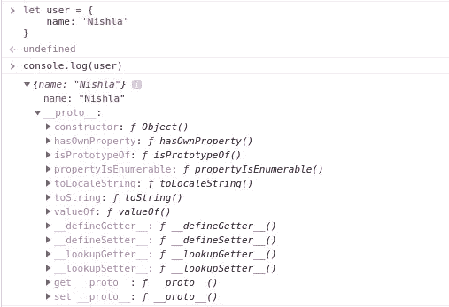

# 对象原型和原型继承的基础

> 原文：<https://javascript.plainenglish.io/object-prototype-and-prototypal-inheritance-d73784565b5?source=collection_archive---------12----------------------->


对象是构建大部分 JavaScript 的基本构件。如果你是 JavaScript 新手，那么我建议你尽可能地理解这个术语。对象是 JavaScript 中的基本数据类型之一，可以定义为键值对的集合。可以按如下方式创建对象:

```
// "object literal" syntax
let user = {
    name: 'Nishla'
};
// "object constructor" syntax
let user1 = new Object({
    name: 'Nishla'
});
```

创建每个对象后，它继承一个内部属性，称为 ***__proto__* 。**它只是对另一个对象的引用，包含该对象所有实例的公共属性/特性。将一个对象放在另一个对象中作为引用，这听起来可能有点混乱，但下面的方法可以澄清这一点:*我们创建的两个对象* ***user*** *和****user 1****都将有一个属性****_ _ proto _ _****，该属性完全相同，并将出现在我们创建的所有对象中*



Fig 1\. __proto__ property of user object

```
user.__proto__ === user1.__proto__
> trueuser.__proto__ === Object.prototype
> true
```

这个在创建时添加到每个对象的属性( *__proto__* )是对一个对象的引用，JavaScript 对象从该对象继承方法和属性( *Object.prototype* )。

JavaScript 中的原型是在对象之间共享公共功能的机制。因此，如果一个属性在一个对象中找不到，它将在原型链中一直搜索到顶部。让我们看看下面的例子:

```
let person = {
    gender: 'female',
    sings: true
}//setting person as prototype of user
Object.setPrototypeOf(user, person); user.hasOwnProperty('name');
> trueuser.hasOwnProperty('gender')
> falseuser.gender
> female
```

这里，我们将***person***object 设置为 ***user*** object 的原型，并尝试访问 ***user*** object 的 ***gender*** 属性，该属性显然不存在，但它会查看其原型对象并返回值。这个从一个人的原型继承价值的过程被称为 ***原型继承*** 。更多的例子让我们检查不同数据结构上的原型继承。

在 JavaScript 中，还有其他几个内置函数，如 *Object* 可以用作构造函数来创建对象和其他原始数据结构。我们将使用*数组*构造函数来创建一个新数组并检查它的原型

```
var friends = new Array(‘Ankita’, ‘Pratibha’, ‘Sonika’, ‘Aayesha’)
```


Fig 2\. __proto__ property of friends array

```
friends.__proto__ === Array.prototype
> true
```

Prototype 指定了它从哪个对象继承属性，这里我们创建了一个数组，关键字 ***__proto__*** 指的是一个拥有数组所有方法和属性的对象。因此，即使我只是用我朋友的名字创建了一个数组，我仍然可以使用数组继承的方法和属性，如下所示:

```
friends.sort()
> ["Aayesha", "Ankita", "Pratibha", "Sonika"]friends.length
> 4
```

我希望你已经掌握了什么是原型，原型是如何继承的，以及它的用法的简单知识。这些原型方法使用起来非常方便，我打赌这些方法在你的开发生涯中会非常有用。关于这个话题的更多信息，我建议你查看下面的链接:

1.  [原型遗传](https://javascript.info/prototype-inheritance)
2.  [原型](https://github.com/getify/You-Dont-Know-JS/blob/1st-ed/this%20%26%20object%20prototypes/ch5.md)