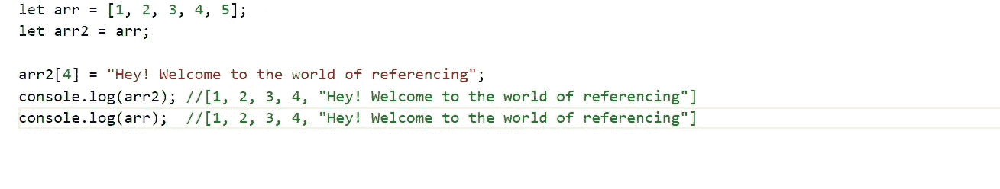
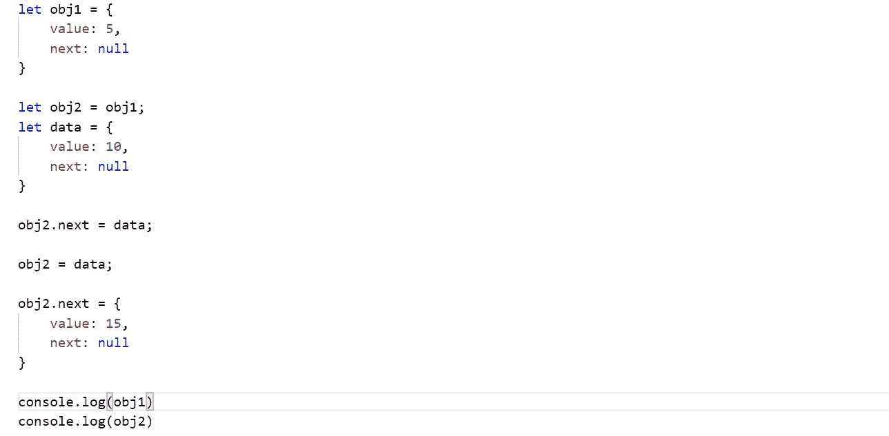

# JavaScript 中的引用是如何工作的？

> 原文：<https://javascript.plainenglish.io/object-referencing-in-javascript-9ecb6ba29e22?source=collection_archive---------0----------------------->

## 对 JavaScript 中引用的工作方式有点困惑？你不是唯一一个。把我也包括在名单里。

让我们快点开始吧。我们将变量 arr 声明为一个数组，并使用第二个 arr2 来引用变量 arr。然后我们将使用 console.log 来查找 arr2 的输出。

那么，console.log(arr2)的结果会是什么呢？猜不到奖。是[1，2，3，4，5]。现在让我们做点新的。

那么，arr2 的输出是什么呢？这很简单，不是吗？是啊，当然。

哇哦。arr2 的输出是预期的，但不是 arr 的输出。这让我们所有人都很惊讶，可能对那些稍微有点参考价值的人来说不是这样。那么，这里到底发生了什么？

当我们声明变量 arr 并初始化它时。变量 arr 指向内存中的一个位置。当我们调用 arr 时，它会去那个内存位置并获取值。现在，当我们声明变量 arr2 并将其初始化为变量 arr 时。arr 的存储位置传递给 arr2，而不是值。因此，无论何时对这两个变量中的任何一个进行更改，更改都是在内存位置进行的，这就是为什么对这两个变量都有反映。

> 我们可以有 n 个变量引用变量 arr，每次 n 个变量中的任何一个发生变化时，都会在内存位置上发生变化，并反映到每个变量输出中。

现在让我们注意一下引用中的一个复杂的概念。我们会看到对象中的引用。现在，我们将从变量 obj1 和 obj2 开始。

我想我们现在可以理解上面的代码片段是如何工作的了。不是吗？我们初始化一个变量 obj1，它指向一个内存位置，并在那里存储数据。现在，我们初始化另一个变量 obj2，并将 obj1 的地址引用到 obj2。现在，当我们对 obj2 进行任何更改时，它也会反映在 obj1 上。但是，我们现在重新初始化 obj2。现在，obj2 将指向新的内存位置，因此当 obj2 更改时，它不会在 obj2 重新初始化后立即反映到 obj1 上。

现在你会说这很容易，我们都能猜到。好吧！现在这里是另一个代码片段，猜猜变量 obj1 和 obj2 的输出。

你们都猜到了吗？好吧，让我们看看你是否答对了。

> 不，你应该猜对了。不是吗？即使我们重新初始化了 obj2 = data，obj2 上的变化也反映在 obj1 上。到底是怎么发生的？当我们放置 obj2.next = data 时，obj2.next 现在指向数据的内存位置，obj1.next 也是如此。现在当我们做 obj2 = data 时，obj2 指向数据的内存位置。

所以，我尽了最大的努力，试图让这个概念的理解。希望你喜欢。

> 当我们使用链表时，这个概念会派上用场。在末尾插入一个节点的复杂度将从 O(n)急剧地转移到 O(1)。也许，我会在下一篇文章中尝试使用这个概念，这篇文章可能是关于链表的。

如果你想了解 JavaScript 中另一个重要的提升概念，这里有链接【http://tiny.cc/zqo75y

 [## 在 JavaScript 中提升。

### 提升是 JavaScript 的一种未知或被忽略的行为。

medium.com](https://medium.com/@anupam1996/hoisting-in-javascript-946708c532af)