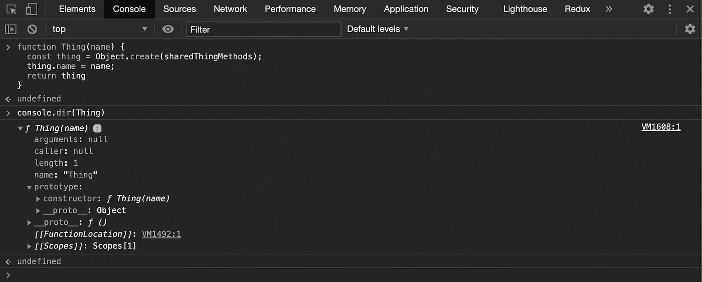
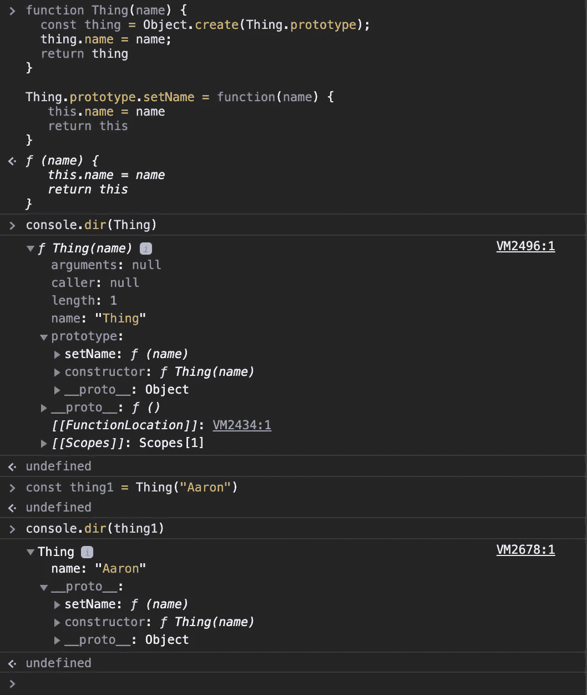
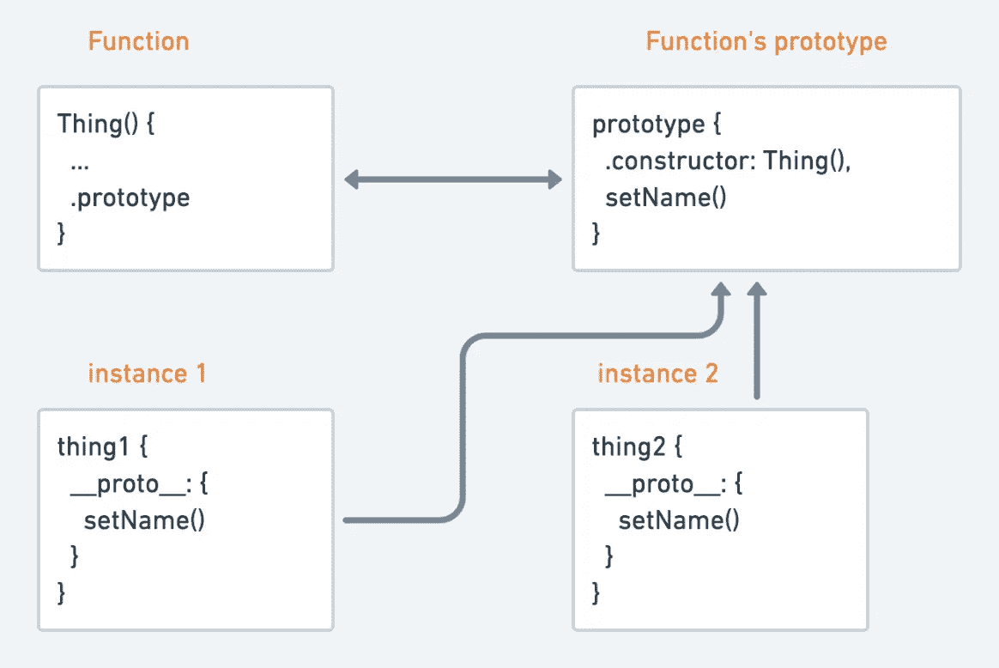

# 在 JavaScript 中创建对象的所有不同方法

> 原文：<https://javascript.plainenglish.io/objects-and-how-to-make-them-b733bb4b01e8?source=collection_archive---------10----------------------->

我最近一直在试图弄清楚如何用 JavaScript(确切地说，是许多 JavaScript)制作对象，以及理解`.prototype`、`__proto__`、原型继承与类继承以及对象组合。这是一个相当深刻的主题，这篇博客文章可能只是触及了表面，但我希望它也能帮助你更好地理解它。

首先，我将看看我们如何创建一个对象，以及它如何演变成一个工厂函数、构造函数和类。然后我们会看看为什么你会喜欢某些方法。

这些想法不是我自己的，而是我从别处学到的东西的融合。你将要读到的，我来自以下参考资料。如果你没有从这篇文章中得到你所需要的一切，我鼓励你去钻研这些:

1.  [https://ui.dev/beginners-guide-to-javascript-prototype/](https://ui.dev/beginners-guide-to-javascript-prototype/)
2.  [https://medium . com/better-programming/prototypes-in-JavaScript-5 BBA 2990 e04b](https://medium.com/better-programming/prototypes-in-javascript-5bba2990e04b)
3.  [https://medium . com/JavaScript-scene/JavaScript-factory-functions-with-es6-4d 224591 A8 b 1](https://medium.com/javascript-scene/javascript-factory-functions-with-es6-4d224591a8b1)
4.  [https://medium . com/JavaScript-scene/JavaScript-factory-functions-vs-constructor-functions-vs-classes-2f 22 ceddf 33 e](https://medium.com/javascript-scene/javascript-factory-functions-vs-constructor-functions-vs-classes-2f22ceddf33e)
5.  [https://medium . com/JavaScript-scene/master-the-JavaScript-interview-what-s-the-difference-class-prototypal-inheritance-e4c d0 a 7562 e 9](https://medium.com/javascript-scene/master-the-javascript-interview-what-s-the-difference-between-class-prototypal-inheritance-e4cd0a7562e9)

# 只有一个

这是我们如何用 JavaScript 创建一个对象:

```
const name = "Aaron";const thing = {
  name,
  setName(name) {
    this.name = name;
    return this;
  } 
}
```

这叫做对象字面量。请注意这里也使用了速记语法。这与以下内容相同:

```
const thing = {
  name: "Aaron",
  setName: function(name) {
    this.name = name;
    return this;
  } 
}
```

太好了，我们可以做一个，多一个怎么样？

# 工厂功能

我们可以设想创建一个函数，让许多对象看起来有点像这样:

```
function Thing(name) {
  const thing = {};
  thing.name = name;
  thing.setName = function (name) {
    this.name = name;
    return thing;
  };
  return thing;
}const thing1 = Thing("Aaron");
```

这是一个工厂函数。它可以用几种不同的方式编写，包括箭头函数语法(稍后将详细介绍)。

假设`Thing`的每个实例都有一个`setName`方法。因此，理想情况下，我们希望所有的`Thing`实例共享同一个`setName`方法。我们可以这样实现:

```
const sharedThingMethods = {
  setName(name) {
    this.name = name;
    return this;
  },
};function Thing(name) {
  const thing = Object.create(sharedThingMethods);
  thing.name = name;
  return thing;
}const thing1 = Thing("Aaron");
```

`[Object.create()](https://developer.mozilla.org/en-US/docs/Web/JavaScript/Reference/Global_Objects/Object/create)`是这里的钥匙。它创建一个新对象，并将其参数用作查找失败的委托对象。所以，假设你做了`thing1.setName("new name")`，JavaScript 将会寻找`sharedThingMethods`的`setName()`方法，因为它不存在于`Thing`的实例中。

事实证明，JavaScript 有一种内置的方式来完成上面的工作，这就是函数`.prototype`属性。

# 什么是原型？

对于这一点，您将需要打开一个浏览器窗口，并准备好开发工具。不，说真的，不要只是读它😉。

将`Thing`功能复制粘贴到控制台，然后点击`console.dir(Thing)`。这将列出`Thing`函数对象的所有属性，您应该有如下内容。



查看`prototype: constructor: f Thing(name)`。这是什么？它与我们的`sharedThingMethods`有何关系？

所有的函数(用`function`关键字定义——稍后会讲到)都有一个引用对象的`.prototype`属性。该对象有一个`.constructor`属性，该属性返回到它所属的函数。原来，这个原型对象的功能和`sharedThingMethods`差不多。正如您在控制台中看到的，目前的情况是`Thing`没有利用它的原型，让我们改变这一点。

```
function Thing(name) {
  const thing = Object.create(Thing.prototype); // <<< This bit changes
  thing.name = name;
  return thing;
}Thing.prototype.setName = function (name) {
  this.name = name;
  return this;
};const thing1 = Thing("Aaron");
```

现在，在查找失败时，我们将参考原型，而不是参考`sharedThingMethods`对象。我们现在有这样一种情况:



注意功能`.prototype`上的`setName`和实例`__proto__`。

您也可以这样想象:



`Thing`的每个实例都有一个引用函数`.prototype`的`__proto__`属性。`setName`通过函数的原型在`Thing`的所有实例之间共享。

# 工厂功能 3 种方式

因此，我们知道我们可以创建一个工厂函数来制造大量的对象，我们也知道工厂函数原型在其中扮演了什么角色。但是，当您使用 Arrow 函数来定义工厂函数时会发生什么呢？

这三个工厂的功能几乎相同，但有一个轻微的差异，你能告诉吗？

```
// Factory 1 (the one we have already been looking at)
function Thing(name) {
  const thing = Object.create(Thing.prototype);
  thing.name = name;
  return thing;
}Thing.prototype.setName = function (name) {
  this.name = name;
  return this;
};const thing1 = Thing("Aaron");// Factory 2
const proto = {
  setName(name) {
    this.name = name;
    return this;
  },
};const Thing = (name) => {
  const thing = Object.create(proto);
  thing.name = name;
  return thing;
};// Factory 3 ()
const Thing = (name) => ({
  name,
  __proto__: {
    setName(name) {
      this.name = name;
      return this;
    },
  },
});
```

这到底是怎么回事？为什么“工厂 2”看起来像是我们要回到手动设置原型对象，工厂 3 中的`__proto__`是什么？

**总之**:所有这些功能都采用原型委托，只是方式不同。前两个在功能上是等效的——它们在所有实例之间共享一个原型。最后一个在内存使用上有所不同。它为每个实例创建一个新的原型。

话真多，让我们详细说明一下。

[Arrow 函数](https://developer.mozilla.org/en-US/docs/Web/JavaScript/Reference/Functions/Arrow_functions)没有`.prototype`属性，这意味着它们不能用作构造函数(更多关于构造函数的内容请参见下文)，但是它们可以用作如上的工厂函数。查看工厂 2，缺少`.prototype`意味着您必须自己委托一个原型对象并将其传递给`Object.create()`。你选择工厂 1 还是工厂 2 完全是个人喜好的问题，但是他们的行为都是一样的。

工厂 3 的不同之处在于，它通过定义`__proto__`来创建原型，但是它为每个创建的实例创建一个新的原型，并且缺乏其他工厂 2 所具有的内存节省优势。那么，工厂 3 中的原型有什么意义呢？假设我们想使用类似`Object.keys(thing1)`的东西迭代我们的`Thing`实例，我们可能希望从这个操作中排除类似`setName`的方法。因为某些属性在所有情况下都是通用的，所以包含它们可能会产生无用的“噪音”,没有什么意义。将它们放在`__proto__`属性上可以隐藏它们。

# 从工厂到施工人员

因此，我们已经研究了工厂函数，如何使用它们来创建对象的多个实例，如何为对象属性查找创建委托的原型链，以及根据您编写工厂函数的方式，这看起来会有什么不同。现在让我们看看 JavaScript 是如何用构造函数和类在整个过程中添加一些语法糖的。

如果用关键字`new`调用一个函数，即`const thing1 = new Thing("Aaron")`，那么这个函数就是一个构造函数。将我们的工厂函数转换成构造函数，我们可以省略几行。

```
function Thing(name) {
  // const this = Object.create(Thing.prototype);
  this.name = name;
  // return this
}Thing.prototype.setName = function (name) {
  this.name = name;
  return this;
};const thing1 = new Thing("Aaron");
```

有了构造函数，上面注释掉的两行就隐式地完成了。注意，创建的对象名为`this`，并被隐式返回。

# 从构造函数到类

只要用关键字`class`稍微增加一点语法上的难度，我们就能得到这个结果:

```
class Thing {
  constructor(name) {
    this.name = name;
  }
  setName(name) {
    this.name = name;
    return this;
  }
}const thing1 = new Thing("Aaron");
```

值得注意的是，这在功能上等同于上面的构造函数。只是看起来不一样。

# 工厂函数 vs 构造函数 vs 类

这篇文章已经讨论了工厂函数、构造函数和类，但是让我们后退一步，看看什么时候我们可以使用其中的一个。

类和构造函数是一样的，只是语法上稍有不同。因此，构造函数的优点和缺点也适用于类。

构造函数强制调用方使用`new`关键字。工厂没有。这是唯一的区别，但这确实有一些副作用。

工厂函数有时被视为构造函数的升级，实际上是一种常见的重构模式。

简单重述一下——`new`关键字的使用导致 JavaScript 自动创建一个新对象，在函数中为该对象设置`this`,并返回该对象。这在工厂函数中不会自动发生。您需要告诉工厂函数返回什么(在大多数情况下是新对象)，但这确实增加了一点灵活性。

```
function ConstructorThing(name) {
  this.name = name;
}
ConstructorThing.prototype.setName = function (name) {
  this.name = name;
  return this;
};function factoryThing(name) {
  const obj = {
    name,
    setName(name) {
      this.name = name;
      return this;
    },
  };
  // Other code to manipulate obj in some way here
  return obj;
}
```

事实上，我们可以包含其他代码来以某种方式操作对象，并定义要返回的对象，这意味着返回值可能因参数而异。

从[封装](https://www.aaron-thompson.dev/posts/code-encapsulation-40mm/)的角度来看，这种灵活性也是有益的。考虑以下工厂函数:

```
function createWallet() {
  const balance = 0; function privateMethod() {
    console.log("do a private thing");
  }
  function add() {
    console.log("add");
  }
  function empty() {} return Object.freeze({
    add,
    empty,
  });
}
```

只有我们在返回中公开的方法是公共的。其他的都被封装了。

默认情况下，类(以及扩展构造函数)属性是公共的，可以在类外部检查或修改。也就是说，私有字段作为一个实验特性在类中是可用的。

类和构造函数可以创建有问题的层次结构，导致面向对象设计中众所周知的问题，包括脆弱的基类、“大猩猩香蕉问题”和必然的复制。通过使用工厂函数，你可以采用一种复合优于继承的方法，但这是另一篇博文的大主题！

这是一个巨大的话题，我期待着写更多关于它的东西。我还在学习，所以一如既往，任何建设性的意见都很感谢。