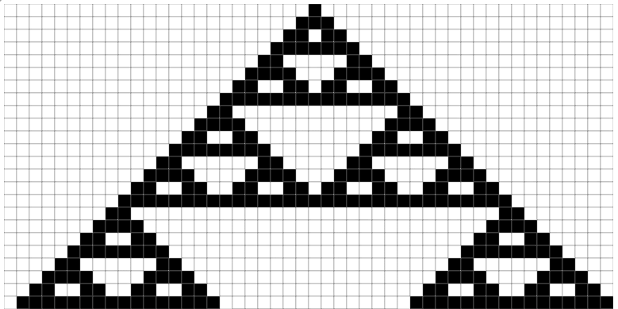
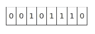
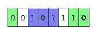
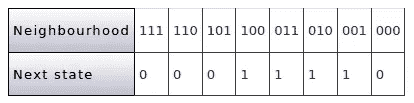
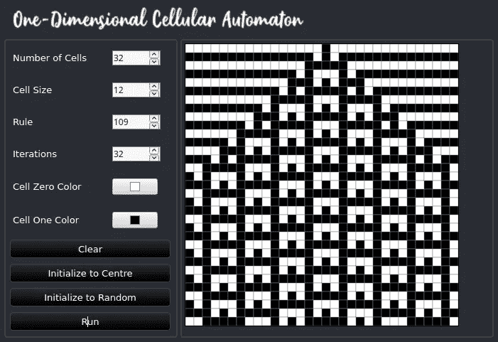
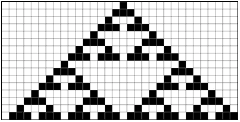
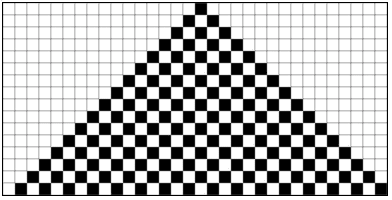
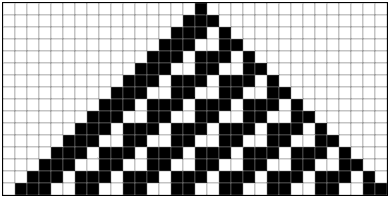

# JavaScript 中的一维元胞自动机

> 原文：<https://javascript.plainenglish.io/one-dimensional-cellular-automaton-in-javascript-85eb31ad6e67?source=collection_archive---------6----------------------->

Rule 126

在这篇文章中，我将用 JavaScript 编写一个一维元胞自动机的简单实现。

细胞自动机的概念自 20 世纪中期就已经存在，并且已经发展成为一个具有许多实际和理论应用的广阔领域。

细胞自动机由排列在 1、2、3 或更多维中的任意数量的“细胞”组成。每一个都有一个与之相关的状态(在最简单的情况下只是开或关)，每个单元以及整个自动机都根据一个或一组规则随时间从一个状态转换到下一个状态。

维度的数量、可能的细胞状态的数量和规则可以变得任意大和复杂，但是对于这个项目，我将实现最简单类型的一维细胞自动机，称为初等细胞自动机。

## 基本细胞自动机

一个基本的细胞自动机由一排细胞组成，每一个细胞都可以“开”或“关”，在下表中用 0 和 1 表示。

为了计算每个单元的下一个状态，单个单元被认为具有由单元本身和两侧的两个单元组成的“邻域”。对于两端的单元，邻域的一部分是另一端的单元，因此自动机可以被认为是逻辑循环的。下表显示了以粗体显示的两个小区的邻域。

有 8 个可能的邻域，因此用于设置下一个单元状态的规则可以用一个字节来表示。由所有可能的字节表示的十进制值 0-255 形成了众所周知的沃尔夫拉姆码，这是以史蒂夫·沃尔夫勒姆的名字命名的，他在该领域进行了研究，并写了《一种新的科学》一书。

这是规则 30 的 Wolfram 代码，第二行的位形成二进制的 30

1D 元胞自动机随时间变化的状态通常由连续的行表示，状态由不同颜色的块表示。在这个项目中，我将编写一个基于 HTML/JavaScript 的实现，这是一个使用规则 109 运行示例的截图。产生的一些模式可能比其他模式更有趣。

该项目由以下文件以及 css 文件和图形组成，所有这些都可以从 [Github 库](https://github.com/CodeDrome/cellular-automata-1d-javascript)中克隆/下载。

*   ca1d.js —实现细胞自动机本身
*   ca1dsvg.js 在 HTML 页面中输出 ca1d.js 中的细胞自动机
*   ca1d.htm—包含一个细胞自动机，它的输出和控制
*   ca1d page . js—ca1d.htm 的后台代码

首先让我们看一下 **ca1d.js** ，它作为 ES6/ES2015 类实现了一个细胞自动机，从构造函数开始。

这里发生的事情不多，是吗？！我们所做的就是为属性创建一些后备变量。

前两个属性是数组，最初为空，可以向其中添加函数，当当前状态或单元格数量发生变化时会调用这些函数。这使得任何负责绘制细胞自动机的代码都包含对`CellularAutomaton1D`对象的引用，并向其添加事件处理程序。然后，这些事件处理程序将做任何必要的事情来绘制自动机的可视化输出。这使得细胞自动机和它的视觉输出完全分离。我将使用`CellularAutomaton1DSVG`类，但是你可以编写并“插入”你自己的实现，而不用修改`CellularAutomaton1D`类。

然后我们又多了几处房产。请注意，最后一个按钮`NumberOfCells`触发了一个适当的事件，以便插入的任何 UI 都知道如何更新自己。

前两个方法调用了`_StateChangedEventHandlers`和`_NumberOfCellsChangedEventHandlers`数组中的所有函数。通常只有一个，但如果你愿意，你可以添加更多。

接下来是`Randomize`方法。这会以相等的概率将每个单元格随机设置为 0 或 1。

`InitializeToCentre`方法将所有单元格设置为 0，除了设置为 1 的中间单元格。

方法是最复杂的，位于类的核心。首先，我们需要将规则转换为二进制数，转换为字符串并填充到 8 位。例如，规则 30 变为“00011110”。

然后我们迭代单元格，首先获取前一个和下一个单元格的索引，并允许第一个和最后一个单元格滚动到另一端。然后，我们可以将三个单元的邻域值设置为一个字符串。

然后，在一个开关块中，我们将`_NextState`数组中的相关单元设置为正确的值。我们需要在一个单独的数组中设置下一个状态；就地设置单元格会打乱连续单元格下一个值的计算。循环结束后，我们只需将新状态复制到当前状态，并触发相关事件。

最后一个方法是`Iterate`，它简单地循环函数参数中的迭代次数，每次调用`CalculateNextState`。

现在我们可以转到显示细胞自动机的代码，也是一个类。

在为各种属性设置了一些支持变量之后，我们为`CellularAutomaton1D`类事件设置了几个处理程序。对于状态改变，我们需要调用函数来增加 SVG 元素的高度，以容纳额外的一行，然后绘制该行。对于单元格数量的变化，我们需要改变宽度以适应新的单元格数量。

最后，我们需要调用函数来设置 SVG 元素的初始宽度和高度。

这里没有什么令人兴奋的事情发生——只有一些 getters 和 setters。

## _DrawState

该函数为每个单元格创建一个新元素，设置其大小、位置和颜色，并将其添加到 SVG 元素中。总体效果是在显示的底部添加一行新的单元格。

## _SetHeight 和 _SetWidth

设置 SVG 元素相关属性的非常简单的函数。

## 清楚的

从 SVG 元素中移除所有元素，同时重置迭代，并将 SVG 元素的大小设置为 0，从而有效地隐藏它。

## ca1d.htm

我没有在这里列出页面的 HTML，但是它包含在 zip 和 Github 库中。它只包含屏幕截图中显示的控件和 SVG 元素。

## ca1dpage.js

同样，这里我没有展示代码，但是它创建了`CellularAutomaton1D`和`CellularAutomaton1DSVG`类的实例，以及在各种控件的事件处理程序中设置属性或调用方法。

在你的浏览器中打开**ca1d.htm**，设置一个规则，点击初始化到中心按钮，然后点击运行按钮。这里有几个例子。

Rule 22

Rule 122

Rule 158