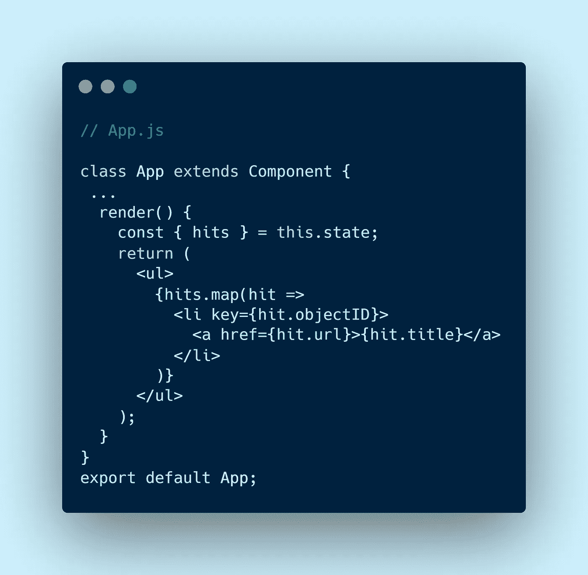

# 带 React 挂钩的一夜情

> 原文：<https://javascript.plainenglish.io/one-night-stand-with-react-hooks-92999797c3d3?source=collection_archive---------13----------------------->

Illustration by [SouravInsights](https://twitter.com/SouravInsights)

# 我新恋情的开始

原谅我这样的标题，但我的创作自由只能想出这个…然而，我是认真的。我是说**胡克斯**就是这样一个**辣妹**让每个人都疯狂**。事实上**，所有的 JavaScript 卡萨诺瓦都在寻找机会用**钩子**把钩住。😝所以，当世界为 React Hooks 疯狂的时候，我没花太多时间就发现了 React Hooks 的热门。到这个时候，我已经开始渴望和**的一夜情了，最后，我走运了。😬现在**找个座位**我给你讲我如何和 React 钩子做爱的下流故事。🥰**

在 Hooks 之前，我和**类组件**结婚是为了能够处理状态。我们的关系很好，也许现在还是。但事情变得复杂了，至少对我来说是这样。🥴

我敢肯定，很多 **JavaScript 卡萨诺瓦**也是这样。作为一种人类特质，我们都会瞬间爱上一个闪亮的新事物。但是有了**反应钩**就不一样了，我发誓这不是一次**放纵**。😌好了，够了，现在你能给我解释一下什么是反应钩吗？🙏

**先等等**，在我谈论钩子之前，讨论一下我和常规**类组件的关系不是更有意义吗？**🤔那就让我允许你调查我的前任。👇

嗯，她也很漂亮。至少在我看到钩子之前。😌我假设你能清楚地阅读那些解释每一行代码片段的注释行。那么，我们来谈谈`componentDidMount()`生命周期法。这是事实上获取数据的方式。人们仍然在使用它，这完全没问题。在 React 的未来更新中，我们可以用****更有效地做同样的事情。**但是让我们把它留到以后吧。回到我们的话题。**

**因此，在方法`componentDidMount,` **中，DidMount** 表明当调用或运行该方法时，组件已经使用 **render( )** 方法运行，并且在 **setState( )** 的帮助下，当提取的数据存储在本地状态时，组件将再次运行。当它存储在本地状态中时，就可以在 render()方法中使用它来显示一些东西或者将它们作为道具传递。**

# **是时候建造一些东西了…**

**说得够多了，我们现在将构建一个小应用程序，它从广为人知的[**hacker news API**](https://hn.algolia.com/api/v1/search)获取数据，并在我们的应用程序中呈现它们。太棒了，让我们开始编码吧…**

**你可以使用`create-react-app`或者使用 **Codesandbox。对于本教程，我将推荐 Codesandbox。它易于设置，可以无缝地启动和部署应用程序。点击 [**此处**](https://codesandbox.io/s/new) 新建一个 **Codesandbox** 项目。****

> **请确保您键入每一行代码，而不是复制粘贴。重要的是把这些东西打出来，然后自己尝试。好吧，你说到点子上了，我们继续吧…**

**现在在`App.js`文件中用下面的代码替换内容:**

****

**再次提醒你，这里我们使用[**hacker news API**](https://hn.algolia.com/api/v1/search?query=react)来获取流行的 React 文章。显然，你可以使用你自己的 API 或者任何你自己选择的 API。还有另一个由[**JSONPlaceholder**](https://jsonplaceholder.typicode.com/)提供的用于测试目的的 API。因此，在这里，一旦获取了数据，我们就使用`this.setState()`方法将它存储在本地状态中。正如我前面解释的那样，一旦它存储在本地状态中，render()方法就会使用它。**

**酷，现在让我们写我们的渲染方法，我们将使用 **map** 函数显示获取的数据。简单地说，它让我们用修改后的数据将一个数组转换成另一个数组。**

****

**在这里，我们的应用程序组件使用`map`函数创建一个新的数组，该数组具有相同数量的元素，其中每个元素都是调用我们提供的函数的结果。**

**我们的代码中有一些小东西，比如:`hit`、`objectID`、`url`、`title`，如果你想知道这一切到底是从哪里来的，那么请在你的浏览器中打开[**hacker news API**](https://hn.algolia.com/api/v1/search?query=react)或者 [**Postman**](https://www.postman.com/) 。正如您在 JSON 响应中看到的，`**hits**` 是来自 HN API 的一个数据数组，它有下面的键对:`objectID`、`url`和`title`。**

**还有一件事你可能已经注意到了，我在上面的例子中使用了项目的数组索引作为`key`道具。React 依靠`key`来识别列表上的项目。记住 React 使用一个虚拟 DOM，它只重画自上次渲染以来发生变化的组件。这就是了。现在一切都应该正常了。**

## **[**在 Codesandbox 上试试吧。**](https://codesandbox.io/s/data-fetching-using-conventional-class-component-gf5iw)**

# **见见我的新女友，React Hooks 女士:**

**现在是时候向你介绍我的新女友了。我知道你们都在等待这一刻。😏**

**很多时候，当我们构建 React 应用程序时，我们看到自己在两个或更多不同的组件中编写几乎完全相同的代码。理想情况下，我们在这种情况下可以做的是将递归逻辑提取到一段**可重用代码(hook)** 中，并在需要的地方重用它。**

**这就是定制挂钩背后的整个想法。所以，事不宜迟，**让我们构建一个自定义钩子**来从广为人知的 [**黑客新闻 API**](https://hn.algolia.com/api) 中获取数据，从壁橱中获取流行的 React 文章。**

# **好吧，让我们用 React 钩子重新发明轮子:**

**正如你已经知道的，我们将在一个类组件中使用 React 钩子，以一种更可持续的方式实现我们之前用`componentDidMount()`实现的相同特性。所以，让我们把手弄脏吧。😬**

**点击 [**此处**](https://codesandbox.io/s/new) 创建一个新的 Codesandbox 项目。**

**完成后，用下面的代码替换您的`app.js`文件。**

****

**Generate beautiful images of your source code using [**Carbon**](https://carbon.now.sh/).**

**如果您已经编写了代码片段，它可能会显示一些错误。暂时不要惊慌。**

**因此，我们在这里写了一个功能组件，它将显示黑客新闻中的热门反应文章列表。我们正在使用一个名为 **useState** 的钩子，负责管理我们要为应用组件获取的数据的**本地状态**。**参照下图**了解**使用状态**挂钩。**

****

**在我们的例子中，初始状态是**命中**的空列表，这是一个表示我们的数据的对象。**

**我们将使用 [axios](https://github.com/axios/axios) 来获取数据，但是您可以使用另一个数据获取库或浏览器的本机**获取 API** 。在 Codesandbox 中添加 axios 作为依赖项，或者在 CLI 中键入`npm install axios`(如果您正在本地系统中这样做)。**

## **useEffect Hook 的魔力:**

**我们现在将使用另一个名为 **useEffect** 的内置钩子。它允许您在功能组件中执行副作用。副作用可能意味着从更新文档标题到发出 API 请求的任何事情。在“反应”渲染树之外发生的任何事情都是组件的副作用。**

**把它想象成一个可以直接在**功能组件**中处理**生命周期事件**的功能。这是最棒的部分，useEffect 取代了三种不同的 API 方法(`componentDidMount`、`componentDidUpdate`和`componentWillUnmount`)。所有功能都是一个！很疯狂，不是吗？让我们通过在我们的例子中实际使用它来看看魔法。**

> **此外，您还可以通过[**丹·阿布拉莫夫**](https://medium.com/u/a3a8af6addc1?source=post_page-----92999797c3d3--------------------------------) 阅读 [**使用效果完整指南**](https://overreacted.io/a-complete-guide-to-useeffect/) 以深入了解使用效果。**

****

**现在，让我们将这个功能添加到我们的应用程序组件中，一切都将正常工作。请注意，我们在这里使用`async`、`await`来获取数据。在上面的例子中，我们使用了处理 JavaScript 承诺的常见方式，即使用它们的`then()`块。JavaScript 中的下一代异步请求呢？这就是为什么我将这个例子重构为使用 async/await。**

**好吧，所以上面的代码感觉很熟悉，看起来像我的前女友，但穿着不同的西装。😜是的，我说的是常规类组件中的`componentDidMount`。这并不完全相似，但是是的，它现在更加**易读**，更加**清晰**，非常**简洁**和**直截了当**。我告诉过你，React Hook 是个**辣妹**。👌**

**但是等等，先别激动。上面的代码有个 **bug** ！*美丽是有代价的*。😏现在在浏览器的另一页打开预览，然后转到网络选项卡。如你所见，它在获取数据的**无限循环**中。哪里出了问题？🤔在一个类组件中，`componentDidMount`在组件挂载后被调用。它只发射一次。但另一方面，默认情况下，`useEffect`内部的效果会应用于每一次渲染。它让我们传递一个可选参数——一个`dependencies`的**数组**,通知 React 何时应该重新应用效果。如果所有依赖项都没有改变，则不会重新应用该效果。所以，让我们像这样在末尾添加一个**空数组****

****

**厉害！现在一切都正常了。检查你的代码是否有不一致的地方，并与我的 code sandbox[**Demo**](https://codesandbox.io/s/a-simple-custom-hook-for-data-fetching-non-encapsulated)进行比较。让我们提取我们的定制钩子，这样我们可以在其他地方重用组件逻辑。**

# **封装我们的定制钩子:**

**创建另一个名为***use fetch . js****的文件，用下面的代码替换。***

****

**相当直接。只是不要忘记返回数据对象。否则，您会看到类似这样的错误:*无法读取未定义的属性“hits”。这很明显，因为我们的函数应该总是返回一些东西。***

**现在转到 ***App.js*** 用这个替换它:**

****

## **[在 Codesandbox 上尝试。](https://codesandbox.io/s/a-simple-custom-usefetch-hook-dc0tb?file=/src/App.js:215-317)**

****祝贺你！！🥳** 很显然，你刚刚爱上了我的新女朋友，**胡克小姐反应过来。😜**同样，祝贺您创建第一个自定义反作用挂钩**。👏****

**但这并不是故事的结尾。首先，我只是想有一个一夜情，然后忘记。但由于这种情况在生活中很少发生，我们最终总是会产生某种依恋。这就是我的遭遇。我现在爱上了反作用钩子。**

**感谢你到目前为止阅读这篇文章。如果您有任何反馈，请在下面发表评论。**

**你可以在[中](https://medium.com/@souravinsights)和[推特](https://twitter.com/SouravInsights)上跟着我。如果你有任何疑问，或者需要任何类型的指导，或者只是想随意谈论你的生活，请在推特上与我联系。我很乐意帮忙。**

**我目前正在寻找一些自由职业的机会。我对开发任何类型的软件即服务产品感兴趣，也很想听听你的想法。请在[howdysourav@gmail.com](mailto:howdysourav@gmail.com)与我联系🔥🔥🔥**

**到那时
快乐编码！**

## ****简单明了的 JavaScript****

**喜欢这篇文章吗？如果是这样，通过 [**订阅我们的 YouTube 频道**](https://www.youtube.com/channel/UCtipWUghju290NWcn8jhyAw) **获取更多类似内容吧！****