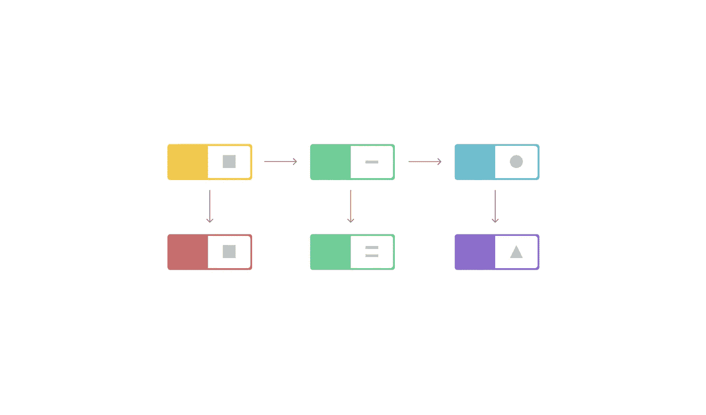
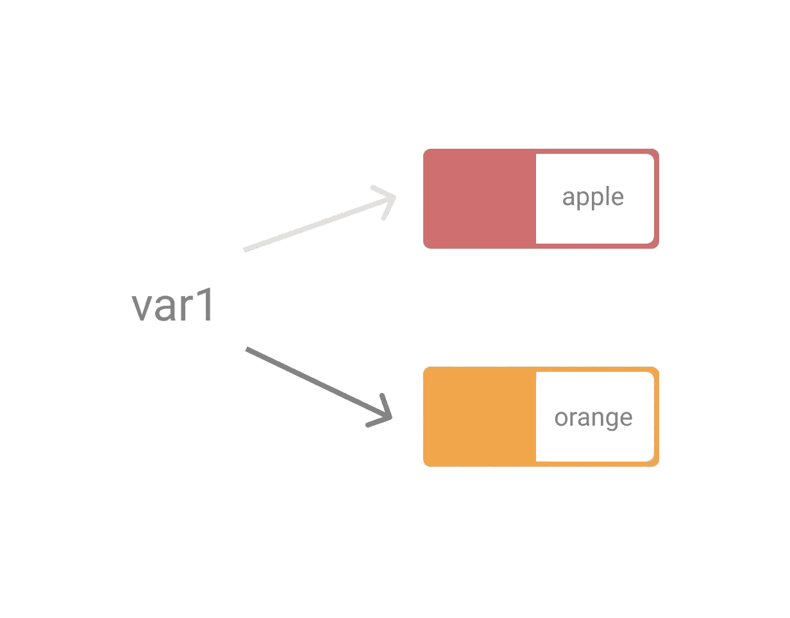
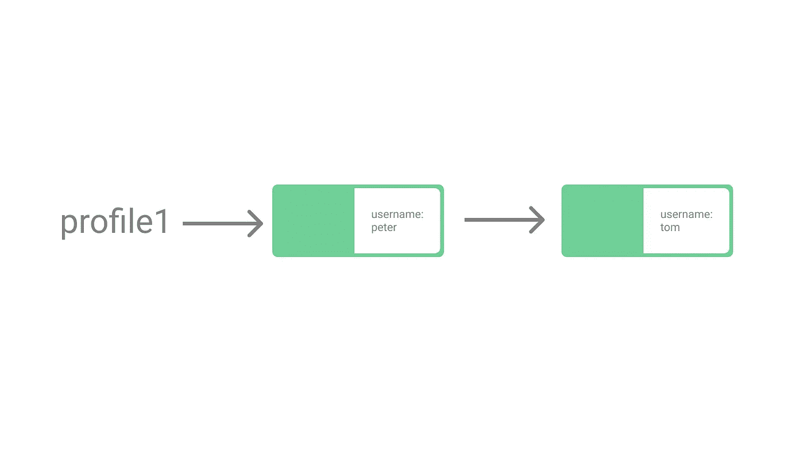
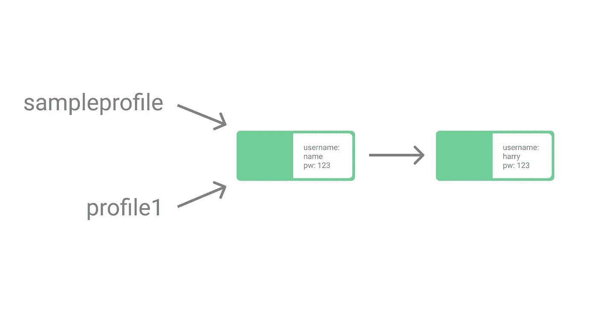
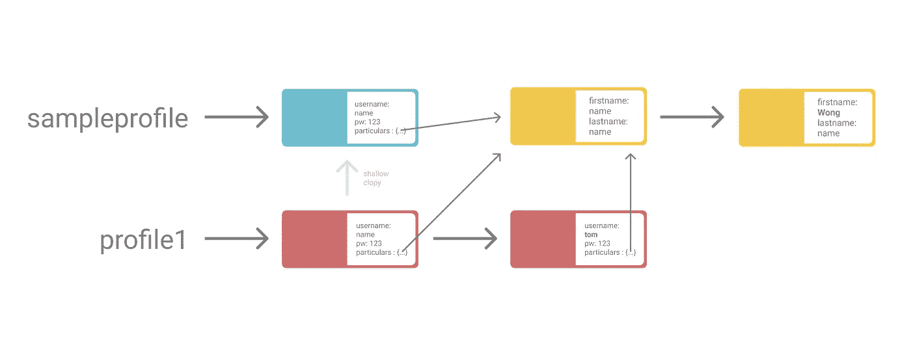

# JavaScript 中需要理解的第一件事——不变性

> 原文：<https://javascript.plainenglish.io/one-of-the-first-things-to-understand-in-javascript-immutability-629fabdf4fee?source=collection_archive---------5----------------------->

## JavaScript 中的突变以及了解这一点的重要性

## **让我们回到基础:“在 JavaScript 中，*变量*或者常量是不可变的吗？”**



答案是**都不是**，如果你对你的答案有一点犹豫，请继续读下去。每种编程语言都有不同的风格和特点，在 JavaScript 中，这是需要注意的最重要的事情之一，尤其是在我们学习 Python、Java 等语言的时候。

您可能不需要立即改变用 JavaScript 编写代码的方式，但是尽早了解这一点，可以防止您陷入以后难以调试的糟糕境地。我将包括一些你可以采用的方法来防止陷入这样的问题——做浅层和深层拷贝的不同方法。

在我们开始之前，先简单总结一下:
**变量**(用`let`初始化)—可重新赋值的&可变的
**常量**(用`const`初始化)—不可重新赋值的&可变的

在我们解释 JavaScript 的可变性之前，让我们快速浏览一些基础知识…你可以跳过这一部分。

JavaScript 中大致有几组数据类型:

1.  **原始(主要)** —布尔、数字、字符串
2.  **非原语(引用)或对象** —对象、数组、函数
3.  **特殊** —空，未定义

*快速提示，你可以用* `*console.log(typeof unknownVar)*` *算出你正在处理的变量的数据类型*

## 默认情况下，原始数据类型是不可变的

对于原始数据类型(如 boolean、number 和 strings)，如果它们被声明为常量，它们就是**不可变的**，因为对于这些数据类型，您不能添加任何附加属性或改变某些属性。

要‘改变/改变’原语，仅仅意味着你必须重新分配它们，只有当它们被声明为变量时才有可能。

```
**let** var1 = 'apple' //'apple' is stored in memory location A
var1 = 'orange' //'orange' is stored in memory location B**const** var2 = 'apple'
var2 = 'orange' // ERROR: Re-assignment not allowed for constants
```



在上面的例子中，如果我们编辑 var1 的字符串，JavaScript 将简单地在另一个内存位置创建另一个字符串，var1 将指向这个新的内存位置，这被称为**重新分配**。这适用于所有的*原始数据类型*，不管它们是被声明为变量还是常量。

并且所有常数都不能被重新赋值。

# 在 JavaScript 中，对象是通过引用传递的

当我们处理**对象**时，问题开始出现…

## 对象不是不可变的

对象一般指非原语数据类型(对象、数组、函数)，即使用`const`声明为常量也是可变的

*(在本文的其余部分，我将给出 Object 数据类型的例子，因为这里出现的问题最多。数组和函数的概念是一样的)*

那么这意味着什么呢？

```
const profile1 = {'username':'peter'}
**profile1.username = 'tom'**
console.log(profile1) //{'username':'tom'}
```



在这种情况下，profile1 指向位于同一内存位置的对象，我们所做的是在同一内存位置改变该对象的属性。

这看起来很简单，为什么会有问题呢？

## 当对象的变异成为一个问题时…

```
const sampleprofile = {**'username':'name'**, 'pw': '123'}
const profile1 = sampleprofile**profile1.username = 'harry'**console.log(profile1) // {**'username':'harry'**, 'pw': '123'}
console.log(sampleprofile) // {**'username':'harry'**, 'pw': '123'}
```

*看起来像是一段简单的代码，你可能无意中编写了这段代码，对吗？你猜怎么着，这里已经有一个问题了！*

这是因为在 JavaScript 中对象是通过引用传递的**。**



在这种情况下，通过引用传递的'*'的意思是，我们将常量 sampleprofile 的引用传递给 profile1。换句话说，profile1 和 sampleprofile 的常量都指向位于 **相同内存位置**的同一个对象**。***

因此，当我们更改常量 profile1 的对象的属性时，它也会影响 sampleprofile，因为它们都指向同一个对象。

```
console.log(sampleprofile===profile1)//true
```

*这只是一个简单的例子，说明了通过引用传递(以及由此产生的变异)可能会有问题。但是我们可以想象，当我们的代码变得更加复杂和庞大时，这将变得非常棘手，如果我们没有意识到这一点，我们将很难解决某些错误。*

那么，我们如何预防或试图避免潜在的此类问题呢？

为了有效地面对与对象突变相关的潜在问题，我们应该了解两个概念:

*   **通过冻结物体防止变异**
*   **使用浅层&深层复制**

我将展示一些用 JavaScript 实现的例子，使用普通的 JavaScript 方法，以及一些我们可以使用的有用的库。

# 防止对象中的突变

## 1.使用 Object.freeze()方法

如果你想阻止一个对象改变属性，你可以使用`Object.freeze()`。这样做的目的是不允许对象的现有属性改变。任何这样做的尝试都会导致它“无声地失败”，这意味着它不会成功，但也不会有任何警告。

```
const sampleprofile = {'username':'name', 'pw': '123'}**Object.freeze**(sampleprofile)sampleprofile.username = 'another name' **// no effect**console.log(sampleprofile) // {'username':'name', 'pw': '123'}
```

然而，这是一种**浅冻结**的形式，它不能用于深度嵌套的对象:

```
const sampleprofile = {
  'username':'name', 
  'pw': '123', 
  'particulars':{'firstname':'name', 'lastname':'name'}
}**Object.freeze**(sampleprofile)sampleprofile.username = 'another name' **// no effect**
console.log(sampleprofile)/*
{
  'username':'name', 
  'pw': '123', 
  'particulars':{'firstname':'name', 'lastname':'name'}
}
*/sampleprofile.particulars.firstname = 'changedName' **// changes**
console.log(sampleprofile)/*
{
  'username':'name', 
  'pw': '123', 
  'particulars':{'firstname':'changedName', 'lastname':'name'}
}
*/
```

在上面的例子中，嵌套对象的属性仍然能够改变。

您可以创建一个简单的函数来递归冻结嵌套的对象(您可以自己尝试一下，并在本文中评论您的答案？😊)，但是如果你很懒，这里有一些你可以使用的库:

## 2.使用深度冷冻

但说真的，如果你看看[深冻](https://www.npmjs.com/package/deep-freeze)的[源代码](https://github.com/substack/deep-freeze/blob/master/index.js)，它本质上只是一个简单的递归函数，但无论如何这是你可以轻松使用它的方式..

```
var deepFreeze = require('deep-freeze');const sampleprofile = {
  'username':'name', 
  'pw': '123', 
  'particulars':{'firstname':'name', 'lastname':'name'}
}deepFreeze(sampleprofile)
```

深度冻结的另一个替代方法是 [ImmutableJS](https://immutable-js.github.io/immutable-js/) ，你们中的一些人可能更喜欢它，因为它有助于在你试图改变你用库创建的对象时抛出一个错误。

# 避免与通过引用传递相关的问题

关键在于理解 JavaScript 中的**浅层和深层复制/克隆/合并**。

根据程序中对象的具体实现，您可能希望使用浅层或深层复制。还可能有关于内存和性能的其他考虑，这将影响您对浅拷贝或深拷贝甚至库的选择。但是我们将把这个留到我们到达那里的另一天😉

我们先从浅抄开始，然后是深抄。

# 浅层复制

## 1.使用扩展运算符(…)

ES6 引入的 spread 操作符为我们提供了一种更简洁的方式来组合数组和对象。

```
const firstSet = [1, 2, 3];
const secondSet= [4, 5, 6];
const firstSetCopy = [...firstset]
const resultSet = [...firstSet, **...**secondSet];console.log(firstSetCopy) // [1, 2, 3]
console.log(resultSet) // [1,2,3,4,5,6]
```

ES2018 还将跨页属性扩展到了对象文字，因此我们也可以对对象进行同样的操作。所有对象的属性将被合并，但对于冲突的属性，后续对象将优先。

```
const profile1 = {'username':'name', 'pw': '123', 'age': 16}
const profile2 = {'username':'tom', 'pw': '1234'}
const profile1Copy = {...profile1}
const resultProfile = {...profile1, ...profile2}console.log(profile1Copy) // {'username':'name', 'pw': '123', 'age': 16}
console.log(resultProfile) // {'username':'tom', 'pw': '1234', 'age': 16}
```

## 2.使用 Object.assign()方法

这类似于使用上面的 spread 操作符，它可以用于数组和对象。

```
const profile1 = {'username':'name', 'pw': '123', 'age': 16}
const profile2 = {'username':'tom', 'pw': '1234'}
const profile1Copy = **Object.assign**({}, profile1)
const resultProfile = **Object.assign**({},...profile1, ...profile2)console.log(profile1Copy) // {'username':'name', 'pw': '123', 'age': 16}
console.log(resultProfile) // {'username':'tom', 'pw': '1234', 'age': 16}
```

注意，我使用了一个空对象`{}`作为第一个输入，因为这个方法从浅层合并的结果中更新了第一个输入。

## 3.使用。切片()

这只是针对*浅克隆数组*的一种便捷方法！

```
const firstSet = [1, 2, 3];
const firstSetCopy = firstSet**.slice()**console.log(firstSetCopy) // [1, 2, 3]//note that they are not the same objects
console.log(firstSet===firstSetCopy) // false
```

## 4.使用 lodash.clone()

另请注意，lodash 中也有一种方法可以进行浅层克隆。我认为使用这个有点过分(除非你已经包含了 lodash ),但是我在这里只给出一个例子。

```
const clone = require('lodash/clone')const profile1 = {'username':'name', 'pw': '123', 'age': 16}
const profile1Copy = **clone**(profile1)
...
```

## 浅层克隆的问题:

对于所有这些浅层克隆的例子，如果我们有**更深层次的对象嵌套**，问题就开始出现了，如下例所示。

```
const sampleprofile = {
  'username':'name', 
  'pw': '123', 
  'particulars':{'firstname':'name', 'lastname':'name'}
}const profile1 = {...sampleprofile}
**profile1.username='tom'
profile1.particulars.firstname='Wong'**console.log(sampleprofile)
/*
{
  **'username':'name'**, 
  'pw': '123', 
  'particulars':{**'firstname':'Wong'**, 'lastname':'name'}
}
*/console.log(profile1)
/*
{
  **'username':'tom'**, 
  'pw': '123', 
  'particulars':{**'firstname':'Wong'**, 'lastname':'name'}
}
*/console.log(sampleprofile.particulars===profile1.particulars) //true
```

注意改变`profile1`的嵌套属性(‘名字’)也会影响`sampleprofile`。



对于浅层克隆，嵌套对象的引用被复制。因此，`sampleprofile`和`profile1`的“细节”对象指的是位于相同存储位置的相同对象。

为了防止这样的事情发生，并且如果你想要一个没有外部引用的 100%真实的拷贝，我们需要使用**深度拷贝**。

# 深度复制

## 1.使用 JSON.stringify() & JSON.parse()

这在以前是不可能的，但是对于 ES6，JSON.stringify()方法也能够对嵌套对象进行深度复制。但是，请注意，该方法仅适用于数字、字符串和布尔数据类型。这里有一个 JSFiddle 中的例子，试着到处玩一下，看看哪些是复制的，哪些不是。

通常，如果您只使用原始数据类型和一个简单的对象，这是一个简短的单行代码！

## 2.使用 lodash.deepclone()

```
const cloneDeep = require('lodash/clonedeep')
const sampleprofile = {
  'username':'name', 
  'pw': '123', 
  'particulars':{'firstname':'name', 'lastname':'name'}
}const profile1 = cloneDeep(sampleprofile)
**profile1.username='tom'
profile1.particulars.firstname='Wong'**console.log(sampleprofile)
/*
{
  **'username':'name'**, 
  'pw': '123', 
  'particulars':{**'firstname':'name'**, 'lastname':'name'}
}
*/console.log(profile1)
/*
{
  **'username':'tom'**, 
  'pw': '123', 
  'particulars':{**'firstname':'Wong'**, 'lastname':'name'}
}
*/
```

*仅供参考，lodash 包含在使用 create-react-app 创建的 react 应用中*

## 3.自定义递归函数

如果你不想下载一个库只是为了做深度复制，也可以随意创建一个简单的递归函数！

下面的代码(虽然没有涵盖所有情况)给出了如何自己创建它的大致思路。

```
function clone(obj) {
    if (obj === null || typeof (obj) !== 'object' || 'isActiveClone' in obj)
        return obj;

    if (obj instanceof Date)
        var temp = new obj.constructor(); //or new Date(obj);
    else
        var temp = obj.constructor();

    for (var key in obj) {
        if (Object.prototype.hasOwnProperty.call(obj, key)) {
            obj['isActiveClone'] = null;
            temp[key] = clone(obj[key]);
            delete obj['isActiveClone'];
        }
    }
    return temp;
}
// taken from [https://stackoverflow.com/questions/122102/what-is-the-most-efficient-way-to-deep-clone-an-object-in-javascript](https://stackoverflow.com/questions/122102/what-is-the-most-efficient-way-to-deep-clone-an-object-in-javascript)
```

也许下载一个库来实现深度克隆更简单？还有其他的**微库**，比如 [rfdc](https://www.npmjs.com/package/rfdc) 、[克隆](https://www.npmjs.com/package/clone)、 [deepmerge](https://www.npmjs.com/package/deepmerge) 来完成这项工作，它们的封装尺寸比 lodash 更小。你不必为了使用一个功能而下载 lodash。

希望这能让你对 JavaScript 面向对象的本质有所了解，以及如何处理与对象突变相关的错误！这也是一个流行的 JavaScript 面试问题。感谢阅读！:)

## **用简单英语写的 JavaScript**

喜欢这篇文章吗？如果有，通过 [**订阅获取更多类似内容解码，我们的 YouTube 频道**](https://www.youtube.com/channel/UCtipWUghju290NWcn8jhyAw) **！**