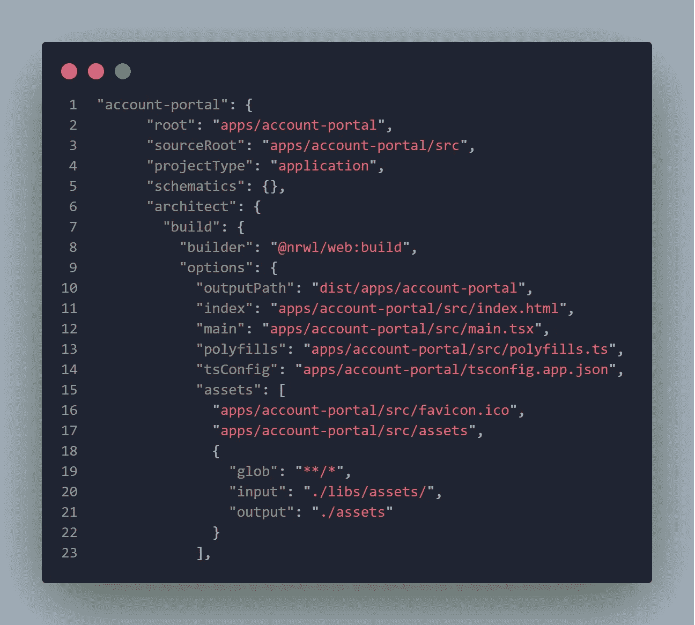
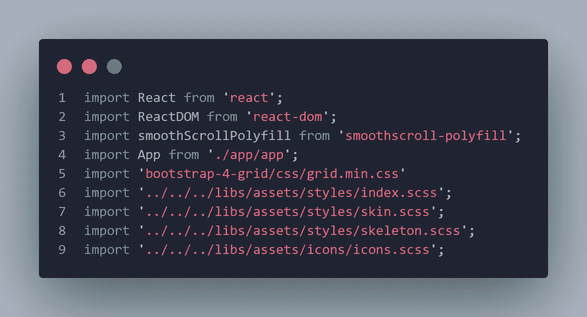
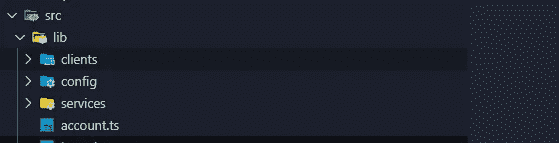
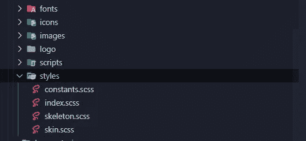

# 在您的项目中创建一致的组件

> 原文：<https://javascript.plainenglish.io/one-ui-components-for-all-your-projects-785697e73a8d?source=collection_archive---------8----------------------->


经过多年的开发，高级前端开发人员将开始考虑的挑战之一是**如何为所有前端项目找到一个 UI 库**。困难的总是配置方面。【https://nx.dev/】感谢社区和[T5](https://nx.dev/)**项目；现在更加简单明了**。我将回顾实现这一点的老方法，以及我们如何利用 NX 工具做同样的事情。然后，我将讨论前端项目工作区中的一些重要注意事项，这是我在生活经历中学到的。

# Angular 中的共享 UI 组件库

学习如何在 Angular 中创建库的最简单方法是从下一个链接查看他们网站上的指南:

 [## 有角的

### Angular 是一个构建移动和桌面 web 应用程序的平台。加入数百万开发者的社区…

angular.io](https://angular.io/guide/creating-libraries) 

文档将带您了解生成和配置库的细节，但是所有的魔力都来自下一个命令:

```
ng generate library <my-lib>
```

实际上，该命令将在**下创建一个子目录。/projects** 并在该目录中创建您的库。之后，您将拥有一个名为 **public_api.ts** 的文件，您将需要在其中导出您想要在其他项目中使用的所有组件。在其他项目中使用您的库就像从库名中导入组件一样简单，而不用担心链接到那个库，**因为前面的命令会自动将库添加到 angular.json 文件**中，这将使它可以从根项目中仅使用库名来访问，比如:

```
import { YourComponent } from ‘library-name’;
```

如果您想将组件发布到 npm 包并通过安装直接使用库，只需调用库项目上的下一个命令:

```
npm publish
```

请记住，您需要在 packages.json 中指定您的包版本、名称和细节，此外，还需要添加一个关于如何使用您的组件的可选的 **readme.md** 。

# 使用 NX 在 Angular 中共享 UI 组件库

使用 NX 创建共享库和以前不使用 NX 一样简单，只需运行下一个命令:

```
ng g @nrwl/angular:lib <my-lib>
```

创建的 **index.ts** 文件将是导出公共组件的地方，要添加组件，您可以使用下一个命令:

```
ng g component <component name>  — project=<project name>  — export
```

NX 框架中的好东西是依赖图，通过运行:

```
npm run dep-graph
```

因此它将向您显示项目和库之间的依赖关系。

在 NX 中，只需要直接将库导入到想要使用它的项目中就足够了，因为正如我在上一段中讨论的那样，它已经在 **angular.json** 文件中定义了。

```
import { Component } from ‘@workspace_name/library_project_name’;
```

# React 中的共享 UI 组件库

通常，在 React 中创建共享库的最佳方式是使用下一个链接中的“create-react-library”包:

[](https://www.npmjs.com/package/create-react-library) [## 创建-反应-库

### 使用 Rollup 和 create-react-app 创建可重用的现代 React 库的 CLI。易于使用的 CLI 处理所有现代…

www.npmjs.com](https://www.npmjs.com/package/create-react-library) 

它将使用汇总来构建库，然后您需要通过下面的命令导入该库:

```
npm link (At the directory of the library)npm link library-name (At the directory of your project)
```

因此，在这种情况下，您将在项目和库之间创建一个本地链接，这样做的好处是，每当您使用下一个命令对代码进行更改时，您都可以自动构建库:

```
rollup — watch
```

因此，库中的任何更改都会使您的项目重新构建并接受新的更改。

你也可以将这个库发布到一些像 npm 这样的仓库中，然后直接安装到你的项目中，就像我之前提到的那样。

# 使用 NX 在 React 中共享 UI 组件库

您可以使用下一个命令为 React so easy 创建一个共享库:

```
ng g @nrwl/react:lib <my-lib>
```

这也将导致生成一个带有库名的文件，该文件将导出该库中的公共组件。

NX 还支持在该库中生成组件的命令:

```
ng g @nrwl/react:component <component name> — project=<project name> 
```

在 NX 中，只需要直接将库导入到想要使用它的项目中就足够了，因为它已经在 angular.json 文件中定义了。

```
import { Component } from ‘@workspace_name/library_project_name’;
```

# 前端项目工作区中的重要说明

1.始终只创建一个库项目来存储静态文件(字体-图标-图像-脚本-样式),因此在这种情况下，您将有一个统一的地方来管理项目资源，并且您将在所有 FE 项目中保持一致性，特别是在样式方面，在 NX 中，我通过创建一个空的库项目并将所有这些文件放在那里，并且在 assets 部分中的每个项目的 angular.json 文件中，您应该指向该项目，如下所示:



在代码内部，我直接从它们的路径导入样式，如下所示:



2.如果您可以在一个单独的库项目中定义对后端 API 的所有调用，那就更好了，这样您就可以在处理前端项目的后端时保持一致性，并且在后端修改的情况下，您可以只更新一个地方。在 NX 中，我将 Apollo 客户端用于 REST 端点或 GraphQL 端点，项目的库结构如下:



在客户端内部，我定义了 Apollo 客户端，在 config 内部，我添加了路径等全局配置，在服务内部，我添加了跨项目的公共服务，在 **account.ts** 内部，例如，我添加了 GraphQL 查询和变异。我为每个业务逻辑创建了 I 文件。

3.始终将所有通用组件放在一个单独的库项目中

4.最好是分离全局样式，并使用 CSS 或 SCSS 在资源项目中定义它们，以及特定于组件的样式，并在组件文件中定义它们，我使用@emotion library 来实现这一点。下一个链接很好地概述了在前端项目中实现样式的最可能的方法:

[https://www.sitepoint.com/react-components-styling-options/](https://www.sitepoint.com/react-components-styling-options/)

@emotion 不在那个链接中考虑，但我更喜欢它主要用于组件样式。我更喜欢用以下结构来组织全球资源:



在 **constants.scss** 中，我定义了调色板、字体大小和其他类型的品牌常量。在 **skeleton.scss** 文件中，我定义了 HTML 元素的结构，比如边距、宽度、高度等等。在 **skin.scss** 文件中，我定义了所有与皮肤风格相关的东西，比如颜色、字体、边框、背景等等。在 **index.scss** 中，我通常将主文档元素的样式和任何覆盖放在其他库中，如 bootstrap。

我希望这些笔记能帮助你以一种更干净、更有条理的方式启动你的下一个项目。