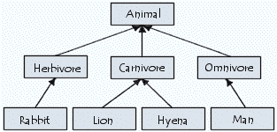
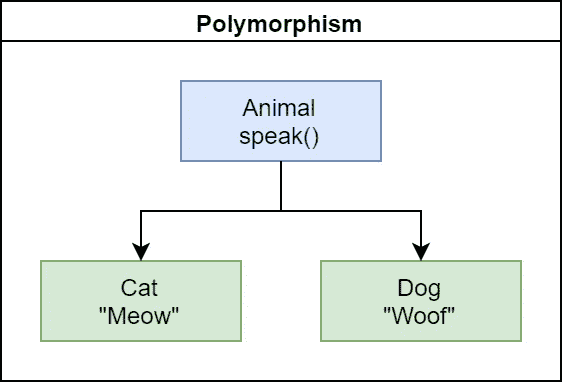
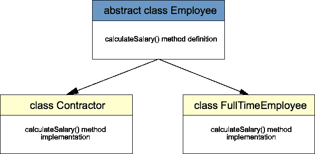
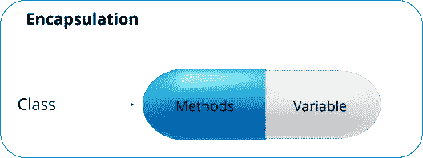

# 自信面对面试的 OOP 概念

> 原文：<https://javascript.plainenglish.io/oop-concepts-for-interviews-f1f0136a7d4?source=collection_archive---------0----------------------->

Photo by [wu yi](https://unsplash.com/@takeshi2?utm_source=unsplash&utm_medium=referral&utm_content=creditCopyText) on [Unsplash](https://unsplash.com/s/photos/object-oriented?utm_source=unsplash&utm_medium=referral&utm_content=creditCopyText)

# 介绍

这个世界完全是一团乱麻，有许多问题需要解决。当引入基于 IT 的解决方案来解决这些问题时，它变得越来越复杂。如果我们可以在程序中模拟真实世界的场景，那么解决这个问题就很容易了。为了将现实世界建模成程序，引入了面向对象编程(OOP)的概念。

> OOP 的概念实际上是为了将现实世界建模成一个程序，并将问题的复杂性降低到一个水平，在这个水平上，一切都被视为一个对象。

除了类和对象，OOP 的 4 个主要概念是

## 继承、多态、抽象、封装

# 1.遗产

如果一个子类可以继承一个父类的属性和方法，这就是所谓的继承。它代表了一种关系。

> ***例如:*** *“男人”和“女人”这两个阶级继承了“人类”这个阶级的特征和行为。也就是说，男人是人，女人也是人。*

ref: [https://ccm.net/contents/422-oop-inheritance](https://ccm.net/contents/422-oop-inheritance)

# 2.多态性

以不同的方式实现相同的方法被称为多态性。

多态性可以在运行时和编译时以两种不同的方式实现，即方法重写和方法重载。

> ***Ex:*** *如果人类类有一个名为 speak()的方法，但是女人和男人说话的方式是完全不同的。因此，我们需要在这两个子类中覆盖 speak()方法，并根据性别给它们单独的实现。这也称为运行时多态性，通过在子类中覆盖超类的方法来实现。*
> 
> ***例如:*** *让我们来看一个简单的计算器应用程序，我们最多可以将两到四个数字相加。然后，我们在同一个类中包含了几个方法，命名为* ***add(int a，int b)，add(int a，int b，int c)，add(int a，int b，int c，int d)。这被称为方法重载，在编译时被检查。***

ref:: [https://www.brightdevelopers.com/object-oriented-programming-inheritance-polymorphism/](https://www.brightdevelopers.com/object-oriented-programming-inheritance-polymorphism/)

# 3.抽象

抽象只是隐藏方法的实现，只显示方法的功能。我们也可以定义需要包含和排除的方法。

抽象可以通过接口和抽象类来实现。默认情况下，接口中声明的所有方法都是抽象的，而抽象和非抽象方法都可以在抽象类中声明。

抽象类和接口都不能被实例化。但是，一个类可以实现许多接口，而一个抽象类可以被一个类扩展。

> ***ex:*** *人类有嘴巴。嘴是一个抽象概念。眼睛是一个抽象概念。皮肤是一种抽象。这是因为，我们不知道上述部分的实际实现，神经元如何工作，信号如何在神经中传递等等。*
> 
> ***例如:*** *在计算机中，有两种不同的界面供管理员和访客使用。这也是通过抽象来实现的。*

ref: [https://javatutorial.net/java-abstraction-example](https://javatutorial.net/java-abstraction-example)

# 4.包装

将数据绑定到一个单元中称为封装。

属性和方法被绑定到一个类中。类是一种封装。几个类一起创建包。包是一种封装。

通过封装，我们可以控制对胶囊内数据的访问。大多数情况下，访问修饰符用于此目的。

> 一个人是一个单独的封装。所有的男人和女人都属于人类。人类是一种封装。

ref: [https://www.edureka.co/blog/object-oriented-programming/](https://www.edureka.co/blog/object-oriented-programming/)

# **一个示例场景**

1.  三鱼一石的鱼缸。

这里，我们可以先把物体识别为一个鱼缸、一条鱼、水和一块石头。我们应该有命名为鱼，水，岩石，鱼缸的类。鱼缸类应该包括一个保存水对象的变量，另一个保存岩石对象的变量，和一个保存鱼对象的鱼数组。如果有小鱼的话。应该有一个类 BabyFish，它应该扩展 Fish 类。鱼的鳃表现出抽象性，因为我们不知道鳃的内部活动。FishTank 是一个封装了所有其他对象的单元。尽管鱼会游泳，但它们的游泳方式却各不相同，这也是多态现象。

Photo by [Sarah Brown](https://unsplash.com/@sweetpagesco?utm_source=unsplash&utm_medium=referral&utm_content=creditCopyText) on [Unsplash](https://unsplash.com/s/photos/fish-tank?utm_source=unsplash&utm_medium=referral&utm_content=creditCopyText)

# 结论

正如我们所讨论的，有四个主要的面向对象编程概念。所有这些都用于将真实世界的场景建模到程序中，通过它我们可以以较低的复杂度单独处理每个对象。

在面试中，当你被要求解释 OOP 概念时，不要列出来。一次说一个，然后解释它的意思。不要止步于此。要有创造性，举一个真实世界的例子来说明这个概念，然后解释如何用你知道的语言来实现它。