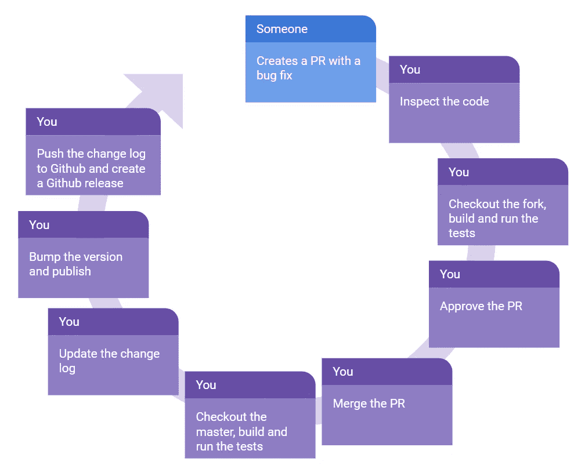

# 开源系列:自动化

> 原文：<https://javascript.plainenglish.io/open-source-series-automation-fe826e365b54?source=collection_archive---------7----------------------->

如何通过什么都不做来做更多事情

在我的 [*个人博客*](https://www.justjeb.com/blog) *上可以免费获得这篇文章和其他文章。请务必注册以获得最新最棒的！*

大家好，欢迎来到我的系列文章的最新部分！在前一章中，我们讨论了管理贡献(即问题和 PRs)。今天我们将谈论自动化——可能是 OSS 项目管理最重要的方面之一。对于那些没有读过我的系列文章的人，或者想知道我计划增加哪些内容的人，下面是我一直在做的工作的概述:

# 目录

*   [简介](https://medium.com/@justjeb/owning-an-open-source-part-1-b63abc60236)
*   [开始一个项目](https://medium.com/@justjeb/owning-an-open-source-project-part-2-2b55810aeb8)
*   [文档](https://medium.com/@justjeb/open-source-series-documentation-96ed1420ce81)
*   [宣传](https://medium.com/@justjeb/open-source-series-publicity-8b3be7d65c17)
*   [问题和 PRs](https://medium.com/@justjeb/open-source-series-issues-and-prs-8cb1de880fd4)
*   **自动化**
*   [版本管理](https://justjeb.medium.com/open-source-series-version-management-dc91424aa63d)

# 为什么要自动化

如果说我在拥有开源系统的这些年里学到了什么的话，那就是你必须自己做的例行工作越少，你就有越多的时间从事实际工作(比如修复 bug 和开发新功能)。因此，我尽我所能寻求自动化。

以下是我希望我们如何实现这一目标；让我们首先检查两种工作流程，(非自动化和全自动化)，看看你有多少时间实际上被投入到日常任务中。然后，我们将探讨如何改进工作流程，以便有更多的时间来修复 bug。

## 最坏的情况—没有自动化

如您所见，在没有自动化的情况下，所有的工作都由您来做。仅仅是修复一个 bug 就要做很多工作，除此之外，这也是每次有一个 bug 修复或者一个新特性的时候*你*不得不*做的工作！现在让我们看看另一种情况。*

## 最好的情况—一切都是自动化的

在这种情况下，您只需要做您必须做的事情——检查代码并(有时)批准拉取请求。其他一切都是自动完成的。
科幻小说？不，这叫**持续集成**和**持续部署**。我们不会深入到构建脚本和特定于系统的配置的细节中，相反，我们将回顾使其工作所需的工具，并且我将让您自己决定细节。

## 持续集成

> 持续集成(CI)是将来自多个参与者的代码变更自动集成到一个软件项目中的实践。CI 过程由自动工具组成，这些工具在集成之前断言新代码的正确性。

一个非常基本的 CI 运行将包括**构建**和**单元测试**，然而它并不局限于这两个。它还可能包括各种静态代码分析工具、linters 等。这是你定义标准的地方。

## 端到端测试

虽然构建和单元测试为您提供了代码更改的快速反馈，但花费的时间相对较短，如果出现问题，很快就会失败；端到端(E2E)测试在竞争情报中有着特殊的地位。E2E 测试不仅应该涵盖代码的正确性，还应该涵盖您的部署流程、包完整性等等。当我偶然发布了一个不包含任何代码的包的新版本时，我自己也意识到了这一点。构建已经通过，单元测试和 E2E 测试都是绿色的(那些是通过链接测试项目的构建输出目录安装的)。哪里失败了？在包装阶段。这里有一个要点:E2E 测试应该像真实用户一样测试你的包。

为了实现这一点，我建议如下:

1.  在 CI 运行期间，启动一个本地包注册表。每种语言/生态系统都有一些选项，例如对于 Java 或 Scala 项目，你有 [Nexus Repository](https://blog.sonatype.com/using-nexus-3-as-your-repository-part-1-maven-artifacts) ，对于 JavaScript 有 [Verdaccio](https://github.com/verdaccio/verdaccio) (我在 [@angular-builders](https://github.com/just-jeb/angular-builders) 中使用了它)
2.  有一个单独的项目使用您的包(这可以驻留在同一个 repo 中)。这个项目中的测试应该测试您的包的功能。
3.  将此项目配置为使用本地包注册表。
4.  在构建您的包之后，将其发布到本地包注册中心(在您的 CI 系统中启动)。
5.  将最新版本的包(您刚刚发布的)安装到您的测试项目中。
6.  进行测试。

它不仅会测试您的包的完整性和可靠性，还会在持续部署时为您节省一些工作。

## 竞争情报系统

有很多 CI 系统都有开源项目的免费计划，其中有 [Travis CI](https://travis-ci.com/) 、 [CircleCI](https://circleci.com/) 、 [AppVeyor](https://www.appveyor.com/) 、 [Github Actions](https://github.com/features/actions) 等等。它们都是一样的，基本上是一样的，它们将你的代码签出到虚拟机，运行你定义的脚本(通常运行构建和测试)，然后向 Github 报告成功或失败。

所有这些系统都有一个用于与 Github 集成的[应用](https://github.com/marketplace?category=continuous-integration&type=apps),所有这些系统的集成流程都非常相似:

1.  在平台上注册。
2.  在你的 Github 账号里安装相应的 app。
3.  [配置对所选存储库的访问权限](https://github.com/settings/installations)。
4.  创建一个配置文件(如`travis.yaml`)来定义构建矩阵、所需的构建链和 CI 脚本。
5.  把它推给主人

这将使您的 CI 在每个 PR 上运行，并向 Github 报告状态，但是，这还不够。您真正想要的是阻止合并到主分支，直到 PR 通过所有检查。

这是通过定义分支保护规则来实现的。为了定义这些规则，您应该转到存储库"**设置"**中的"**分支"**部分，然后点击"**添加规则"**按钮:

然后选中“**合并前需要通过状态检查”**复选框:

如你所见，相应的 Github Apps 复选框已经出现在这里，所以剩下的唯一事情就是启用它们。确切的构建脚本实际上取决于您的生态系统、编写项目的语言、您使用的框架等等。因此，我们不会在这里讨论它——您必须自己查阅 CI 系统的文档来了解细节。但是，您现在已经对 CI 是什么以及它如何自动化您的 PRs 有了相当好的了解，所以让我们继续。

## 持续部署(CD)

> 连续部署(CD)是一个软件发布过程，它使用自动化测试来验证对代码库的更改是否正确和稳定，以便立即自主部署到生产环境中。

在我们的例子中，生产环境是当一个包在包注册中心公开时。这是一个不可逆转的阶段，因为一旦您发布了它，您就不能取消发布，因为它是公开可用的(因此可能会被使用)。

持续部署有多种策略，这实际上取决于项目及其复杂性，但在我看来，发布应该只从主分支进行，因为这使得工作流非常容易。方法如下:

1.  每个 PR 代表一个 bug 修复或者一个新特性。
2.  代码在到达主程序之前就已经被测试过了(包括 E2E)。
3.  主服务器是受保护的分支，因此只要您不合并失败的 PRs，主服务器就保持稳定。
4.  每次 PR 合并到主配置项都会触发主配置项运行，最终发布新版本。

这将确保所有的发布都是连续的，并且将使特定的 PR 与特定的版本联系起来变得非常容易。

为了自动化软件包发布，我们需要一些东西:

1.  基于提交消息的自动版本升级。
2.  基于提交消息的自动变更日志更新。
3.  自动将包发布到公共包存储库中。
4.  Github 上的自动发布。

好消息:所有这些都已经得到了语义发布的支持。坏消息:你将不得不投入一些时间来让它工作(但最终它会有回报)。

## 语义释放

> semantic-release 自动化了整个包发布工作流，包括:确定下一个版本号、生成发布说明和发布包。
> 
> 这消除了人类情感和版本号之间的直接联系，严格遵循了[语义版本化](http://semver.org/)规范。

我们不会在这里涵盖整个集成过程，因为他们有非常好的文档，没有理由在这里复述。不过，我要提几点:

*   在开始语义发布之前，确保你理解了[语义版本规范](https://semver.org/)和[常规提交](https://www.conventionalcommits.org/en/v1.0.0/)格式。
*   为了让语义发布工作得更好，您应该强制执行某些提交消息格式。为此，您可以将[commit list](https://github.com/conventional-changelog/commitlint)作为 [husky](https://github.com/typicode/husky) 预提交钩子来运行。当有人创建本地提交时，它将强制执行常规提交，但它不能对直接从 Github web UI 执行的提交做任何事情(当有人想要快速修复他们的 PR 时，经常会发生这种情况)。因此我建议你通过 [commitlint Github Action](https://github.com/marketplace/actions/commit-linter) 来备份。

在您将语义发布设置为工作流的一部分之后，您就差不多完成了，并且您不再需要将您的时间花费在这些常规流程上。虽然还有一个优化你可以做。

## 使项目保持最新

如果您的项目没有外部依赖关系，请跳过这一部分。然而，大多数项目依赖于其他包，而其他包往往会发生变化。保持你的项目和它的依赖项保持同步是很重要的，但是*这很耗时*。幸运的是，我们有一个解决方案。其实有[绿人](https://greenkeeper.io/)、[翻新](https://renovate.whitesourcesoftware.com/)、[依赖机器人](https://dependabot.com/)这几个。所有这些产品的想法都差不多，所以我只引用 Dependabot 的“它是如何工作的”一节:

> **1。dependent bot 检查更新** dependent bot 下载你的依赖文件，寻找任何过时或不安全的需求。
> 
> *2。****dependent bot 打开拉取请求*** 如果您的任何依赖项过期，dependent bot 会打开单独的拉取请求来更新每个请求。
> 
> *3。* ***您检查并合并*** 您检查您的测试是否通过，扫描包含的变更日志和发布说明，然后满怀信心地点击合并。

您可能已经注意到，只有当您有一个工作配置项时，这才有意义。

# 结论

如果你有一个完全自动化的 CI/CD 周期，并且在你的 OSS 库中有一个新的问题，你可以在几分钟内提供一个错误修复。事实上，您可以从手机进入移动 Github 版本，修复一两行 bug，并提交代码。剩下的是自动完成的，您的客户会马上得到一个新版本。我自己能够多次快速、轻松地为我的客户获得一个固定版本。

> 拥有强大的自动化并不意味着腾出一些时间来休闲，而是将你的时间投入到真正重要的事情上，并提高你的响应能力。

在本系列的下一篇文章中，我们将讨论**版本管理**，它总是与每个拥有大量用户的 OSS 项目相关。如果你喜欢我的写作，学到了一些新的或有见地的东西，或者如果你不想错过下一部分，请确保你在 [Twitter](https://twitter.com/_Just_JeB_) 或 Medium 上关注我。干杯！