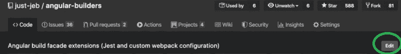
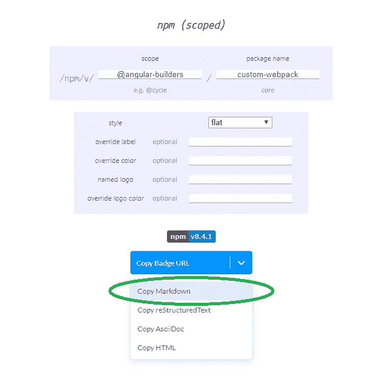
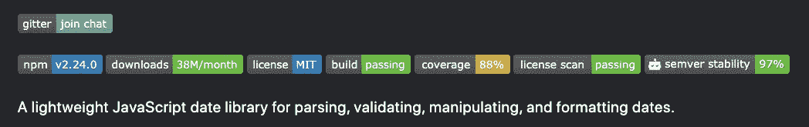

# 开源系列:文档

> 原文：<https://javascript.plainenglish.io/open-source-series-documentation-96ed1420ce81?source=collection_archive---------7----------------------->

## 或者回答“什么”和“如何”的问题

在我的 [*个人博客*](https://www.justjeb.com/blog) *上可以免费获得这篇文章和其他文章。请务必注册以获得最新最棒的！*

大家好，欢迎来到“开源”之旅的第三部分。
对于那些尚未阅读前几部分或想知道下几部分计划内容的人:

# 目录

*   [简介](https://medium.com/@justjeb/owning-an-open-source-part-1-b63abc60236)
*   [开始一个项目](https://medium.com/@justjeb/owning-an-open-source-project-part-2-2b55810aeb8)
*   **文档**
*   [宣传](https://medium.com/@justjeb/open-source-series-publicity-8b3be7d65c17)
*   [问题和 PRs](https://medium.com/@justjeb/open-source-series-issues-and-prs-8cb1de880fd4)
*   [自动化](https://medium.com/@justjeb/open-source-series-automation-fe826e365b54)
*   [版本管理](https://justjeb.medium.com/open-source-series-version-management-dc91424aa63d)

# 概述

在前面的部分中，我们已经讨论了什么是开源以及如何开始一个新的开源项目。前两部分是针对那些考虑创建一个开源项目的人，让他们知道会发生什么，并给他们一些在开源世界的开端。

这一部分，以及接下来的部分，也将与已经维护一个开源项目的人相关，并帮助他们改进他们所做的事情。

## 这部分的基线:

> 您已经有了一个开源项目，它可以在 Github 上获得，并且可以通过一个包注册表轻松使用。

***如果你不知道我在说什么，我建议你阅读前两部分。

# 所以我们开始吧

> 一个没有文档的开源项目是一个死项目

它已经死了，因为没有人会深入你的代码，找出应该如何使用它。甚至在*如何*、*、*之前，甚至没有人知道*你的代码应该做什么。*

因此，这些基本上是您的文档应该包含的两件事情— *什么*和*如何*。这些是基石，文件的必备之物。

# 描述

描述是每个人在进入 Github 库时看到的第一件事。因此，一个好的描述应该以简短和信息丰富的方式回答*什么*问题。例如:

[反应过来](https://github.com/facebook/react):

> 一个用于构建用户界面的声明式、高效且灵活的 JavaScript 库。[https://reactjs.org](https://reactjs.org/)

[Moment.js:](https://github.com/moment/moment)

> 用 javascript 解析、验证、操作和显示日期。[http://momentjs.com](http://momentjs.com/)

[棱角分明的建设者](https://github.com/just-jeb/angular-builders)(这个是我的):

> 角度构建外观扩展(Jest 和自定义 webpack 配置)

点击存储库右上角的`Edit`按钮可以编辑描述:

## 自述文件。医学博士

自述文件。MD 是你的项目根目录中的一个文件，用 [Markdown 语法](https://help.github.com/en/github/writing-on-github/basic-writing-and-formatting-syntax)编写，它包含了你需要知道的关于你的项目的所有信息。

自述文件应该包含一个详细的描述(详述了*什么*问题)和关于*如何*使用你的项目的非常详细的说明。
说明应该涵盖*公共 API* 的每一个部分，最好有使用示例。

编写好的 API 文档的几个要点:

*   保持简单
    *API 和例子越简单——用户就越容易理解它做了什么以及如何使用它*
*   保持结构化
    *对每个 API 方法使用相同的模板和可视化结构，这样你就可以定义自己的语言来与用户交流 API*。
*   永远从用户的角度来写 API 描述。假设您对内部情况一无所知，并且只有这份文档。
*   随着项目的发展，API 可能会发生变化。确保你的自述文件总是包含最实际的 API 和例子

自述文件可以(但不是必须)包含以下内容:

*   链接到投稿指南
*   贡献者列表
*   链接到更改日志
*   最新版本
*   许可证
*   构建状态
*   下载计数器
*   链接到聊天以获得快速反馈

# 徽章

徽章是一种很好的方式来直观地展示你的项目的基本信息，比如:构建状态、版本、许可和你的项目使用的各种工具。有很多选择，但我建议你使用[盾形徽章。他们几乎什么都有徽章。](https://shields.io/)

将徽章添加到您的自述文件非常简单:

1.  转到 [shields.io](https://shields.io/)
2.  选择适当的类别
3.  单击您想要添加到自述文件中的徽章
4.  填写所需信息(如果有)
5.  从下拉菜单中选择复制降价
6.  将降价信息粘贴到您的自述文件中

徽章通常放在自述文件的顶部，详细描述之前。看起来是这样的:

# 试验

API 参考很棒，但是没有什么比得上使用公共 API 的真实代码。补充你的文档的最好方法之一是用描述性测试覆盖好代码。有时测试比任何文档更能解释代码。

# 包装它

在这一部分中，我们只讨论了文档的基础知识。它不仅仅是一个自述或描述，例如，随着项目的发展和问题的出现，它们成为文档不可或缺的一部分。

> 然而，对于任何像样的开源项目来说，拥有一个包含公共 API 的自述文件是最起码的要求

感谢您的阅读，如果您不想错过我们将要谈论的 [**宣传**](https://medium.com/@justjeb/open-source-series-publicity-8b3be7d65c17) 的下一部分，请确保您在这里或在 [Twitter](https://twitter.com/_Just_JeB_) 上关注我。