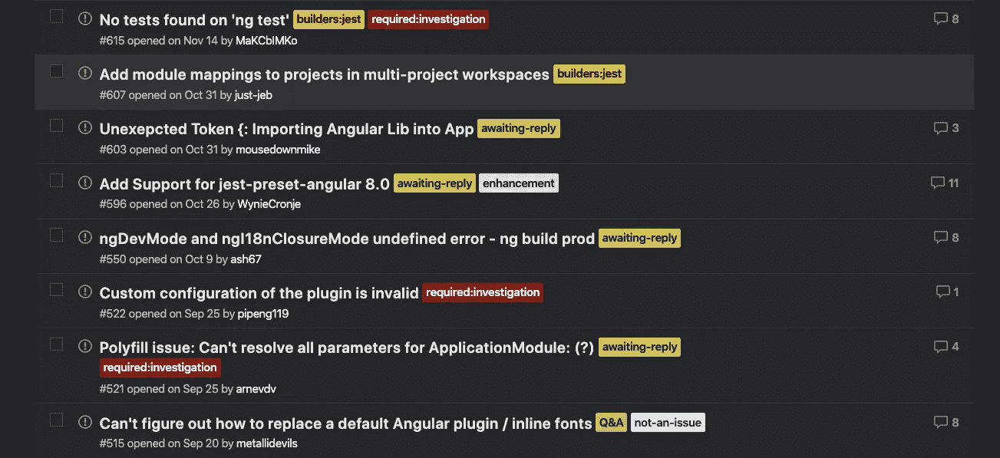
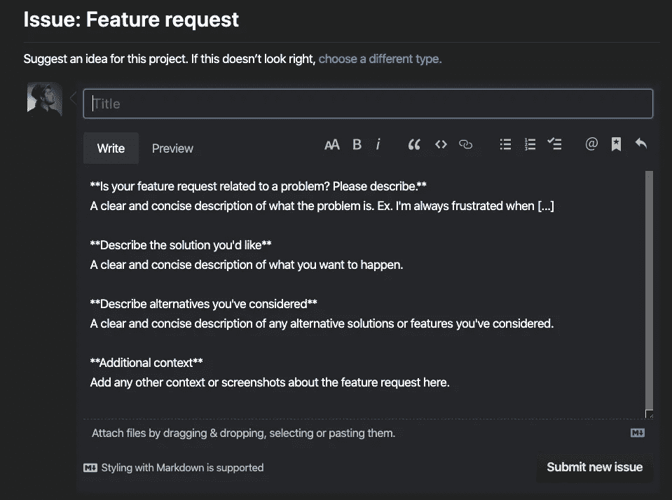
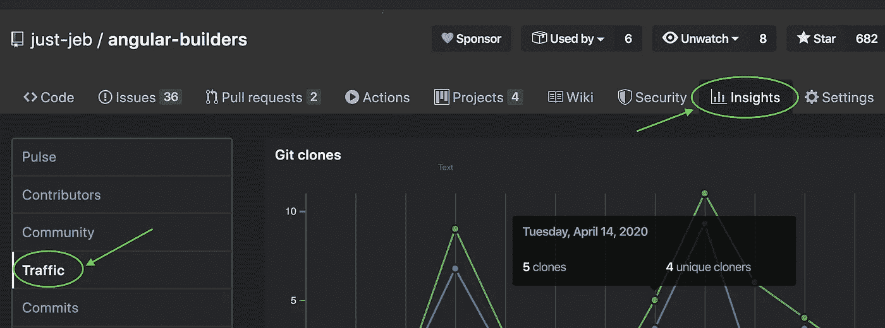
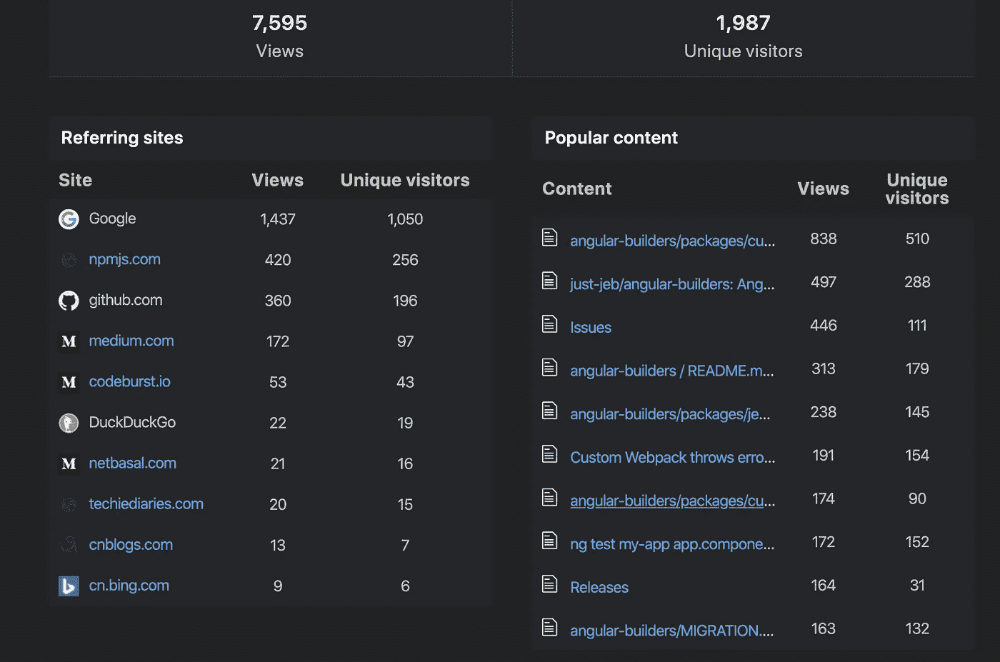
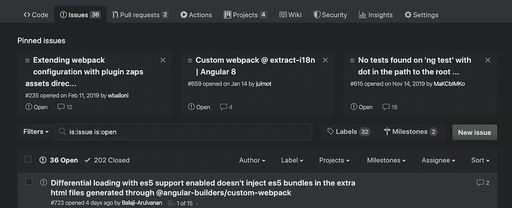

# 开放源码系列:问题和 PRs

> 原文：<https://javascript.plainenglish.io/open-source-series-issues-and-prs-8cb1de880fd4?source=collection_archive---------6----------------------->

## 如何有效地管理你的项目

在我的 [*个人博客*](https://www.justjeb.com/blog) *上可以免费获得这篇文章和其他文章。请务必注册以获得最新最棒的！*

大家好！距离我的上一篇系列文章已经有一段时间了，但是我们成功了！在前一章中，我们探讨了共享信息，使您的开源项目更有吸引力，以及我建议您在继续阅读之前查看的其他几个主题。今天我们将讨论*贡献，*每个开源项目的圣杯。我们将探讨管理和组织贡献的最佳方式，以及如何对待它们等等。对于那些没有读过我以前的文章，或者想知道我计划发布什么的人，这里有一个概述:

# 目录:

*   [简介](https://medium.com/@justjeb/owning-an-open-source-part-1-b63abc60236)
*   [开始一个项目](https://medium.com/@justjeb/owning-an-open-source-project-part-2-2b55810aeb8)
*   [文档](https://medium.com/@justjeb/open-source-series-documentation-96ed1420ce81)
*   [宣传](https://medium.com/@justjeb/open-source-series-publicity-8b3be7d65c17)
*   **问题和 PRs**
*   [自动化](https://medium.com/@justjeb/open-source-series-automation-fe826e365b54)
*   [版本管理](https://justjeb.medium.com/open-source-series-version-management-dc91424aa63d)

# 今天的基线是:

您已经有了一个开源项目，它可以在 GitHub 上获得，有很好的文档记录，并且可以通过一个包注册中心轻松使用。

# 什么是贡献

对开源项目的贡献是除所有者之外的人所做的任何改变。实际上，它有两种形式:

## 问题

以下是 Github [对](https://help.github.com/en/github/managing-your-work-on-github/about-issues)关于问题的说法:

> 您可以收集用户反馈，报告软件错误，并组织您希望通过存储库中的问题来完成的任务。问题不仅仅是报告软件错误的地方。

简而言之，问题是任何需要采取某种行动的信息。

## 拉请求(PRs)

下面是 Github [对](https://help.github.com/en/github/collaborating-with-issues-and-pull-requests/about-pull-requests)关于拉请求的描述:

> Pull 请求允许你告诉其他人你已经推送到 GitHub 上的一个存储库中的一个分支的变更。一旦打开了一个拉请求，您就可以与协作者讨论和评审潜在的变更，并在您的变更被合并到基础分支之前添加后续提交。

简而言之，拉请求是对项目的实际变更。

# 处理问题和 PRs

那么，如何实际处理问题和减贫战略，以及如何处理贡献者提出的问题和减贫战略？

# 个人例子

我能给你最好的建议就是*用一个个人的例子*来融入某种工作方法。这意味着当你在开发一个新的特性时，你应该为此创建一个 PR，一旦它符合你的所有标准，就合并它。
当你发现一个 bug 或者想到一些缺失的功能时，你应该制造一个问题。这种方法不仅可以组织你的工作，使你的项目有条不紊，还可以为贡献者提供一个参考，他们可以从中学习和适应他们的问题和相应的 PRs。

此外，如果你有很高的标准(意味着你相信每一个 PR 都应该有适当的文档，测试覆盖率等等)。)那么你应该像对待其他贡献者一样对待自己。你不能要求别人做你自己没有做的事情。此外，有时你应该对贡献者比对自己更宽容。尤其是如果你的项目处于早期阶段，并且没有很多贡献者。这就引出了下面这一点。

# 所有的工作都受到赞赏

与他人合作就是相互尊重。你应该尊重你的贡献者。回答他们的问题(即使是最愚蠢的问题)时要有耐心，提出建设性的批评时要有礼貌*。记住:欣赏你的贡献者的工作是至关重要的。如果有人只是制造了一个问题(即使没有彻底的研究，甚至没有复制)——感谢他们。他们不厌其烦地把椅子移近桌子，坐直身体，打一些他们认为可能对你有益的东西，向他们表示感谢，如果需要，以礼貌和尊重的方式询问更多细节。*

*如果有人创造了一个不符合你高标准的公关——感谢他们。感谢他们，礼貌地要求他们修改代码/编写测试/添加文档等等。给他们一个你的 PRs 的链接作为参考，或者给他们一个投稿指南的链接。建设性和积极的对话会给那些贡献者更多的动力来继续他们的工作。否则就不会…*

# *质量与数量*

*最终，几乎总会有一个折衷(除非你拥有一个巨大的开源项目，比如 Angular 或 React)。你可以决定不放松你的标准，甚至一点也不放松，最有可能的是，你将自己完成所有的工作，或者——你可以决定降低贡献者的标准(但是这将使你的标准无效，因为它们没有被应用)。*

*我了解到每个贡献者都需要不同的方法。这真的取决于个人和他们对自己贡献的个人兴趣。你应该考虑诸如问题的紧迫性、贡献者的经验、代码的复杂性、所需修复或特性的复杂性、贡献者的动机等等因素。通常，我会礼貌地要求改变，等上几天，如果什么都没发生，我会自己去改变，当然，前提是这个问题相当重要。至于不太重要的(最好有)补丁或特性——我通常把它们完全留给社区。*

*随着时间的推移，随着问题和 PRs 数量的增加，对它们进行跟踪、优先排序和分类成为一项艰巨的任务，因此标签变得极其重要。*

# *标签*

*[Github labels](https://help.github.com/en/github/managing-your-work-on-github/about-labels) 是一个很棒的工具，可以让您的问题和 PRs 保持优先和有序。虽然这允许您通过标签进行搜索和过滤，但我发现这里最有帮助的是它能够帮助您可视化项目的整体状态。因此，您可以进入“问题”页面，并看到您的大多数问题都被标记为`bug`(这意味着您应该停止向前推进，而是专注于解决它们。)或者，您可以看到大多数问题都被标记为`enhancement`或必需的`features`。`priority`是另一个有用的标签，可以帮助你首先关注重要的事情。*

*此外，您的贡献者可以(也将会)从您使用标签中受益。例如，回到**获取合作者**，用户可以进入“问题”页面，直观地识别需要社区帮助的问题(`help-wanted`、`pr-welcome`等)。)除了具有单一责任的标签(如`bug`或`enhancement`)，我建议您使用标签来界定问题/PR 的范围或将其放在一定的范围内。例如:*

*   *`priority:low`，`priority:high`*
*   *`required:investigation`、`required:tests`、`required:docs`*
*   *或者在单一回购的情况下:`packages:package1`、`packages:package2`等。*

*以下是我的项目中带有标签的问题页面的示例:*

**

*标签可以很容易地辨别出哪些问题需要您(或您的贡献者)的关注，这些问题与哪个组件相关，以及需要什么才能继续。*

# *PR 和问题模板*

*我强烈建议您花几分钟时间为[问题](https://help.github.com/en/github/building-a-strong-community/configuring-issue-templates-for-your-repository)和 [PRs](https://help.github.com/en/github/building-a-strong-community/creating-a-pull-request-template-for-your-repository) 定义模板。*

> *使用问题和拉取请求模板，您可以自定义和标准化您希望参与者在存储库中打开问题和拉取请求时包含的信息。*

*这将为你节省大量时间，因为你不必对每一个问题或公共关系做出回应，要求提供额外的信息或变化。您仍然必须这样做(因为有些贡献者根本不关注模板)，但是这种情况会比您不创建模板时少得多。*

*下面是一个默认问题的示例，当在存储库中定义相应的模板时，您会看到该问题:*

**

# *Github 应用和操作*

*有相当多的 [Github 应用和动作](https://help.github.com/en/actions/automating-your-workflow-with-github-actions/about-actions#comparing-github-actions-to-github-apps)可以帮助你管理 PRs 和问题。这个列表会不断增加，但我个人认为这些是最有用的:*

*   *[陈旧的机器人](https://github.com/marketplace/stale)*
*   *[在制品](https://github.com/marketplace/wip)*
*   *[自动批准](https://github.com/dkhmelenko/autoapproval)*
*   *[PR 贴标机](https://github.com/actions/labeler)*

# *响应性*

*如果我给另一个开源项目开了一个问题或一个 PR，并且要花很长时间才能得到回复，那么我就换了。[这里的](https://github.com/greenkeeperio/monorepo-definitions/pull/24)就是一个例子:*

*   *最初的反应相当迅速，仅用了两天时间*
*   *讨论颇有成果*
*   *公关仍然是开放的，没有更新到底是什么丢失/错误*

*结果换了另一个套餐。*

*如果你不响应，你的项目也是如此:如果你花了两个星期来响应等待你的 PRs，而不是等待贡献者对你要求的更改，那么你将失去用户(即潜在贡献者)。所以，帮你自己一个忙——积极回应。它不一定是对某人问题的即时解决方案，但是即使让用户知道你将在下周调查他们的问题，也已经给了他们一些确定性和时间框架。*

*坏消息是你应该袖手旁观你的承诺。如果这些时常远离你，不要担心——我们都有个人生活，如果你有一些紧急的事情推迟了你的开源工作，这是可以理解的。如果出现这种情况，那么就做一个简短的更新——没什么大不了的，只要写一两个字让人们知道他们期待已久的功能已经被推迟了。*

# *优化*

*有一些方法可以帮助你区分最重要问题的优先次序。首先，如何确定最重要的问题？在我看来，最重要的问题是用户最想要的；不管是新特性、漏洞修复还是其他什么。有时用户会表达他们对这个问题的兴趣，但很可能他们不会。因此，我向你介绍一种非常简单的方法来了解用户对什么感兴趣:*

*Github 上的每个项目都有一个“洞察”标签，还有一个“流量”部分:*

**

*在这一部分的底部，您可以找到热门内容表，让您深入了解哪些页面被您的访问者浏览得最多:*

**

*此表中列出的问题是最常访问的问题，因此最有可能对用户很重要。*

*当您确定了最重要的问题后，您需要在问题页面上突出显示它们。这里有几种方法可以做到这一点:*

## *锁定问题*

*每个存储库最多可以有三个固定问题。锁定的问题出现在您的问题页面的顶部，因此几乎不可能错过它们:*

**

## *添加标签*

*我们已经讨论过*使用*标签，这是*应用*`help-wanted`以及`priority:high`标签的一个很好的例子。这些标签将让潜在的贡献者知道这个问题是重要的，任何帮助都是值得赞赏的。*

# *连续累计*

*在将每个 Pull 请求合并到主分支之前，对其进行构建和测试，会让您对将要合并到主分支中的代码有足够的信心(取决于测试覆盖率)。虽然我不得不提到它是公关管理过程的一部分，但它是一项任务的自动化，否则你必须自己完成，因此它与公关管理没有直接关系。您仍然可以检查每一个 PR，在本地构建它，运行测试，如果一切都是绿色的，那么合并(因此持续集成与 PRs 管理没有直接关系)。不过不要担心，我们将在下一章详细讨论它。*

# *结论*

*保持你的项目整洁有序是非常重要的，因为——众所周知——整洁仅次于虔诚。它不仅使管理过程更加有效，而且还改善了您的项目的整体印象。*

*PRs 和 issues(以及代码库)是您的开源项目门面的组成部分。不要低估它们的价值。在本系列的下一个版本中，我们将讨论 [**自动化**](https://medium.com/@justjeb/open-source-series-automation-fe826e365b54) ，它对于每个开源项目都至关重要，并且可以极大地减少您必须投资于它的时间。*

*如果你喜欢我的文章，学到了新的或有见地的东西，或者如果你只是不想错过下一部分，请确保在 [Twitter](https://twitter.com/_Just_JeB_) 或这里关注我。干杯！*