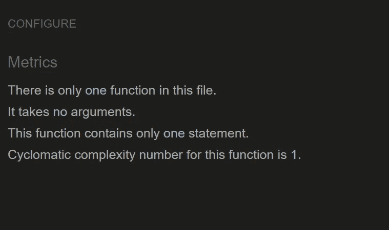
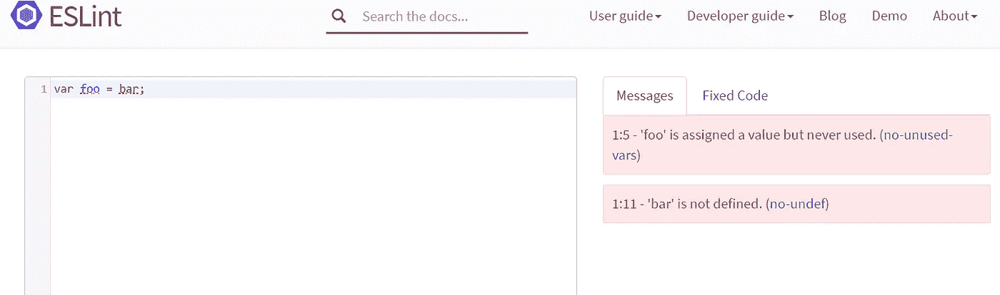

# 开源工具检测 JavaScript 代码中的错误和问题

> 原文：<https://javascript.plainenglish.io/open-source-tools-to-detect-errors-and-problems-in-your-javascript-code-f034893f4327?source=collection_archive---------5----------------------->

## 对 JavaScript 程序执行静态和动态代码分析

在这篇文章中，我想展示一些开源工具来对我们的 JavaScript 应用程序进行静态和动态代码分析。分析我们代码的缺陷总是明智的。然而，如果我们正在开发一个将被大量使用或者在我们的业务中至关重要的应用程序，这个任务就变得不可或缺。使用这些开源工具有助于我们防止质量差的代码或不遵守编码标准的代码进入生产阶段。

## 索引

*   JSLint
*   JSHint
*   JSLint 与 JSHint
*   埃斯林特
*   柏拉图
*   共析器
*   流动
*   Iroh

## JSLint

JSLint 是软件开发中用于检查 JavaScript 源代码的另一个静态代码分析工具。它帮助我们检测代码中的错误和潜在问题。它主要是作为一个基于浏览器的 web 应用程序通过 jslint.com 域提供的，但也有命令行的修改。

JSLint online analyzer

JSLint online analyzer

网址:[https://jslint.com/](https://jslint.com/)

## JSHint

JSHint 是一个静态代码分析工具，可以检测 JavaScript 代码中的错误和潜在问题。JSHint 被脸书、维基百科、谷歌或 Spotify 等公司广泛使用。JSHint 是由 Anton Kovalyov 在 2011 年创建的，作为 JSLint 项目的一个分支，允许更多的定制选项。

JSHint 要求我们的源代码遵守某些约定和标准。JavaScript 代码可以在 JSHint 网站上在线查看。

JsHint online analyzer

JsHint online analyzer

网址:【http://jshint.com 

## JSLint 与 JSHint

对于大多数人来说，Slant 社区推荐 JSLint 而不是 JSHint。JSLint 它有一定的历史，由道格拉斯·克洛克福特创建，被许多程序员视为 JavaScript 之神。这意味着许多开发人员认为这是执行 JavaScript 最高标准的最佳方式。此外，不需要设置。

作为一个缺点，JSLint 有一个严格和教条的规则集，不能更改，而且很难知道哪个规则导致了错误。

另一方面，JSHint 抛弃了 JSLint 的许多更具对抗性的规则，并添加了一整套新规则，总体上变得更加灵活。JSHint 还附带了对许多库的支持。

## 埃斯林特

ESLint 是一个静态代码分析工具，用于识别在 JavaScript 代码中发现的有问题的模式并避免 bug。ESLint 附带了一些内置规则，但是我们能够在任何时间点动态加载新规则。它内置于大多数文本编辑器中，我们可以将 ESLint 作为持续集成管道的一部分来运行。

它类似于 JSLint 和 JSHint，但有一些例外:

*   ESLint 使用 Espree 进行 JavaScript 解析。
*   ESLint 使用 AST 来评估代码中的模式。
*   ESLint 是完全可插拔的，每一个规则都是一个插件，你可以在运行时添加更多。

ESLint 检测到的许多问题可以自动修复，而且修复是语法感知的。

ESlint online analyzer

ESlint online analyzer

网址:[https://eslint.org](https://eslint.org/docs/user-guide/getting-started)

演示地点:【https://eslint.org/demo 

## 柏拉图

Plato 是一个开源工具，它允许我们可视化和分析静态 JavaScript 代码。Plato 利用一个叫做 complexity-report 的模块来生成一个关于源代码各个方面的统计报告。

每个 Plato 报告都包括任何源代码文件的统计数据，例如:

*   可维护性得分
*   代码行
*   Linter 错误计数
*   估计的实现错误计数

最新版本适用于 ES6，但关于柏拉图的负面观点是，他最后一次提交是在 2016 年 8 月 9 日

Plato lines of code

网址:【https://github.com/es-analysis/plato 

## 共析器

Codelyzer 是一个开源工具，位于 TSLint 之上，为 Angular 项目执行静态分析。你可以通过网络、Ionic 应用程序等运行静态代码分析器。大多数规则的灵感来自棱角分明的风格指南。他们有一个与他们相关的网址，将链接到 angular.io/styleguide.的确切部分

Codelyzer online analyzer

Codelyzer online analyzer

网址:[http://codelyzer.com/](http://codelyzer.com/)

## 流动

Flow 是 JavaScript 代码的另一个静态类型检查器，它有助于使我们的代码更快更健壮。

Flow 通过静态类型注释来监控我们的代码中的错误。这些类型允许我们告诉 Flow 我们希望我们的代码如何工作，并且 Flow 确保它确实以那种方式工作。

尽管 Flow 通过静态注释来检查我们的代码中的错误，但是大多数时候，我们不需要定义它们，因为您可以通过上下文来推断它们。

网址:[http://flowtype.org/](http://flowtype.org/)

## Iroh.js

Irohjs 是一个动态代码分析工具，它允许我们在运行时记录我们的代码流，并即时操纵/拦截信息。与静态分析相比，动态分析允许收集仅在运行时可用的数据。

Iroh.js analysis example

## 结论

在本文中，我们已经看到了一小组代码分析器，虽然这些是可以用它们完成的工作的代表，但是还有更多。在我们的工作周期中尽可能多地使用它们并整合它们总是明智的。此外，如果我们在一个团队中工作，他们有助于维护不同开发人员之间的代码一致性。

## 参考

[https://github.com/analysis-tools-dev/static-analysis](https://github.com/analysis-tools-dev/static-analysis)

我希望你喜欢这篇文章。非常感谢你阅读我！

## **用简单英语写的 JavaScript 笔记**

我们已经推出了三种新的出版物！请关注我们的新出版物:[**AI in Plain English**](https://medium.com/ai-in-plain-english)[**UX in Plain English**](https://medium.com/ux-in-plain-english)[**Python in Plain English**](https://medium.com/python-in-plain-english)**——谢谢，继续学习！**

**我们也一直有兴趣帮助推广高质量的内容。如果您有一篇文章想要提交给我们的任何出版物，请发送电子邮件至[**submissions @ plain English . io**](mailto:submissions@plainenglish.io)**，并附上您的 Medium 用户名，我们会将您添加为作者。另外，请让我们知道您想加入哪个/哪些出版物。****