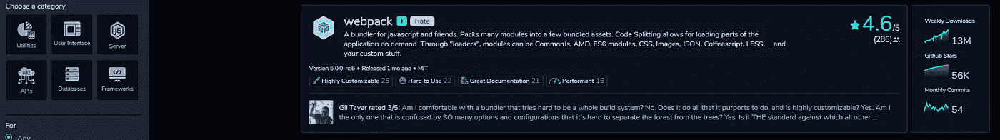

# Open base——开源软件包的叫卖声

> 原文：<https://javascript.plainenglish.io/openbase-the-yelp-of-open-source-packages-e638f95239cf?source=collection_archive---------12----------------------->

帮助开发者选择正确的开源包和库

[Openbase](https://openbase.com/)

# Openbase 到底是什么？

Openbase 是开源包和库的 Yelp。Openbase 由 Lior Grossman 创立，目标是帮助开发者“更快地构建令人惊叹的产品”。从 140 万个可供选择的 JavaScript 包中，用户可以深入了解每个包，并比较哪个最适合他们的需求。

# 它是如何工作的？

要注册，您可以授权 Openbase 使用您的 GitHub 帐户登录。登录页面展示了前端框架、捆绑器和 CSS 框架。它还展示了顶级开发者的包评论。当然，您也可以搜索特定的包。

目前，Openbase 支持 JavaScript 包。不过有计划扩展到 Java，C#，Python 等。

# 种类

“类别”页面允许您根据搜索和过滤条件搜索包。你可以从下面选择一个包的类别:*工具*、 *UI* 、*服务器*、*API*、*数据库*和*框架*。也可以选择 Node.js、Vue、React Native 等具体框架。结果将显示各种细节，如评级，每周下载量，星级和最近的评论。

[Categories](https://openbase.com/categories)

# 强大的洞察力

Openbase 为开发者提供了对每一个包的强大洞察力，从你期望得到的关于一个包的通常细节到备选包和开发者评论。

[Openbase — Vue](https://openbase.com/js/vue)

正如你所期望的，GitHub 会为你提供这个包的一般细节:readme，starts，contributors，versioning 等等。Openbase 还提供评论和替代建议，并将所有这些数据汇总到一个漂亮的仪表板中。对于每个包，您可以从一个页面查看所有数据。但是，您可以通过在左侧导航栏中选择特定组件来查看它们(照片中不存在)。还有一个很棒的地方是有一个教程标签，用户可以在里面留下教程视频、博客等的链接。

# 复习

评论是 Openbase 的主要特点。用户可以留下他们的意见，分享他们的经验，也可以阅读其他评论，给他们一个大拇指/大拇指。它们包含标签，用户可以将这些标签添加到他们的评论中，让其他人知道这个包是否被很好地记录、易于使用、高性能、缓慢、有错误、甚至被放弃(以及其他几个标签)。用户还可以查看开发者的个人资料，阅读他们对其他包的评论，从中获得灵感。

# 排行榜

用户根据他们拥有的点数在排行榜上排名。每次评论都是 10 分，每次分享你的评论都是另一分。这增加了一个有趣的方面，因为它鼓励用户分享他们的观点和经验以及他们使用的包和库。还会举行竞赛，排名前几位的贡献者将赢得奖品——第一名将赢得 Airpods 和一件 Openbase t 恤！

# 结论

这是一个很好的平台，开发者可以根据自己的需求选择合适的包。考虑到在一个地方数据的聚集以及其他用户留下的评论，Openbase 已经为开发者创建了一个平台来与他人分享他们使用软件包的经验。