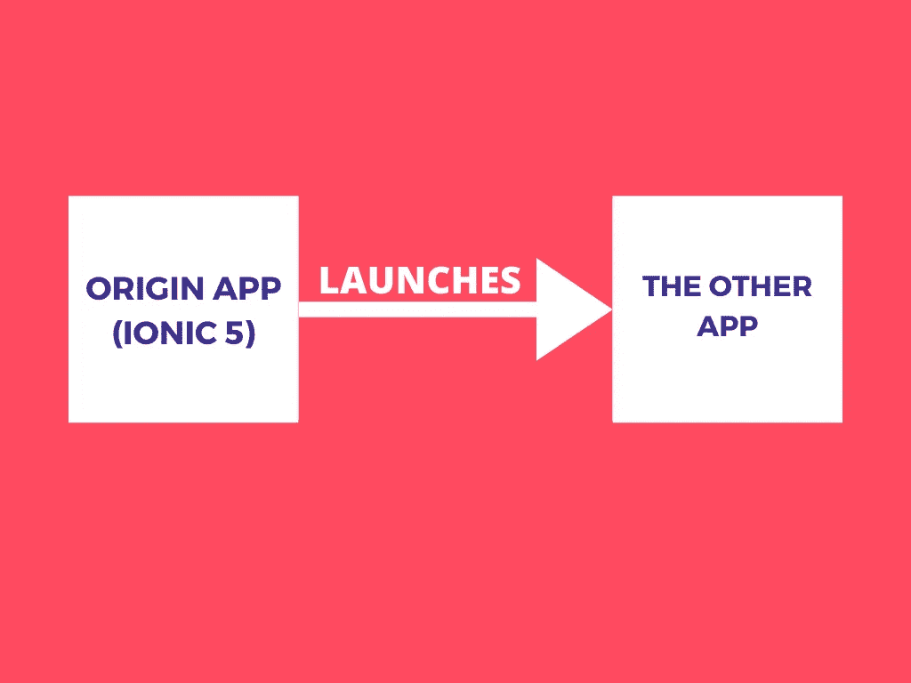
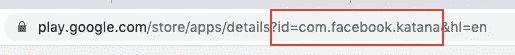
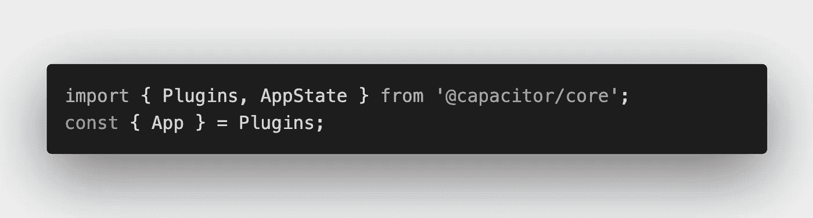
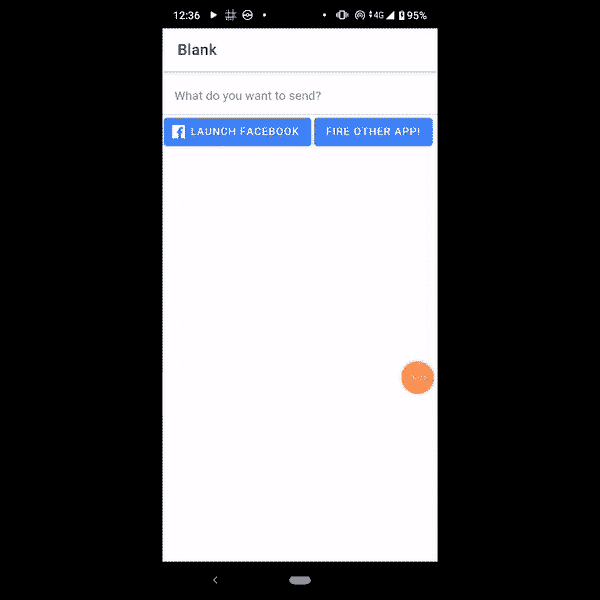

# 从 Ionic 5 应用程序打开另一个应用程序

> 原文：<https://javascript.plainenglish.io/opening-another-app-from-your-ionic-5-app-becf8c098d0e?source=collection_archive---------2----------------------->


Photo by [SpaceX](https://unsplash.com/@spacex?utm_source=unsplash&utm_medium=referral&utm_content=creditCopyText) on [Unsplash](https://unsplash.com/s/photos/launch?utm_source=unsplash&utm_medium=referral&utm_content=creditCopyText)

有时，您可能需要用正在开发的应用程序打开另一个应用程序。这个话题中常见的词包括应用浏览器、应用启动器和深度链接/深度链接。如果你正在构建一个基于 Cordova 的应用程序，这是真的，但是有一个更简单的方法是用电容器。由于 Ionic 5 应用程序使用电容器作为其默认的原生选项，我将向您展示一种更简单、更容易的方法来从您的 Ionic 5 应用程序打开另一个应用程序。



电容器有自己的方法来做到这一点，而且非常简单。不像 Deeplinking/Deeplink，InAppBrowser，App Launcher 等；不需要进行复杂的安装，不需要导入任何提供程序，这是真正的“开箱即用”。我在这里写的指南是基于电容器自己的指南，可以在这里访问:

[](https://capacitor.ionicframework.com/docs/apis/app/#method-addListener-1) [## 应用

### 应用程序 API 处理高级应用程序状态和事件。例如，这个 API 在应用程序进入和离开时发出事件…

capacitor.ionicframework.com](https://capacitor.ionicframework.com/docs/apis/app/#method-addListener-1) 

*请注意，在我写作的时候，这些是我正在使用的框架版本和方法:*

> 离子版本:5.0.1
> 
> Ionic CLI 版本:6.1.0
> 
> 电容版本:1.5.0
> 
> 方法:有角度

## **先决条件:**

我假设你熟悉 Ionic 框架，并且已经开始用 Ionic 构建一些应用程序。如果没有，请转到以下链接并开始使用。

如果你熟悉 HTML，开始使用 Ionic 真的很容易:

[](https://www.ionicframework.com) [## Ionic -跨平台移动应用开发

### Ionic 是面向 web 开发者的应用开发平台。构建令人惊叹的跨平台移动、web 和桌面应用程序…

www.ionicframework.com](https://www.ionicframework.com) 

好吧，假设你在遵循了 Ionic 网站上的[入门](https://ionicframework.com/getting-started)指南后，开始了一个新的 Ionic 5 项目，下面是你需要采取的步骤:

## **第一步:获取目标应用的应用 ID/URL**

你首先需要弄清楚的是目的应用 ID。去哪里获取 app ID？您将需要使用您的网络浏览器，并前往[谷歌 Play 商店](https://play.google.com)。通常在 play store，在 url 地址栏的末尾有三个词，看起来像这样:



如果你还没有猜到，上面的地址是脸书的应用程序。这是我们需要的应用程序 ID，请务必记下来。不同的应用程序有不同的应用程序 ID，如果你记错了，这可能无法工作，所以请记下应用程序 ID 并记在某个地方。因此，在这个例子中，我们将使用`com.facebook.katana`

## 第二步:将以下内容导入到您的`home.page.ts` 文件中

假设您正在构建一个按钮，该按钮将被推送到您主页中的下一个应用程序，您需要将以下内容导入到您的`home.page.ts`



将这些导入语句放在所有`import`语句所在的`home.page.ts`的顶部。请注意，不需要安装，所有这些都已经内置到您的 Ionic 应用程序中。

## 第三步:创建一个函数来启动另一个应用程序

完成后，您需要创建一个函数，用您记下的应用程序 ID 启动另一个应用程序。让我们调用这个函数 launchApp()并在`home.page.ts`内部这样写:

```
async launchApp(){ var ret = await App.canOpenUrl({ url: 'com.facebook.katana' }); var retx = await App.openUrl({ url:’com.facebook.katana' });
  console.log(’Open url response: ', ret);}
```

## 第四步:执行 launchApp()函数

剩下要做的就是启动您的应用程序。在`home.page.html` 内放置一个按钮，执行如下功能(我添加的内容在**粗体**):

```
<ion-header>....</ion-header>
<ion-content>...
 **<ion-button (click)="launchApp()">
      Launch another app
  </ion-button>**</ion-content>
```

## 第五步:构建一个 Android 应用程序来测试它

点击[此处](https://capacitor.ionicframework.com/docs/android#creating-android-project)可获得将你的应用转化为安卓应用的指南。假设你已经正确地遵循了所有的步骤，你应该能够从你的 Ionic 5 应用程序中打开脸书应用程序，它应该看起来像这样:



给你。

这就是从 Ionic 5 应用程序启动另一个应用程序所需的全部操作。您可以做的其他事情包括在两个或多个应用程序之间建立深度链接连接，以安全地传递参数。我可能会在另一篇文章中介绍如何通过这种方法从另一个应用程序发送参数，但现在，这是如何从 Ionic 5 应用程序启动另一个应用程序。#数字代理