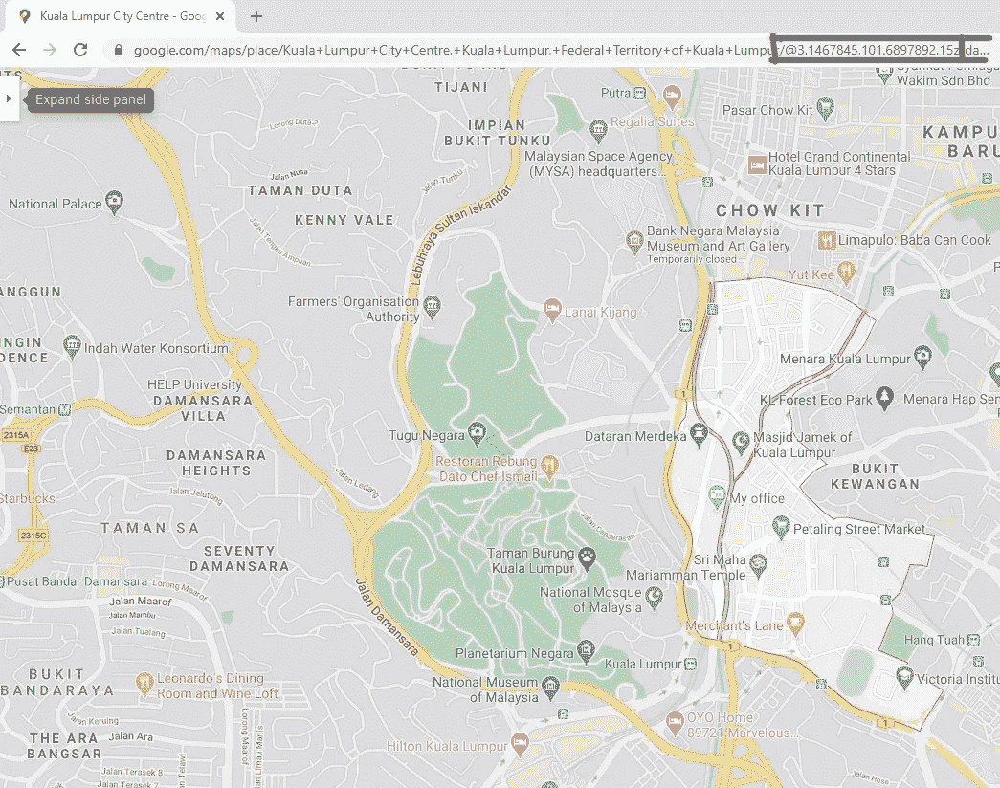
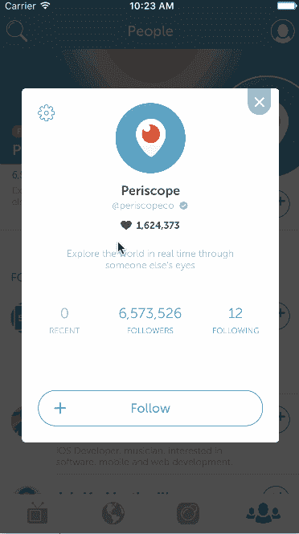

# 从您的应用程序中打开谷歌地图应用程序或 Waze 应用程序进行导航

> 原文：<https://javascript.plainenglish.io/opening-google-maps-app-or-waze-app-from-your-app-for-navigation-7d1d9f7a79ed?source=collection_archive---------6----------------------->

在 Ionic 应用程序中，你希望用户直接打开谷歌地图应用程序或 Waze 应用程序中的特定位置，这样他们就可以直接导航到该位置。

关于如何链接，这似乎是一项艰巨的任务，而且看起来，首先，你需要对如何使用深度链接来链接应用程序有相当深刻的理解。我可以向你保证，事实并非如此，而且令人惊讶的是，这是一个非常简单的任务。请继续阅读，找出方法。

Photo by [Daniil Silantev](https://unsplash.com/@betagamma?utm_source=unsplash&utm_medium=referral&utm_content=creditCopyText) on [Unsplash](https://unsplash.com/s/photos/maps?utm_source=unsplash&utm_medium=referral&utm_content=creditCopyText)

我在这里使用的离子版本是:

*   离子版本 5
*   Ionic CLI 版本 6.10.1

> “…我希望我的客户只需点击一个按钮，就可以直接打开谷歌地图或 Waze 应用程序进行导航…”——未命名的客户端

我在网上搜寻这个问题的解决方案。我正在开发一个应用程序，客户希望我自动打开他们的办公室地址，直接从他们的移动应用程序的谷歌地图应用程序或 Waze 应用程序。这个想法是，如果他们的客户需要到办公室来，他们可以很容易地导航到他们的位置。

这个问题有很多解决方案，有些比另一些复杂得多，有些不是我想要的。我决定尝试找到一个更简单的方法来解决这个问题。

这个解决方案，听起来很简单，涉及到链接到一个 URL。就是这样。令人惊讶的是，它是如此的简单和容易。以下是如何在 Ionic Angular 应用程序中构建它:

# 第一步。获取坐标

你可以通过谷歌地图网站获得地球上任何一点的坐标(感谢谷歌！).方法如下:

Kuala Lumpur City Center in Google Maps

看到红框中的数字，那基本上是坐标，基本上是由纬度和经度组成的，在这个例子中，是吉隆坡市中心。更准确地说，吉隆坡市中心的纬度/经度是:

**纬度** : 3.1467845

**经度** : 101.6897892

# **第二步。在你的 Ionic 应用程序中创建一个行动表**

为什么要创建行动表？也许向用户展示几个选项供其选择是个好主意。在我们的例子中，我们希望用户能够使用谷歌地图或 Waze。我觉得有一个行动表比无聊页面上的无聊按钮更好看，也更优雅。

你可能会问，行动单是什么样的？下面是一个行动表的示例:

Action sheet example

Ionic 的伟大之处在于，它已经作为 Ionic UI 组件的一部分内置到了 Ionic 框架中，[在这里阅读更多信息](https://ionicframework.com/docs/api/action-sheet)。

现在你知道它会是什么样子了，下面是如何在你的 Ionic 应用程序中创建一个行动表:

函数`presentActionSheet()`将启动一个动作表，但到目前为止它是空的，因为我们没有在`actionLinks` 数组中添加任何东西。进入下一步。

# **第三步。通过 actionlinks 数组添加动作表中的链接**

接下来，我们需要通过`actionLinks`数组在动作表中添加链接。为此，我们需要做的就是使用`.push()`命令，就像这样:

请注意，与前面的代码块相比，这段代码块中唯一的不同是从第 24 行到第 58 行，这里我们使用`.push()`在`actionLinks`数组中添加了链接。这应该用 3 个选项填充动作表列表:

1.  通过谷歌地图应用打开位置并开始导航的链接
2.  通过 Waze 应用程序打开位置并开始导航的链接
3.  取消操作并关闭动作单的按钮

就是这样。您应该能够使用 Ionic 应用程序中的 action sheet 控制器直接打开您选择的地图应用程序。这应该对 Android 和 iOS 都适用。但是，如果在您的设备中没有找到谷歌地图或 Waze 应用程序，它应该通过打开一个网络浏览器来显示您选择的网站(谷歌或 Waze)上的坐标位置。

告诉过你没痛苦而且简单。

## 简单英语的 JavaScript

喜欢这篇文章吗？如果有，通过 [**订阅获取更多类似内容解码，我们的 YouTube 频道**](https://www.youtube.com/channel/UCtipWUghju290NWcn8jhyAw) **！**