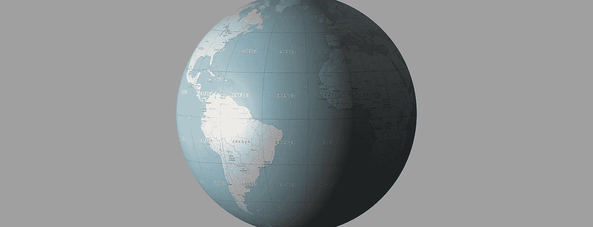
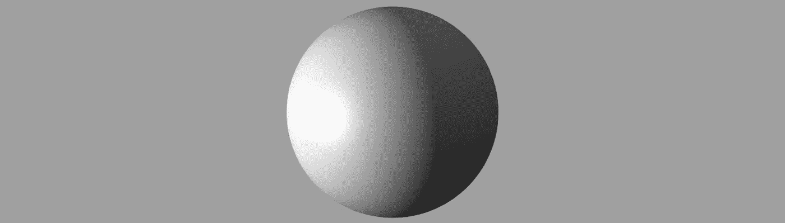
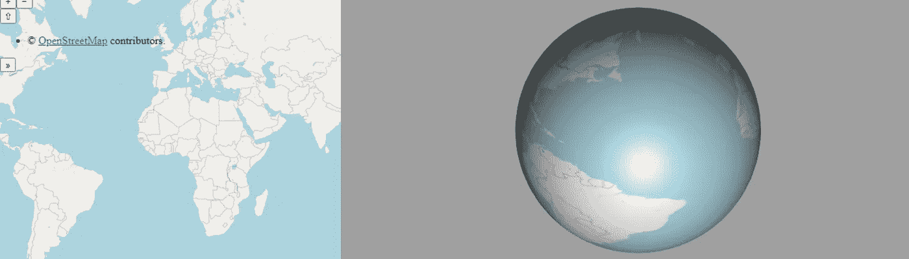
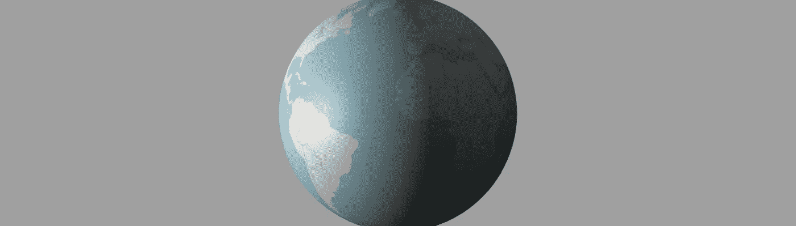
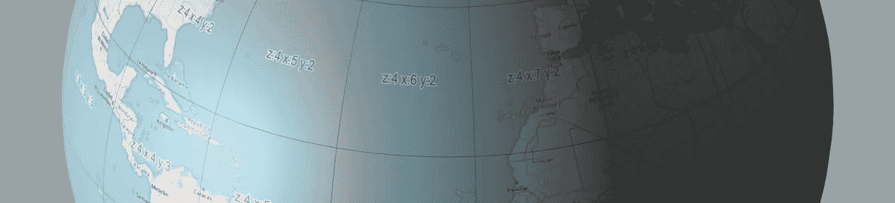
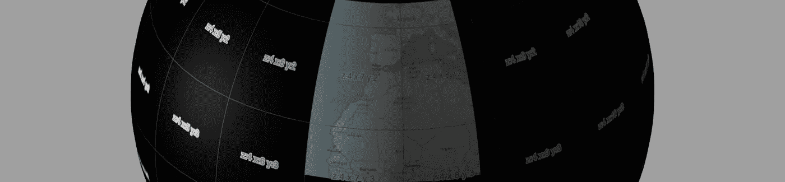

# OpenLayers 和 three.js

> 原文：<https://javascript.plainenglish.io/openlayers-and-three-js-99c904eed76c?source=collection_archive---------4----------------------->



最近，我考虑为一个项目创建一个在线 3D 地球仪。Three.js 是一个令人惊叹的库，互联网上有许多资源可以创建视觉上令人惊叹的地球仪。但是我也想拥有 OpenLayers 丰富的映射功能。

虽然有用于此目的的库，但我想探索这两个库的可能性，而不受一个软件包解决方案的限制。可能性是无穷无尽的。我们开始吧。

第一步是使用 three.js 创建一个 3D 球体。这里没有什么复杂的，只是一些注意事项:

*   我们使用正交相机，因为透视不适合这种事情。
*   我们集成了轨道控制，以便能够在地球上旋转和缩放。

```
var camera = new THREE.OrthographicCamera(
  -window.innerWidth / 4,
  window.innerWidth / 4,
  window.innerHeight / 4,
  -window.innerHeight / 4,
  1,
  1000
);camera.position.set(0, 0, 100);var controls = new THREE.OrbitControls(camera, renderer.domElement);var globe = new THREE.Mesh(
  new THREE.SphereGeometry(90, 64, 64),
  new THREE.MeshPhongMaterial()
);
```



A three.js scene with a sphere, orbit controls and orthographic camera.

接下来，我们添加一个简单的 OpenLayers 地图，这是有趣的开始。Three.js 有一个方法可以将画布元素作为纹理放到网格对象中。它基本上与基本纹理类相同，但是它接受 canvas 元素作为输入，并且默认情况下将 needsUpdate 属性设置为 true。OpenLayers 有一个 map 事件，当渲染完成时，我们可以从该事件中获取地图画布。在事件内部，我们将地图画布设置为球体的纹理，并将球体材质的 needsUpdate 属性设置为 true。

```
map.on("rendercomplete", function () {
var mapContainer = document.getElementById('map');var mapCanvas = mapContainer.getElementsByTagName('canvas')[0];var texture = new THREE.CanvasTexture(mapCanvas);
  globe.material.map = texture;
  globe.material.needsUpdate = true;
});
```



An OpenLayers map projected on a three.js sphere.

起初，结果相当糟糕。我们必须做的一件事是改变 OpenLayers 视图的投影。这是因为 OpenLayers 默认使用 EPSG:3857 球面墨卡托，它将坐标投影到 2D 表面，从而在极点处拉伸地图。这对于平面视图来说很好，但是对于球体，我们需要 EPSG:4326 或类似的东西，它使用椭球 2D 坐标系。改变 OpenLayers 视图的投影系统非常简单。

```
var view = new ol.View({
  projection: "EPSG:4326",
  extent: [-180, -90, 180, 90],
  center: [0, 0],
  zoom: 2
});
```

这张地图看起来好多了，但我们还是漏掉了一些部分。这是因为画布不会渲染整个地图。为了解决这个问题，我们必须强制画布视图显示整个地图。以度为单位的地图边界为[-180，-90，180，90]，因此宽度和高度的比例为 2:1。将地图元素的宽度和高度分别设置为 1000 像素和 500 像素，可以正确地在画布上渲染整个地图，并最终渲染我们的球体纹理。我们还隐藏了地图，这样就不会遮挡 3d 视图(希望可以节省资源)。

```
<div id="container">
  <div id="map" style="position: fixed; visibility:hidden; width: 1000px; height:500px;"></div>
</div>
```



An OpenLayers map correctly projected on a three.js sphere.

这样更好。我们现在有了一个正确应用了 OpenLayers 地图的 3D 地球。但是还有一个问题。我们不能缩放球体并获得更好的地图分辨率，这意味着更多的瓷砖。我尝试了几种方法来实现这一点，但似乎最有效的方法是在 three.js 相机的特定缩放级别下增加画布的大小。这是有意义的，因为球体上的缩放需要更高分辨率的纹理。

为此，我们可以使用 OrbitControls 结束事件。在事件中，我们可以让摄像机缩放，并在特定的缩放级别上改变画布的大小。我们使用三种变焦情况进行测试，但显然更多的情况是适用的。请注意，每当我们更改地图元素的大小时，都需要在地图上调用 updateSize()方法。此外，因为当我们缩小地图尺寸时，视图不会缩小，所以我们必须重置视图分辨率(或缩放级别)。您可以使用 view.getResolution()方法获得每个地图大小的分辨率，并使用这些值再次设置分辨率。最后，为了提高效率，我们不希望每次缩放改变时都触发，所以我们需要一种方法来限制每次轨道控制改变时的大小改变。在这里，我使用相机缩放的 Math.floor 来获取整数值，并使用一个临时变量来存储当前宽度，但是您可以通过几种方式获得类似的结果。

```
var currentWidth = 1000;
controls.addEventListener("end", function (event) {
switch (Math.floor(camera.zoom)) {
    case 1:
      document.getElementById("map").style.width = "1000px";
      document.getElementById("map").style.height = "500px";
      if (currentWidth !== 1000) {
        map.updateSize();
        view.setResolution(0.36);
        currentWidth = 1000;
      }
      break;
    case 2:
      document.getElementById("map").style.width = "2000px";
      document.getElementById("map").style.height = "1000px";
      if (currentWidth !== 2000) {
        map.updateSize();
        view.setResolution(0.225);
        currentWidth = 2000;
      }
      break;
    case 3:
      document.getElementById("map").style.width = "4000px";
      document.getElementById("map").style.height = "2000px";
      if (currentWidth !== 4000) {
        map.updateSize();
        view.setResolution(0.18);
        currentWidth = 4000;
      }
      break;
    default:
      break;
  }
});
```



An OpenLayers map on a three.js sphere with zoom functionality.

而且越来越好了。我们现在有一个带开放层的 3D 地球仪，在上面我们可以缩放并获得更好的分辨率。但是还有最后一个问题。我们从全世界下载瓷砖。这是一个非常繁重的过程，当调用 tiles loading 时，它会使场景非常滞后。为了解决这个问题，我们可以在切片图层上使用 setExtent 方法，并将切片加载限制在感兴趣的特定区域。为了做到这一点，我们必须找到相机当前正看着球体的地图坐标。有一个聪明的方法可以做到这一点。

首先，我们使用 three.js 的 Raycaster 类来获取屏幕中心的球体交点(因此也是摄像机的交点)。由此，我们可以得到相机中心当前正对着的地图画布的 UV 位置。将 UV 坐标乘以画布的像素大小，我们得到画布上相应的像素。幸运的是，OpenLayers 有一个非常有用的函数，getCoordinateFromPixel，通过它我们可以从画布像素获得地图上的坐标(x，y)。

```
var raycaster = new THREE.Raycaster();
controls.addEventListener("end", function (event) {
raycaster.setFromCamera({ x: 0, y: 0 }, camera);let intersects = raycaster.intersectObject(globe);let x = -map.getCoordinateFromPixel([
    intersects[0].uv.x * currentWidth,
    (intersects[0].uv.y * currentWidth) / 2
  ])[1];
  let y = map.getCoordinateFromPixel([
    intersects[0].uv.x * currentWidth,
    (intersects[0].uv.y * currentWidth) / 2
  ])[0];});
```

最后，为了得到范围，我们在中心定义一个半径为 20 度的圆(这将取决于我们需要的范围的大小，并且它可以根据不同的相机缩放级别动态变化)。从圆特征，我们得到的范围，我们传递给 OSM 层。结果看起来相当不错。

```
var circle = new ol.Feature({
    geometry: new ol.geom.Circle([y, x], 20)
  });var circleSource = new ol.source.Vector({
    features: [circle]
  });osm.setExtent(circleSource.getExtent());
```



An OpenLayers map on a three.js sphere with extent restriction.

作为最后的润色，我们可以添加第二个 OSM 层来覆盖我们焦点区域周围的黑色纹理。为了限制该层的图块加载，我们将该层源的 maxZoom 属性设置为 2。

```
new ol.layer.Tile({
      extent: [-180, -90, 180, 90],
      source: new ol.source.OSM({
        maxZoom: 2
      })
    }),
```

我们现在在一个 three.js 3D 球体上有了一个全功能的 OpenLayers 地图。这开启了 3D 映射的许多可能性。令人惊讶的是，我们只用几行代码就能做到这一点，并且在我们的武库中拥有两个伟大的库的能力和特性。