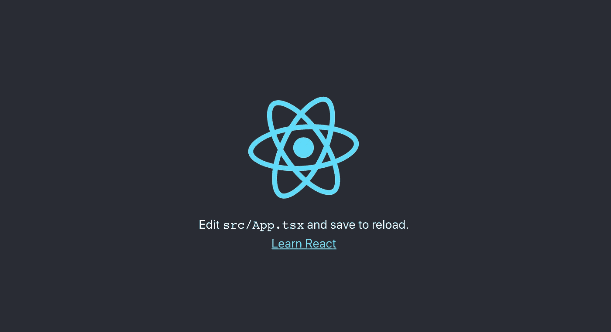
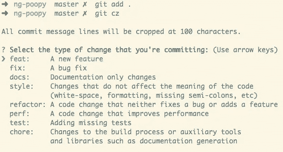
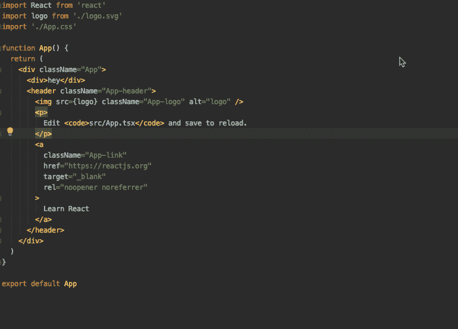
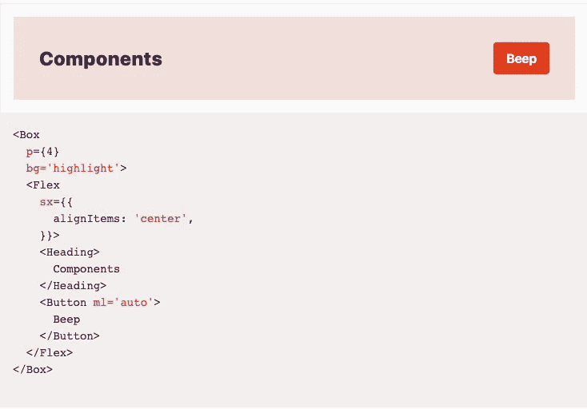
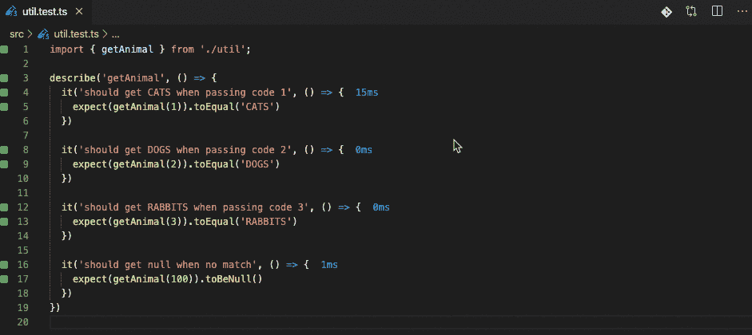

# 固执己见用有用的库创建 React 应用程序

> 原文：<https://javascript.plainenglish.io/opinionated-create-react-app-with-useful-libraries-f92bce7cc572?source=collection_archive---------5----------------------->

## 使用有用的库创建 react 应用程序



作为多年的前端开发经验，我将向您展示我在大多数项目中使用的 React 设置。

# 回购示例

以下是完整代码库的链接，以供参考:

[](https://github.com/manakuro/opinionated-create-react-app-example) [## manakuro/固执己见-创建-反应-应用程序-示例

### 这个项目是用 Create React App 引导的。键入脚本反应-应用程序-重新布线/自定义-cra 风格-组件…

github.com](https://github.com/manakuro/opinionated-create-react-app-example) 

# 设置创建 React 应用程序

对于我的大多数 React 项目，我使用 TypeScript 是因为:

*   静态类型让你很容易理解代码库(自文档化)。
*   组件让你知道什么道具是需要的，什么是不需要的。
*   如果所需的属性没有通过，TypeScript 将立即警告您。
*   如果您使用可能为空的变量，Typescript 会警告您，以便您可以避免不必要的运行时错误，如 undefined。
*   编辑器可以告诉你代码建议，让你的开发速度快得令人难以置信

最初，TypeScript 中的代码可能看起来很简单，但是一旦你习惯了，你会发现它非常有用。

因此，让我们用 TypeScript 模板创建 react 应用程序:

```
npx create-react-app my-react-app --typescript
```

# 图书馆

*   [react-app-rewired](https://github.com/timarney/react-app-rewired)/[customize-CRA](https://www.npmjs.com/package/customize-cra)
*   [commitzen](https://github.com/commitizen/cz-cli)
*   风格系统
*   主题用户界面
*   玩笑
*   [反应-测试-库](https://testing-library.com/)
*   Wallaby.js

# 发展环境

首先，我将介绍一些用于高效开发的库。以下是其中的一些:

*   [commitzen](https://github.com/commitizen/cz-cli)
*   [react-app-rewired](https://github.com/timarney/react-app-rewired)/[customize-CRA](https://www.npmjs.com/package/customize-cra)
*   eslint/beauty/lint-staged

## 委员会

[commitzen](http://commitizen.github.io/cz-cli/) 允许您使用交互式命令行界面填写必需的提交字段。

在提交之前，会出现下面的界面，您可以选择已经更改的提交类型。之后，commitzen 将生成消息并自动提交。



虽然你可以定制提交消息模板，但是如果你不挑剔的话，你可以使用 [AngularJS 的提交消息约定](https://github.com/angular/angular.js/blob/master/DEVELOPERS.md#-git-commit-guidelines)，这是前端开发中的一个流行约定，和其他库一样， [Vue.js](https://github.com/vuejs/vue/blob/dev/package.json#L145-L149)

那么，让我们来看看它是如何工作的。

安装 commitzen 和 cz-conventi on-changelog:

```
yarn add -D commitizen cz-conventional-changelog
```

并在 package.json 中配置它:

```
"scripts": {
  "start": "react-scripts start",
  "build": "react-scripts build",
  "test": "react-scripts test",
  "eject": "react-scripts eject",
 **"commit": "git-cz"**
},...
**"config": {
  "commitizen": {
    "path": "./node_modules/cz-conventional-changelog"
  }
}**
```

让我们按`git add .`和`yarn commit`运行:


## react-app-重新布线/定制-cra

Create React App 不允许你在默认不弹出的情况下自定义 babel 插件、eslint 或 jest 设置。为了不弹出来，我们可以用 [react-app-rewired](https://github.com/timarney/react-app-rewired) 和 [customize-cra](https://github.com/arackaf/customize-cra/blob/3046d395878afc0e6ad8508f9be5a90edb46b9ef/readme.md) 。

安装 react-app-rewired 和自定义-cra:

```
yarn add -D react-app-rewired customize-cra
```

在根目录下创建一个`config-overrides.js`:

并将 package.json 中的 *start* 、 *build* 和 *test* 脚本修改成这样:

## eslint/beauty/lint-staged

设置 react-app-rewired 后，就可以在项目中使用 eslintrc.js 了。

所以，还是装 eslint 更漂亮吧。

```
yarn add -D eslint eslint-config-prettier eslint-plugin-prettier prettier
```

并添加 eslintrc.js:

Create React App 提供了一个预置的基础配置，默认为`react-app`。因此，我强烈建议您扩展它，并在其中添加您的规则。

这个 eslint 设置中也启用了 beauty。所以，当你运行命令`eslint —fix`时，eslint 和 prettier 都会检测并修复代码。

在我的编辑器中，我通常连接`eslint — fix`来保存文件。所以，每次我保存文件，它都会自动格式化代码。



在 VS 代码中，可以像本文一样启用 linter on save，[林挺 on Save with Visual Studio Code 和 ESLint](https://alligator.io/workflow/auto-eslinting/) 。

接下来，我们将设置 lint-staged，在提交之前检查代码的格式是否正确。

```
yarn add -D lint-staged
```

并将配置和脚本添加到 package.json:

在运行 commit 之前，lint-stage 将仅针对暂存文件运行，并强制 eslint 格式。


# 用户界面

在前端开发中，我一直在努力解决 UI 组件 bug 或 CSS 代码混乱等问题。发生这种情况是因为每个开发人员创建了他们自己的 UI 组件和 CSS 代码，而没有注意到一个类似的组件已经被制作出来了。如果这种情况持续一段时间，您将会遇到以下问题:

*   很多不一致的风格
*   大量重复的 UI 组件
*   大量不必要的设计和开发时间

为了避免这些问题，您需要保持我们的 UI 组件的一致性。创建可重用的组件使您的开发速度更快，还提供了一致的用户界面，帮助您的用户导航并与网站交互，而不会产生混淆。

为了实现这一点，我使用 styled-system，因为:

*   你可以编写没有命名冲突的 CSS(对于 CSS 面条问题)
*   您可以根据设计系统编写代码(针对不一致的风格问题)
*   您可以编写可重用的组件(针对重复的 UI 组件问题)

那么，让我们来看看它是如何工作的。

## 风格系统

风格化系统设计了一套将道具映射到设计系统的工具，也有一堆为 CSS 提供功能的 API。它支持 CSS-in-JS 库，如 styled-component、emotion，甚至支持 Vue.js。

## 主题用户界面

主题 UI 是基于设计原则创建可重用组件的风格化系统的下一个发展。主题用户界面的特点如下:

*   风格系统的下一次进化
*   基于实用程序的原子 CSS 方法的创造者
*   使用`sx`道具的主题风格
*   Style [MDX](https://mdxjs.com/) 内容带有简单、富于表现力的 API
*   使用[typhony . js](https://github.com/KyleAMathews/typography.js)主题
*   几乎与任何 UI 组件库兼容
*   与现有的[风格的系统](https://styled-system.com/)组件一起工作
*   快速移动优先的响应风格
*   内置对黑暗模式的支持
*   原始页面布局组件
*   用于[盖茨比](https://gatsbyjs.org/)网站和主题的插件
*   完全可定制的强大主题
*   使用标准的[主题规范](https://system-ui.com/theme)构建互操作性
*   用[情感](https://emotion.sh/)为限定范围的样式构建

属性可以让你内联任何元素，也可以使用主题中的值。因此，如果你给道具添加值`bg: highlight`，主题 UI 将引用主题中的值`colors: { highlight: “#663399”}`，这非常有用，因为你可以使它更通用，而不是为每个组件使用一个特定的值。



安装主题用户界面:

```
yarn add theme-ui
yarn add -D @types/theme-ui
```

在`App.tsx`中设置主题提供者:

`ThemeProvider`是主题 UI 中的一个内置提供者，它通过上下文 API 向其下的所有 React 组件提供一个主题。

`<Global />`组件将一个基本的 CSS 应用到 HTML 中作为全局样式。

让我们给`src/styles/theme.ts`添加一个主题:

这是基于来自 [them-ui/presets](https://www.npmjs.com/package/@theme-ui/presets) 的预置，但是你可以在你的项目上定制你想要的任何东西。如果您的团队使用设计系统，您可以将其应用到主题中。

此套件中还提供了以下预设:

*   [系统](https://theme-ui.com/presets/system)
*   [放克](https://theme-ui.com/presets/funk)
*   [未来](https://theme-ui.com/presets/future)
*   [机器人](https://theme-ui.com/presets/roboto)
*   [黑暗](https://theme-ui.com/presets/dark)
*   [深](https://theme-ui.com/presets/deep)
*   [瑞士](https://theme-ui.com/presets/swiss)
*   [tosh](https://theme-ui.com/presets/tosh)
*   [自举](https://theme-ui.com/presets/bootstrap)
*   [布尔玛](https://theme-ui.com/presets/bulma)(在制品)
*   [顺风](https://theme-ui.com/presets/tailwind)

您可以在[演示](https://theme-ui.com/demo/)页面上播放预设。

因此，让我们使用主题 UI 组件重写欢迎页面:

我喜欢用这种方式编写代码的原因是:

*   你不再需要考虑 CSS 命名冲突了
*   你可以通过定义主题来保持风格的一致性
*   通过使用基本组件，如 Box、Flex、Text 等，可以避免创建重复的组件。即使有微小的差异，只是添加风格道具，没有必要创造一个新的。

主题 UI 中有一堆有用的特性，我甚至无法在这里描述。我建议你在[文档](https://theme-ui.com/)中查看它们。

# 测试

以下是我在项目中使用的一些测试库:

*   [反应-测试-库](https://testing-library.com/)
*   玩笑
*   [Wallaby.js](https://wallabyjs.com/)

## 反应测试库

我已经使用[酶](https://enzymejs.github.io/enzyme/)有一段时间了，这是一个测试 React 组件的非常好的工具。通过使用浅层渲染，您可以将组件与它们所渲染的子组件隔离开来，这比使用`mount`进行完全渲染更轻便高效。

通过提供模拟真实用户行为的 API，Enyzme 允许我们专注于实现。

嘲讽函数和组件很容易让我写一个测试，但我也是:

*   在重构实现时，努力更新关于嘲讽的测试代码。
*   对真实用户行为的覆盖面没有安全感。

所以最近我改变了写测试的心态。我关注更多用户的行为，因为如果预期的结果是安全的，您可以轻松地重构实现并更改代码。它还能让你对你的产品充满信心，给你的用户高质量的产品。

react-testing-library 适合这种情况，因为它们提供了有用的 API，使我们能够更加关注用户的行为。

这些实用程序处理的是 DOM 而不是组件实例，并且鼓励按照预期的方式使用组件的测试。

[指导原则](https://testing-library.com/docs/guiding-principles)说:

> 你的测试越像你的软件被使用的方式，它们就越能给你信心。

另外[JavaScript-测试-最佳实践](https://github.com/goldbergyoni/javascript-testing-best-practices#-%EF%B8%8F-33-whenever-possible-test-with-a-realistic-and-fully-rendered-component)鼓励你完全渲染组件来测试用户的行为:

> 只要规模合理，就像用户一样从外部测试组件，完全呈现 UI，对其进行操作，并断言所呈现的 UI 的行为符合预期。避免各种各样的嘲弄、部分和肤浅的渲染——这种方法可能会由于缺乏细节而导致未被捕获的错误，并且由于测试弄乱了内部结构而使维护变得更加困难(参见“支持黑盒测试”)。如果其中一个子组件明显变慢(例如动画)或使设置变得复杂——考虑明确地用一个假的替换它

虽然它们之间有利弊，实际上也有权衡，如果你像我一样在测试上有困难，你可以考虑尝试一下。

## Wallaby.js

Wallaby.js 是一个测试工具，当你改变时，它立即运行你的 JavaScript 或 TypeScript 测试，并在你的代码编辑器中以惊人的速度显示结果。



当您更改测试代码时，Wallaby.js 会自动检测错误并显示预期结果。

这非常有用，可以提高您的开发效率。

我已经谈过如何使用 Wallaby.js，在[用 Wallaby.js](https://medium.com/better-programming/blazingly-fast-testing-with-wallaby-js-61383d60d7f9) 进行惊人的快速测试，所以你可以检查一下。

# 结论

就是这样。我强调了开发、UI 和测试库。我将在后面的帖子中讨论 API 和处理表单。

我希望这件作品能让你感兴趣。

## **用简单英语写的一段 JavaScript 笔记:**

我们总是有兴趣帮助推广高质量的内容。如果你有一篇文章想用简单的英语提交给 JavaScript，用你的中级用户名发邮件到[submissions@javascriptinplainenglish.com](mailto:submissions@javascriptinplainenglish.com)给我们，我们会把你添加为作者。