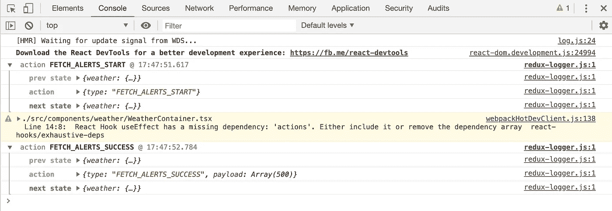

# 使用 Typescript 的固执己见的 Redux 设置

> 原文：<https://javascript.plainenglish.io/opinionated-redux-setup-with-typescript-eb71eb619716?source=collection_archive---------13----------------------->


Photo by [Steve Johnson](https://unsplash.com/@steve_j?utm_source=unsplash&utm_medium=referral&utm_content=creditCopyText) on [Unsplash](https://unsplash.com/s/photos/opinion?utm_source=unsplash&utm_medium=referral&utm_content=creditCopyText)

什么，另一个关于如何设置 Redux 的帖子。我想分享我是如何通过构建一个简单的应用程序从 weather.gov 获取天气警报来设置我的 Redux 商店的。

让我们从引导一个 React 应用程序开始。

```
npx create-react-app weather --template typescript
```

这将为我们提供一个 boiler plate React 应用程序，所以让我们继续安装 Redux 依赖项。我们还将安装 react-redux 和 redux-logger 的类型，并安装 axios 来发出我们的请求。

纱线:

```
yarn add redux react-redux axios
yarn add --dev @types/react-redux redux-logger @types/redux-logger
```

NPM:

```
npm i -S redux react-redux axios
npm i -D @types/react-redux redux-logger @types/redux-logger
```

Redux logger 是在控制台中查看状态变化的一种很好的方式，这样您就可以监视数据是如何流经 Redux 存储的。



让我们继续并删除锅炉板文件，然后使目录结构。我也喜欢有一个基于应用程序所属部分的文件夹。所以我要做一个`components`、`context`和`store`文件夹。在主 src 目录中，我将有一个`index.tsx`文件，在组件中，我将有一个`App.tsx`文件。

让我们继续设置我们的主文件和应用程序组件:

我们的应用程序不多，但我们会实现的。让我们为商店设置锅炉板。当考虑商店时，我们将有一个天气键。那把钥匙应该包含我们的警报。让我们在商店中创建一个名为`weather`的子文件夹。

首先，让我们在`weatherTypes.ts`文件中定义我们的类型:

在类型中，我们利用 Typescript 中的 enum 为 Redux 提供我们的类型。我们还定义了我们的警报是什么样子，以及天气预报器的状态是什么样子。

现在让我们创建我们的 Reducer 文件。

我们的减速器看起来不一样，那就是它里面没有开关盒。原因是当我们使用有限状态机时，我们希望重用我们的 reducer 函数。如果我们把 api 的不同部分拉进来，我们可以把我们的开始和失败类型映射到一个 reducer，这样我们的代码就枯竭了，只需要声明新的 reducer 来处理成功的动作。

createReducer 函数是一个高阶函数，它接受初始状态，并且是一个对象，其键值对链接到我们的 Reducer 函数。然后，它将状态和动作输入到 reducer 中。该文件如下所示:

现在是我们行动的时候了。我们只需要一个动作来获取天气警报。我们将利用 react-redux 包中钩子的能力，并将我们的动作分配给一个 useCallback 钩子来记忆函数。该文件如下所示:

现在让我们建立我们的商店。我们将有一个`index.ts`、`reducers.ts`和`useActions.tsx`文件。下面是它们的样子:

这三个文件是将商店结合在一起的粘合剂。我将 reducers 和 actions 导入到这些文件中，并将所有内容组合在一起。

现在，我想做的下一件事是定义一个包含我的行为的上下文。我在 src 下创建了一个名为 Contexts 的文件夹，并创建了一个名为`ActionsContext.tsx`的文件。

我们的商店现在已经设置好了，让我们继续构建几个组件来测试我们的商店。我们将构建一个应用程序组件、一个容器和一个组件来处理每个警报。

借助 react-redux 挂钩的强大功能，我们能够生成清晰易读且易于维护的代码。我知道这是很多信息，但谢谢你花时间阅读我如何喜欢我的 redux。你觉得你的 redux 怎么样？

# **用简单英语写的便条**

你知道我们有四份出版物和一个 YouTube 频道吗？你可以在我们的主页 [**plainenglish.io**](https://plainenglish.io/) 找到所有这些内容——关注我们的出版物并 [**订阅我们的 YouTube 频道**](https://www.youtube.com/channel/UCtipWUghju290NWcn8jhyAw) **来表达你的爱吧！**