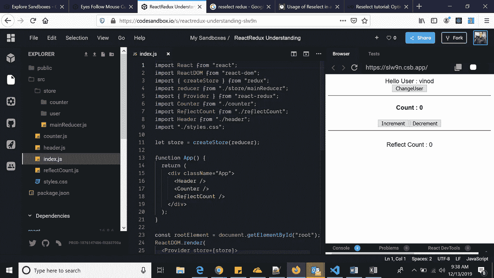
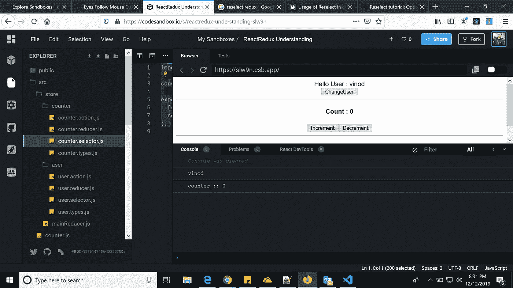
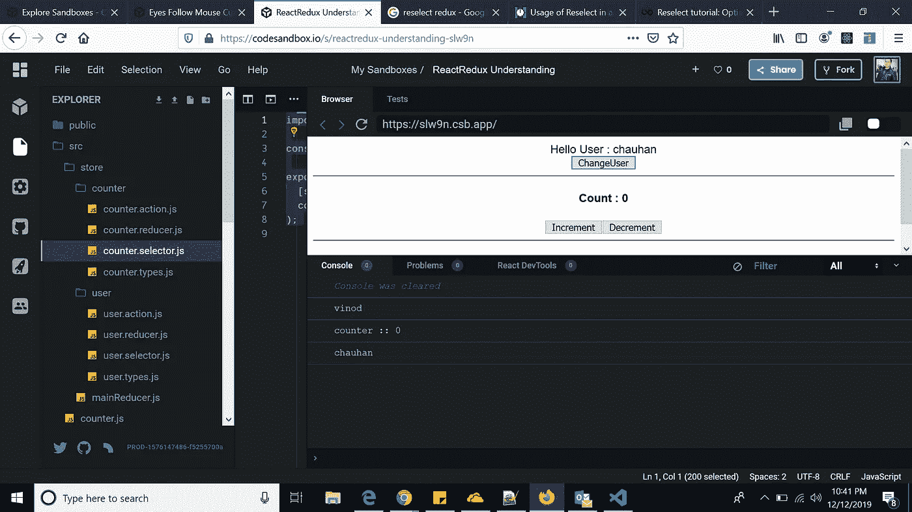

# 在 Redux 杀死你的应用程序之前优化它

> 原文：<https://javascript.plainenglish.io/optimize-redux-before-it-kills-your-application-6b73cf5f520b?source=collection_archive---------3----------------------->



CodeSandbox Image

首先，我们来看看一个 React-Redux 应用程序是如何工作的。Redux 在内部做了什么，它为我们的应用程序状态提供了一个商店，并提供了与商店通信的方法。其中一种方法是 *connect()* 函数。在自定义组件上调用 *connect()* 之后，您会得到一个包装器，它将状态作为道具从存储传递到您的组件。这通过每次状态改变时调用的 *mapStateToProps()* 函数来实现。

在 *mapStateToProps()* 产生重新计算的属性后，新属性比旧属性浅，如果它们不同，组件将被重新渲染。再次使用引用等式(===)来比较道具。

**好好反应和 Redux** 互相恭维。React 组件订阅 Redux store，因此每次状态(Redux state)改变时，子组件都会重新呈现。因此，订阅 Redux re 的任何组件都会在状态发生变化时呈现(除非我们提到不要这样做)。这是需要优化 React Redux 应用程序以避免不必要的重新渲染的主要原因。

为了避免所有这些冲突，有一些方法如下所述:

*   使用 **React 的 PureComponent** ，React shallow 比较以前的道具和现在的道具，如果没有变化就避免重新渲染。
*   使用 **shouldComponentUpdate** 生命周期，我们可以有选择地避免 React 组件的重新呈现。
*   不使用内部状态时使用**功能组件**。

这有助于避免重新渲染**,除非并且直到组件消耗了适当的改变。**

# 重新选择概念

根据图书馆的主页

**选择器可以计算派生数据，允许 Redux 存储最小可能状态。**这可以被认为是尽可能保持店铺的最小化。通过选择器计算任何派生的数据。

选择器是高效的。除非选择器的一个参数发生更改，否则不会重新计算选择器。

在上面示例的控制台选项卡中，默认情况下，您会看到两个日志:



Logs

在上面的屏幕中，默认情况下 Header 和 Counter 组件都被加载，因此我们得到了两个控制台输出。在此之后，如果您单击 changeUser 按钮，它将只呈现标题组件，这是我们在这里优化。



为了实现这一点，我们需要理解“重新选择”库中的选择器。

# 什么是选择器？

在我们的上下文中，**选择器只不过是可以计算或从存储中检索数据的函数。我们通常像这样使用 mapStateToProps 函数获取状态数据。**

```
//selectCounterValue
import { createSelector } from "reselect";
const selectCounter = state => state.counter;export const selectCounterValue = createSelector(
[selectCounter],
counter => counter.counter
);
```

' selectCounterValue '帮助我们从整个状态对象中只检索计数器状态，我们可以在组件中利用它，如上所述。

```
//In Component
const mapStateToProps = createStructuredSelector({
counter: selectCounterValue
});
```

这里 createStructuredSelector 将为我们创建一个结构，在这个结构中我们不需要将我们的状态作为参数传递&它也是由“reselect”库提供的。

# 让你的生活更美好的小贴士

总而言之，我将指定我在使用 Reselect 库时为自己获得的一些技巧。

1.  如果它以任何方式从状态转换值，总是使用 Reselect 中的 *createSelector()* 来创建选择器。
2.  避免咖喱选择器。一般来说，你不需要它们。您可以使用选择器的第二个参数传递您需要的所有参数。事实上，我能想到的唯一需要 curried 选择器的情况是在 [**文档**](https://github.com/reactjs/reselect#sharing-selectors-with-props-across-multiple-components) **中描述的。**
3.  从生命周期功能向商店分派动作时要小心。一般来说，避免这样做。但如果你不得不，也许在派遣一个动作之前手动比较道具是个好主意。