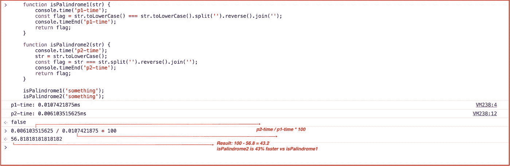
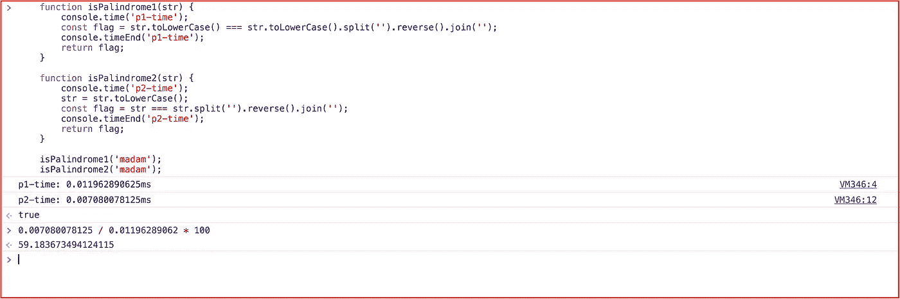
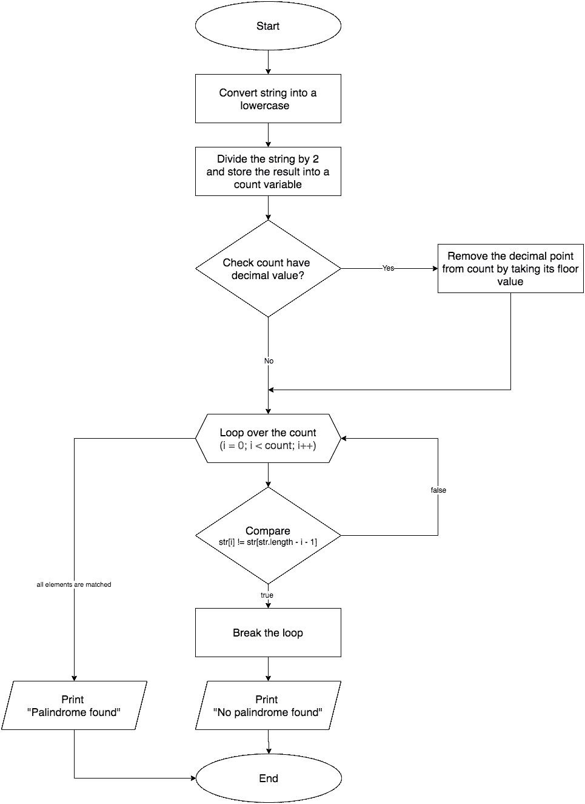
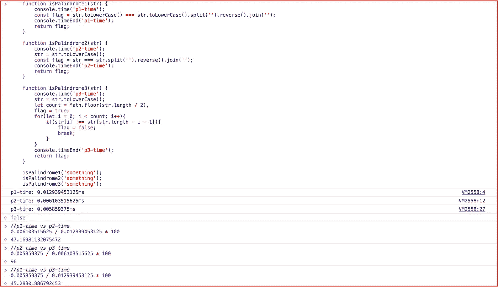
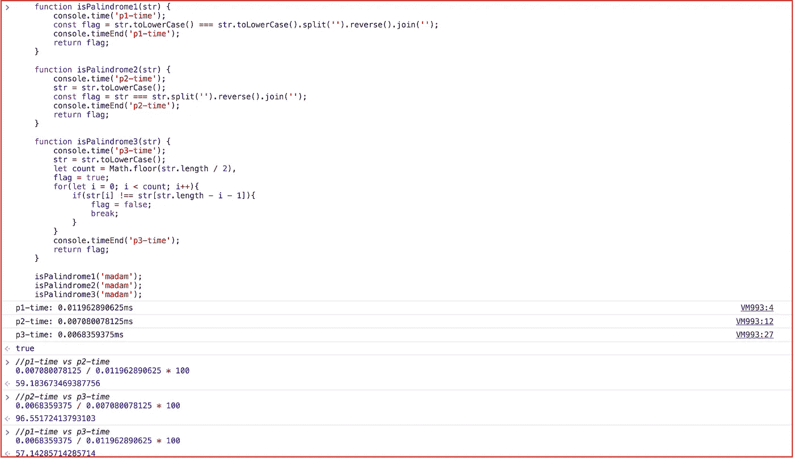

# 优化您的代码，它将执行高达 55%的✈️快

> 原文：<https://javascript.plainenglish.io/optimize-your-code-and-itll-execute-up-to-55-faster-%EF%B8%8F-3f0c1929ab07?source=collection_archive---------2----------------------->


Code

这个故事是关于代码性能的，我们可以看到我们如何以传统方式编写代码，或者当我们有一个很短的最后期限时，如何优化代码以运行更快，并使其对其他开发人员更具可读性。

*“任何傻瓜都能写出计算机能理解的代码。优秀的程序员编写人类能够理解的代码”——马丁·福勒*

太好了。但是你说，**“优化代码”**所以我的问题是:*“什么是代码优化？”*


## 代码优化

*代码优化是指，任何通过修改代码来提高代码质量和效率的方法。一个程序可以被优化，使得它变得更小，消耗更少的内存，执行更快。*

我相信我们非常清楚代码优化，对吗？没错。

让我们来看一个问题，并开始构建一个解决方案:“*写一个函数来确定这个字符串是否是一个回文？”*

## 回文

*回文是一个单词、数字、短语或其他向前和向后读起来一样的字符序列，如 madam、racecar。*


All the names are palindrome

开始编码吧！

嗯，我用 JavaScript 编码，所以这就是我在这个例子中使用 JavaScript 的原因，但是你可以使用任何你喜欢的编程语言，这完全取决于你。

我们用传统方式做的事情。

```
**function** isPalindrome(str) {
 **return** str.toLowerCase() ===       str.toLowerCase().split(**''**).reverse().join(**''**);
};
isPalindrome(**'madam'**); *// true* isPalindrome(**'racecar'**); *// true* isPalindrome(**'pop'**); *// true* isPalindrome(**'something'**); *// false* isPalindrome(**'abc'**); *// false*
```

我做到了，非常简单。在上面的代码片段中，有一个函数在对输入进行一些处理后将一个字符串作为输入，并最终返回输出，不管该字符串是否是回文。

正如你在上面看到的，我也运行了一些测试案例，它们完全正常。

这是我们匆忙做的事。让我们试着优化一下。🤔

```
**function** isPalindrome(str) {
 str = str.toLowerCase();
 **return** str === str.split(**''**).reverse().join(**''**);
};
```

耶，我已经优化了上面的代码块。将两个𝚝𝚘𝙻𝚘𝚠𝚎𝚛𝙲𝚊𝚜𝚎函数调用合并成一个，提高了我们的代码性能，你可以查看附件截图。



isPalindrom1 vs isPalindrome2 (input: “something”)



isPalindrom1 vs isPalindrome2 (input: “madam”)

## 性能公式

公式写在上面的截图中，但是让我在这里解释给你听。
假设代码块#1 在 4 毫秒内执行，而代码块#2 在 3 毫秒内执行，那么我们的语句应该是这样的:
`min_time / max_time * 100
3 / 4 * 100 = 75
100 - 75 = 25`

这意味着代码块#2 比代码块#1 快 25%

根据上述性能结果，`isPalindrome1`的执行时间为 0.01074 毫秒，而`isPalindrome2`的执行时间为 0.00610 毫秒，这意味着`isPalindrome2`快了 43%。

很酷，仅仅把两个独立的调用合并成一个就提高了将近 40%的性能，这是我们在编码时从来没有想到的。是的，你是对的。

是时候让它变得更快更易读了。**我知道分裂(’)。反转()。加入(' ')**”听起来有点混乱。

让我们想出一个更好的方法来做到这一点。🤔


Idea

我想出了一个算法，使用这个算法，我们可以使我们的解决方案更快，更容易被其他人理解。该算法非常灵活，可以用任何编程语言实现。

我给你看一下算法的流程图，这样你可以更好的理解。



## 流程图。

*流程图是一种表示工作流程或过程的图表。
流程图也可以被定义为一种算法的图示，一种解决任务的逐步方法。*

让我们用上面的算法建立一个解决方案，看看结果如何。

```
**function** isPalindrome(str) {
 *//converting string into lowercase* str = str.toLowerCase();
 *//divid string by 2, floor the value and saving it to count* **let** count = ***Math***.floor(str.**length** / 2);
 *// initialize flag with default value of true* **let** flag = **true**;
 *//loop over the count* **for**(**var** i = 0; i < count; i++){
  *//comparing string characters* **if**(str[i] !== str[str.**length** - i - 1]){
   *//set flag to false and break the loop* flag = **false**;
   ***console***.log(**'No palindrome found'**);
   **break**;
  }
 }

 **return** flag;
}
```

我认为我们应该对这个程序运行上述所有测试用例，以检查它是否按预期工作。

嗯，好主意！

```
isPalindrome(**'abc'**); *// false* isPalindrome(**'madam'**); *// true* isPalindrome(**'racecar'**); *// true* isPalindrome(**'pop'**); *// true* isPalindrome(**'something'**); *// false* isPalindrome(**'xyz'**); *// false*
```

太棒了，我们来看看表演。



isPalindrome1 vs isPalindrome2 vs isPalindrome3 (input: “something”) best-case scenario



isPalindrom1 vs isPalindrome2 vs isPalindrome3 (input: “madam”) worst-case scenario

根据上述性能结果，`isPalindrome3`在两种情况下都比`isPalindrome2`快 4%,而在最坏情况下比`isPalindrome1`快 43%,在最好情况下快 55%。

太棒了。

## 结论。

在这个故事中，我们学习了什么是代码优化，如何优化代码并使其对其他人更具可读性。

我们为一个给定的问题提出一个解决方案，然后优化这个解决方案，最后提出一个算法来最大化速度，这个算法进一步提高了我们代码的质量、性能、可读性。