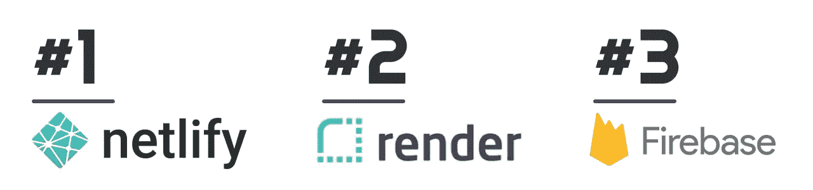

# 部署您的全栈 React 应用

> 原文：<https://javascript.plainenglish.io/options-for-deploying-full-stack-react-app-7078c4d12b71?source=collection_archive---------4----------------------->

编程最伟大的事情之一就是有大量的方法去做事情。通常没有对错之分。我会争辩说，做事情有更好和更坏的方法，但这是题外话。作为开发人员，我们从代码中创造出能够为人们的生活增加价值的东西的能力是首屈一指的！

# **所以。很多。选项**

对于开发人员提供的所有构建和部署选项，选择正确的选项会变得令人难以置信的困难。著名心理学家本·施瓦茨称这种现象为“选择麻痹”。他认为，更多的选择让我们不太可能采取行动，也不太满意我们最终的决定。

部署环境中有如此多的选项和服务，要缩小范围并做出适合您应用的平台、价位和可用性的明智选择可能相当困难。更糟糕的是，你可能会太沉迷于研究选项，以至于对项目失去了所有动力。

这可能是你现在的情况，或者你可能刚刚开始，需要一些指导。无论哪种方式，让我们让您继续前进，开始您的部署。在我们开始之前，还有一件事…你必须向我保证，一旦你读了这篇文章，你将选择一个平台并进行部署。成交？
成交！

## 继续前进

我将在下面分享一些关于如何部署 React 应用的有用指导，以及一些最流行的平台及其优缺点的比较。这不是一个详尽的列表，也不是一个深入的操作指南。但是我希望它能在您的开发过程中帮助您。

随着 FaaS 或“无服务器”的出现，应用服务器的使用已经大幅下降。如果你不确定有什么不同，让我来告诉你。应用服务器是为您的前端应用程序服务的服务器(在我们的例子中是 React ),充当中间件。中间件可以用于很多事情，但是我倾向于把它作为轻量级的后端代码，专门用于它所服务的前端。

由于无服务器和应用服务器的不同需求，我将为每种类型列出一个列表。

# 部署应用服务器

Ranking of platforms for deployment with an application server

1.  **Render**我的首选是 Render，这是新上市的 kid。他们是一家羽翼未丰的初创公司，在 Disrupt 赢得了 2019 年初创公司战场。他们提供了大量的工具，包括数据库、磁盘和虚拟主机，很少或没有供应商限制。他们对你所付费的资源也非常直接，而且非常容易使用。Render 只会和 GitHub 或者 GitLab 一起部署，但是它会自动连接到 repo，并且会在 push 上自动部署！在撰写本文时，应用服务器的价格从 7 美元开始。
2.  我的第二选择是 Heroku。我最不喜欢 Heroku 的一点是他们的服务器超级可疑，或者他们称之为 Dynos。没有人真正知道 dyno 是什么，但他们以伸缩性良好而闻名。在 Heroku 上，较大的应用程序会变慢，即使你支付了额外费用。
    与 Render 类似，您可以使用 Heroku 而不锁定供应商，并从 Github 自动部署，但不能使用 GitLab。Heroku 确实有一个免费版本，这对于原型开发或辅助项目来说很棒，但在编写本书时，他们的付费版本起价为 7 美元。
3.  **Back4App**
    我之所以把 Back4App 列在这个名单上，是因为它被广泛使用，我也听到了很多关于它的好消息。为了了解它是如何工作的，我创建了一个帐户，并开始部署我的一个项目。长话短说，我在部署之前就停止了。Back4 是一个令人惊讶的深度工具，能够处理整个企业堆栈。但是，如果您正在寻找一个简单易行的流程来部署您的应用程序，这不是您想要的。改为使用渲染:)

# 部署无服务器应用程序

Ranking of platforms for deployment with a serverless app

1.  **Netlify**
    对于无服务器或静态站点部署，我的首选是 Netlify。他们的免费层是可怕的！该平台拥有惊人的大量功能，并且都很容易使用——我不能说这个列表中的所有平台都是如此(Back4App)。例如，您可以将项目中的表单与 Netlify 的表单处理程序集成在一起，使您能够在提交表单时发送通知，并将它们存储在 Netlify 中以供将来查看。全部免费！您还可以将 Github、GitLab 和 BitBucket 与后续的自动部署连接起来。有大量的选择，简单又免费——我的首选！
2.  **渲染**第二名去渲染。它很容易使用，你可以连接 Github 或 GitLab 进行自动部署。他们是 Disrupt 的 2019 年创业战场，正在与 AWS 和 GCP 等巨头较量，以简化开发人员在部署和托管方面的体验。由于 Render 还可以托管服务器和数据库之类的东西，如果您使用 Expressjs API 或数据库进行扩展，那么它将是一个很好的托管场所。Render 中的大多数东西都是付费的，所以如果你想在你的整个全栈上花 0 美元，Firebase 可能是你的选择。
3.  **火基**
    火基相当不可思议。这是最后一次，因为就托管而言，如果你的应用程序被充分使用，你可能需要为此付费。在 Render 或 Netlify 上托管你的前端可以 100%免费，而 Firebase 可能会收费。如果传输或托管的数据超过特定限制，Firebase 将收费。这意味着如果你达到了这个限制，你可能会被收费或者你的应用被关闭。
    我真的很喜欢 Firebase！我在很多项目中使用 Firestore 和云功能，但我从未使用 Firebase 托管过，因为我认为还有更好的选择。我有一个生产应用程序，托管在渲染，但使用 Firebase 的数据库和后端。是我最喜欢的组合！

# 全栈考虑

由于您的 Fullstack 应用程序不仅仅是前端，因此在部署时需要考虑的事情很少。无论您使用应用服务器还是无服务器，对应用程序的需求都是一样的。您将需要某种 API 来连接到后端和数据库以存储您的数据。

我通常主张开发人员首先尝试托管后端。像 Firebase 的 firestore 或 AWS Amplify (DynamoDB)这样的数据库可以帮助您快速移动，并且必须管理更少的基础架构。考虑到这一点，下面是我对廉价快速部署堆栈的首选。

以下是我为您的全栈应用托管和部署的首选。

## 渲染主机和 Firebase 后端

**它的用途是什么:无服务器托管&托管后端**

我喜欢 Render 的主机和平台，这不是什么秘密。它从 AWS 或谷歌云等更大的竞争对手那里获得了所有伟大的功能，并将其简化，因此你不需要 MBA 学位和 7 天时间就能弄明白它们。使用 Firebase 的 Firestore 和 Cloud 功能作为后端为您提供了巨大的灵活性，并消除了管理数据库和 API 的复杂性。

使用 Firebase 确实会让你陷入困境，但如果你有一个设计良好的应用程序，使用像 RXJS 这样的流库转换到 MongoDB，不会太痛苦。

**我为什么喜欢它:**

*   100%前端托管
*   数据库和 API (Firestore 和云功能)的巨大自由层
*   为您管理后端
*   非常快速地开始

# 包裹

部署全栈应用有各种令人惊叹的选择。当我寻找一个平台来托管和部署时，我关注的是易用性和简单性。这就是为什么我在比较中没有包括像 Amplify 或 GCP 这样的工具。它们是不可思议的工具，但是它们有一个陡峭的学习曲线，需要你花大量的时间来学习它们。

我希望我的部署和托管快速简单。在构建和测试应用程序的所有工作完成之后，您应该做的最后一件事是学习如何在部署之前创建和管理 VM。虚拟机和企业工具有其存在的时间和地点，但通常我们只需要一种简单的方式将我们的想法和代码公之于众。

我希望这对你有所帮助！现在，前进并展开！

 [## 卢克弗罗格培养基

### 阅读卢克·弗罗格在媒介上的作品。我是一名企业家、软件开发商和创始人。每天，卢克·弗罗格…

medium.com](https://medium.com/@lukefrogger)