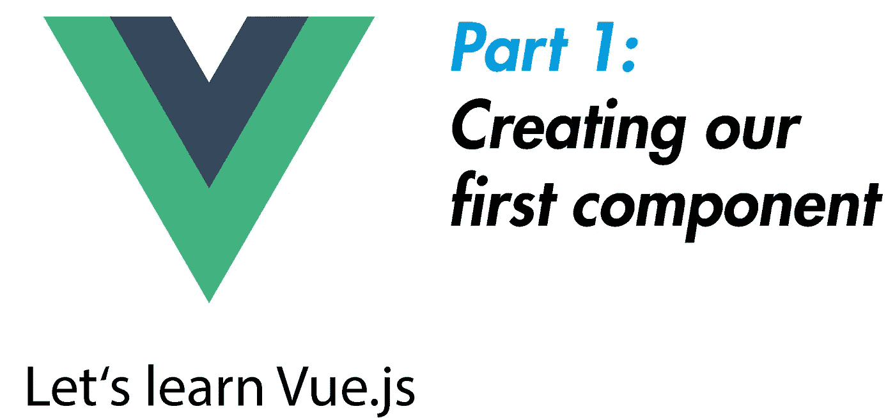

# 我们的第一个组件—让我们学习 Vue.js(第 1 部分)

> 原文：<https://javascript.plainenglish.io/our-first-component-lets-learn-vue-js-part-1-2803e2f0656e?source=collection_archive---------8----------------------->

## 这一系列的文章正在不断扩展，旨在帮助您开始使用 Vue.js。我们一点一点地涵盖每篇文章的每个重要主题。



## 所以你是想学习 Vue.js 还是想提升自己的知识？那么这个系列适合你！

这个系列是这样工作的:在每篇文章中，我们将涉及 Vue.js 的一个重要主题。要学习 Vue.js，你至少应该有 HTML 和 JavaScript 的基础知识。

你总是会在当前文章的末尾找到本系列的下一篇文章作为链接。所以你可以从头到尾点进去。如果你没有找到一篇新文章的链接，说明还没有新文章。如果你想确保不错过一个，那就跟我到 Medium 来。因此，我们今天从第一部分开始:**我们建立了我们的第一个小 Vue.js 应用程序&开发我们的第一个组件。**

# 让我们安装 Vue.js

也许你已经知道 Vue.js 很容易嵌入和使用在 HTML 中，你也可以通过官方的 **CLI** ，一个命令行界面让它运行。
不要担心，我们将两者都看一看，但是现在先不使用 **CLI** 开始。

我们所需要的只是官方的 JavaScript，因为最终 Vue.js，即使它是一个框架，也不过是大量现有的 JavaScript 代码，允许我们编写自己的代码。

您可以通过 CDN(内容交付网络)在 HTML 中嵌入正式版本，以经典的方式使用脚本标签，看起来像这样:(对于我们的示例，我将从该链接下载 Vue)

```
<script src=”https://cdn.jsdelivr.net/npm/vue/dist/vue.js"></script>
```

一开始我们采用 Vue.js 的所谓**开发版本**，它应该只用于开发应用程序。
因为如果你只是在浏览器中打开或下载脚本标签中的文件，你会注意到它并没有被最小化。
这意味着有很多不必要的空行&也是源代码，只是用来支持我们的开发。这使得该文件比我们稍后将使用的**生产版本**大得多。

现在我们已经有了一个实际的框架文件，我们将整个工作网站合并到一个 HTML 文件中。看起来像这样。
我建议把 Vue.js 放在头部区域。

```
<html lang=”en”>
<head>
<meta charset=”UTF-8" />
<script src=”https://cdn.jsdelivr.net/npm/vue/dist/vue.js">                               </script>
</head><body></body></html>
```

如果您现在在浏览器中打开该页面，还不会发生太多变化。实际上什么都没有，因为 Vue.js 现在可用，但我们不要对它做任何事情。

如果您现在在浏览器中打开该页面，还不会发生太多变化。实际上什么都没有，因为 Vue.js 现在可用，但我们不要对它做任何事情。
但是，如果您打开浏览器的控制台，终端中应该会出现以下内容:

> 您正在开发模式下运行 Vue。
> 部署生产时，确保打开生产模式。

这是 Vue.js 已经准备好的标志&因为我们希望它可以作为**开发版本**提供。

# 用它创造了我们的第一个组件？

要用 Vue.js 创建可见的东西，我们必须首先在 HTML 中创建我们的 Vue.js 实例可以引用的东西。我们可以很容易地为此创建一个

&给它一个 ID，这样我们就可以明确地寻址它。

为了在浏览器中获得更多关于 Vue.js 的信息，我们可以使用所谓的文本插值，它与 Mustache 语法(两个花括号)一起工作。
通常这不是一个工作源代码，但是 Vue.js 将能够检测到&使用它。
让我们在<分区>中输出一条消息。

```
<body>
  <div id=”app”>
    {{ message }}
  </div>
  <script src=”app.js”></script>
</body>
```

你可能已经注意到了，我们在它下面放了一个 app.js。
在这个文件中我们要写下我们所有的代码，也就是我们现在要做的。因此，创建您的 app.js 文件，将其嵌入到您的 HTML 中，然后我们开始:

```
const app = new Vue({
  el: ‘#app’,
  data: {
    message: ‘Hi there!’
  }
})
```

在 Vue.js 中，我们总是可以简单地将组件保存为变量。我们将第一个组件称为“ **app** ，并通过使用 **new** 关键字创建一个新的 Vue 实例来创建它。
现在我们在 Vue.js 中有了一个组件和 HTML 代码，但是我们仍然需要合并这两个部分。
我们通过使用“ **el** ”来实现这一点，它代表 JavaScript 部分中的“ **element** ”来引用 HTML 标记——使用通常的语法，其中“ **#** ”代表 HTML 标记的 ID。

因为我们已经在 HTML 代码中创建了 ID 为" **app** "的 div，所以我们现在简单地引用它。现在我们组件的两个重要部分 JavaScript 文件中的逻辑，以及 HTML 代码中的可视模板——链接在一起了。所以现在我们可以真正开始了。
我们做的第一件事是通过创建数据对象来使用 Vue 的数据绑定。这是由 Vue.js 预定义的&可用于将数据从我们的组件逻辑传递到我们的 HTML，网站的可见部分。

因为我们已经使用 mustache 语法在我们的网站上预期了一个“**消息**”，所以我们也在我们的数据对象中创建了“**消息**”。在这里我们现在可以简单地保存字符串"**你好！**”或任何数字，然后直接输出到网页上。

## 如果你现在在浏览器中打开 index.html，你应该会看到一个简单的“你好！”。很好，对吧？

最后，我们将消息变量的值从“你好！”任何像 10 这样的数字。
这个应该是这样的&浏览器中的结果这次只是简单的“10”。

```
const app = new Vue({
  el: ‘#app’,
  data: {
    message: 10
  }
})
```

好消息是，多亏了 Vue.js，我们甚至可以在 HTML 中更改数据。
让我们将 div 改为:

```
<div id=”app”>
  {{ message * 2}}
</div>
```

如果我们现在在浏览器中重新加载页面，一个“20”等待着我们。为什么？仅仅是因为在 JavaScript 中，我们将值“10”乘以了 2。
这个运算的逻辑结果当然是“20”。我们可以直接在模板中这样做，这很酷，不是吗？
相信我，这只是开始。在下一部分中，我们将看看如何处理输入&我们还可以用模板做些什么。

## 下面是第二部分:

[](https://medium.com/javascript-in-plain-english/why-vue-js-lets-learn-vue-js-part-2-a53f1db62a81) [## 为什么是 Vue.js？—让我们学习 Vue.js(第二部分)

### 让我们学习 Vue.js 系列的第二部分——这次的主题是:“为什么是 Vue.js？”—这里有几个很好的理由让你采取…

medium.com](https://medium.com/javascript-in-plain-english/why-vue-js-lets-learn-vue-js-part-2-a53f1db62a81) 

## 关于 Vue.js 的更多资源:

*   官方[文档](https://vuejs.org/)
*   Udemy，尤其是[马克西米利安·施瓦兹米勒](https://www.udemy.com/user/maximilian-schwarzmuller/)的课程
*   最受好评的[书籍之一](https://amzn.to/2HqFHYN)
*   有用的[备忘单](https://devhints.io/vue)