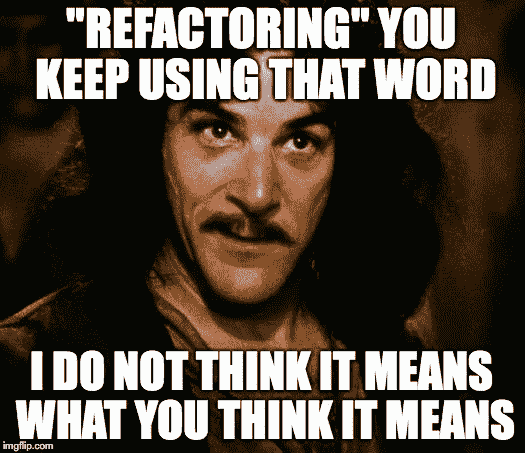

# 开源系列:开始一个项目

> 原文：<https://javascript.plainenglish.io/owning-an-open-source-project-part-2-2b55810aeb8?source=collection_archive---------6----------------------->

## 或者如何向世界开放你的项目

在我的 [*个人博客*](https://www.justjeb.com/blog) *上可以免费获得这篇文章和其他文章。请务必注册以获得最新最棒的！*

大家好，欢迎来到“开源”之旅的第二部分。
对于那些没有阅读过[第一部分](https://medium.com/@justjeb/owning-an-open-source-part-1-b63abc60236)或想知道接下来部分计划内容的人:

# 目录

*   [简介](https://medium.com/@justjeb/owning-an-open-source-part-1-b63abc60236)
*   **开始一个项目**
*   [文档](https://medium.com/@justjeb/open-source-series-documentation-96ed1420ce81)
*   [宣传](https://medium.com/@justjeb/open-source-series-publicity-8b3be7d65c17)
*   [问题和 PRs](https://medium.com/@justjeb/open-source-series-issues-and-prs-8cb1de880fd4)
*   [自动化](https://medium.com/@justjeb/open-source-series-automation-fe826e365b54)
*   [版本管理](https://justjeb.medium.com/open-source-series-version-management-dc91424aa63d)

# 概述

在前一部分中，我们已经讨论了什么是开源，以及为什么有人会为此而烦恼。在这一部分，我们将变得更加实际，我们将讨论如何真正开始一个开源项目。

所以你在场景#1 中，你有一个特定问题的解决方案，你渴望与世界分享它。我们再强调一遍:

1.  这与你的自负无关
2.  你不希望从中受益
3.  你真的想帮助别人解决同样的问题

如果你对所有这些问题的回答都是肯定的，那么这里有一个快速的清单，以确保你做的事情是正确的:

1.  确保开源是正确的格式。如果你想与世界分享的是一件小事，那么一篇小博文就足够了。
2.  仔细检查是否已经不存在类似的项目。也许你的解决方案是一个已建立的开源项目的完美公关。

# 为即将到来的事情做好准备

正如我提到的，拥有一个开源项目有很多困难。

一个突出的困难是它需要你大量的时间。你为开源所做的一切都需要时间，无论是写代码、管理问题、更新依赖、与人交谈、回答问题等等。你在开源上投入的每一分钟都是你本可以拥有但却没有投入到你的家庭、你的爱好、你的健康等等的一分钟。

你唯一能做的就是授权。当(或者我应该说“如果”)你有足够多的合作者时，你可以将你的部分职责外包给你信任的人。

# 代码分离

所以我们开始吧，你有一个解决你的具体问题的方法，你认为其他人可以从中受益。它仍然集成在您的代码库中，您可能不想让整个代码库成为开源的(除非您这样做)。

首先，您必须将这些代码与您的代码库的其余部分分离开来。

## 从重构开始

…这将最终导致所有将要打开的代码驻留在一个单独的目录中。

## 使其通用

确保新目录中的代码是通用的，并且不局限于您的特定问题，如果需要，创建一个抽象层。

例如，我带着一个非常具体的需求(来自我的另一个开源项目中的[)开始了](https://github.com/just-jeb/electron-angular-native) [angular-builders](https://github.com/just-jeb/angular-builders) ，为 Angular build 添加本地模块的定制加载器。我本可以创建*本地模块构建器*来专门服务于这个目的。然而，我意识到，以相对较低的成本，我可以创建一个更通用的解决方案来解决类似的(但不是相同的！)问题。

这就是 [custom-webpack](https://github.com/just-jeb/angular-builders/tree/master/packages/custom-webpack) builder 的诞生。

## 保持简单

仿制药很好，但是要小心不要对此太兴奋。

过早优化和过泛化是软件工程中两个众所周知的问题。你应该找到这个甜蜜点，在这里你的解决方案解决了你的问题之外的问题，但不是世界上所有的问题。

如果你建立一个量表，其中你特定问题的解决方案是 1，所有世界问题的解决方案是 100，那么你应该从 2 开始。

你的通用代码应该比你的特定代码能解决更多的问题。

## [吃自己的狗粮](https://en.wikipedia.org/wiki/Eating_your_own_dog_food)

在你的代码库中，每一步都要使用这种通用代码——这样做可以确保去掉不必要的部分，只留下需要的部分。它还可以确保您将要打开的代码正常工作。

请记住，你是你的开源项目的第一个用户。

## 不要被起诉

如果您从公司代码库中提取代码，请咨询您的上级，如果需要，还可以咨询法律部门。确保他们支持你的计划，并且你要打开的代码不受你公司知识产权的约束。这也将帮助你决定哪个[开源许可](https://opensource.org/licenses)更适合你的项目。

当一切都正常工作，代码被分离并且足够通用时，您就拥有了所有的批准(如果需要的话)——是时候向世界开放它了。

# 向世界开放这个项目

一旦你的开源代码被分离和一般化，是时候把它从你的代码库中完全分离出来了。

## 公开经营

首先，你必须开放你的项目的源代码(说到底是什么使它成为一个开源项目！).
在线托管源代码有[种不同的选择](https://stackify.com/source-code-repository-hosts/)，但我们会选择默认的——Github。

1.  [在 Github 上创建新的回购](https://help.github.com/en/github/getting-started-with-github/create-a-repo)
2.  克隆存储库
3.  从您之前创建的目录中移动源代码(暂时不要删除目录)。
4.  提交和推送——瞧，它现在是一个开源项目。

*或者是？*

## 创建包

您的项目是公开可用的，但是没有人在使用它(包括您，因为您在更大的代码库中使用了该代码的副本)，并且没有人知道它的存在。

此外，你的项目在网上公开可用的唯一格式是*源代码*，使用它的唯一方式是将代码复制粘贴到你的代码库中。不是很方便的方式，你不觉得吗？

为了正确分发您的项目，您必须:

1.  从源代码中创建一个包
2.  让这个包在一个公共包注册中心可用(取决于您的生态系统，例如，对于 Java，它可能是 [Maven Central Repository](https://search.maven.org/) ，对于 JavaScript，它可能是 [Npm 包注册中心](https://www.npmjs.com/)等等。)

这是当你添加一个构建链到你新的闪亮的存储库，定义项目名称等等。

我不打算分解整个过程，因为它非常依赖于您的生态系统、工具集和您使用的语言。

你可能是一个全能的人，对他来说定义一个新项目，添加一个构建链并发布包是小菜一碟。如果是这样的话，那对你有好处！

你也可能是一个习惯于只写代码的人，但从来没有面对过所有这些定义、配置、工件之类的东西。对你来说这可能是一个全新的世界。好了，该学习了。不会很快，我向你保证。

## 无论如何

当你完成填充你头脑中所有缺失的拼图时，你已经了解了关于相关包注册表的一切，你的包实际上已经发布了，*然后是* *，只有到那时*你才能真正考虑你的项目开源。

*在这一点上，你实际上可以告诉人们:“嘿，我已经有了一个解决你的问题的方案，只需将这个包添加到你的项目中并使用它！”*

## 健全性检查

在你的项目像病毒一样传播之前，你最好确保它是可行的。

对您的包进行健全性检查实际上是从您的大型代码库中删除通用目录，并使用公开可用的包来代替。
毕竟，*你是你的开源项目*的第一个用户。

## 进一步发展

当你开始在你的代码库中使用这个包时，开发流程可能会改变:以前，现在开放源代码已经是你的代码库的一部分；您可以立即使用这些更改，但现在它就像代码中使用的任何其他第三方包一样，是一个外部包。

因此，当你在你闪亮的新开源项目中开发一个新特性时，你必须首先发布它，以便能够在你更大的代码库中使用它。但是，如果你不确定它是否有效，你就不能发布它，因为一旦发布，它可能会影响其他用户。

因此，为了避免发布不完整的版本，您可以做以下几件事:

1.  用测试覆盖你的代码，包括单元测试和端到端测试。我想我没有必要让你相信考试有多重要。
2.  将这个包的新版本打包并安装到您更大的代码库中。一旦证实一切正常，你就可以发布了。
3.  发布一个测试版，只对那些明确想要的人开放，而不是对全世界开放。
    *例如，在 npm 包注册表中有* [*dist 标签*](https://docs.npmjs.com/cli/dist-tag) *可用于此目的。
    默认标签是* `*latest*` *，当你运行* `*npm install mypackage*` *时，它有效地运行* `*npm install mypackage@latest*` *。当你在另一个标签下发布一个新版本时，例如* `*beta*` *，你将不得不从这个标签显式地安装以获得最新的版本:* `*npm install mypackage@beta*` *。*

# 包装它

不像前一部分完全是理论性的，这一部分实际上需要你做一些工作。根据你的经验和学习能力，你可能需要几天甚至几周的时间来完成这个强制性的步骤。我们甚至还没有开始。这就是为什么我有责任再问你一次:

> 你真的准备好为社区贡献大量宝贵的时间了吗？

感谢您的阅读，如果您不想错过我们将要谈论的下一部分 [**文档**](https://medium.com/@justjeb/open-source-series-documentation-96ed1420ce81) ，请确保您在这里或在 [Twitter](https://twitter.com/_Just_JeB_) 上关注我。