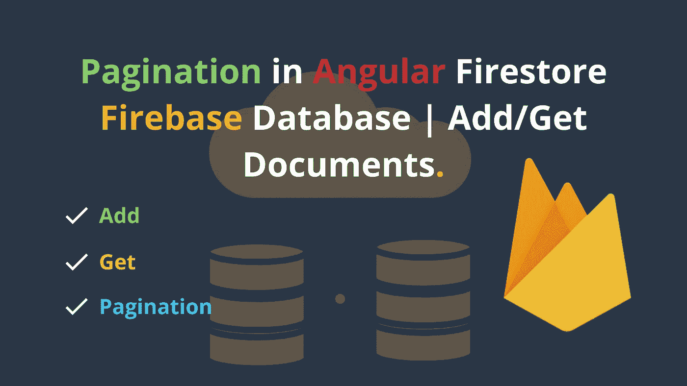

# Angular Firestore Firebase 数据库中的分页|添加/获取文档|在项目中集成 Angular Firestore

> 原文：<https://javascript.plainenglish.io/pagination-in-angular-firestore-firebase-database-add-get-documents-14ca723e9c24?source=collection_archive---------2----------------------->

FireStore 是谷歌的 Firebase 服务，提供基于 NoSQL 云的数据库解决方案。



## 本文将涵盖:

1.  创建新的角度项目。
2.  在项目中集成 Angular Firestore。
3.  将项目对象添加到数据库。
4.  使用 limit 从数据库分块加载数据。
5.  分页从数据库加载更多的数据。

让我们开始吧…

# 1.创建一个新的角度项目(点击这里↓)

如果您已经有一个项目，请跳过这一步。或者[点击这里](https://medium.com/codechintan/create-a-single-page-website-using-angular-firebase-hosting-8ba22b8176a1) ↓新建一个角度项目。

[](https://medium.com/codechintan/create-a-single-page-website-using-angular-firebase-hosting-8ba22b8176a1) [## 使用 Angular & Firebase 托管创建一个单页网站。

### 创建一个新的有一个网页的网站和 Firebase 托管服务器的角度项目。

medium.com](https://medium.com/codechintan/create-a-single-page-website-using-angular-firebase-hosting-8ba22b8176a1) 

希望你已经有一个角度的项目，或者你已经通过下面的[链接](https://medium.com/@AnkitMaheshwariIn/create-a-single-page-website-using-angular-firebase-hosting-8ba22b8176a1)创建了一个新项目。

# 2.在项目中集成 Angular Firestore。

为了在项目中使用 Firebase 服务，我们将安装 Firebase 的官方库。
运行以下 NPM 命令进行安装:

```
npm install firebase @angular/fire — save
```

打开 **app.module.ts** 文件，添加以下代码:

```
import { AngularFireModule } from '@angular/fire';
import { AngularFirestore } from '@angular/fire/firestore';
import { environment } from '../environments/environment';...imports: [
   BrowserModule,
   AngularFireModule.initializeApp(environment.firebase),
   ...
],
providers: [
   AngularFirestore
]
```

打开"**~ environments/environment . ts**"文件，用下面的代码更新它:
(用您的代码替换下面的↓ firebase 配置-要知道从哪里获得这些 firebase 配置细节，[请单击此处](https://medium.com/@AnkitMaheshwariIn/steps-to-setup-firebase-firestore-instruction-to-setup-firebase-firestore-database-c7cc49ce96de))

```
export const environment = {
  production: false,
  firebase: {
    apiKey: "XXXXXXXXXXXXXXXXXXXXXXX",
    authDomain: "XXXXXXXX.firebaseapp.com",
    databaseURL: "[https://](https://just-freaking.firebaseio.com)XXXXXXXX[.firebaseio.com](https://just-freaking.firebaseio.com)",
    projectId: "XXXXXXXXXXXXXXXXXXXXXXX",
    storageBucket: "XXXXXXXX.appspot.com",
    messagingSenderId: "XXXXXXXXXXXXXXXXXXXXXXX",
    appId: "XXXXXXXXXXXXXXXXXXXXXXX"
  }
};
```

# 3.将项目对象添加到数据库

现在要向数据库添加新的项目，我们需要在组件文件中导入 AngularFirestore。

打开 app.component.ts 文件或以下任何其他组件导入:

```
import { **AngularFirestore** } from '@angular/fire/firestore';
```

还将其添加到组件的类构造函数中，如下所示:

```
constructor(**private angularFirestore: AngularFirestore**)
```

## FireStore 中的数据是如何存储的？

FireStore 是一个 NoSQL 云数据库，数据以集合和文档的形式存储在其中。每个集合就像一个表，就像我们在关系数据库管理系统(RDMS)中一样，并且在每个集合中有*文档*就像表行一样。

例如，我们将创建一个集合" **People** "，该集合将包含每个文档的键值对，分别为 **Id** 、**名称**、**地点**、**时间戳**

## *如何在集合中添加新文档？

开始之前，在 app.component.ts 文件或任何其他组件中声明几个变量，如下所示:

要在集合中添加新的文档或项目，我们创建一个 **add** 方法，如下所示:

# 4.使用 limit 从数据库分块加载数据。

## *如何从集合中获取文档？

最初从集合中获取前 5 个文档记录/项目。

# 5.分页从数据库加载更多的数据。

## *如何从集合中获取下一组文档？

添加内部使用的函数-这些函数将在 newt 和上一页数据加载中使用。

这段代码将在单击“下一步”按钮时生效，就像加载接下来的 5 个文档一样。

## *如何从集合中获取前一组文档？

这段代码将在点击“上一步”按钮时生效，就像加载前 5 个文档一样。

# 搞定了。🤩在 Angular Firestore Firebase 数据库中添加分页就是这么简单。

再见👋👋

> 欢迎在评论框中发表评论…如果我错过了什么，或者有什么是不正确的，或者有什么对你不起作用:)
> 继续关注更多文章。
> 
> 更多文章敬请关注:
> 【https://medium.com/@AnkitMaheshwariIn 

如果你不介意给它一些掌声👏 👏既然有帮助，我会非常感谢:)帮助别人找到这篇文章，所以它可以帮助他们！

永远鼓掌…


# 了解更多信息

*更多内容尽在*[*plain English . io*](http://plainenglish.io/)