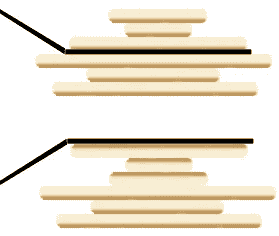

# JavaScript 中的煎饼排序

> 原文：<https://javascript.plainenglish.io/pancake-sorting-in-javascript-ecc1486e7e33?source=collection_archive---------4----------------------->

## 你可能想知道，煎饼排序是什么？🧐

[**煎饼分拣**](https://en.wikipedia.org/wiki/Pancake_sorting) **，**顾名思义，类似于用锅铲分拣盘子里的煎饼，在这里你只能用锅铲翻动盘子里一些最上面的煎饼。如图所示，抹刀正在翻转最上面的三个煎饼，结果如下所示。与传统的排序算法不同，传统的排序算法以尽可能少的比较进行排序，目标是以尽可能少的反转对序列进行排序。



Demonstration of pancake sorting

Visualization of Pancake sorting

对于排序一个未排序的数组，类似于选择排序，我们一个接一个地将最大元素放在最后，并将当前数组的大小减少一。

如何在 JavaScript 中实现煎饼排序？让我们来看一个例子(这个例子出自[**Pramp.com**](https://www.pramp.com/#/))。

# 煎饼排序

给定一个整数数组`arr`:

1.  编写一个函数`flip(arr, k)`，它反转数组`arr`中第一个`k`元素的顺序。
2.  写一个函数`pancakeSort(arr)`，排序并返回输入数组。您只允许使用您在第一步中编写的函数`flip`来修改数组。

**示例:**

```
input:  arr = [1, 5, 4, 3, 2]
output: [1, 2, 3, 4, 5]   *# to clarify, this is pancakeSort's output*
```

分析解决方案的时间和空间复杂性。

**约束:**

*   【时限】5000ms
*   [输入] array.integer `arr`
*   【输入】整数`k`
*   0 ≤ k
*   [输出] array.integer

第一部分，flip()是 pancakeSort()中的辅助函数。像任何其他排序算法一样，该算法的关键部分是通过迭代逐步对数组进行排序。我们设计了一种算法，将最大元素发送到数组的最后一个位置，并以此作为迭代步骤。为了找到最大元素索引，我们实现了另一个辅助函数 findMaxIndex()。

**翻转()**

给定一个数组和一个整数 k，我们翻转第一个 k 元素，这将是从 0 到 k 的元素，并颠倒顺序。

[https://gist.github.com/GAierken/68f8cd27b8fc2ae3b15af9ba70d11191](https://gist.github.com/GAierken/68f8cd27b8fc2ae3b15af9ba70d11191)

**findMaxIndex()**

为了找到 max 元素的位置，我们用最小值声明一个 max 变量，索引从 0 开始。我们遍历 arr，返回最大索引。

**pancakeSort()**

从等于 arr.length 的当前大小开始，当当前大小大于 1 时，将当前大小减 1。设当前大小为“I”。对每个“我”做以下事情。

1.  查找 arr[0]中最大元素的索引..i-1]。设索引为' maxIndex '
2.  呼叫翻转(arr，maxIndex)
3.  呼叫翻转(arr，i-1)

[https://gist.github.com/GAierken/2d787ac6952053ca943dff75eeb89530](https://gist.github.com/GAierken/2d787ac6952053ca943dff75eeb89530)

**最终解决方案**将如下所示。

[https://gist.github.com/GAierken/a9f34b1006a6205151621e35a84cf45c](https://gist.github.com/GAierken/a9f34b1006a6205151621e35a84cf45c)

整体时间复杂度为 **O(n )** 。

这是操场的链接。希望这有所帮助。

*参考文献:*

[](https://en.wikipedia.org/wiki/Pancake_sorting) [## 煎饼分类

### 煎饼排序是对一堆杂乱的煎饼进行排序的数学问题的通俗说法

en.wikipedia.org](https://en.wikipedia.org/wiki/Pancake_sorting) [](https://www.geeksforgeeks.org/pancake-sorting/) [## 煎饼分类- GeeksforGeeks

### 给定一个未排序的数组，对给定的数组进行排序。您只能对数组执行以下操作。翻转(arr，i)…

www.geeksforgeeks.org](https://www.geeksforgeeks.org/pancake-sorting/)