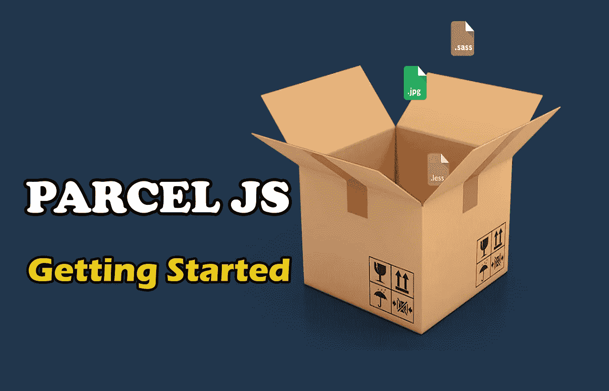
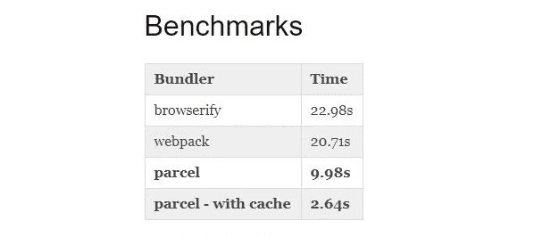
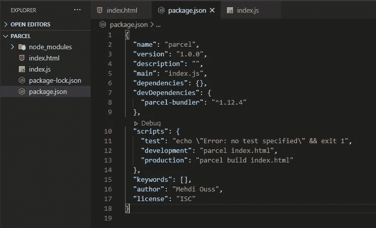
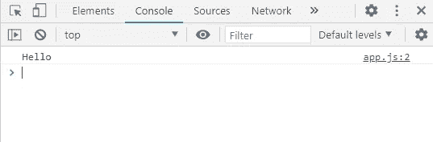

# 包裹——零配置网络包替代方案

> 原文：<https://javascript.plainenglish.io/parcel-the-zero-configuration-webpack-alternative-1bcd6704ab9f?source=collection_archive---------7----------------------->

## 为您的项目开始使用超级简单的 JavaScript Bundler



Image Created with❤️️ By Mehdi Aoussiad.

# 介绍

许多 web 开发人员在他们的 web 应用程序中使用一些打包程序，如 Parcel 或 Webpack。在构建 web 应用程序时，这些捆绑器能够执行更多的任务。bundler 可以帮助您将 web 应用程序的资产打包成包，从而使您的文件易于管理和部署。

在本文中，我们将探索包裹 web 应用程序 bundler。

# 包裹是什么？

Parcel 是一个 web 应用程序捆绑器，它是所有代码的编译器，与语言无关。packet-bundler 获取您所有的文件和依赖项，将它们合并成一个较小的输出文件集，可以用来运行您的代码。它利用多核处理提供极快的性能，并且不需要任何配置。这个包为你的开发过程做了很多工作，比如缩小你的文件，这样它们的大小就会减小，从而使你的应用程序更快更容易部署。它还用于编译 Sass 文件和支持 JavaScript ES6 特性，以便浏览器能够理解该语法。如果你想了解更多，可以看看他们的 [GitHub 库](https://github.com/parcel-bundler/parcel)。



Some Benchmarks.

# 装置

您可以使用 NPM 或纱线安装包裹。您也可以在本地计算机上全局安装它。请确保您的计算机上安装了 NPM 或纱。看看下面关于如何全局安装包的例子。

NPM:

```
npm install -g parcel-bundler
```

纱线:

```
yarn global add parcel-bundler
```

您也可以将包作为开发依赖项进行安装。您只需要创建一个新文件夹，然后使用命令行界面在该文件夹中使用命令`**npm init -y**`。这将在您的项目目录中创建一个`**package.json**`文件。让我们在 VScode 中打开包文件。


The Package.json file.

在 VScode 终端中使用以下命令会将 parcel 作为开发依赖项进行安装:

```
**npm i -D parcel-bundler**
```

现在，如果你看一下文件`**package.json**`，你会意识到这个包已经被添加到你的开发依赖中。

# 开始使用包裹

要开始使用 parcel，您需要在项目文件夹中创建一个`**index.html**`文件和一个`**index.js**`文件，然后使用 HTML 文件中的脚本标签将它们链接在一起。之后，您还需要在您的`**package.json**`中添加一个开发和生产脚本。下面的例子向您展示了如何做到这一点。

```
"scripts": {"test": "echo \"Error: no test specified\" && exit 1","development": "parcel index.html","production": "parcel build index.html"}
```



The Package.json file.

现在，您可以开始使用没有任何配置的包裹。

# 将 ES6 模块用于包裹

package 使您能够在脚本中使用 ES6 模块。因此，浏览器可以理解模块的语法。为了向您展示如何在 parcel 中使用模块，我们将创建另一个 JavaScript 文件`**app.js**` ，然后我们将代码从该文件导入到`**index.js**` 文件中。

我们`**app.js**`文件的内容:

```
const sayHello = ()=>{console.log("Hello");}export { sayHello };
```

我们的`**index.js**` 文件内容:

```
import { sayHello } from "./app";sayHello();
```

注意，我们在 HTML 中只链接了`**index.js**`文件。

```
<script src="index.js" defer="true"></script>
```

如果您还记得上面的内容，我们已经在`**package.json**`文件中创建了两个脚本。要开始使用模块并让浏览器理解它们，我们只需要在命令行或 VScode 终端中运行开发脚本。看看下面的例子:

```
**npm run developemnt**
```

请注意，另一个名为“dist”的文件夹已经添加到我们的项目中。那个文件夹包含我们文件的版本。

使用 NPM 在终端中运行该脚本后，让我们在浏览器中打开我们的`**index.html**` 并检查我们的控制台。



The browser console.

如您所见，浏览器理解我们的模块语法，我们在控制台中打印了“hello ”,而没有使用 babel。

# 用包裹缩小我们的文件

如果你还记得，我们还在我们的`**package.json**` 中创建了一个制作脚本。在我们的终端中运行这个脚本将为生产构建和缩小我们的文件。下面的命令会做到这一点。

```
**npm run production**
```

这有利于部署，因为这将减小整个应用程序的大小。如果你检查“dist”文件夹，你会发现所有的文件都被缩小了。这将有助于减小文件的大小。包裹可以做更多的任务，如编译 Sass 文件等。也可以和框架一起使用(React-Vue……)。

# 结论

package 解决了 Webpack 等捆扎机配置复杂的问题。有了 Parcel，不需要任何配置，又快又好用。感谢您阅读本文，希望您觉得有用。

喜欢这篇文章吗？如果有，通过 [**订阅获取更多类似内容解码，我们的 YouTube 频道**](https://www.youtube.com/channel/UCtipWUghju290NWcn8jhyAw) **！**