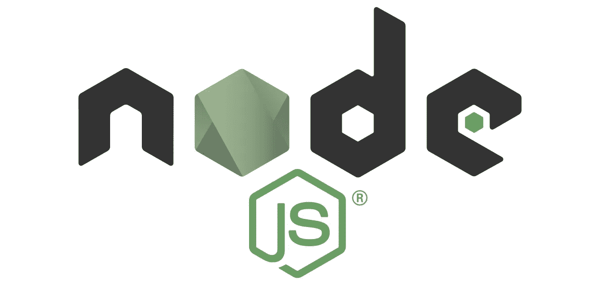

# 在 Node.js 中以 3 种不同的方式解析 post 数据，无需第三方库

> 原文：<https://javascript.plainenglish.io/parsing-post-data-3-different-ways-in-node-js-e39d9d11ba8?source=collection_archive---------1----------------------->



## application/json、application/x-www-form-urlencoded 和 multipart/form-data

好吧，老实说，这并不容易，因为我到处都可以找到第三方库的解决方案或者只是部分理论信息，正如你可能已经知道的，我正在从头开始学习 Node.js 和 web 技术，以了解幕后发生的事情。

完整的源代码在这篇文章的末尾，所以如果你知道你在做什么，你可以直接进入，如果你也在学习，享受阅读。

这个项目利用了我在以前的帖子中分享的知识，所以我不会在这里讨论这些主题:

*   [如何从头编码 Node.js 响应](https://medium.com/@ObjSal/how-to-encode-node-js-response-from-scratch-ce520018d6)
*   [我要开始玩 Node.js 了](https://medium.com/@ObjSal/im-going-to-start-playing-with-node-js-ad1aa7f2ebbb)

# 1.application/x-www-form-urlencoded

html [表单](https://developer.mozilla.org/en-US/docs/Web/HTML/Element/form)的默认 [enctyp](https://developer.mozilla.org/en-US/docs/Web/API/HTMLFormElement/enctype) 是`application/x-www-form-urlencoded`，它发送的数据格式与你访问网站时在 URL 上看到的格式相同，例如:`name1=value2&name2-value2`，发布文件时编码类型变为`multipart/form-data`，我们将在后面的故事中展示如何解析这类请求。

下面的 HTML 片段创建了一个将请求编码为`application/x-www-form-urlencoded`的表单，

```
<form method="post">  
  <input id="username1" type="text" name="username">
  <input id="password1" type="password" name="password">
  <input type="submit">
</form>
```

上面的表单使用 POST 方法发送数据，您也可以将这种数据作为 GET 请求发送，但是我更愿意解析请求正文中的数据，而不是 URL。

在表单标签中有 3 种不同的输入类型，文本、密码和提交。

*   `text`:用于捕捉文本。
*   `password`:与文本相同，但明显隐藏文本，并为每个键入的字符加上“”。
*   `submit`:创建触发 post 请求的按钮。

输入中的`id`对于使用 CSS 进行样式化或者在通过 JavaScript 访问字段时很容易找到它们很有用。

`name`是真正**重要的**，如果不包含名称，它就不会将数据发送到服务器，名称是用来标识从服务器端传入的数据。

因为这个表单在第一个`<form>`标签中没有包含`action`参数，所以它将请求发送到浏览器中加载的同一个 URL。

现在，我们如何从 Node.js 中读取和解析这种数据呢？

为了读取数据，我添加了对`data`和`end`发射事件的回调，如下所示:

```
const querystring = require('querystring')let rawData = ''
request.on('data', chunk => {
  rawData += chunk
})request.on('end', () => {
  let parsedData = querystring.decode(rawData)
  ...
}
```

在注册回调之前，我声明并初始化了一个名为`rawData`的字符串，以便按顺序追加所有传入的数据，每次有数据可供服务器读取时将调用`data`事件，当没有更多传入的数据时将调用`end`事件。我使用`end`事件解析完整的捕获数据，并将响应发送给服务器。

解析`application/x-www-form-urlencoded`是一个一行的！Node.js 为这种类型的解析提供了一个名为`querystring`的内置库。

# 2.应用程序/json

解析 JSON POST 请求也是一个单独的程序，繁琐的部分来自 HTML 的观点，因为我们必须破解表单以防止它的默认行为，手动从表单中读取数据，手动创建 JSON 并创建请求。

```
<form action="javascript:" onsubmit="onFormSubmit(this)">
  <input id="username2" type="text">
  <input id="password2" type="password">
  <input type="submit">
</form>
```

在上面的 HTML 表单中，我们使用`action`来告诉表单它将触发一个 javascript 方法，而不是默认行为，我们使用`onsubmit`来指定当用户按下提交按钮时调用哪个 JavaScript 方法，我们将`this`作为参数发送给函数，以便我们能够从表单中读取信息。

为了简单起见，我在同一个 HTML 站点中创建了`onFormSubmit(form)`方法，如下所示:

```
<head>
...
  <script>
    'use strict'
    function onFormSubmit(form) {
      const username = form["username2"].value
      const password = form["password2"].value
      let body = JSON.stringify({
        username: username,
        password: password
      });
      (async () => {
        try {
          const response = await fetch('/', {
            headers: {
              'content-type': 'application/json'
            },
            method: 'POST',
            body: body
          })
          const text = await response.text()
          if (response.status !== 200) {
            if (text && text.length > 0) {
              console.error(text)
            } else {
              console.error('There was an error')
            }
            return
          }
          document.body.innerHTML = text
        } catch (e) {
          console.error(e.message)
        }
      })()
    }
  </script>
</head>
```

首先，我们使用表单中给定的`id`从用户名和密码中读取值。

然后，我们使用`JSON.stringify()`创建 JSON 字符串响应。

然后我创建一个 POST fetch 请求，指定数据为`application/json`，JSON 数据为`body`。

接下来的几行读取服务器响应，使用`document.body.innerHTML = text`行，我们用返回给浏览器的数据替换站点的当前内容，以获得与上面`application/x-www-form-urlencoded`类似的行为。

在服务器端，我使用相同的`data`和`end` emit 方法读取数据，然后用`JSON.parse(rawData)`解析数据。

# 3.多部分/表单数据

这是最棘手的一个，这不是一个接近一行；如果真的这么复杂，为什么还要麻烦呢？简单的答案是在单个请求中传输带有表单数据的文件。

有不同的方法来解析这些数据，但在本例中，我将所有数据加载到内存中，然后将给定的文件存储到服务器中，当然，与前面的示例一样，也将请求数据作为响应数据返回，我从响应中删除了二进制文件，因为我在网站上显示数据，加载二进制文件需要很长时间。HTML 表单比`application/json`简单，它基本上和`application/x-www-form-urlencoded`一样，但是编码不同(enctype)

```
<form method="post" enctype="multipart/form-data">
  <input id="username3" type="text" name="username">
  <input id="password3" type="password" name="password">
  <input id="picture3" type="file" name="picture">
  <input type="submit">
</form>
```

与`x-www-form-urlencoded`不同的是，我们没有显式地将 enctype 赋给`multipart/form-data`，而是在 mix 中添加了一个名为 picture 的`file`输入类型。

我使用与前面方法相同的`data`和`end`发出事件回调，但是这一次，在我们注册回调之前，我们将请求编码更改为`latin1`，以便它正确读取二进制数据。

```
if (request.headers['content-type'] === 'multipart/form-data') {
  // Use latin1 encoding to parse binary files correctly
  request.setEncoding('latin1')
}
```

`multipart/form-data`发送的数据由浏览器发送的 content-type 头中指定的边界分割成多个部分，例如:

```
------WebKitFormBoundaryxJi9AgGdxx83BunR
Content-Disposition: form-data; name="username"sal
------WebKitFormBoundaryxJi9AgGdxx83BunR
Content-Disposition: form-data; name="password"pass
------WebKitFormBoundaryxJi9AgGdxx83BunR
Content-Disposition: form-data; name="picture"; filename="Chromium_11_Logo.svg"
Content-Type: image/svg+xml<?xml version="1.0" encoding="UTF-8" standalone="no"?>
<!-- Created with Inkscape ([http://www.inkscape.org/](http://www.inkscape.org/)) --><svg>
...
</svg>------WebKitFormBoundaryxJi9AgGdxx83BunR--
```

上例中的边界是`------WebKitFormBoundaryxJi9AgGdxx83BunR`，我创建了一个助手函数来从请求头中提取边界，如下所示:

```
function getBoundary(request) {
  let contentType = request.headers['content-type']
  const contentTypeArray = contentType.split(';').map(item => item.trim())
  const boundaryPrefix = 'boundary='
  let boundary = contentTypeArray.find(item => item.startsWith(boundaryPrefix))
  if (!boundary) return null
  boundary = boundary.slice(boundaryPrefix.length)
  if (boundary) boundary = boundary.trim()
  return boundary
}
```

在上面的方法中，我从`content-type`头中读取信息，然后通过`;`将其拆分，然后从 content-type 中的每个条目中读取`trim`空格，然后通过检查`boundary=`作为前缀在数组上运行`find()`方法来获得边界，然后返回前缀后的字符串。

现在我们知道了如何获得边界，我们将使用它来分割请求 post 主体，如下所示:

```
const boundary = getBoundary(request)
let result = {}
const rawDataArray = rawData.split(boundary)
for (let item of rawDataArray) {
  ...
}
```

在 for 循环中，我首先检查的是名字:

```
// Use non-matching groups to exclude part of the result
let name = getMatching(item, /(?:name=")(.+?)(?:")/)
if (!name || !(name = name.trim())) continue
```

我使用非匹配组正则表达式搜索来排除匹配字符串的一部分，以便它只返回我要获取的数据，即与`(.+?)`匹配的名称，如果没有找到名称，则继续下一项。

接下来，我用一个有点复杂的正则表达式搜索获得给定命名输入的值，也使用了不匹配的组:

```
let value = getMatching(item, /(?:\r\n\r\n)([\S\s]*)(?:\r\n--$)/)
if (!value) continue
```

上面匹配所有字符，包括空格、换行符和制表符，值与`([\S\s]*)`匹配，如果没有找到值，我们继续数组中的下一项。

下一步是检查这个条目是否是一个文件，如果我们找到一个文件名，我们就会发现它，如下所示:

```
let filename = getMatching(item, /(?:filename=")(.*?)(?:")/)
if (filename && (filename = filename.trim())) {
...
}
```

文件名可以是空的，如果用户没有选择任何文件并按下提交按钮，这就是为什么我使用`(.*?)`匹配 0 个或更多字符来匹配文件名。

如果文件名有效，我也搜索内容类型，如下所示:

```
let contentType = getMatching(item, /(?:Content-Type:)(.*?)(?:\r\n)/)
```

上面的 regex 字符串与带有`(.*?)`的内容类型匹配。

因为在示例中 post 请求中可能有几个文件，所以我将所有文件存储在结果数组中，为了将文件存储在服务器中，我执行了以下操作:

```
for (let file of data.files) {
  const stream = fs.createWriteStream(file.filename)
  stream.write(file.picture, 'binary')
  stream.close()
  file.picture = 'bin'
}
```

请注意，在写文件时，我将编码设置为`binary`，这是正确存储文件所必需的。

这就是现在所知道的如何对参数和表单配置的所有组合进行编码，但是这个例子应该给你一个很好的开始来创建你自己的完整的解析器，或者只是了解许多库的幕后发生了什么。

完整的源代码你应该你的实现`getMatching()`在上面的例子中使用正则表达式查找匹配字符串，你还会发现一些条件来验证请求，以及一个安全措施来拒绝请求大于#字节；所有的解析代码都在一个名为`security-utils.js`的文件中，3 种 HTML 格式在 index.html 都有。

参考

*   [https://developer . Mozilla . org/en-US/docs/Web/HTML/Element/form](https://developer.mozilla.org/en-US/docs/Web/HTML/Element/form)
*   [https://nodejs.org/api/querystring.html](https://nodejs.org/api/querystring.html)
*   [https://stackoverflow.com/q/42128238](https://stackoverflow.com/q/42128238)
*   [https://stackoverflow.com/a/44194173](https://stackoverflow.com/a/44194173)
*   [https://it next . io/how-to-handle-the-post-request-body-in-node-js-without-using-a-framework-CD 2038 b 93190](https://itnext.io/how-to-handle-the-post-request-body-in-node-js-without-using-a-framework-cd2038b93190)

# **简明英语团队的笔记**

你知道我们有四份出版物和一个 YouTube 频道吗？你可以在我们的主页 [**plainenglish.io**](https://plainenglish.io/) 找到所有这些内容——关注我们的出版物并 [**订阅我们的 YouTube 频道**](https://www.youtube.com/channel/UCtipWUghju290NWcn8jhyAw) **来表达你的爱吧！**