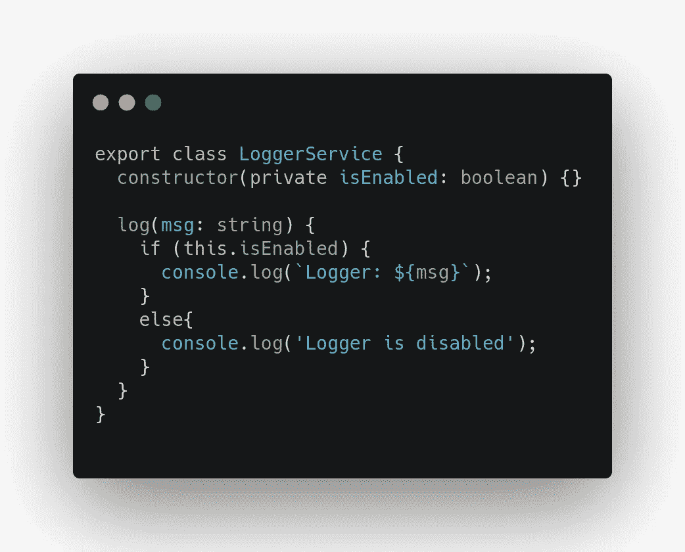
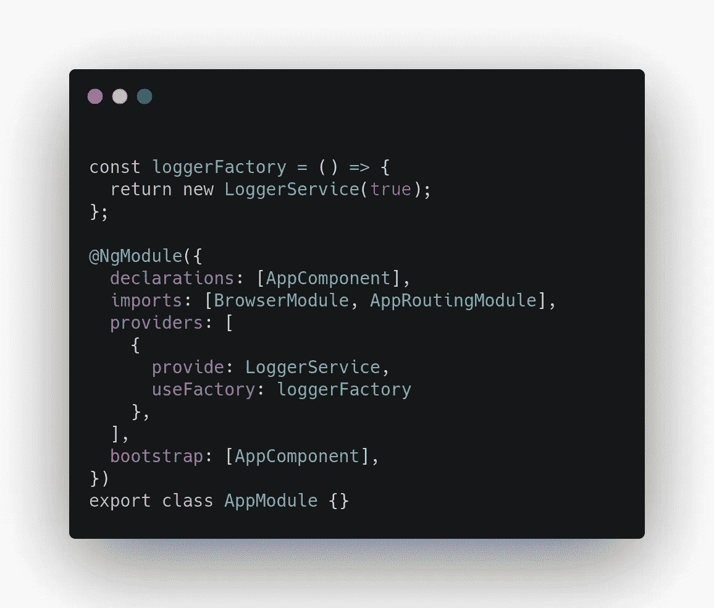
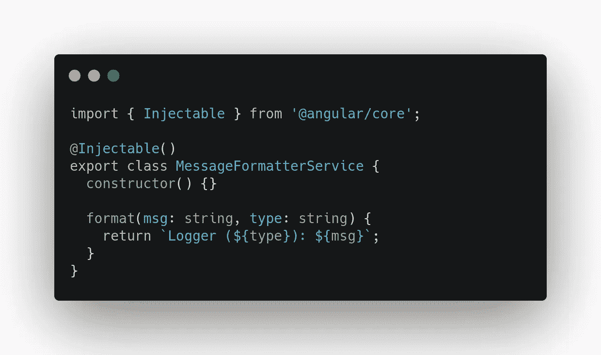
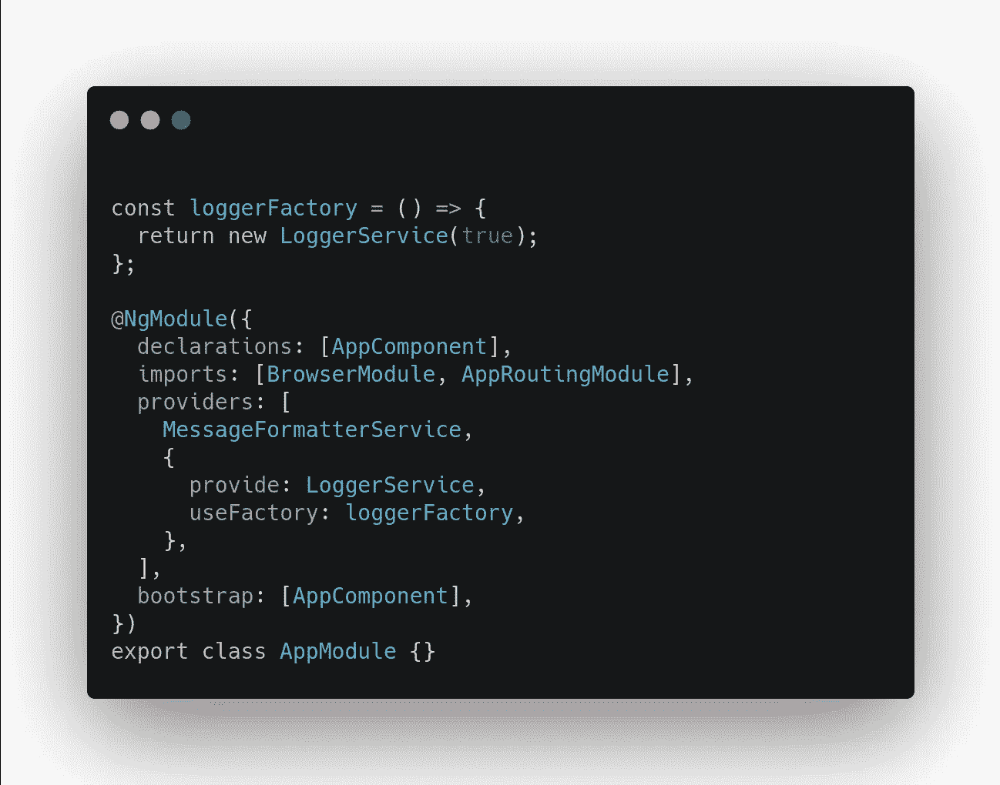
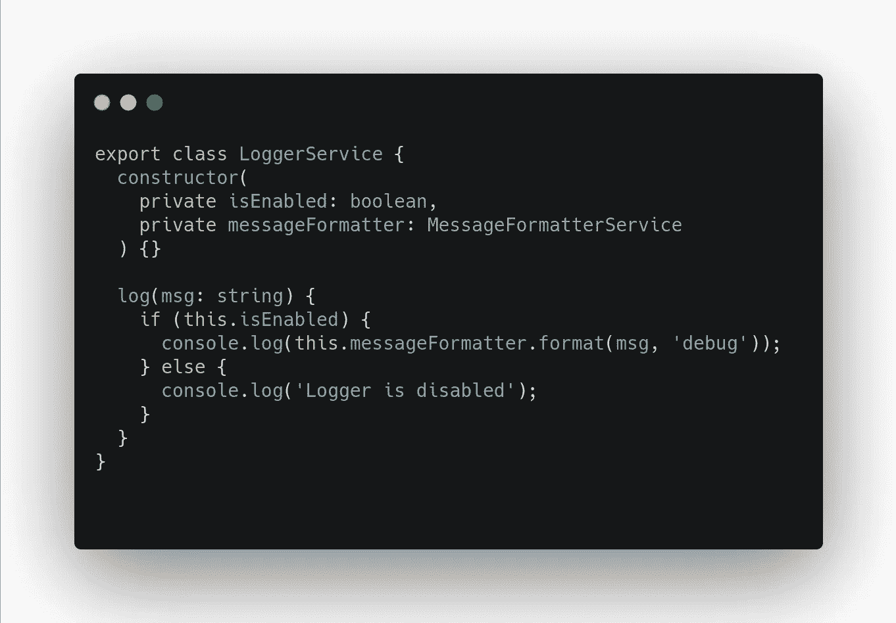
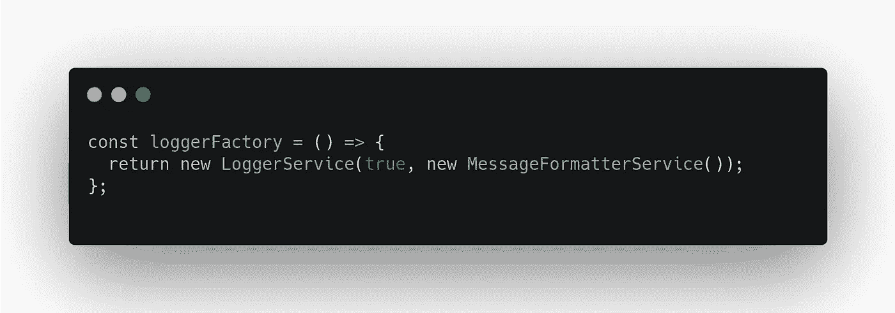
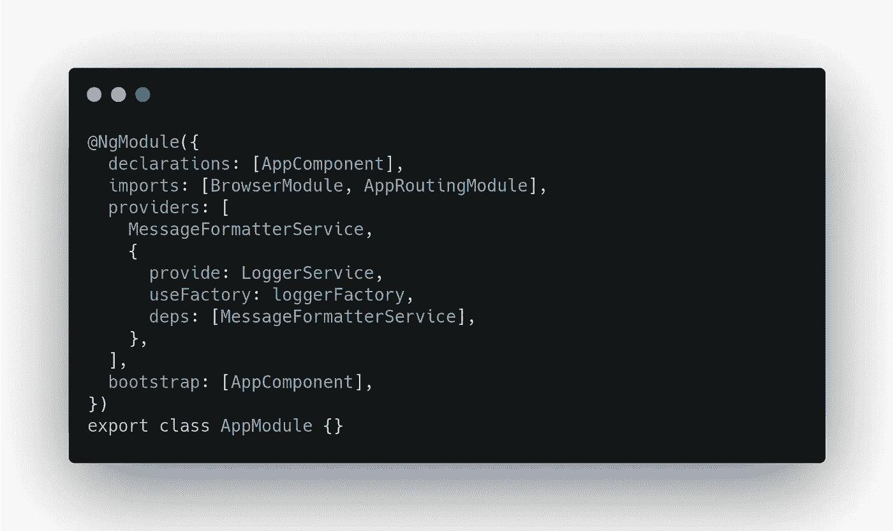
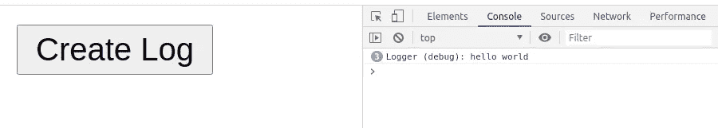

# 在 Angular 中将依赖项传递给工厂提供者

> 原文：<https://javascript.plainenglish.io/pass-dependencies-to-a-factory-provider-in-angular-9073502cae4?source=collection_archive---------3----------------------->

## 需要将其他服务作为依赖项传递给工厂提供者吗？

如果你直接来看这篇文章，这是上一篇关于“我们如何使用 Angular Factory Provider 实例化服务”的文章。

 [## 使用角度工厂提供者实例化服务

### 需要在服务中通过构造函数注入一个变量？

medium.com](https://medium.com/@hengky.kaiqi/instantiate-a-service-using-an-angular-factory-provider-38670aea4a94) 

在本文中，我们将继续讨论 Angular Factory Provider，并回答您的问题“我们需要将其他服务作为依赖项传递给工厂提供者怎么样？”

# 咖啡时间

首先，让我们做些伸展运动，并喝杯咖啡😃

[pexels.com](https://www.pexels.com/photo/beverage-break-breakfast-brown-414630/)

完成了吗？我们走吧！

# 问题

这里，我们有一个 *LoggerService* ，它实现了一个简单的日志消息，并在构造函数中添加了一个变量( *isEnabled* )来控制我们的日志功能是否启用。

我们使用 *useFactory* 属性和 *loggerFactory* 函数来实例化 *LoggerService* 。

那么问题是，如果我们需要将另一个服务作为依赖项传递给 *LoggerService* 怎么办？

假设我们有另一个名为*message formatter****的服务。*** 这个依赖项允许我们格式化我们的日志记录消息，获取消息和日志记录类型，然后它将作为字符串输出返回。

接下来，我们转到 app.module.ts，用 Angular 的依赖注入机制注册我们的 *MessageFormatter* 。

然后，让我们在我们的 *LoggerService 中使用 *MessageFormatter* 。*

现在，如果我们运行这个程序，我们将得到一个错误“没有为' messageFormatter '提供一个参数。”因为我们的 *FactoryProvider* 函数只接受一个布尔值( *isEnabled* )。

# 解决方案 1

然后我们需要扩展我们的 *FactoryProvider* 函数来传递我们的*message formatter****的实例。***

我们可以像这样直接在工厂函数中实例化对象。

但是，如果我们这样做，我们就不会在 Angular 中实现依赖注入机制。

然后呢？怎么会？🤔

# 解决方案 2

我们可以这样注射它:

为了告诉角度依赖注入器注入该依赖，我们需要定义如下所示的 ***deps*** 属性:

所以基本上，我们的 *FactoryProvider* 函数接受参数的数量，在这里，在 ***deps*** 属性中，我们可以指定一个应该传递给我们的工厂函数的依赖数组。

如果我们保存它，现在我们可以看到这样的控制台日志输出

# 编码

如果你想看完整的代码，你可以去我的 GitHub 仓库的分支"[传递依赖关系到工厂提供者](https://github.com/hengkysanjaya123/angular-factory-provider/tree/pass-dependencies-to-factory-provider)"

 [## hengkysanjaya 123/角度-工厂-提供商

### 此项目是使用 Angular CLI 版本 9.1.10 生成的。为开发服务器运行 ng serve。导航到…

github.com](https://github.com/hengkysanjaya123/angular-factory-provider/tree/pass-dependencies-to-factory-provider) 

谢谢大家！我希望你能从这篇文章中找到一些新的见解😀

干杯，

亨基·桑佳亚