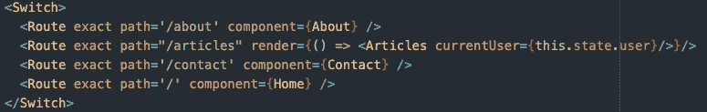
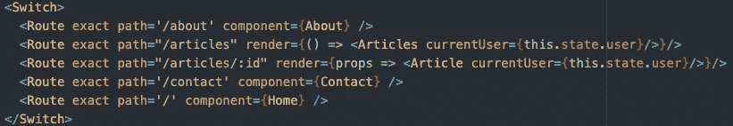

# 如何将道具传递给 React 路由器内部的组件

> 原文：<https://javascript.plainenglish.io/passing-props-to-components-inside-react-router-3d26165662b1?source=collection_archive---------2----------------------->

使用 React Router 是组织 React 应用程序的一个很好的方式。但是当你需要将道具传递给路由器内部的组件时会发生什么呢？当你也有无限的动态路由时会发生什么？

考虑一下你的组件通常是什么样子。

如果能够将我们当前用户的信息发送到 articles 组件，那就太好了。除了在这个路径中使用组件属性，我们还可以使用渲染属性，这需要一个函数。在函数内部，我们可以向组件添加一个新的道具。

如果我们需要每篇文章的路径，然后我们还需要将当前用户信息发送到那里，该怎么办？如果你需要了解如何设置这些路由，可以参考我的文章《用 React 设置[动态路由》。](https://medium.com/javascript-in-plain-english/dynamic-routes-with-react-f9caa4c804f1)

一旦你设置好了，事情就变得有点棘手了。问题是，在组件内部，我们经常需要访问这条路径自动提供的匹配属性。我们可以也应该添加我们的用户作为道具，但是匹配、历史和位置都变得不确定。这可以通过使用 withRouter 来解决。

在需要匹配和用户的组件上从 react-router-dom *导入 withRouter】。*

*从“react-router-dom”导入{ with router }*

最后，使用 withRouter 将其导出。

*用路由器导出默认(文章)；*