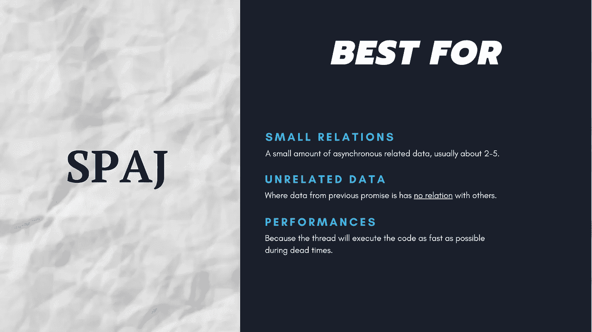

# JavaScript 中异步编程和异步函数优化的模式

> 原文：<https://javascript.plainenglish.io/patterns-for-async-programming-and-async-function-optimization-in-javascript-931cf49cadcd?source=collection_archive---------6----------------------->

## JavaScript 的基础知识

## 关于异步机制的快速提示，以及一些可以快速应用的模式。

在对我的关于 JavaScript 异步性的文章进行了几个月的反馈后，我决定重新编辑一些更小更简单的内容，重点是模式而不是概念的解释。

如果你是一个初学者，如果你准备好了，可以随意阅读这个链接上的全部课程或者阅读本文的其余部分。

[](https://medium.com/javascript-in-plain-english/understand-javascript-sequencing-and-asynchronous-behaviors-to-leverage-code-parallelism-1e381fa8d33c) [## 理解 JavaScript 排序和异步行为，以利用代码并行性。

### 关于如何使用 JS 并发模型提高应用程序性能的小指南。

medium.com](https://medium.com/javascript-in-plain-english/understand-javascript-sequencing-and-asynchronous-behaviors-to-leverage-code-parallelism-1e381fa8d33c) 

本文旨在简化初学者的逻辑，并且只给出您可以快速应用的模式，而不必阅读完整、全面和详细的示例。

在获得模式之前，让我们快速回顾一些基础知识。

# 关于 JS 中异步性的快速提醒

```
console.log("a");
setTimeout(() => console.log("b"), 0)
console.log("c");
```

将`a` `c` `b`输出得尽可能的奇怪。因为 JavaScript 是异步的，并且是著名的事件循环的一部分，你可能已经知道了，或者你最好在 Google 上看看这个。

**JavaScript 主要有 3 个工具来处理异步。**

## 复试

回调函数是在某些事件上运行的函数，比如“作业完成”或“发生错误”，给定关于该事件的参数。

这导致了众所周知的“回调地狱”的情况，在这种情况下，您嵌套回调的方式使得代码不可读并且容易出现错误。

## 承诺

哪些是新的(不太新？)的方式来**处理异步处理。**这允许**通过允许链接语句而不是嵌套来减少“回调地狱”**。

## 异步函数

这是对异步作业和承诺语法的改进。这纯粹是承诺的语法糖，使用了某种隐藏的生成器函数。

简而言之，您可以编写异步代码，在进入下一条语句之前等待异步处理完成。

# 异步编程优化

好了，现在一切都是新鲜的，你可能已经使用过了，但是可能用错了异步函数。

**👨🏻‍🎓我们将在下面看到的模式:**

1.  **异步作业的小排序(SSAJ):** *当异步任务之间的关系很小，必须按特定顺序执行时。*
2.  **有延迟的小并行** `**await**` **启动后的语句:** *当异步任务之间没有关系，必须以任意顺序并行执行时。*

这些名字可能不存在，因为我只是这样命名的，它们可能有其他的名字😅

## 1 —异步作业的小排序(SSAJ)


想象一下下面的代码片段，在阅读下一段之前，试着计算一下执行和打印这些值需要多长时间。

**当你准备好得到答案时，只需在浏览器控制台或 NodeJS 程序中运行代码。** `console.time`是给出两个标记之间经过的时间的语句。

```
function resolveIn(time, val) {
  return new Promise(res => setTimeout(() => res(val), time))
}async function example() {
  console.time("Example time");const a = await resolveIn(3000, "a");
  const b = await resolveIn(2000, a); console.log(a, b); console.timeEnd("Example time");
}example()
```

你觉得怎么样？

**解释**

> **答案大概 5 秒。**

正如你所看到的，使用关键字`await`我们在第一条指令处阻塞了代码，这条指令必须等待 3 秒钟才能进入下一个事件。因此，我们等待 3 秒钟，然后一旦完成，我们只启动 2 秒钟的第二个计数器，这导致在打印语句之前总共有 5 秒钟。我们在第二个指令中使用了第一个异步指令值。**那是排序或链接。**

> 我们该如何改进呢？

## **2—启动后延迟** `**await**` **语句的异步作业(SPAJ)的小并行度。**



我们在上面看到的**非常适合需要以特定顺序执行的指令**，例如，如果您需要来自第一个指令结果的一些数据来触发第二个指令。

但是当事情与副作用的免除无关时，你应该并行地实现那些**来利用 JavaScript 异步能力。为此，**你应该同时启动计数器**,这样做的效果是同时将任务委托给内核，并将其放入事件循环中(或者至少在最快的时候，一个程序仍然一次执行一条语句😅).**

**下面的代码片段修复并改进了我们刚才看到的代码片段。**

```
function resolveIn(time, val) {
  return new Promise(res => setTimeout(() => res(val), time))
}async function example() {
  console.time("Example time"); const aPromise = resolveIn(3000, "a");
  const bPromise = resolveIn(2000, "b"); console.log(await aPromise, await bPromise);
  // or
  console.log(await Promise.all([aPromise, bPromise]);

  console.timeEnd("Example time");
}example()
```

**这里，我们(几乎)同时启动了异步计数器，程序仅在控制台语句处开始`await`。我们没有等到第一条语句解决后再开始第二条语句，这导致了执行时间的整体改善。**

**这已经是一篇中等大小的文章了，但是我们可以通过循环和 Javascript 生成器更进一步。如果你有兴趣了解更多，请随时在 LinkedIn 上联系我，或者在 Reddit 上评论这个帖子**

**[**🇫🇷STOP！你是法国人吗🥖？**您也可以访问 ici 网站，接收法国的私人通讯🙂](https://codingspark.io)**

## ****简明英语笔记****

**我们总是有兴趣帮助推广高质量的内容。如果您有一篇文章想要提交给我们的任何出版物，请发送电子邮件至[**submissions @ plain English . io**](mailto:submissions@plainenglish.io)**，并附上您的 Medium 用户名，我们会将您添加为作者。****