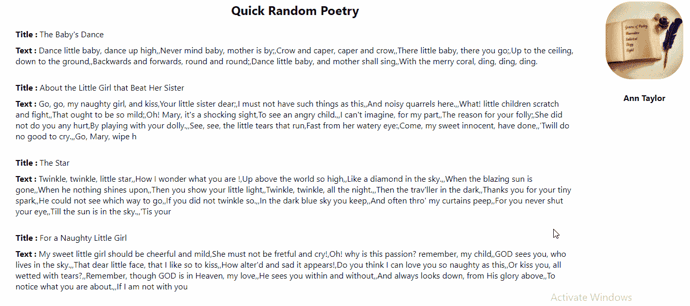

# 使用骨架屏幕提高 React 应用程序的 UX

> 原文：<https://javascript.plainenglish.io/perform-your-react-app-with-react-skeleton-screens-e021558af9d0?source=collection_archive---------17----------------------->

一般来说，网站通过各种不同的方式处理获取数据，如显示旋转器(例如网飞的情况)、进度条或定制动画，其中一种方式(如 Medium 和脸书使用的)是通过使用 **React 骨架屏幕**在浏览器上处理获取数据，为使其更加清晰，请查看下图

这将是我们的应用程序，我们将建立一个快速简单和快速反应。js 应用程序，显示一个随机诗人的随机诗歌，不要担心一切将解释如下，源代码将在最后提供😉

# 设置

首先，让我们通过创建 react.js 应用程序来初始化我们的项目:

> npx 创建-反应-应用反应-屏幕-示例

现在，为了初始化我们的内容，我们将使用一个免费的诗歌数据库提供商，你可以在这里找到****，所以让我们开始编码。所以我们需要两个状态变量“poems”和“poet”用 Api 回调来更新****

****如上面的图片所示；函数“fetchPoems”进行第一次调用以获得可用诗人的列表，然后用一个随机的名字解析它，第二次调用以获得诗歌的列表，这个函数在 useEffect 挂钩中调用，首先用一个计时器来查看事情是如何工作的，然后我们将移除计时器，直接调用它，不使用任何计时器，这就是它的一般用法****

****这意味着在可视地改变内容之前，它将显示框架屏幕 5 秒钟，但是记住将该行放在注释中，并像第 7 行那样直接调用“fetchPoems”函数。****

****现在，在 return closure 中，我们将根据状态有条件地呈现内容，因此在第一次呈现时，我们将有一个临时数据(稍后是骨架屏幕)，然后在安装 useEffect 后，我们将调用 fetchPoems 来更新内容，因此让我们构建骨架屏幕。****

# ****骨架屏幕****

****简单地说，我们的骨架屏幕是定制的 html 元素，以灰色作为背景色，并添加一些 css 动画来使其闪闪发光。首先，我们需要知道我们的渲染器内容的性质，即:文本，标题，标题，图像和头像，在我们的例子中，我们有三种类型的内容:单行文本(标题)，多行文本和头像，所以我们必须设计我们的骨架。首先创建一个文件夹，命名为“skeleton ”,包含两个文件“index.js”和“style . css”,“index . js”是一个 React 组件，它必须接收一个指示内容类型的属性，因为我们必须基于此自定义 CSS****

****因此，正如你所看到的，我们根据接收到的属性创建 CSS 类名，稍后在。/style.css "如下****

****现在让我们回到 App.js，用这个新的逻辑更新 render 方法，在 hooks 函数中获取数据之前显示框架****

****这里我们只是测试初始数据是否为空，如果是这样，我们渲染四个块，每个块中有一个标题和一个正文元素，然后我们渲染一个关于作者的简单元素，有一个头像和一个标题元素，但是如果 state 更新得很好，那么我们渲染十首带有标题的诗，如第 6 行中的 map()函数，右边的块有一些诗人的信息。****

****就在结束之前，让我们添加一些快速的 CSS 动画，将与骨架一起显示，因此创建另一个文件夹，并将其命名为“twinkle”(如我所做的😜)有了“index.js”和“style.css”两个文件，这个动画块后面会被包裹在 Skeleton 元素中，所以我们来看看这个动画根文件:****

****简单地说，这里有一个包装块，我们将把它放入动画中，这个块将用于动画，在 CSS 文件中有定义 X 线上平移的动画关键帧，动画将花费 1.5 秒在一个无限循环中从左到右执行。****

****最后，我们必须向 Skeleton 元素添加新的动画包装器，只需通过导入动画文件来更新 fine skeleton/index.js，并将组件包装在根块中，如下所示:****

****就是这样！😃****

******源代码:**[https://github . com/bl mine/medium-article-React-Skeleton-Screens](https://github.com/BLemine/medium-article-React-Skeleton-Screens)****