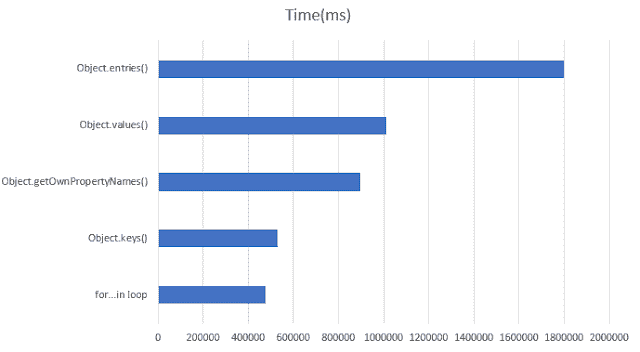

# 5 次 JavaScript 对象迭代的性能比较

> 原文：<https://javascript.plainenglish.io/performance-test-for-5-javascript-object-iterations-587df56f5266?source=collection_archive---------7----------------------->

Photo by [Hannah Olinger](https://unsplash.com/@hannaholinger?utm_source=medium&utm_medium=referral) on [Unsplash](https://unsplash.com?utm_source=medium&utm_medium=referral)

# JavaScript 中的对象是什么

*   对象是 JavaScript 中的**一切**
*   在 JavaScript 中，我们以**对象(键值)JSON** 格式发送和接收数据，并遍历**对象**来呈现数据
*   对象是属性的集合，属性是名称(或键)和值之间的关联
*   JavaScript 是基于简单的基于对象的范例设计的

Photo by [Nick Fewings](https://unsplash.com/@jannerboy62?utm_source=medium&utm_medium=referral) on [Unsplash](https://unsplash.com?utm_source=medium&utm_medium=referral)

# 让我们深入研究 5 种不同 JavaScript 对象迭代的性能

## 性能测定

*在许多采访文章或研究中，我们了解到* `*for...loop*` *是最快的方法，而* `*object.entries()*` *是最慢的方法来迭代对象*

1.  对于…在循环中
2.  Object.keys()
3.  Object.getOwnPropertyNames()
4.  Object.values()
5.  Object.entries()

> 实际上？？？

Photo by [Ben White](https://unsplash.com/@benwhitephotography?utm_source=medium&utm_medium=referral) on [Unsplash](https://unsplash.com?utm_source=medium&utm_medium=referral)

*对于那些不相信上面排名的人，我做了一些小测试*

# 给定一个有 10000 个条目的对象，我运行 10 次，得到每个对象迭代技术的平均性能(我在 VS 代码控制台上运行)

*稍微解释一下上面的代码*

*   在 **objLoop** 函数中，我创建了一个有 10000 个条目的对象
*   **t0** 测量初始时间， **t1** 测量功能执行后的时间。因此， **t1 — t0** 产生函数 **objLoop** 的执行时间

# > 10000 个条目的性能测量

(10000 个条目的性能测量排名)

## **①②1。for…in loop(255.8 毫秒)**

(303+305+234+246+265+259+267+223+222+234)**/10**

## (5) 2.object . keys(319.2 毫秒)

(509+456+271+294+338+263+292+263+244+262)**/10**

## (3) 3.object . getownpropertynames(256.6 毫秒)

(345+310+312+246+206+214+201+251+262+219)**/10**

## (1) 4.object . values(244.8 毫秒)

(282+259+251+287+200+260+207+211+208+283)**/10**

## (4) 5.object . entries(266.9 毫秒)

(274+278+382+263+246+271+239+245+243+228)**/10**

> 什么？？？

Photo by [Daniel Schaffer](https://unsplash.com/@le_me?utm_source=medium&utm_medium=referral) on [Unsplash](https://unsplash.com?utm_source=medium&utm_medium=referral)

> 更多的数据(即 1 亿个数据)呢？？？

Photo by [Ben White](https://unsplash.com/@benwhitephotography?utm_source=medium&utm_medium=referral) on [Unsplash](https://unsplash.com?utm_source=medium&utm_medium=referral)

> 几乎没有机会 for loop (O(n))
> 
> 一亿条数据
> 
> 对于 1 亿个数据，我们很可能在现实生活中使用 BST(O(log n))或其他高级算法

# 尽管如此，让我们迭代 1 亿个条目

## >针对 10000 * 10000 个条目的性能测量

(1 亿个条目的性能测量排名)

## (5) 1.对于…在环路中(18002.9 毫秒)

(18132+17391+18484+18651+18533+17493+18137+18943+18296+15969)**/10**

## (4) 2.object . keys(17377.2 毫秒)

(18104+17343+17123+20989+16329+15617+17900+17521+16499+16347)**/10**

## (1) 3.object . getownpropertynames(16817.1 毫秒)

(17264+17304+18639+16255+15640+15804+17767+16936+16596+15966)**/10**

## (2) 4.object . values(17044.9 毫秒)

(19358+18636+17654+16728+15346+18061+16369+16151+15952+16194)**/10**

## (3) 5.object . entries(17120.5 毫秒)

(18477+18601+16310+16834+17682+18660+16461+16134+16125+15921)**/10**

> 还是？？结果是不同的
> 
> 不仅仅是我们最初的预期
> 
> 而且还来自之前的 10，000 个条目的测试

Photo by [Pete Wright](https://unsplash.com/@petewright?utm_source=medium&utm_medium=referral) on [Unsplash](https://unsplash.com?utm_source=medium&utm_medium=referral)

# 结论

from [hackernoon](https://hackernoon.com/5-techniques-to-iterate-over-javascript-object-entries-and-their-performance-6602dcb708a8)

*   对于超过 1 亿个条目的数据，对象迭代方法的性能差异可能是有意义的
*   但是对于一个真实的例子(例如，web 开发),性能差异是最小的

# 真实结论(一行程序)

> 我认为你可以使用任何适合你的用例的对象迭代方法

Photo by [Jan Tinneberg](https://unsplash.com/@craft_ear?utm_source=medium&utm_medium=referral) on [Unsplash](https://unsplash.com?utm_source=medium&utm_medium=referral)