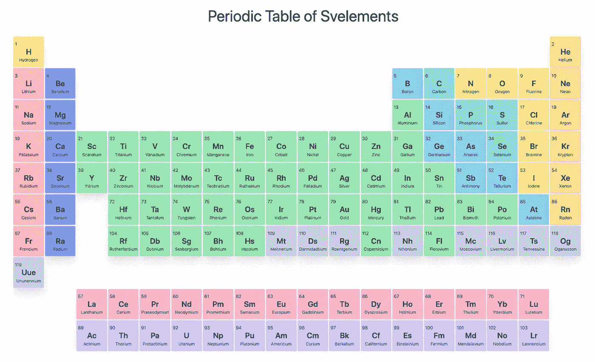

# 纤细的元素周期表

> 原文：<https://javascript.plainenglish.io/periodic-table-of-elements-in-svelte-52fafddb19dd?source=collection_archive---------11----------------------->



Periodic Table of Svelements and final output for this tutorial

最近，我一直在玩`Svelte`，我惊讶于它的简单易懂。还有很少的样板代码，所以您可以在最小的阻力下开始编码。

在一个化学相关的行业工作，我不时地使用元素周期表，并想知道在`Svelte`中实现它会是什么样子。在这篇文章中，我分享了我建造`Periodic Table of Svelements`的旅程(抱歉，忍不住加入了所有与`Svelte`相关的双关语！).希望这个简短的教程也可以作为那些不太熟悉的人对`Svelte`的简单介绍。

# 初始设置

对于这个项目，我选择将`Svelte`与`Tailwind CSS`一起使用，这是另一个很棒的框架，可以更容易地对组件进行样式化。`Tailwind CSS`是一个实用优先的 CSS 框架，它允许你通过添加实用类而不是使用预先样式化的组件来调整组件的样式。如果你对`Tailwind`不熟悉，建议你也去看看。

对于主项目，一个简单的开始方式是在[https://github.com/colinbate/svelte-ts-tailwind-template](https://github.com/colinbate/svelte-ts-tailwind-template)使用模板。模板包括`Svelte`和`Tailwind`。它还包括对`TypeScript`的支持，但是我们现在不会在我们的项目中使用它。您可以通过进入您的`terminal`并遵循以下步骤来快速启动模板。

```
npx degit colinbate/svelte-ts-tailwind-template svelte-app
cd svelte-appnpm install
```

您可以在根目录下使用`npm run dev`启动应用程序。然后，您可以在网络浏览器中转至`localhost:5000`。这将调出一个带有`HELLO WORLD`的页面。

除了 starter 模板，我们还需要一些包含元素信息的数据。你可以从[https://github.com/Bowserinator/Periodic-Table-JSON](https://github.com/Bowserinator/Periodic-Table-JSON)得到一个`json`和所有需要的数据。

接下来，在你的`src`文件夹中创建一个名为`Data`的文件夹，并将这个`json`放入其中。我们将使用这些数据来填充我们的周期表。

从本地文件获取`json`数据有许多不同的方法，一种简单的方法是使用`rollup`插件`@rollup/plugin-json`。您可以按照下面的步骤进行安装。

```
npm install @rollup/plugin-json
```

然后在你的`rollup.config.js`文件里面。导入`json`模块并将其放在`typescript`的导入下方。

```
import typescript from '@rollup/plugin-typescript';
import json from '@rollup/plugin-json';
```

最后，在`rollup.config.js`插件下添加`json()`。可以放在`commonjs()`下面。

```
plugins: [
...
commonjs(),
json(),
...
]
```

# 我们走吧

看元素周期表，可以看到元素是以表格形式排列在单元格中的，因此得名。然而，一个表也可以被认为是一个`grid`，所以我们大概可以使用`CSS grid`来实现同样的事情。我想我喜欢那个计划，所以让我们继续吧。

让我们从删除`App.svelte`中不必要的代码开始。移除除了`Tailwind CSS`的导入之外的所有内容。我们也可以移除`TypeScript`语言支持(`lang="ts"`)以保持简单。

最后，让我们添加一个标题，这样我们就可以在页面上看到一些东西。您应该会得到下面的代码块。运行`npm run dev`应该会弹出一个带有适当样式标题的页面。这就是初始设置。

# 创建单个元素

在我们创建表格之前，让我们创建我们的`<Element />`组件来利用来自`json`文件的数据。

在`src`中创建一个名为`Components`的文件夹。创建一个名为`Element.svelte`的新文件。复制下面的代码块，让我解释一下接下来会发生什么。

在我们的`script`标签中，我们做了几件事。

1.  使用`object destructuring`将`json`数据导入并提取到名为`elements`的变量中。
2.  我们向我们的父对象`component` ( `Table.svelte`，我们还没有创建它)公开了两个道具。`atomicNumber`属性将用于传递适当的原子序数，我们的`<Element />`组件将使用该原子序数从`json`文件中检索适当的数据。我们还公开了一个`style` prop，我们可以用它像普通 HTML 一样传递 CSS 样式。
3.  我们还创建了一个名为`toCamelCase()`的函数，顾名思义，它将字符串转换成 camelCase。因为`json`文件中的类别是带空格的字符串，所以我们用这个来转换它们，这样我们就可以很容易地用 CSS 来定位它们。这一步不是必需的，只是一个偏好。

在`<style />`中，我们基本上通过使用`vw`作为我们的尺寸单位来使我们的设计具有响应性。我们也为不同的类别设置颜色。

最后，`style`下面是`<Element />`组件的标记。我们将每个元素设置为一个`button`。然后，我们通过`Tailwind's`实用程序类添加样式。我们通过使用它们在`elements`数组中的索引(它们的原子序数减 1)来访问它们，从而访问每个元素的信息。类似`name`和`symbol`的属性是来自`json`的属性名。

# 将元素带入表中

下一步是将我们的元素放入表格(网格)。在`Components`文件夹中创建一个名为`Table.svelte`的文件。将下面的代码添加到文件中。

我们基本上用 18 列创建网格。然后我们用我们的`<Element />`组件填充网格。接下来我们需要弄清楚的是如何根据周期表来定位我们的元素。

幸运的是，我们一开始导入的`json`数据包含了我们实现这一目标所需的所有信息。它将元素的原子序数存储在`number`属性中，并将每个元素的 x 和 y 位置分别存储在`xpos`和`ypos`属性中。

然后我们使用`Svelte's`超级方便的`{#each}`块来循环我们的元素数组。我们现在差不多完成了。我们只需要在我们的`App.svelte`文件中导入我们的`<Table />`组件。

编辑`App.svelte`,如下图所示。

如果您还没有运行`npm run dev`，那么我们就完成了！在`localhost:5000`你应该有一个本地运行的灵敏而灵活的 s 元素周期表。

你可以在[https://github.com/kinxiel/Periodic-Table-of-Svelements](https://github.com/kinxiel/Periodic-Table-of-Svelements)找到完整的项目和所有的源代码。

在这一点上，我们有了周期表，但它没有任何用处。在第 2 部分中，我们将探索如何在元素周期表中添加一些基本的控件来显示额外的数据。

更新:第二部分已经准备好了，你可以在[https://medium . com/JavaScript-in-plain-English/elements-table-in-svelte-Part-2-98 F3 F7 b 2515](https://medium.com/javascript-in-plain-english/periodic-table-of-elements-in-svelte-part-2-98f3f7b2515)找到它