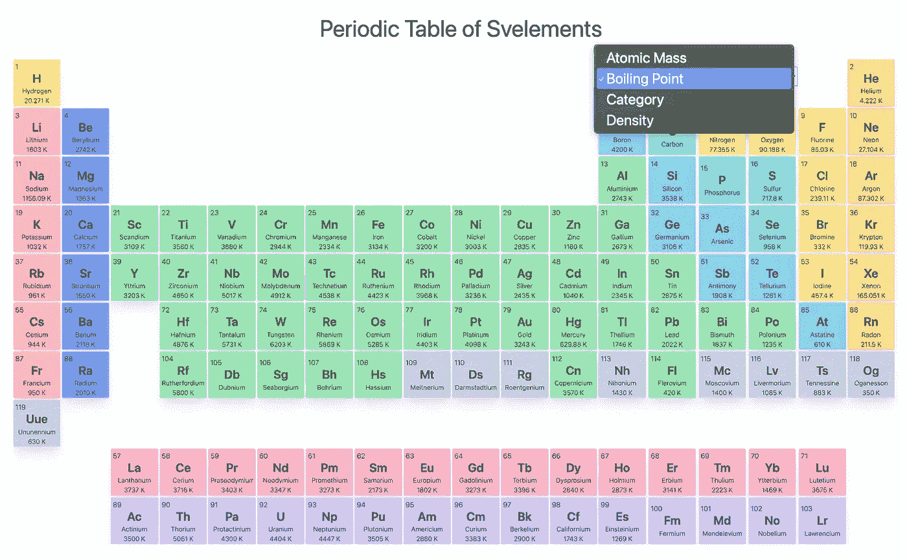

# 元素周期表第二部分

> 原文：<https://javascript.plainenglish.io/periodic-table-of-elements-in-svelte-part-2-98f3f7b2515?source=collection_archive---------7----------------------->



在第 1 部分的**中，我们能够连接我们的数据并使用 Svelte 呈现周期表。如果你需要一个简短的复习，你可以在这里找到**第一部分**([https://medium . com/JavaScript-in-plain-English/elements-table-in-svelte-52 fafddb 19 DD](https://medium.com/javascript-in-plain-english/periodic-table-of-elements-in-svelte-52fafddb19dd))。**

目前，我们的元素周期表没有任何有趣的东西，老实说，没有比印刷版本增加任何额外的价值。让我们通过增加一些交互性来改变它，使它更有用。在这个过程中，我们还可以看到组件如何以苗条的方式通信，以及连接东西是多么容易。

# 项目设置

如果您从我们在**第 1 部分**中停止的地方继续，您可以从那里继续。如果您不知何故丢失或找不到项目，您总是可以克隆存储库并安装依赖项，如下所示:

```
git clone [https://github.com/kinxiel/Periodic-Table-of-Svelements.git](https://github.com/kinxiel/Periodic-Table-of-Svelements.git)cd Periodic-Table-of-Svelements/
npm installnpm run dev
```

如果没有错误，前往`localhost:5000`找到你渲染的周期表。

# 我们要加什么？

目前，我们的周期表只显示每个元素的名称和符号，但我认为我们可以做得更好。如果我们检查包含在`/src/Data/PeriodicTableJSON.json`的数据的`json`，我们可以看到每个元素都有很多其他信息。例如，对于氢，我们有关于它的沸点的信息，在一个属性中叫做`boil`，它的原子质量在`atomic_mass`中等等。

让我们找到一种方法将这些信息放入我们的元素周期表，并添加一些简单的功能来允许用户选择他们想要显示的值。

# 添加附加信息

让我们从在元素符号的正下方添加元素的原子质量开始。在`/src/Components/Element.svelte`中打开`Element.svelte`，并在`<script>`标签中添加以下代码行。您将这些代码放在哪里并不重要，但是通常您想要公开的属性都放在文件的顶部附近。在我的例子中，我将它添加到了`export let atomicNumber`的正下方和`toCamelCase()`函数声明的上方。

```
export let selectedProperty = 'atomic_mass';$: additionalInformation = eval(
  'elements[atomicNumber - 1].' + selectedProperty
);
```

在第一行中，我们公开了一个带有默认值的`selectedProperty`属性，其他组件可以访问该属性。在第二行我们有`$:` …


这在 Svelte 中被称为**反应性陈述**，然而这种语法并不是 Svelte 独有的。它在普通的 JavaScript 中使用，被称为**标记语句**。它用于中断或继续循环中的语句，但不常用。因为 Svelte 是一个编译器，它可以赋予这些类型的语法新的含义。

**反应式语句**可用于捕捉其引用变量的变化。在上面的例子中，变量`additionalInformation`随时更新，它引用的变量(如`selectedProperty`)发生变化。目前，`selectedProperty`被设置为一个静态值，所以我们现在不能利用它，但我们很快就会利用它。

同样需要注意的是，当你将一个变量赋值为**反应语句**时，你不需要用`let`来声明它，Svelte 会在幕后为你做这件事(谢谢 Svelte！).

最后，`eval`是一种普通的 JavaScript，用于将字符串作为代码进行计算。所以上面的例子翻译成氢气的`element[0].atomic_mass`。

对于标记，在包含`{elements[atomicNumber — 1].name}`的`div`的正下方添加以下代码。

```
<div class="mx-auto overflow-hidden font-light text-center element-name">
  {additionalInformation}
</div>
```

保存文件，如果操作正确，您现在应该看到每个元素的原子质量显示在它们的符号下面。如果您遇到问题，可以在文章末尾找到要点和源代码。

# 创建属性菜单

现在我们有了一种方法来显示每个元素的附加信息，让我们允许用户查看其他属性。

让我们从创建一个选择菜单开始。打开`/src/Components/Table.svelte`中的`Table.svelte`。在`<script />`标签中添加以下内容。

```
// Initial value for the select element
let selection = {
  value: 'atomic_mass',
  text: 'Atomic Mass',
};// These are the options in the select element
let properties = [
 { value: 'atomic_mass', text: `Atomic Mass`},
 { value: 'boil', text: `Boiling Point` },
 { value: 'category', text: `Category` },
 { value: 'density', text: `Density` },
];
```

我们想把这个选择元素放在表中，硼(B)的上面，氦(he)的左边。在`<style />`标签中添加以下 CSS。

```
.menu {
 grid-column: 13;
 grid-row: 1;
 grid-column-end: 17;
}.menu select {
 font-size: 1.5vw;
 width: 20vw;
}
```

最后添加以下标记，就在我们用来循环第 1 部分中的**元素的`{#each /}`块的正上方。**

```
<div class="menu">
  <select
    bind:value={selection}
    class="border border-blue-500 shadow sm:mt-2 md:mt-4">
    {#each properties as property}
      <option value={property}>
        <span>{property.text}</span>
      </option>
    {/each}
  </select>
</div>
```

基本上，我们遍历属性列表，用适当的选项填充 select 元素。`bind`指令用于将选择元素的值直接链接到变量。在这种情况下，我们将`selection`属性链接到我们的选择元素。

`bind:value`的行为因其使用位置而异，但通常用于链接输入元素(如输入、复选框、选择)和变量之间的值。在苗条的中大量使用了`bind`指令，除了上面提到的，它还有其他用途，但是为了简单起见，现在让我们把注意力集中在这个用例上。

顺便提一下，类`sm:mt-2`和`md:mt-4`是 TailwindCSS 类，它们告诉浏览器分别在小尺寸屏幕上设置顶部边距为`0.5rem`，在中等尺寸屏幕上设置顶部边距为`1rem`。

保存文件，你应该会在氦(he)的左边看到一个选择菜单。您可以从菜单中选择一个选项，但它还不会做任何事情，所以让我们继续工作。

# 让我们把事情反应过来

至此，我们差不多已经完成了所有的设置，我们只需要添加最终的连接来将我们的`<Element />`组件链接到我们的`<Table />`组件。

在`Table.svelte`中，就在关闭`<script />`标签之前，在`properties`数组的正下方添加以下内容。

```
<script>// ... properties array declaration ...$: selectionProperty = selection.value;</script>
```

我们创建一个名为`selectionProperty`的新的反应变量，并在选择元素的值改变时将其值设置为`selection.value`。

最后，编辑`{#each /}`块中的标记，如下面的代码所示。

```
{#each elements as element, i}
  atomicNumber={element.number}
  // Add this line below
  bind:selectedProperty={selectionProperty}
  style="grid-column: {element.xpos}; grid-row: {element.ypos}" />{/else}{null}{/each}
```

这里我们再次使用了`bind`指令，但是方式略有不同。这一次，我们使用它将子组件的道具链接到父组件的道具。

组件之间有许多不同的方式进行通信。上面的例子就是这样一个例子。我个人认为这是最简单直观的方法之一。这可以总结为以下模式。

```
<childComponent bind:childProp = {parentProp} />
```

在我们的代码中，我们基本上将`{selectedProperty}`的值链接到`<Table />`组件中的`selectionProperty`属性，该值是由`<Element />`组件导出的属性。我们还知道，当`selectedProperty`发生变化时，也会触发`additionalInformation`的值更新，最终导致周期表中的值更新。

在你的终端上运行`npm run dev`，如果它还没有运行的话，直接转到`localhost:5000`。您现在应该有一个功能齐全的菜单，它允许用户更改表中显示的补充信息。

# 添加一些上光剂

有了前一步，我们基本上完成了周期表。但是，您可能也注意到了一些数字的格式不正确，通过添加一些单位来添加一些上下文也是有帮助的，所以让我们来解决这个问题。

对于密度，我们需要有条件地渲染正确的单位，因为密度取决于元素的相位。在`Element.svelte`中，在靠近`<script />`标签末尾的`toCamelCase()`函数声明之前添加以下内容。

```
$: phaseInformation = eval('elements[atomicNumber - 1].' + 'phase');
```

我们基本上是获取元素的相态(固体、液体、气体)并将这些信息存储在`phaseInformation`中。然后我们可以用它来显示适当的单位。

接下来，替换标记部分末尾附近的`{additionalInformation}`,看起来像下面的代码。

```
{#if additionalInformation == null}
{:else if selectedProperty == 'atomic_mass'}
  {additionalInformation.toPrecision(4)}
{:else if selectedProperty == 'density'}
  {#if phaseInformation == 'Gas'}
    {additionalInformation} g/L
  {:else}
    {additionalInformation} g/cm<sup>3</sup>
  {/if}
{:else if selectedProperty == 'boil'}
  {additionalInformation} K
{:else}
  {additionalInformation}
{/if}
```

很多条件，但它基本上根据选择呈现正确的单位。最后一次，在你的终端中运行`npm run dev`，玩一下菜单，看看是否得到预期的结果，我们就大功告成了！

如果您在演练过程中遇到困难，您可以在下面找到`<Element />`和`<Table />`组件的完整代码。

`Element.svelte`

`Table.svelte`

# 结论(消失的行为)

在这篇文章中，我们探索了在 Svelte 中执行组件之间的数据通信是多么简单和直观。该框架提供了许多方便的工具，使得实现普通任务变得容易，比如绑定适当的值。尽管 Svelte 给了你超能力，但它仍然感觉非常易于管理，我认为其中一个原因是，归根结底，Svelte 代码看起来非常像 HTML、CSS 和 JavaScript，大多数人都很熟悉，这就是它的神奇之处。

Svelte 也被称为“消失的框架”,主要是因为在编译之后，它允许您发布非常小的代码包，这对性能有好处。我认为 Svelte“消失”的另一个原因是直观和简单的语法。当我以苗条的方式工作时，我经常忘记我实际上是在使用一个框架，它允许我关注内容而不是工具。

如果您有任何意见或问题，请随时告诉我，您可以在[https://github . com/kinxiel/Periodic-Table-of-Svelements-part 2](https://github.com/kinxiel/Periodic-Table-of-Svelements-Part2)上查看完整的源代码。感谢阅读！