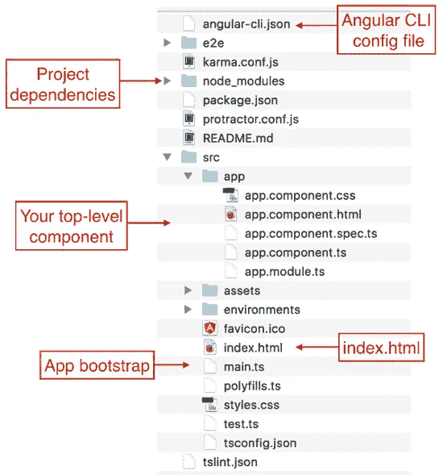

# 使用 Angular 8 和 Bootstrap 的个人投资组合

> 原文：<https://javascript.plainenglish.io/personal-portfolio-using-angular-8-and-bootstrap-5dde6fc7cf9b?source=collection_archive---------0----------------------->

**技术:Angular 8，BootStrap，HTML5，CSS3。**

**Github 链接:**【https://github.com/mehulk05/Mehul.Kothari】T4

**工作演示:**[https://mehul-kothari.vercel.app/](https://mehul-kothari.vercel.app/)

**视频解说**:

[https://www.youtube.com/watch?v=MHzWXfjdE0w&feature = youtu . be](https://www.youtube.com/watch?v=MHzWXfjdE0w&feature=youtu.be)

**Angular** 是世界上最流行的用于构建现代 web 应用程序的 Javascript 框架之一。Angular 是由谷歌开发的，背后有巨大的社区支持。

我用 Angular 8 制作了我的个人投资组合。虽然我用的是 Angular8，但其他版本的 angular 8 没有太大区别

# Angular 8 项目的先决条件

Angular 带来了处理所有配置的解决方案: **Angular CLI** 。通过使用 Angular CLI，我们可以在几分钟内开始开发一个 Angular 项目。

1.节点 js 版本 10.9.0

2.Npm(版本 8.x 或 10.x)。

# 什么是 Angular CLI？

CLI 代表**命令行界面。** Angular CLI 用于 Angular 项目的自动化操作，而不是手动操作。CLI 自始至终支持 Angular 项目中的开发人员。

例如，角度 CLI 可用于:

*   配置，环境设置
*   建筑构件、服务、路由系统
*   启动、测试和部署项目
*   安装第三方库，如 **Bootstrap、Sass、**等。(带**网络包**


# 如何用 CLI 启动 Angular app？

如果你访问上面的[官网](https://cli.angular.io/)可以看到有一些**命令**写的。以下是启动 Angular 应用程序的 4 个主要步骤:

*   **节点包管理器(NPM)** 安装(先决条件)
*   角度 CLI 安装
*   使用 CLI 创建 Angular 应用程序
*   运行应用程序

# 步骤 1:安装 NPM:

Angular、Angular CLI 和 Angular 应用程序取决于作为 [npm 包](https://docs.npmjs.com/getting-started/what-is-npm)提供的库所提供的特性和功能。要下载和安装 npm 软件包，您必须有一个 npm 软件包管理器。你可以从这里的下载 NPM。


# 步骤 2:安装 Angular CLI

安装 NPM 后，第二步可以安装 Angular CLI。打开终端或命令提示符，键入以下命令:

```
npm install -g @angular/cli
```


*|*|***ng****代表***和****——v****是* ***的版本。****

# *步骤 3:使用 CLI 创建新的角度项目*

*你在一个有角度的[工作空间](https://angular.io/guide/glossary#workspace)的环境中开发应用。*

*要创建新的工作区和初始 starter 应用程序，请执行以下操作:*

1.  *运行 CLI 命令`ng new`并提供名称`my-app`，如下所示:*

```
*ng new Personal-Portfolio*
```

*2.`ng new`命令提示您初始应用程序中要包含的特性信息。通过按 Enter 或 Return 键接受默认值。*

# *步骤 4:运行应用程序*

*Angular CLI 包括一个服务器，因此您可以轻松地在本地构建和维护您的应用程序。*

1.  *转到工作区文件夹(`my-app`)。*
2.  *使用 CLI 命令`ng serve`和`--open`选项启动服务器。*

```
*ng serve --open*
```

*`--open`(或者只是`-o`)选项自动打开你的浏览器到`[http://localhost:4200/](http://localhost:4200/.)` [。](http://localhost:4200/.)*

**

# *步骤 5:了解文件夹结构*

**

*我们一个一个来，看看每个文件和文件夹的用途是什么。*

1.  ***e2e(端到端)** —该文件夹包含测试整个应用程序的测试用例及其特定的配置文件。*
2.  ***node_modules** —这包含了角度应用中使用的所有节点模块。*
3.  ***src** —应用程序的完整源代码驻留在 src 文件夹中。*
4.  ***app** —应用的根组件。*
5.  ***资产** —包含应用程序中使用的所有图像或资源。*
6.  ***环境** —包含应用程序的构建配置环境。我们可以创建任何目标环境，并在这里指定其配置。*
7.  ***index.html**—这是当有人打开你的网站或应用程序时呈现的主 HTML 页面。*
8.  ***main.ts** —这是 angular 应用程序的主入口点，它编译 AppModule 并在浏览器中呈现指定的引导组件。*
9.  ***styles.css** —包含应用程序中全局使用的所有样式。*
10.  ***。editorconfig** —该文件用于定义一致的配置。*
11.  ***angular.json** —该文件主要用于指定 CLI 的配置。它包括@angular-cli 使用的构建、服务、测试、lint、e2e 命令的配置。*
12.  ***karma.conf.js** —指定 karma 的配置，用于测试角度应用。*
13.  ***package.json** —指定所有项目依赖关系。*
14.  ***tsconfig.json** —定义项目中 TypeScript 的配置。*
15.  ***tslint.json** —定义项目的 tslint 配置。TSLint 是一个用于 TypeScript 的可扩展静态分析工具。*

# *步骤 6:将代码添加到项目中*

*您可以创建自己的组件，也可以访问我的存储库，复制代码并粘贴到您的项目中。*

*链接到此项目的我的存储库:*

*[](https://github.com/mehulk05/Mehul.Kothari) [## GitHub - mehulk05/Mehul。科塔里

### 此项目是使用 Angular CLI 版本 8.3.2 生成的。为开发服务器运行 ng serve。导航到…

github.com](https://github.com/mehulk05/Mehul.Kothari) 

添加代码后，运行您的应用程序，它将如下所示


# 摘要

现在，您对这些命令的含义有了更好的理解:


**命令写在 CLI** 官网的 [**上**](https://cli.angular.io/)

*   首先，安装 NPM
*   安装 Angular CLI
*   通过 CLI 创建应用程序
*   上菜

这就是我们如何从零开始开发 Angular 应用程序。Angular CLI 对于开发 Angular apps 很有帮助。但是，有时可能会出现意想不到的问题/错误。嗯，欢迎编程:)

不要担心，谷歌一下错误，试着找到解决方法。如果还是解决不了，就在下面评论下来，我们看看。

希望这篇文章对你有用。如果你喜欢我的博客，请在 https://paypal.me/mehulk05?country.x=IN 表示你的支持*