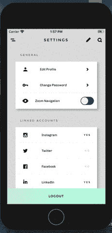
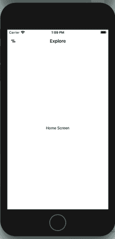
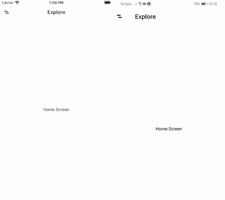
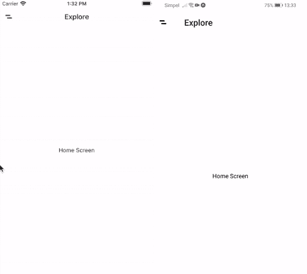
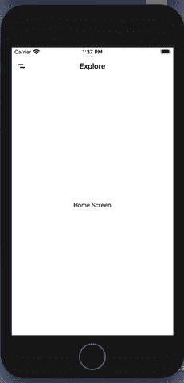
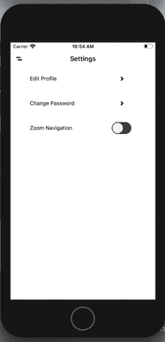

# 如何使用 React Native 个性化您的应用导航体验

> 原文：<https://javascript.plainenglish.io/personalised-navigation-transition-effects-with-react-native-fc1493a4b7a9?source=collection_archive---------0----------------------->

我最近在我的一个应用中创建了一个设置选项，为用户提供了一种个性化导航体验的方式。在本教程中，我将展示如何在 React Native 中实现这一点。



Implementation of personalisation option in my recent project

更具体地说，这个简短的教程将演示如何利用 React Navigation v5 的许多定制选项，您可以:

*   应用嵌套的堆栈导航器来实现不同的屏幕过渡效果。
*   为 iOS 和 Android 创建匹配的屏幕过渡。
*   自定义屏幕过渡动画，创造各种有趣的效果。
*   通过简单的设置开关在不同的屏幕过渡效果之间切换。

在本教程结束时，您应该对 React Navigation 提供的许多定制选项有所了解。

**React Native Starter Kit** :以上是取自*React Native Share Starter Kit*的样品，在[这里](https://market.nativebase.io/view/react-native-share-app-theme)可以买到。

**React 原生资源:**想要访问这个项目的源代码和其他 React 原生资源？然后[注册我的简讯](http://knowlephant.com/)。

*注意:本教程的结果是上述 gif 的精简版本，它是取自“React Native Share Starter Kit”的一个示例。*

# 设置嵌套堆栈导航器

这个应用程序的基础是两个嵌套的堆栈导航器中的屏幕集合:

*   *MainNavigationStack* ，保存应用程序的主屏幕，默认情况下以水平导航过渡效果显示。
*   *PopupNavigationStack* ，保存所有显示垂直导航转换动画的屏幕。

当谈到嵌套导航器时，重要的是要意识到这是一种带有来自 [React 导航文档](https://reactnavigation.org/docs/nesting-navigators/)的警告消息的做法:

> 我们建议将嵌套导航器减少到最低限度…将嵌套导航器视为实现您想要的 UI 的一种方式，而不是组织您的代码的一种方式。

因为我们将创建两种类型的导航过渡——水平和垂直用于我们的“默认”设置，放大和缩小用于我们的自定义设置——我们没有其他选择，只能嵌套我们的导航器。

首先，[建立一个新的 Expo 项目](https://docs.expo.io/get-started/create-a-new-app/)，并在新项目中安装所有需要的【React 导航依赖项。

> 在这个演示中，我假设你有一些开发基本屏幕和视图的经验。因此，我不会详细讨论如何对本演示中使用的每个屏幕和组件进行编码。



The initial project screens and navigation setup

现在我们的新项目设置已经准备好了，让我们构建四个主屏幕和一个菜单屏幕。然后，这些屏幕应该被分组到 routes 文件中的两个嵌套导航堆栈中，如下所示:

# 为 iOS 和 Android 添加相同的过渡效果

你可能已经注意到，在使用 React Navigation 的默认设置时，iOS 和 Android 提供了不同的屏幕过渡效果:



iOS (left) and Android (right)

幸运的是，我们可以选择修改这些过渡，并为我们的 iOS 和 Android 应用程序提供类似的屏幕过渡动画。为此，我们需要应用 React 导航 API *附带的*cardstyleinterpolator*和*headerstyleinterpolator*。*

您可能会问，这些应该应用于哪个堆栈导航器选项？React 文档可能会提供一些见解:

> 您只能从导航器的一个屏幕组件中修改导航选项。这同样适用于嵌套为屏幕的导航器。

不幸的是，这个建议不适合我们的设置！让我们通过更新*主*导航堆栈屏幕和*弹出*导航堆栈屏幕的选项道具来看看:

```
const RootStackScreen = () => {
  return (
    <RootNavigationStack.Navigator>
      <RootNavigationStack.Screen
        name="Main"
        component={MainStackScreen}
        options={({ route, navigation }) => ({
          //...OTHER OPTIONS
          headerStyleInterpolator: HeaderStyleInterpolators.forStatic,
          cardStyleInterpolator: CardStyleInterpolators.forHorizontalIOS,
        })}
      />
      <RootNavigationStack.Screen
        name="Popup"
        component={PopupStackScreen}
        options={({ route, navigation }) => ({
          //...OTHER OPTIONS
          headerStyleInterpolator: HeaderStyleInterpolators.forStatic,
          cardStyleInterpolator: CardStyleInterpolators.forVerticalIOS,
        })}
      />
    </RootNavigationStack.Navigator>
  );
};
```

您会注意到，虽然弹出屏幕的垂直过渡动画显示正确，但主堆栈屏幕的水平过渡保持不变。

解决方案是采用不同的解决方案，即将我们主屏幕的*cardstyleinterpolator*和*headerstyleinterpolator*函数放到导航堆栈的 *screenOptions* props 中，就像这样:

虽然这看起来很尴尬，但我们现在已经为 iOS 和 Android 提供了相同的默认屏幕转换动画。



iOS (left) and Android (right)

接下来，让我们实现我们的应用程序的自定义缩放过渡效果。

# 创建您自己的自定义插值器

对于我们追求的稍微复杂一点的过渡效果，我们不能再使用 React Navigation 的默认过渡插值器。这意味着我们需要创造我们自己的。

我们的目标是过渡动画是我们的*弹出*屏幕的缩小效果，而不是每个*主*屏幕的放大效果。



设置自定义屏幕转换的关键概念是 c*current*和 n *ext* 属性，这些属性被传递给*header style interpreter*和*cardstylender*函数的参数:

```
screenOptions={{
  headerStyleInterpolator: ({ current, next ]) => headerStyleInterpolator(current, next),
  cardStyleInterpolator: ({ current, next ]) => cardStyleInterpolator(current, next),
}}
```

*当前*属性保存正在被导航离开的屏幕的过渡进度值，而*下一个*属性保存将被导航到的屏幕的过渡进度值。

> 请注意，如果屏幕是堆栈导航器中的最后一个屏幕(或堆栈导航器中的唯一屏幕)，则下一个参数将始终保持未定义状态。

现在，我们可以访问传入和传出屏幕的过渡进度，我们可以设置我们的过渡动画。我们的实现应该是这样的:

*   当堆栈中的当前屏幕离开我们的视图时，它将从 1 缩放到 2。同时，当堆栈中的下一个屏幕(如果存在的话)进入我们的视图时，它将从 0 缩放到 1。
*   当堆栈中的当前屏幕进入我们的视图时，它将从 2 缩放到 1(即当导航回以前的屏幕时)。与此同时，当堆栈中的下一个屏幕(如果存在)离开我们的视野时，它将从 1 缩放到 0。

对于*头部样式内插器*，我们基本上也是这样做的，添加了一些额外的翻译动画来创建放大(从中心)和缩小(向上)的幻觉。

最后一步是导入我们的助手并更新堆栈导航器*屏幕选项*来测试我们的缩放过渡效果。

> 请注意，您可能想以稍微慢一点的速度测试过渡。您可以通过如下设置 transitionSpec 选项来实现:

有一件事你会注意到，进入屏幕的标题被标题栏覆盖，这导致了不必要的效果。这很容易通过设置来解决…

```
headerTransparent: true,
```

…在上面的屏幕任选项里面。

最后，您会注意到，在应用于我们的 *cardStyle* 的缩放效果之下，我们的主屏幕继续显示水平过渡效果。


iOS (left) and Android (right)

要禁用所有主屏幕的水平滑动，我们必须在主标签上设置*动画启用*属性。导航器:

```
<MainNavigationStack.Navigator
  screenOptions={{
    animationEnabled: false,
  }}
>
  //... SCREENS
</MainNavigationStack.Navigator>
```

> 请注意，这也是 React Navigation 的一个谜团，为什么这个设置在应用于我们“主”屏幕堆栈的选项道具时会不起作用。如果你能澄清这件事，请留下评论！

# 使用可选的过渡效果切换开关个性化您的应用程序

本教程的最后一步是启用/禁用自定义过渡效果，作为用户的个性化选项。为此，我们需要两件事:

*   向我们的应用设置菜单添加一个切换开关。
*   将我们的切换设置存储在上下文中，使得我们的导航堆栈可以呈现我们的自定义过渡效果或默认过渡效果。

> 注意，本教程中应用的 React 上下文设置与这里描述的完全相同。我还将假设您有将开关切换动作分派给减速器的经验。

一旦上下文和设置开关设置完成，剩下的实现就相当简单了。

剩下的就是在我们的导航栈中提供对上下文的访问，并基于我们商店中的 *enableCustomNavigation* 值，呈现定制或默认的过渡效果:

还有最后一件事要处理。还记得之前我们禁用了*主*屏幕的动画以消除水平过渡效果吗？这意味着我们还需要根据上下文状态有条件地启用/禁用动画:



End result

这样我们的设置就完成了。如果您计划将此设置应用到您自己的项目中，或者如果您注意到我的代码有问题，请在下面留下评论！

## 简单英语的 JavaScript

你知道我们有三份出版物和一个 YouTube 频道吗？在 [**plainenglish.io**](https://plainenglish.io/) 找到所有内容的链接！