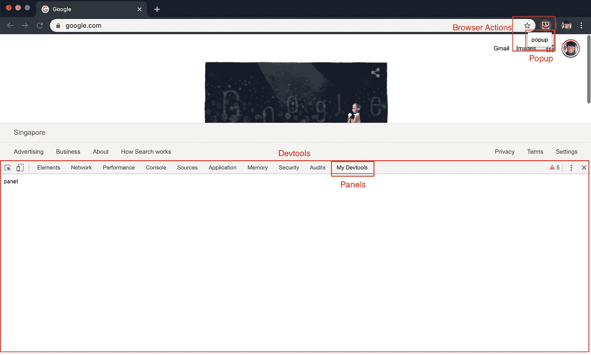
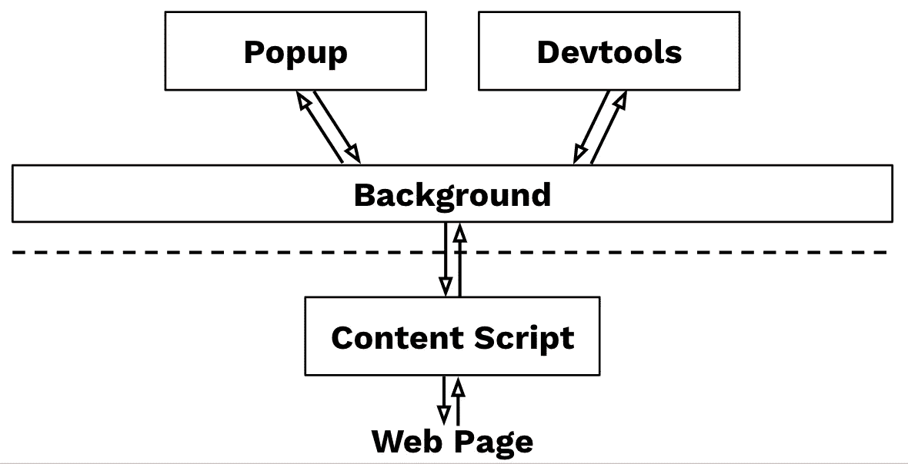
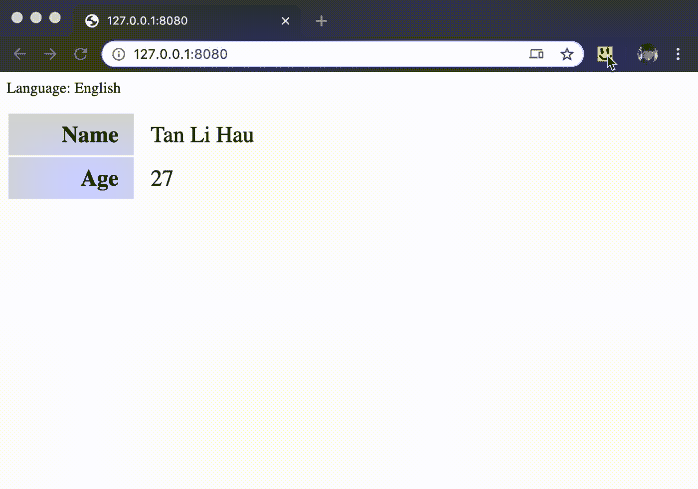
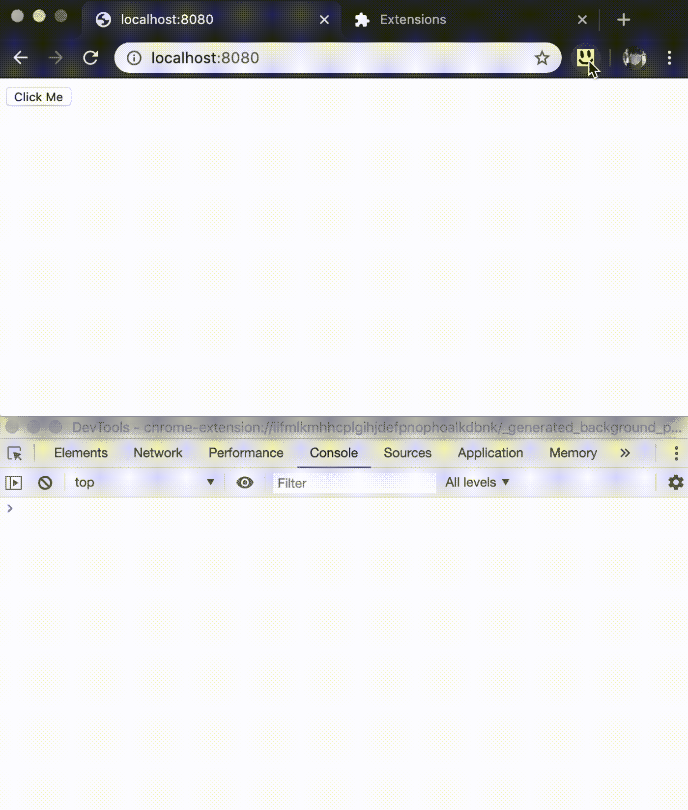
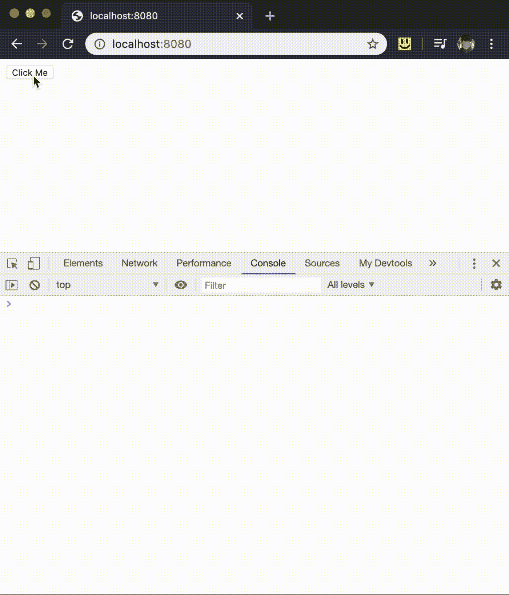

# 通过创建自己的 Chrome 扩展来个性化您的 Web 开发工作区

> 原文：<https://javascript.plainenglish.io/personalize-your-web-development-workspace-by-creating-your-own-a-chrome-extension-7a817e3fbfe9?source=collection_archive---------8----------------------->

# 摘要

Chrome extension 允许我们向浏览器添加功能，个性化我们的开发体验。React DevTools 就是一个很好的例子，它允许 React 开发者通过 Chrome DevTools 检查和调试虚拟 DOM。

在这次演讲中，我将探讨如何开发你的 Chrome 扩展，以及如何使用它来改进你的开发工作流程。

希望在演讲结束时，你能够为你的开发工作空间编写你的 Chrome 扩展。

# 概观

一个 Chrome 扩展由几个组件组成，这些组件可以分解成[后台脚本](https://developer.chrome.com/extensions/background_pages)、[内容脚本](https://developer.chrome.com/extensions/content_scripts)、一个[选项页面](https://developer.chrome.com/extensions/options)、 [UI 元素](https://developer.chrome.com/extensions/user_interface)。

后台脚本**就像你的 Chrome 扩展的后台线程。在这里，您可以观察浏览器事件并修改浏览器行为。**

**内容脚本**在网页的上下文中运行。允许访问和修改网页的 DOM。它是向扩展提供网页信息的地方，也是为网页提供与扩展通信的钩子的地方。

**选项页面**是一个独立的页面，用户可以在这里修改你的 Chrome 扩展的行为。

**UI 元素**就是我们通常认为的 chrome 扩展，包括:

*   [浏览器动作](https://developer.chrome.com/extensions/user_interface#browser_action) *(地址栏旁边工具栏中的小图标)*
*   [弹出](https://developer.chrome.com/extensions/user_interface#popup) *(点击工具栏图标时显示的浮动窗口)*
*   [上下文菜单](https://developer.chrome.com/extensions/user_interface#context_menu) *(是的，您可以定制您的右键上下文菜单)*
*   [devtools 面板](https://developer.chrome.com/extensions/devtools)*(dev tools 中的新面板)*
*   [自定义页面](https://developer.chrome.com/extensions/user_interface#override) *(覆盖历史、新标签或书签页面)*

现在你知道了 Chrome 扩展的不同组件，让我们看看每个扩展中最重要的文件`manifest.json`。

`manifest.json`是你声明 chrome 扩展的地方:

你可以在`manifest.json`中声明所有的 UI 元素。您还可以在后台脚本中以编程方式启用它们。

例如，当站点不使用 React、使用开发 React 和使用生产 React 时，React Devtools 会显示不同的 React 徽标:

注意，`browser_action`和`devtools_page`字段的`options_page`、`popup`接受一个 HTML 页面的路径。您可以将 HTML 页面视为任何 web 应用程序，您可以使用任何您喜欢的框架来构建它。比如 React Devtools 就是用 React 打造的！

*popup.html is just like any web app, that can be build with any web framework*

对于 devtools 页面，您需要以编程方式向 devtools 添加面板:

# 组件之间的通信

由于只有内容脚本在 web 页面的上下文中运行，如果您的扩展需要与 web 页面进行交互，您将需要某种方式从内容脚本与扩展的其余部分进行通信。

例如，React Devtools 使用内容脚本来检测 React 版本，并通知后台脚本相应地更新页面操作图标。

Chrome 扩展的不同组件之间的通信通过使用[消息传递](https://developer.chrome.com/extensions/messaging)来工作。有用于[一次性请求](https://developer.chrome.com/extensions/messaging#simple)以及[长期连接](https://developer.chrome.com/extensions/messaging#connect)的 API。

一次性请求 API 对于一个简单的扩展来说工作得很好，但是当扩展的不同部分之间有更多的通信时，它会变得更加混乱。

我特别研究了 [React Devtools](https://github.com/facebook/react/tree/master/packages/react-devtools-core) [如何工作](https://github.com/facebook/react/blob/master/packages/react-devtools/OVERVIEW.md)，因为要在 Devtools 面板中显示更新后的 React 虚拟 DOM 树，devtools 和内容脚本之间需要大量的通信。

经过一些研究和实验，我为我的 Chrome 扩展提出了以下架构:

*   所有的扩展组件(例如:弹出窗口、内容脚本、开发工具)都与后台脚本保持着长期的连接
*   后台脚本充当中央控制器，接收来自每个组件的消息，并将它们分发到相关组件
*   每个组件就像是[角色模型](https://en.wikipedia.org/wiki/Actor_model)中的一个角色，它根据收到的消息行动，并在需要的地方向其他角色发送消息。

# 内容脚本和网页之间的通信

内容脚本在 web 页面的上下文中运行，这意味着它可以与 DOM 交互，比如操纵 DOM 结构和向 DOM 元素添加事件侦听器。

此外，内容脚本可以在网页的上下文中访问页面历史、cookies、本地存储和其他浏览器的 API。

然而，内容脚本存在于网页的不同全局范围中。这意味着，如果您的 web 应用程序声明了一个全局变量`foo`，内容脚本就不可能访问它。

反之亦然:

但是，内容脚本仍然可以在 web 应用程序中声明一个变量，因为它可以访问同一个 DOM，所以它可以通过添加一个脚本标记来这样做:

> ***注意:*** *取决于* [*当您开始运行您的内容脚本*](https://developer.chrome.com/extensions/content_scripts#run_time) *时，DOM 在您的内容脚本执行时可能已经构建，也可能没有构建。*

但是，您不能将 web 应用程序中的变量声明到内容脚本范围中。

我偶然发现了一个想法，您的 web 应用程序可以通过 DOM“声明一个变量”,方法是创建一个专门用于内容脚本消费的特殊 DOM 元素:

这在技术上是可能的，尽管我不建议这样做。

相反，您应该使用 [window.postMessage](https://developer.mozilla.org/en-US/docs/Web/API/Window/postMessage) 在网页和内容脚本之间进行通信。

> ***注意:*** *一定要添加一个标识符字段，例如:* `*"source"*` *，对事件数据进行过滤，如果不过滤掉您使用中发送的事件，您会惊讶于通过* `*window.postMessage*` *传递的数据有多少。*

## 为您的扩展提供一个挂钩

如果你安装了 [React Devtools](https://chrome.google.com/webstore/detail/react-developer-tools/fmkadmapgofadopljbjfkapdkoienihi) ，尝试在你的控制台中键入`__REACT_DEVTOOLS_GLOBAL_HOOK__`。这是一个由 React Devtools 内容脚本注入的全局对象，为您的网页提供一个与内容脚本通信的简单接口。

您也可以这样做:

你可以[查看我的 repo](https://github.com/tanhauhau/chrome-extension-demo/tree/master/basic) 来获得一个基本的 Chrome 扩展设置，它包含了上面所有的代码。

恭喜，我们已经通过了开发 Chrome 扩展的最困难的部分！

现在，让我们看看我们可以开发什么样的 Chrome 扩展来帮助我们的日常开发。

# 你能用 Chrome 扩展做什么

不知道你怎么样，但是 [React DevTools](https://chrome.google.com/webstore/detail/react-developer-tools/fmkadmapgofadopljbjfkapdkoienihi?hl=en) 和 [Redux DevTools](https://chrome.google.com/webstore/detail/redux-devtools/lmhkpmbekcpmknklioeibfkpmmfibljd?hl=en) 对我的日常 React 开发帮助极大。除此之外，我一直在使用[editthiscokie](https://chrome.google.com/webstore/detail/editthiscookie/fngmhnnpilhplaeedifhccceomclgfbg)进行 Cookie 管理， [JSON Formatter](https://chrome.google.com/webstore/detail/json-formatter/bcjindcccaagfpapjjmafapmmgkkhgoa) 一直在帮助我检查 Chrome 中的`.json`文件，还有许多扩展使我的开发工作更容易，我在本文末尾列出了这些扩展。

如您所见，这些扩展是专门化的，在我发展的某个方面很有帮助:

*   **React Devtools** 用于调试 React 虚拟 DOM
*   **Redux 开发工具**用于调试 Redux 存储和时间旅行
*   **编辑 ThisCookie** 用于调试 Cookie
*   …

它们专门用于一般的 React 或 Redux 项目，但对于您个人或您团队的开发工作空间来说还不够专门。

在下文中，我将向您展示几个示例，以及每个示例的源代码，希望这些示例能启发您创建自己的 Chrome 扩展。

# 切换环境和功能

一个 web 应用程序通常在不同的环境*(例如:测试、试运行、现场)*、不同的语言*(例如:英语、中文)*中提供服务，并且可能有不同的功能切换来启用/禁用 web 应用程序上的功能。

根据您的 web 应用程序设置，切换环境、语言或功能切换可能需要您模拟它，或者手动编辑 cookie /本地存储(如果您的标志保存在那里)。

想想你需要如何教育每个新的开发人员/ QA / PM 如何手动切换环境、语言或特性。

相反，如果你有一个 Chrome 扩展，它提供了一个直观的用户界面，让你可以做到这一点呢？

您可以让扩展写入 cookie /本地存储。您可以从扩展订阅事件，并在您的 web 应用程序中进行适当的更改。

随你怎么做，这是你的 Chrome 扩展。

[演示代码](https://github.com/tanhauhau/chrome-extension-demo/tree/master/feature-toggles)

# 报告屏幕录制的错误

也许你正在使用屏幕记录工具来记录 bug，或者你正在使用一些付费服务，像 [LogRocket](https://logrocket.com/) 来记录每一次用户交互，但是它们与你的 bug 跟踪系统集成得如何呢？

你可以有一个 Chrome 扩展，使用 [chrome.tabCapture](https://developer.chrome.com/extensions/tabCapture) API 来记录标签的视频记录，获取你的应用程序的基本信息，比如你的 web 应用程序的状态、控制台错误、网络请求，并将它们发送到你的错误跟踪系统。

您可以传递开发设置特有的信息，例如 Redux store/[Vuex](https://vuex.vuejs.org/guide/)store/[Svelte store](https://svelte.dev/tutorial/writable-stores)状态和操作历史、特性切换、请求 id…

你还可以整合你的 bug 追踪系统，无论是[吉拉](https://www.atlassian.com/software/jira)、[特雷罗](http://trello.com/)、[谷歌表单](http://sheets.google.com/)、电子邮件还是一些内部系统。

其理念是您的扩展可以根据您的开发工作区设置进行个性化。

[演示代码](https://github.com/tanhauhau/chrome-extension-demo/tree/master/bug-recording)

# 调试事件和分析

调试和测试日志和分析事件通常很麻烦。

通常，尤其是生产版本，事件不会在控制台中注销。因此，检查和调试这些事件的唯一方法是使用网络检查器，在这些事件被发送到后端服务器时检查请求体。

如果我们只在安装了扩展时才注销这些事件，会怎么样？

就像 [Google Analytics Debuger](https://chrome.google.com/webstore/detail/google-analytics-debugger/jnkmfdileelhofjcijamephohjechhna) 一样，该扩展提供了一个打开 Google Analytics 客户端调试模式的开关。

[演示代码](https://github.com/tanhauhau/chrome-extension-demo/tree/master/events-analytics)

# 结束语

我已经向你展示了如何创建你的 Chrome 扩展，也提供了一些扩展的想法。轮到你编写你的 Chrome 扩展并创建你的个性化开发工作空间了。

和我分享一下你的 Chrome 扩展能做什么，期待看到它们！

# 对我的日常发展有帮助的扩展

*   [React Devtools](https://chrome.google.com/webstore/detail/react-developer-tools/fmkadmapgofadopljbjfkapdkoienihi) —检查 React 虚拟 DOM
*   [Redux DevTools](https://chrome.google.com/webstore/detail/redux-devtools/lmhkpmbekcpmknklioeibfkpmmfibljd?hl=en) — Redux 商店检查和时间旅行
*   [JSON 格式化程序](https://chrome.google.com/webstore/detail/json-formatter/bcjindcccaagfpapjjmafapmmgkkhgoa) —使 JSON 易于阅读。
*   [编辑 Cookie](https://chrome.google.com/webstore/detail/editthiscookie/fngmhnnpilhplaeedifhccceomclgfbg) —调试页面上的 Cookie
*   [谷歌分析调试器](https://chrome.google.com/webstore/detail/google-analytics-debugger/jnkmfdileelhofjcijamephohjechhna) —调试谷歌分析
*   [OpenLink 结构化数据嗅探器](https://chrome.google.com/webstore/detail/openlink-structured-data/egdaiaihbdoiibopledjahjaihbmjhdj) —调试网页中的结构化元数据
*   [VisBug](https://chrome.google.com/webstore/detail/cdockenadnadldjbbgcallicgledbeoc) —网页设计调试工具
*   [Wappalyzer](https://chrome.google.com/webstore/detail/wappalyzer/gppongmhjkpfnbhagpmjfkannfbllamg) —检测网页上的网络技术
*   **Shopee dev tools**——仅在内部提供，[加入我们的团队](https://grnh.se/2cf965792)，我将向您展示使用 **Shopee DevTools** 还能做些什么惊人的事情！

[*在 twitter 上关注我*](https://twitter.com/lihautan) *获取我的其他文章。最初发表于***。**