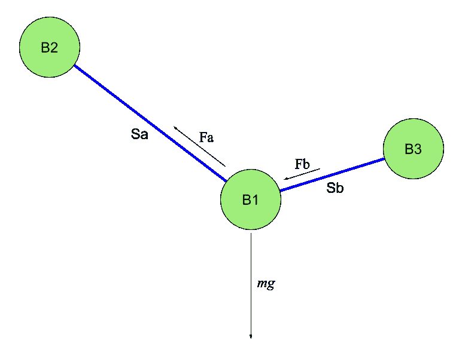

# 在 HTML5 画布中使用 JavaScript 进行物理模拟

> 原文：<https://javascript.plainenglish.io/physical-simulation-with-javascript-in-the-html5-canvas-27dc6ea121cf?source=collection_archive---------1----------------------->

## 展示真实行为的球和弹簧的演示动画


Photo by [Noah Silliman](https://unsplash.com/@noahsilliman?utm_source=medium&utm_medium=referral) on [Unsplash](https://unsplash.com?utm_source=medium&utm_medium=referral)

在这篇文章中，我将向你展示一个例子，如何使用一些基本的物理思想来创建一个简单的具有逼真行为的动画。我们将使用 JavaScript 在 HTML5 画布中呈现动画。

在我们深入研究代码之前，先看看在您的浏览器中运行的[模拟。尝试用鼠标点击并拖动其中一个绿色粒子。](https://doncross.net/chainsim/)

这个基于浏览器的动画的完整代码可以在 [this GitHub repo](https://github.com/cosinekitty/chainsim) 中找到。只有两个文件，`index.html`和`chain.js`，它们没有外部依赖。您可以将它们下载到自己的计算机上，修改代码，然后在浏览器中查看结果。

## 物理模型

在这个示例程序中，模拟的世界是二维的。这个世界上有三种实体:球、锚、弹簧。

球是一个质点，它有质量 *m* ，位置( *x* ， *y* )，速度( *vx* ， *vy* )。质量是恒定的，但是位置和速度向量在每个动画帧期间根据作用在球上的总力进行更新。这些球被描绘成绿色的圆圈。还有一个重力加速度 *g* = 9.8 米/秒将球拉向屏幕底部。

锚是一种特殊的球，不会移动。(实际上，你可以用鼠标移动它，就像你可以移动任何其他球一样。但除此之外，一个锚留在原地。)模拟中只有一个锚点，但是你可以通过在`chain.js`中编辑代码来改变它。锚看起来像红色方块。

弹簧是一条弹性线段，其端点连接两个球。每个弹簧恰好连接两个球，但是一个球可以连接任意数量的弹簧。每个弹簧有两个属性:一个*静止长度*和一个*弹簧常数*。这两个都是正实数，定义了弹簧对连接到两端的两个球施加多大的力。

剩余长度 *L* 是弹簧未拉伸或压缩时的长度。在这个长度上，它对它所连接的球施加的力为零。 *L* 用米表示。

弹簧常数 K 表示弹簧的“强度”,意思是弹簧抵抗拉伸或压缩远离其静止长度的程度。 *K* 以牛顿每米(N/m)为单位表示。

现在我们知道了玩家，让我们来探索模拟器是如何实时计算他们的行为的。

## 画布中的动画

动画本身是通过以下步骤一次绘制一个动画帧来实现的:

*   执行物理计算以更新模型状态。
*   擦除画布的内容。
*   画出所有的球和弹簧。
*   用 10 毫秒的计时器回调来调度另一个动画帧。

## 计算力

在`chain.js`你会发现一个类`Simulation`。里面是一个成员函数`Update`。它的参数`dt`，以秒为单位，代表了一个小的时间增量，通过这个时间增量来更新模拟的状态。在阅读`Update`函数的代码之前，先了解一下作用在球上的力会有所帮助。



Spring and weight forces acting on the ball B1.

每个弹簧都作用在与之相连的两个球上。此时弹簧 *Sa* 以大小相等方向相反的力 *Fa* 作用在滚珠 *B1* 和 *B2* 上。同样， *Sb* 以大小相等方向相反的力 *Fb* 作用在 *B1* 和 *B3* 上。

让我们假设弹簧 *Sa* 在所描绘的时刻被拉伸得比其静止长度更长。这就是为什么力 *Fa* 的箭头指向远离球 *B1* 的方向。同时，相同的力 *Fa* 在相反的方向拉 *B2* ，朝向 *B1* 。

另一方面，假设弹簧 *Sb* 被压缩得比其静止长度短。因此， *Sb* 试图将 *B1* 和 *B3* 推开。这就是为什么力矢量 *Fb* 有一个指向 *B1* 的箭头。

还有球的重量 *mg* 把它往下拉，这里 *m* 是球的质量，单位是千克， *g* = 9.8 m/s 是重力产生的加速度。

函数`Update`将每个球的所有贡献力矢量相加。

Update() calculates forces and updates ball positions and velocities accordingly.

`Update`函数调用`Spring`类中的`AddForce`函数，将模拟中每个弹簧的力添加到它们连接的球上。这是函数:

AddForce() calculates the force of one spring on two balls.

每个弹簧都有一个力，计算方法是将弹簧常数乘以弹簧当前长度与其静止长度之差。力沿着它所连接的两个球之间的直线作用。

## 更新位置和速度向量

在计算了作用在所有球上的力之后，`Update`返回并根据这些力更新每个球的位置和速度。球的运动行为由熟悉的牛顿物理方程 *F* = *ma* 决定。这表示质量 *m* 上的合力矢量 *F* 导致质量以矢量 *a* 加速。

模拟以离散时间步长δ*t*进行。在物理学中，加速度被定义为速度相对于时间的瞬时变化率，或者用微分学符号表示为*a*= d*v*/d*t*。我们将加速度近似为有限变化的比率*a*=δ*v*/δ*t*。将这个近似值与 *F* = *ma* 放在一起，我们可以将球的速度矢量的变化解为δ*v*=(*F*/*m*)δ*t*。我们将在 *x-* 和 *y* 方向上作用在滚珠上的合力 *F* 除以滚珠的质量 *m* ，再乘以时间增量δ*t*，得到在 *x* 和 *y* 方向上的速度变化。

## 矩阵中的一个小故障

但是δ*v*的这种近似会在仿真中引起问题。如果你使用那个简单的公式，你会发现模拟变得不稳定。与无限小的时间增量 d *t* 不同，有限的增量δ*t*会导致系统总能量(动能加势能)的轻微不完美。这可能会导致球随着时间的推移移动得越来越快，并在屏幕上爆炸。

为了缓和这种行为，我们将所有的速度向量乘以一个略小于 1 的摩擦系数。随着时间的推移，这将抑制球的运动，并保持模拟稳定。您可以通过编辑 JavaScript 代码中常量`FrictionHalfLifeSeconds`的值来调整这种摩擦行为。你把这个半衰期值做的越小，摩擦就越多。把它做得足够小，所有的东西看起来都像是在穿过蜂蜜。把半衰期常数弄得太大，就会看到爆炸问题。

`Update`函数还通过将速度向量乘以时间δ*t*来更新每个球的位置，从而计算出球的位置改变了多少。

## 动画

除了上面提到的摩擦技巧，通过为每个显示的动画帧执行 1000 次增量模拟更新，模拟稳定性得到增强。这使得δ*t*值为屏幕更新时间间隔大小的 1/1000。δ*t*的值越小，模拟越精确。

这种每帧的计算量可能听起来有些过分，但是 JavaScript 在这些日子里效率惊人。现代浏览器将 JavaScript 编译成本机代码，并且进行了惊人的优化。在数字处理方面，它的性能远不及 C 或 Fortran，但也不容小觑。

实际上，我对这段代码的性能测试显示，真正的瓶颈根本不在物理计算中。代码中最昂贵的部分是每次调用`Render`函数时擦除画布:

```
context.clearRect(0, 0, canvas.clientWidth, canvas.clientHeight);
```

所以，如果你渴望让这段代码运行得更快，我建议你从这里开始！

我希望您喜欢修补这些代码。我确信有一些数值模拟专家可以告诉我改进的方法，特别是用有限的时间增量更好地逼近物理行为。我很想收到你的来信！请随意发表评论，这样我们都可以学习。

## 资源

*   [ChainSim](https://doncross.net/chainsim/) —此处描述的基于浏览器的实时算法演示。
*   [GitHub Repo](https://github.com/cosinekitty/chainsim)—chain sim 的完整源代码。