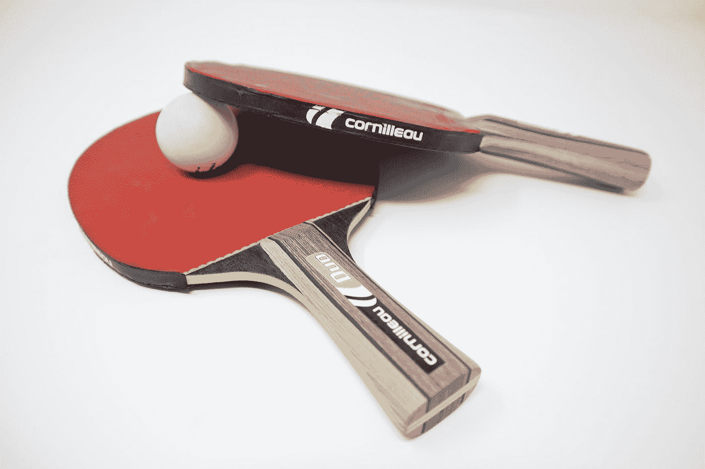

# 乒乓编程—正确配对

> 原文：<https://javascript.plainenglish.io/ping-pong-programming-55f7d8b69f99?source=collection_archive---------9----------------------->

## 红色，开关，绿色，重构！

Photo by [Frederick Tubiermont](https://unsplash.com/@callmefred?utm_source=medium&utm_medium=referral) on [Unsplash](https://unsplash.com?utm_source=medium&utm_medium=referral)

我打算给你们写一个故事，解释鲍勃和杰夫这两个普通的程序员是如何集思广益，发明结对编程的。我打算用鲍勃和杰夫的棒人艺术作品来支持它。

但结果是我甚至不会画棍子，而且我也懒得学。所以我会用我知道的方式来解释。

# 什么是乒乓编程？

简而言之，乒乓编程是结对编程和测试驱动开发的结合。在我的职业生涯中，我尝试并观察了几种不同的与另一个开发者配对的方法，包括 [BitBucket 的专利技术](https://bitbucket.org/spooning/)。

问题是，这些“方法”大部分根本不是方法，而是两种人格结合在一个单一任务上的随机结果。结果在很大程度上取决于许多因素，包括每个开发人员的经验水平、他们的自信程度以及他们沟通的有效性。

以最常见的配对“技术”为例，这就是“驾驶员/导航员”模式。理论是一个开发人员“开车”，用键盘控制方向，打出解决方案。另一个开发人员通过考虑更大的画面来“导航”，关注前面的问题，确保解决方案解决正确的问题，并且通常为驱动程序提供的实现提供建议和替代方案。

这通常被用作知识共享或指导技术，允许有经验的开发人员导航，而初级开发人员通过驾驶来学习。在这种情况下，它可能是有效的，但非常依赖于导航者的沟通技巧。试过听写代码吗？如果没有，尝试一下驱动程序/导航程序模式——你会喜欢向你的驱动程序解释你想要的那组花括号。祝你好运，不要只是抓住键盘，因为这通常更容易。在这种情况下，说“如果我直接去做，会更快”通常意味着有些东西不起作用。

你可能会认为口述代码是不匹配配对伙伴的味道，事实的确如此。但是我经常不得不指导那些在框架或语言方面经验很少或没有经验的开发人员，所以需要一定量的文字解释。如果你足够幸运，有两个有经验的开发人员配对，那就再好不过了。想象你是导航员，看着你的经验丰富的司机充分地导航代码库，和你一样快速地预见问题。你的输入并不是真正需要的，所以你基本上只是看着别人写代码。然后你会收到你妻子的短信，或者网飞的电子邮件。你瞥了一眼你的手机，接下来你知道的是，你完全脱离了手头的任务。

根据我的经验，保持专注是驾驶员/导航员模式中最难的挑战，因为没有结构，太容易懒惰或脱离。不管开发人员的经验如何，这都是事实。谁有键盘，谁就经常忙碌，而另一个开发人员经常会检查电子邮件或盯着空间。

也许这只是我的问题——也许我缺乏专注或者天生懒惰。但在我练习乒乓球编程的近六年时间里，我从未见过这种情况发生。让我们再深入一点。

## 红色、绿色、重构

在你理解乒乓编程之前，理解测试驱动开发是有帮助的。这是在编写代码之前编写测试的过程。它是这样工作的:

1.  我写了一个测试——刚好足以让测试失败。这应该最多只需要几分钟，因为我不是在编写一个完整的测试套件，而只是在做我的第一个断言。我不能夸大这一点——不要试图跑完全程，只要到达第一个障碍！
2.  我修改了测试。我修正它，使测试通过，即使这意味着现在返回一个硬编码的结果。请记住，我不是在写最终结果，而是在每一个周期中逐步改进我的解决方案。如果任何其他测试在这个阶段中断，我也会修复它们。
3.  一旦所有的测试都通过了，我就会查看我的代码并决定是否有任何需要改进的地方。因为我有一套测试，所以我可以相对安全地进行重构。

那么如果那是 TDD，那什么是 PPP 呢？很简单，真的，在步骤 2 之后**把键盘给你的搭档就行了。这样，你就不断地通过编写测试来挑战对方。这就像下战书，但少了一点对抗性。**

我听到你们问，这种方法带来了什么？去问吧，我等着。

嗯，这让你们俩都很投入。在轮不到你开车的时候，你最多只能脱离几分钟。在那段时间里，你会敏锐地观察你的伴侣，看看他们是否能解决你失败的测试，以及他们会给你什么样的测试。

当你在观察和等待的时候，你也可以写下一个你认为需要覆盖的测试用例的列表。通过不断添加到这个列表中，进入下一个测试应该相对容易，因为您可以从列表中选择一个。通常它会与你最近进行的测试相关，但如果不是，这就是这个列表的目的——它会阻止你忘记你仍然需要编写的利基测试用例。

这种方法也让你的沟通更清晰。失败的测试通过陈述预期的结果来帮助沟通。一开始可能不完美，但没关系。通过不断的迭代，测试套件将会改进，并使系统应该如何表现变得非常清楚。

它也有 TDD 的所有好处，尤其是不要计划太远(只到下一个测试)，我们在面对变化时更灵活。你甚至可以说我们更加敏捷。

# 勇气

极限编程中有一种品质，在开发环境中有时听起来不合适。是勇气。在这种情况下，勇气就是大胆地说出来，说出真相，即使这不是客户想要听到的。

勇气也许是结对开发人员最重要的品质，紧随其后的是谦逊。作为一名开发人员，要有勇气展示自己的弱点，当你不知道答案时，要谦虚地承认。当你不知道一些简单问题的答案而不得不去谷歌的时候，通常你会直接去做。如果有人在看着你，这种行为会让人觉得是承认失败，承认自己的无知。但是，尽管我们中的一些人试图在同事面前表现得无所不知，但没有人是完美的。我们都有知识上的差距，如果你能向你的同龄人承认这一点，你会比你试图保持外表有更好的时间配对。意识到你的同事也是人有助于你尊重他们和理解他们。它创造了共情，这对配对至关重要。

当我想到我职业生涯中合作过的最好的开发人员时，脑海中浮现的不是那些看起来非常自信的人，而是那些提问的人，他们总是试图学习新的东西。这些人经常成为很好的配对伙伴，因为他们渴望理解，通过提问，他们允许我也这样做。

# 警告

尽管我对乒乓球编程和配对很有热情，但它并不适合所有人。即使对于那些注定喜欢结对并且擅长结对的人来说，这条路也并不平坦。配对很难。刚开始的几个月，我讨厌结对。但是我开始了一份新工作，同时学习了很多其他概念:Java、依赖注入、自动化测试、mocking、TDD、敏捷等等。如果你从未编写过单元测试，你的旅程将会很艰难。如果你没有真正做 TDD 足够长的时间，让它成为你的第二天性，这将是特别困难的。也许先学会这一点会让配对变得更容易。

但是如果你已经认识了一个实践 TDD 的人，一个善于沟通的人，那么你应该和那个人配对，以便学习。TDD 和乒乓编程最好通过观察已经走过那段旅程的人来学习。从博客文章中读到它是一个可怜的替代品。

但是坚持下去。我认识的许多经历过这一旅程的开发人员一开始都坚信这是正确的事情。即使旅途艰难，他们也坚持到底，因为他们相信目的地。相信目的地和你达到目的地的能力。

# 结论

好吧，我会让你得出你自己的结论。显然我喜欢它，否则我不会告诉你去做。除非这一切只是一个阴谋，让我看起来更好，当你们都开始做一半的工作，我正在做…

但是尝试一下，最好是和有结对经验的人一起。遵循这些步骤，而不仅仅是随波逐流，要有勇气和谦卑。您将学到更多，减少担忧。