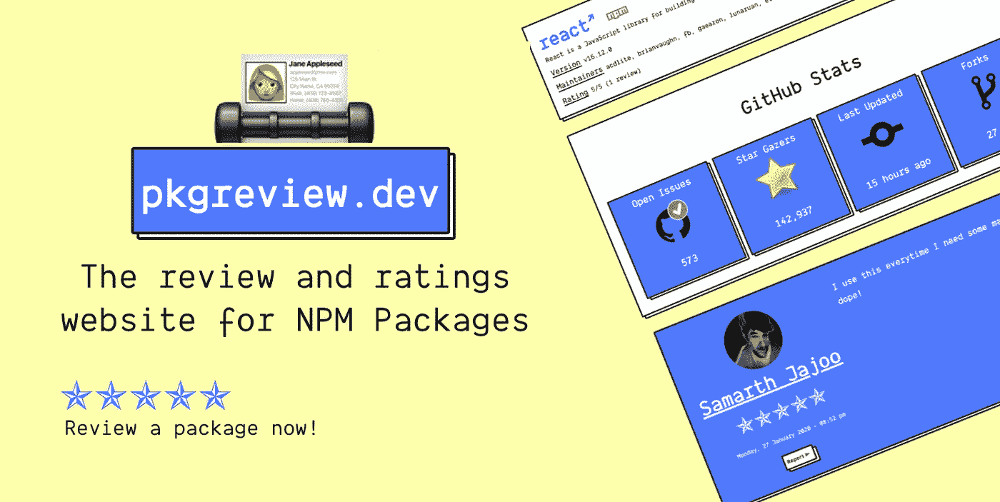
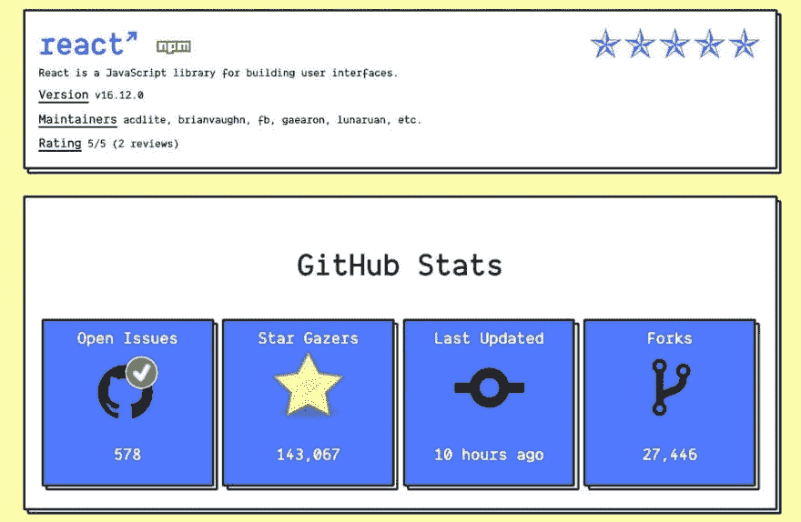

# pkg Review . dev-NPM 套餐的评级和评论网站🎉

> 原文：<https://javascript.plainenglish.io/pkgreview-dev-the-ratings-and-review-website-for-npm-packages-bc0ebd0414c2?source=collection_archive---------9----------------------->

pkgreview.dev 🎉

嘿大家好！🙌

我非常激动地宣布从上周开始我一直在做的副业…

我给它取名 [**pkgreview.dev**](https://pkgreview.dev/) ！完整的产品诞生于一条推特。

The RottenTomatoes for NPM Packages!

# 🎊`pkgreview.dev`

很多人发现很难决定使用什么 NPM 软件包。

有 [pkgreview.dev](https://pkgreview.dev) 来救你了！

📦列出了 30 万个 NPM 包和 GitHub 统计数据！

🎉帮助分析 NPM 软件包

🚨撰写和阅读评论

⭐️明星收视率喜欢*烂番茄*！

NPM Package to analyze and see reviews of.

# 🕹这个想法

很多人发现很难决定使用什么样的 NPM 包、React 组件、模块或库。

**他们最终在 GitHub 上查看社区有多活跃。GitHub 没有告诉你一个清晰的画面。这只是画面的一部分。**

**人们经常错过的**，是使用过图书馆的用户的第一手体验。

`pkgreview.dev`显示包的各种重要元数据(*评论、评级、最后更新、观星者等)。*)并且还展示了关于它们的`other developers' opinion`。

你也可以发表你对 NPM 套餐的评论。🎉

# 🔥建设一个社区

你现在看到的应用程序正处于 MVP 阶段。

为了对大众有用，我们需要更多的评论。作为一名开发人员，你只需对任何有用的包发表评论，就能在这个过程中做出很大的贡献。

这个项目需要 T21 JavaScript 社区的支持。

[**登录 GitHub(需要两秒钟)写下你的第一篇评论！**](https://pkgreview.dev/npm/react)

这是我第一个快速出货的副业项目。请务必给我反馈！🙌

这只是一个开始。

# 在我的 Todolist 里

*   添加对其他包管理器的支持，如 PHP Composer、Docker Hub for Images、PIP for Python 等等！
*   给予包的维护者特殊的权限，比如回复评论或者报告评论。
*   使用人工智能通过在网上阅读软件包来创建评论(例如 GitHub 问题、博客帖子等)。)
*   让 UI 更好，少一些噱头。

只有在你的支持下，我才能实现待办事项列表中的目标。

我喜欢积极的和批评性的反馈🙌

# 关于我

我是 Kumar Abhirup，来自印度的 16 岁 JavaScript React 开发人员，每天都在学习新的东西。

在 Twitter 上与我联系🐦
[我的个人网站和作品集🖥️](https://kumar.now.sh/)

*请在下面评论您改进该产品的更好方法和建议。:)*