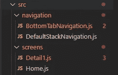

# React Native —使用 React 导航可以做的很酷的事情

> 原文：<https://javascript.plainenglish.io/playing-around-with-react-navigation-3cd9d94e98b1?source=collection_archive---------9----------------------->


Playing around with React Navigation

React 导航是在 React 本地应用中实现导航的最常见方式。我将使用这个库，并给出一些可以用它做的很酷的东西的例子。

在本文中，我将讨论以下主题:

1.  **安装**
2.  **基础**(默认堆栈导航和底部标签导航)
3.  **组合导航**
4.  **导航&认证**

# 1.装置

*初始化 React 本地项目:*

```
npx react-native init AwesomeProject
```

**安装 React 导航**

```
npm install @react-navigation/native
```

**安装依赖关系**

```
npm install react-native-reanimated react-native-gesture-handler react-native-screens react-native-safe-area-context @react-native-community/masked-viewnpm install
```

# 2.基础知识

让我们用两个非常简单的导航器的例子来热身。**堆栈导航**和**底部标签导航。**

## 标准堆栈导航

堆栈导航是最默认的导航类型。顾名思义，屏幕是根据导航的顺序相互堆叠的。

让我们安装所需的依赖项:

```
npm install @react-navigation/stack --save
```


**App.js:导航容器**

NavigationContainer 将处理导航的树和状态。我们希望整个应用程序能够导航，并执行一些基本功能，如导航回前一个屏幕。这就是为什么我们希望将 NavigationContainer 放置在尽可能靠近应用程序根目录的位置。于是，在 App.js 中。

Apps.js with DefaultStackNavigation

**defaultstacknavigation . js** 我们将创建一个带有主屏幕和详细屏幕的堆栈导航。

**Home.js**

**Detail1.js**

现在，结果应该是这样的:


好吧，现在还没什么疯狂的事。

## 底部选项卡导航

通过底部选项卡导航，我们的不同路线将显示在屏幕底部的选项卡中。

让我们安装依赖项:

```
npm install [@react](http://twitter.com/react)-navigation/bottom-tabs --save
```

我们正在回收我们的主页和默认屏幕，但我们将改变导航的类型。



**src/navigation/bottom tab navigation . js:**

我们为底部选项卡导航创建另一个文件。

**App.js:** 我们将渲染 BottomTabNavigation，而不是渲染 DefaultStackNavigation

Apps.js with BottomTabNavigation


与上一个示例相同的设置，但是使用底部的选项卡在不同的页面之间导航。

# 3.组合底部标签和堆栈导航

在我们的 DefaultStackNavigation 中，我们将使用底部的导航，而不是屏幕。这样我们就可以打开另一个导航。当按下主屏幕上的第二个按钮时，导航选项卡将打开，并显示该导航的第一个屏幕。

**App.js:**

使用 StackNavigation 示例中的 App.js

**Home.js:**

**defaultstacknavigation . js:**

**BottomTabNavigation.js**

**Tab1.js:**

**Tab2.js:**


# 4.导航和身份验证

在开发应用程序时，我们希望为未登录的用户隐藏一些内容。

有两种简单的方法可以实现这一点:

*   使用导航器并根据身份验证状态隐藏路由
*   根据身份验证状态使用不同的导航器

**设置:**

让我们用反应上下文来伪造身份验证。我们将添加一个包含身份验证上下文的文件。然后，我们将对现有文件进行一些小的更改，以便它们可以使用 authenticationContext。

*我将 authenticationContext 文件建立在一个博客上，该博客解释了如何使用 React Context。如果您想了解更多关于这个主题的信息，请点击下面的链接。*

**src/state/authentication context . js:**

Based on: [https://kentcdodds.com/blog/how-to-use-react-context-effectively](https://kentcdodds.com/blog/how-to-use-react-context-effectively)

**App.js**

**Home.js**

我们将添加一个按钮来切换我们的认证。我们的认证上下文包含一个经过认证的布尔值，我们将使用它来伪造我们的认证。因此，基本上，我们通过切换身份验证按钮登录和退出。


既然我们已经实现了虚拟认证，我们就可以开始编辑我们的导航了。

## **使用导航器，根据认证状态隐藏路由**

我们将使用身份验证状态来定义哪些路由可以访问，只需添加以下代码:

```
{state.authenticated ? (
<Tab.Screen name="Tab2" component={TabScreen2} />
) : (
<></>
)}
```

在这种情况下，Tab2 只有在经过身份验证时才可见。

**BottomTabNavigation.js**

## 根据身份验证状态使用不同的导航器

根据身份验证状态，我们将使用两个完全不同的导航器。通过这种方法，我们可以区分日志导航和访客导航。

我们创建了一个新的导航文件 src/navigation/authentication navigation . js .
在这个文件中，我们将使用 AuthenticationContext，就像前面的组件一样。

当用户通过身份验证时，我们返回一个 BottomTabNavigator。当用户不在时，将返回一个 StackNavigator。

**authentication navigation . js**

未通过身份验证时，将出现此屏幕:


正如您所注意到的，目前有两个标题是可见的。我们可以简单地通过将代码添加到 DefaultStachNavigation.js:

```
<Stack.Screen
name="Authentication"
component={AuthenticationNavigation}
options={{
   headerShown: false,
}}
/>
```

切换身份验证时，将出现此屏幕:


这总结了一些你可以用反应导航库做的很酷的事情。
如果你喜欢我创作的内容，不要忘记鼓掌，也不要忘记在 Medium 上跟着我。

——托马斯

## **简单英语团队的声明**

你知道我们有四种出版物吗？给他们一个 follow 来表达爱意:[**JavaScript in Plain English**](https://medium.com/javascript-in-plain-english)[**AI in Plain English**](https://medium.com/ai-in-plain-english)[**UX in Plain English**](https://medium.com/ux-in-plain-english)[**Python in Plain English**](https://medium.com/python-in-plain-english)**—谢谢，继续学习！我们还推出了一个 YouTube，希望你能通过 [**订阅我们的简明英语频道**](https://www.youtube.com/channel/UCtipWUghju290NWcn8jhyAw) 来支持我们**

**一如既往,“简明英语”希望帮助推广好的内容。如果您有一篇文章想要提交给我们的任何出版物，请发送电子邮件至[**submissions @ plain English . io**](mailto:submissions@plainenglish.io)**，并附上您的媒体用户名和您感兴趣的内容，我们将会回复您！****