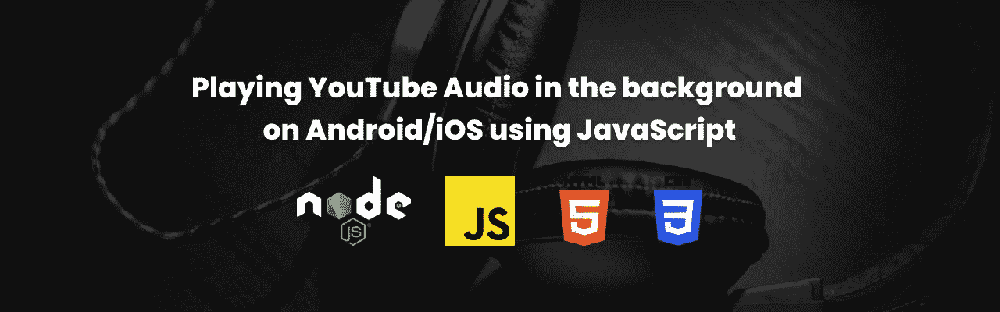

# 如何使用 JavaScript 在 Android/iOS 上后台播放 YouTube 音频

> 原文：<https://javascript.plainenglish.io/playing-youtube-audio-in-the-background-using-javascript-on-mobile-c19aea937ec1?source=collection_archive---------5----------------------->

## 使用 Node.js 流服务器构建一个基于 JavaScript 和 HTML 的音频播放器来播放 YouTube 音频



流行音乐流媒体服务在我居住的地方并不流行，所以 YouTube 一直是我的音乐来源。随着时间的推移，我开始接触 Spotify，但我意识到 YouTube 更了解我的音乐品味，更不用说有很多 Ted 演讲了。我遇到的最大问题是没有后台支持！(显然是在手机上)，所以我的通勤**是**非常空白(呆在家里！注意安全！).让我们利用 JavaScript 的力量来解决这个问题。

*免责声明:这只是一个有趣的项目，解决我自己的问题。我正在分享建立一个快速 MVP 的经验。一定要去看看 YouTube 上的音乐，然后这又是一个可用性的问题。*

在我们进入代码之前，让我们达成共识。我要全力以赴，让我的心灵和你们交流。

我试图解决的问题已经是一个解决方案了！在我看到这篇文章之前，我已经使用这个[技巧](https://www.theverge.com/2020/4/8/21210101/youtube-android-phones-ios-iphones-how-to-pip)很久了。但我遇到的最大问题是数据的使用及其不可靠性。不像大多数国家，我有让我们把它作为“有限的”数据。我能想到的最好的替代方案是从视频中提取音频，并以某种方式进行流式传输。这就是我们将要使用 Node.js 作为流媒体服务器和简单的基于 JavaScript 的前端来构建的东西。

如果你在 GitHub 上搜索基于 JavaScript 的 YouTube 下载模块，你肯定会遇到 [ytdl-core](https://github.com/fent/node-ytdl-core) 。最好的部分是，这个包提取特定 YouTube 视频的各种视频/音频格式的 URL。我的想法是将音频 URL 发送到音频元素的前端，实际上我在本地做得非常好！但是当我遇到一个产品 bug 时，我的快乐列车就到此为止了:)

当我在 Heroku 上托管应用程序时，我不断地从音频 URL 获得 HTTP 403。在进一步挖掘文档后，我发现这些 URL 是基于 IP 的，因此解释了当我试图从我的本地 IP 访问它时出现的 403 错误。嗯，MVP #1 在制作过程中完成了坠入死亡之谷。显然，那次发布是一次重大失败。

进入 MVP #2，流媒体服务器。如果你更关注 ytdl-core，它清楚地表明

> "只用 Javascript 和一个节点友好的流接口编写."

MVP #2 不依赖于将 URL 发送到前端，而是有一个端点接受 YouTube 视频 id，并将“audioonly”流作为响应。它非常有效！IP 限制显然被克服了，因为请求 URL 的 IP 就是消费它的 IP。但是还有另一个问题。缓冲和懒加载！

MVP #2 需要更多的改进。在我将它与前端集成后，我意识到在开始播放之前，整个音频需要下载/流式传输。对我来说，这真的很烦人！因为有时我想跳到音频中的某个运行时，这是可能的，除非所有的东西都被下载了。如果所有的流媒体服务器都这样做，以块的形式发送数据，这种情况可以得到缓解！默认情况下，音频/视频 HTML 元素使用“Range”头请求将特定的字节传输给它。只要我们的 backed 支持部分响应，我们就是好的。这可以通过发送“ *Content-Length* ”、“ *Content-Range* ”、“ *Accept-Ranges* ”作为基于从请求发送的范围的响应头来容易地实现。

因为我们都赶上了。让我们看一下代码

在我们开始之前，让我们建立一个 npm 项目并安装必要的模块。打开终端，键入以下命令

创建一个名为`uscream`(你想叫它什么都行:D)
`*mkdir uscream*`的文件夹

将目录更改为新创建的文件夹
`cd uscream`

初始化一个 npm 项目


火起来 VS 代码(VS 代码是 bae！如果你不同意……时间重新考虑)
`code .`

创建一个名为`server.js`的文件，并复制粘贴下面的代码。当你这样做的时候，试着去理解正在发生的事情，然后回来花两分钱。

`**getInfo,**`请求处理器功能连接到`/info`路径。该路由接受一个查询参数`url`，它是 YouTube 的 URL。该逻辑包含在一个`try catch`块中，如果失败，将返回一个带有消息的`500`响应。实现相当简单

1.  从传递的 URL 获取 YouTube 视频 id。这确保了使用方便的`getURLVideoID`方法提供的 URL 是有效的。有效的请求应该是这样的

```
[http://localhost:4000/info?url=https://www.youtube.com/watch?v=xxxx](http://localhost:4000/info?url=https://www.youtube.com/watch?v=MdZAMSyn_As)xxxx is a video id
4000 is the port number where the app is served
```

2.使用带有视频 id 的`ytdl.getInfo`函数提取视频元细节，并将其作为 JSON 响应发送。我在这里使用 JSON 是因为我们将发送一个`fetch`请求来获取元数据。

从线`31 — 77`移动到下一个请求处理器`getAudioStream`处理音频流。这个功能的核心逻辑依赖于线条`56 — 71`。响应头是根据`audio`元素(在前端)请求的`range`字节定义的。

1.  要点
    中的行`35–50`-验证 YouTube 视频 id
    -抛出一个错误无效
    -从使用由`audioonly`和`highestaudio`过滤的`ytdl-core`包中获取元细节。该过滤器确保我们获得最佳质量的音频。
2.  线`53 —71`处理音频流的部分响应。请记住，在 Express 中，请求处理程序的`req`(请求)和`res`(响应)是流。`req`是可读的数据流，而`res`是可写的数据流。因此从`ytdl`函数返回的`Readable`流可以通过管道或连接到`res`。

为了增加一个`audio`元素的查找能力，我们需要根据请求`start`和`end`范围发送流。根据请求字节的`start`和`end`范围计算要发送的块大小。如果请求头不包含`range`，则`startRange`和`endRange`默认为`0`和`contentLength -1`。HTTP 状态码 206 表示正在发送`Partial Content`。如果有错误，便捷的`try catch`模块会发送一个带有状态代码`500`的空体。

我们完了。这就完成了流媒体服务器。万岁！！！

在下一篇文章中，让我们开始集成这个前端，并在 Heroku 上托管应用程序！如果你不耐烦，你可以去 Github [库](https://github.com/octalpixel/uscream)看看代码。

此外，如果我们可以获得播放列表支持，这个应用程序有一个更好的用例。；)将留给你们这些有思想的家伙