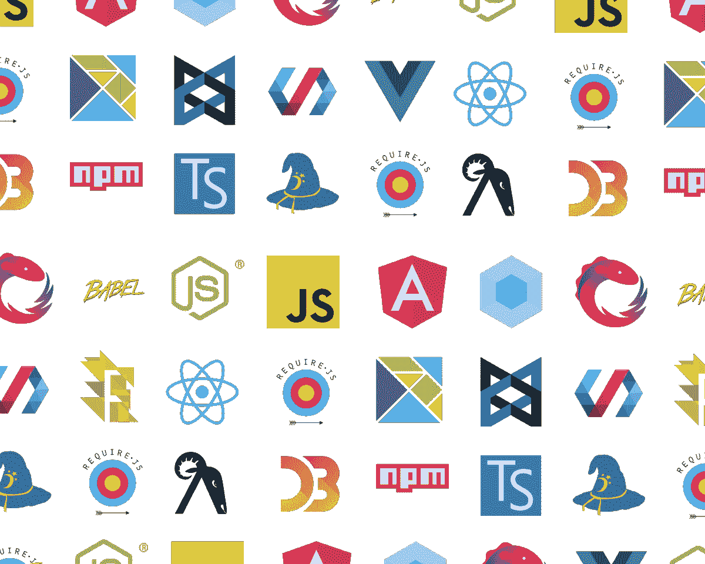

# 前端 Web 开发的实用建议

> 原文：<https://javascript.plainenglish.io/practical-advice-for-front-end-web-development-8789b3c94289?source=collection_archive---------3----------------------->

## 从我的经验中收集的技巧、最佳实践和资源

现代前端开发是创造性和逻辑性的奇妙结合。它有适合每个人的东西。您可以发挥真正的创造力，在 web 上创建独一无二的体验，处理图形和动画，或者您可以使用由单元测试和持续集成/部署组成的复杂构建工作流来构建健壮的应用程序。

对于任何懂编程语言或以前做过编程的人，以及刚开始接触前端 web 开发的人来说，他们的第一反应通常是:

> 这太容易被认真考虑了。

记住，我没有指责任何人。事实上，我从很多人(通常是大多数“程序员”)那里听说过这一点，他们轻视前端，好像这是小孩子的游戏。我自己也有这种想法，当时我还很年轻，很无知😅。

我大错特错了。

# 真相🤔

至少从我的角度来看，这类误解最明显的原因是，除了制作显示数据的布局之外，缺乏关于前端开发人员具体做什么的知识。您学习了一点 html，编写了您的第一个“Hello World”文档(实际上是在. HTML 文件中键入“Hello World”)，学习了一点 CSS 来增加它的味道，编写了几行 JavaScript，就可以了！网站太容易建了！

如果你必须用简单的术语来说，是的，它主要是为显示数据做布局，但现在它不是那种可以用静态 HTML 页面来实现的。

该布局可以是一个分析仪表板，其中多个组件有自己的内部状态，每个部分都有动态值。或者是渲染地图或图表，这需要动态处理大量数据。*数据*本身可能来自 REST API，或者 GraphQL API。

开发人员需要知道如何以及何时从不同的 API 中动态获取这些数据，在内部对其进行处理，并在其上保持一个干净且可理解的用户界面。界面本身必须具有响应性(为移动设备的视窗优化)，需要有互补的配色方案，字体，排版。添加用户认证、SEO(搜索引擎优化)、测试、构建配置、部署、性能优化技术，你会发现，它开始变得有点令人难以招架。

# 诚实的观察和建议🎙

HTML，CSS 和 JavaScript，前端 web 开发的三大支柱。这三种技术的定义不同，但总是一起使用。在学习了基础知识之后，人们通常倾向于忽略 HTML 和 CSS，而直接进入 JavaScript 框架，因为那里有好的东西？

我强调这一点的原因是因为巩固前端开发的基本概念(即 HTML、CSS 和 JavaScript)更重要。如果你投入时间和精力来正确地学习它们，你会意识到其他的一切都是在基本的东西上增加了另一层抽象，提供新的特性或者为你提供预先构建的东西，这样你就不必每次都重新发明轮子。

*   我给所有 web 开发者的第一条建议是**阅读文档**。我怎么强调这一点都不为过。养成阅读的习惯，因为 90%的时候你有关于实现的问题，它很可能已经被记录下来了。
*   了解[网络如何工作](https://developer.mozilla.org/en-US/docs/Learn/Getting_started_with_the_web/How_the_Web_works)、 [HTTP 协议](https://www.w3schools.com/whatis/whatis_http.asp)、不同的 [HTTP 方法](https://developer.mozilla.org/en-US/docs/Web/HTTP/Methods)和 [HTTP 状态代码](https://www.restapitutorial.com/httpstatuscodes.html)。

## **写语义 HTML** ( [什么是语义？](https://developer.mozilla.org/en-US/docs/Glossary/semantics)

*   你的标记不应该是无休止的`
`标签嵌套。HTML 还有其他标签，如`<main>`、`<section>`、`<header>`、`<article>`和[等等](https://www.w3schools.com/html/html5_semantic_elements.asp)。
    编写语义 HTML 的好处源于任何网页的驱动目标:交流的愿望。通过向文档添加语义标签，您可以提供关于该文档的附加信息，这有助于交流。具体来说，语义标签让浏览器清楚地知道页面及其内容的含义。这种清晰性也与搜索引擎沟通，确保为正确的查询提供正确的页面。

## **重点关注 CSS！**

*   CSS 就像一个被忽视的中间孩子，在你以后的开发旅程中，他会回来困扰你。我们通常认为它没有真正的深度，但事实上，当我们无法让我们的网页看起来像我们想要的那样好时，我们会意识到它的重要性。或者当我们遇到一个 CSS 错误时，我们似乎什么都不能解决它。
*   了解 CSS 内部是如何工作的，特别是像[特异性](https://developer.mozilla.org/en-US/docs/Web/CSS/Specificity)、[伪类](https://www.w3schools.com/css/css_pseudo_classes.asp)和[响应设计](https://developer.mozilla.org/en-US/docs/Learn/CSS/CSS_layout/Responsive_Design)这样的主题。
*   了解不同的现代 CSS 布局模型，如 [Flexbox](https://css-tricks.com/snippets/css/a-guide-to-flexbox/) 和 [CSS Grid](https://css-tricks.com/snippets/css/complete-guide-grid/) 。 [Flexbox Froggy](http://flexboxfroggy.com/) 和 [Grid Garden](https://cssgridgarden.com/) 是两个你可以边玩游戏边学习这些概念的网站！
*   学习至少一个 CSS 框架。CSS 框架通常是一个包含预定义的类和组件的库，使开发人员的工作更容易。有很多选择，但最受欢迎的是 [Bootstrap](https://getbootstrap.com/) 。还有其他的像[语义](https://semantic-ui.com/)、[布尔玛](https://bulma.io/)、[尾巴风](https://tailwindcss.com/)或者[物质化](https://materializecss.com/)。
*   学习一个 CSS 预处理器。CSS 预处理器是一种类似 CSS 的语言，它为开发人员提供了更多的功能，如嵌套语法、变量、混合，然后编译成常规的 CSS。我会推荐学习 [SASS](https://sass-lang.com/) ，但是也有其他太像[少](http://lesscss.org/#)或者[手写笔](https://stylus-lang.com/)的。

## **先学 JavaScript 再学框架**

*   学习者常犯的另一个错误是，不先学习语言就直接学习框架。它被称为 *JavaScript 框架*，意味着先决条件是对 JavaScript 有良好的了解。
*   JavaScript 是一种多范例编程语言。它符合过程化、函数式以及面向对象编程的理念。如果你想对这些差异有个大概的了解，[观看这个视频](https://www.youtube.com/watch?v=aoE-92Ac4zE)。
*   了解一下 [DOM](https://developer.mozilla.org/en-US/docs/Web/API/Document_Object_Model/Introduction) 以及 JavaScript [如何与之交互](https://www.youtube.com/watch?v=0ik6X4DJKCc)。
*   JavaScript 是最好的函数式编程语言。观看 Anjana Vakil 的演讲，了解关于 JavaScript 函数式编程的介绍。除此之外，这里还有一个播放列表[，它讲述了类似于](https://www.youtube.com/watch?v=BMUiFMZr7vk&list=PL0zVEGEvSaeEd9hlmCXrk5yUyqUag-n84)[高阶函数](https://dev.to/damcosset/higher-order-functions-in-javascript-4j8b)、[闭包](https://javascript.info/closure)和[curry](https://javascript.info/currying-partials)的概念。所有这些概念对于理解和编写干净、可读和可重用的代码都是必不可少的。
*   JavaScript30 是我强烈推荐的一门提高你技能的课程。
*   关于 JavaScript 还有很多很多奇怪和复杂的地方。这里有一个有价值的资源，你可以作为参考。

# 应该学什么框架？😵

前端框架现在非常流行，我 99%肯定你已经在互联网上看到了这样的争论，那就是:

***棱角 vs 反应 vs Vue***

[Angular](https://angular.io/) 、 [React](https://reactjs.org/) 和 [Vue](https://vuejs.org/) 都是非常受欢迎的 JavaScript 库和框架，帮助开发人员为 web 构建复杂的、反应式的现代用户界面。根据我的经验(与 React 和 Angular 合作过，还有一点 Vue)，没有一个比另一个“更好”。

这三个都是以组件为中心的框架，最终都是为了给 web 应用程序创建表示层。

然而，差异是微妙的，选择取决于作为开发者的你。

**背景**

*   Angular 是一个由谷歌开发和维护的[开源](https://github.com/angular/angular) web 应用框架。
*   React 是一个由脸书开发和维护的用于构建用户界面的开源 JavaScript 库。
*   Vue 是一个[开源的](https://github.com/vuejs/vue) JavaScript 框架，用于构建用户界面和单页应用，由[尤雨溪](https://www.linkedin.com/in/evanyou/)创建，由他和其他活跃的核心团队成员维护。

**语法**

*   Angular 使用 TypeScript 并将 HTML 和 TypeScript 逻辑分成不同的部分。
*   React 使用 JavaScript 和一个名为“ [JSX](https://reactjs.org/docs/introducing-jsx.html) ”的语法扩展(基本上它结合了 HTML 和 JavaScript 逻辑)。
*   Vue 使用常规的 JavaScript，将 HTML 和 JavaScript 逻辑分割成不同的部分。

**人气**

*   这三个框架都很受欢迎，但是 React 比 Angular 更受欢迎，而 Angular 又比 Vue 更常用。

**内置功能**

*   Angular 提供了很多内置功能，Vue 有一些内置功能，而 React 非常简约。

简单来说，

*   如果你喜欢面向对象的编程，喜欢 HTML 视图和类型脚本逻辑的分离，那么**学习 Angular** 。
*   如果你喜欢用 JavaScript 进行函数式编程，并且习惯用它来维护你的观点和逻辑，那么**学习 React** 。
*   如果你喜欢为你的 HTML 视图分离关注点，但是想要为你的逻辑使用普通的 JavaScript，那么**学习 Vue** 。

学习这些框架中的任何一个都没有坏处，一旦你学会了一个，你肯定可以继续学习另一个。它们在语法上不同，但在核心基础上是相似的！

这三个不是市场上仅有的框架，但它们是更受欢迎的。还有其他框架像 [*【余烬】*](https://www.emberjs.com/)*[*svelet*](https://svelte.dev/)*[*Preact*](https://preactjs.com/)*和*[*Mithril*](https://mithril.js.org/)*。如果你想更深入地了解 JavaScript 生态系统，以及这些技术之间的相互比较，请查看 JS 2019* *的状态* [*。*](https://stateofjs.com/)**

# **贡献开源！🌐**

**[Git](https://www.freecodecamp.org/news/what-is-git-and-how-to-use-it-c341b049ae61/) 是一个免费开源的[版本控制系统](https://www.atlassian.com/git/tutorials/what-is-version-control)。 [Github](https://lab.github.com/githubtraining/introduction-to-github) 是一家使用 Git 为软件开发版本控制提供托管的公司。**

**正如你可能知道的，前端开发人员使用的大多数技术都是开源的，因此你也必须知道开源社区是如何工作的，以及你如何做出贡献。**

**[阅读这篇文章](https://codeburst.io/why-open-source-contribution-is-important-a4cf53da3311)，或者[这篇文章](https://opensource.guide/how-to-contribute/)来深入了解为什么开源贡献如此重要。**

**[跟随本文](https://www.firsttimersonly.com/)做出你的第一份贡献！**

# **总之，🥁**

**现代前端开发的世界是一个令人畏惧的地方，尤其是对初学者来说。很容易变得不知所措，失去动力，但如果你做出明智的决定，并不断更新自己，这也可以是一个美好而有益的环境。**

**不要对每一项新技术都有压力。专注于发展你自己的技能，以及最适合你的发展实践。**

**我强烈推荐观看 Adrian Holovaty 的这个演讲，他是 [django](https://www.djangoproject.com/) 的联合创始人，django 是 Python 的一个网络框架。他对 JavaScript 生态系统的复杂性提出了一个有趣的观点，尤其是在前端。**

**记住！正如一个音乐家在真正创作出他最好的作品之前要练习数百个小时一样，你也需要坚持练习。不只是阅读一篇文章或观看一个主题的视频，而是通过创建小的演示项目来应用它。你运用得越多，你的技能和解决问题的能力提高得越快。**

**就是这样！✌**

***原载于*[*https://www . ninadsubba . in*](https://www.ninadsubba.in/blog/practical-advice-for-front-end-web-development)*。***

## ****用简单英语写的 JavaScript 笔记****

**我们已经推出了三种新的出版物！为我们的新出版物献上一点爱心吧，请跟随他们:[**AI in Plain English**](https://medium.com/ai-in-plain-english)，[**UX in Plain English**](https://medium.com/ux-in-plain-english)，[**Python in Plain English**](https://medium.com/python-in-plain-english)**——谢谢，继续学习！****

****我们也一直有兴趣帮助推广高质量的内容。如果您有一篇文章想要提交给我们的任何出版物，请发送电子邮件至:[**submissions @ plain English . io**](mailto:submissions@plainenglish.io)**，使用您的 Medium 用户名，我们会将您添加为作者。另外，请让我们知道您想加入哪个/哪些出版物。******